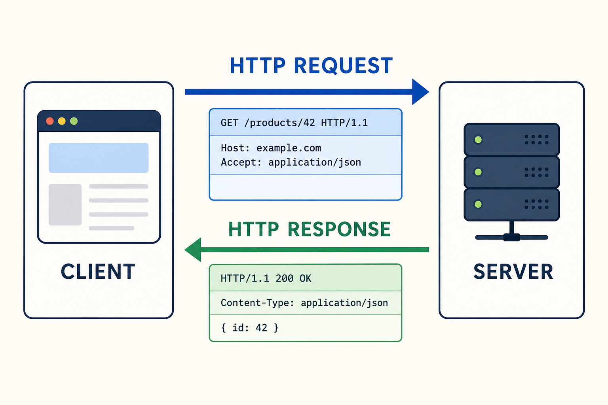
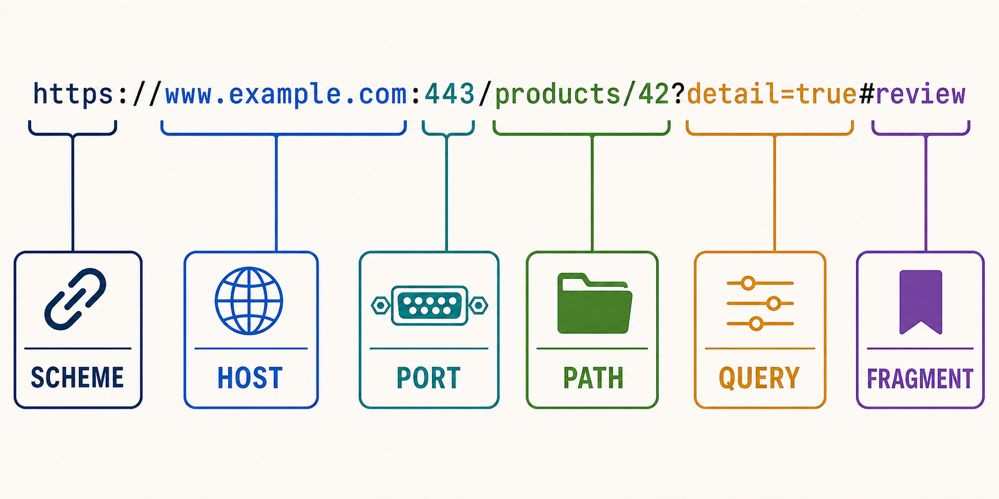
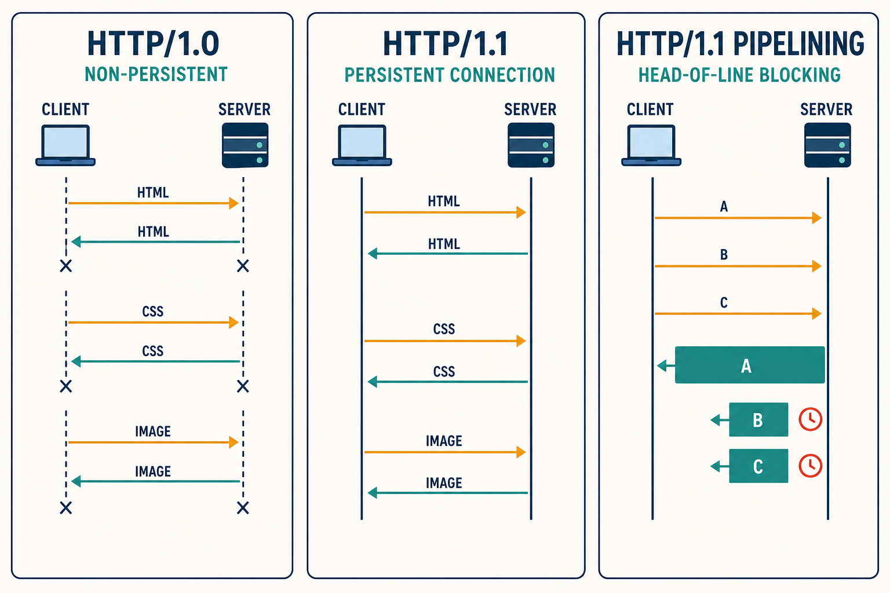
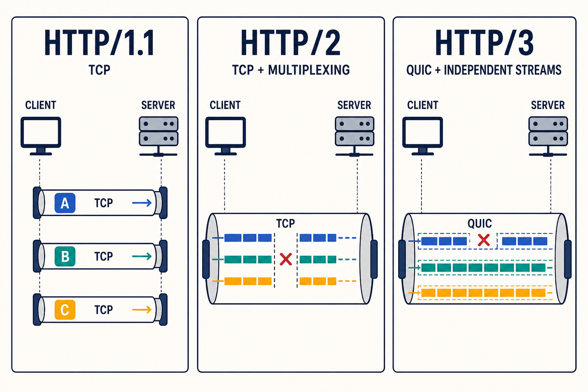
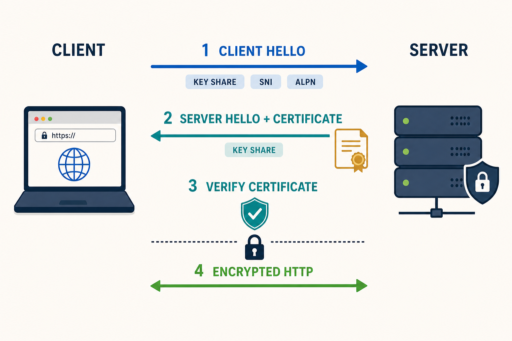

# HTTP

HTTP(Hypertext Transfer Protocol)는 웹에서 클라이언트와 서버가 데이터를 주고받기 위해 사용하는 **애플리케이션 계층 프로토콜**이다. 이름에는 Hypertext가 들어가지만 HTML 문서뿐 아니라 JSON, 이미지, 영상, 파일 등 다양한 형태의 데이터를 전달할 수 있다.

웹 브라우저가 주소를 입력받으면 DNS를 통해 서버의 IP 주소를 알아내고, 전송 계층의 연결을 준비한 뒤 HTTP 요청을 보낸다. 서버는 요청을 해석해 처리 결과를 HTTP 응답으로 돌려준다. HTTP/1.0·HTTP/1.1·HTTP/2는 일반적으로 TCP를 사용하고, HTTP/3는 UDP 위에 구현된 QUIC을 사용한다. HTTPS는 이러한 HTTP 통신을 TLS로 보호하는 방식이다.



HTTP의 핵심은 클라이언트가 **요청(Request**)을 보내고 서버가 **응답(Response**)을 반환한다는 것이다. 서버가 먼저 임의의 HTTP 응답을 보내는 것이 기본 동작은 아니다. HTTP/2의 서버 푸시처럼 서버가 추가 리소스를 전송할 수 있는 기능도 있었지만, 이 역시 클라이언트가 시작한 연결과 요청의 문맥 안에서 동작한다.

## HTTP 메시지

HTTP 메시지는 시작 줄, 헤더, 빈 줄, 선택적인 본문으로 구성된다. HTTP/1.1에서는 사람이 읽을 수 있는 텍스트 형식으로 표현되며, HTTP/2와 HTTP/3에서는 같은 의미의 정보를 바이너리 프레임으로 나누어 전송한다.

다음은 상품 정보를 요청하는 HTTP/1.1 메시지의 예다.

```http
GET /products/42?detail=true HTTP/1.1
Host: example.com
Accept: application/json
User-Agent: ExampleBrowser/1.0

```

요청의 시작 줄은 메서드, 요청 대상, HTTP 버전으로 구성된다.

- `GET`: 서버에 수행할 동작을 나타내는 HTTP 메서드
- `/products/42?detail=true`: 경로와 쿼리 문자열을 포함한 요청 대상
- `HTTP/1.1`: 메시지에서 사용하는 HTTP 버전

서버는 다음과 같이 응답할 수 있다.

```http
HTTP/1.1 200 OK
Content-Type: application/json
Content-Length: 41
Cache-Control: max-age=60

{"id":42,"name":"keyboard","price":50000}
```

응답의 시작 줄은 HTTP 버전, 상태 코드, 이유 문구로 구성된다. 헤더는 메시지와 통신 조건에 대한 부가 정보를 전달하고, 빈 줄 뒤의 본문에는 실제 데이터가 들어간다. `204 No Content`나 `HEAD` 요청에 대한 응답처럼 본문이 없는 메시지도 있다.

### HTTP 헤더

HTTP 헤더는 `이름: 값` 형식이며 대소문자를 구분하지 않는다. 같은 목적의 헤더라도 요청과 응답에서 사용되는 위치가 다를 수 있다.

| 분류 | 대표 헤더 | 역할 |
| --- | --- | --- |
| 요청 정보 | `Host`, `User-Agent`, `Referer` | 요청 대상 호스트와 클라이언트 등의 정보 전달 |
| 콘텐츠 협상 | `Accept`, `Accept-Language`, `Accept-Encoding` | 클라이언트가 처리할 수 있는 응답 형식 전달 |
| 표현 정보 | `Content-Type`, `Content-Length`, `Content-Encoding` | 본문의 형식, 길이, 인코딩 방식 설명 |
| 인증 | `Authorization`, `WWW-Authenticate` | 인증 정보 전달과 인증 방법 안내 |
| 캐시 | `Cache-Control`, `ETag`, `Last-Modified` | 캐시 가능 여부와 유효성 검사 조건 지정 |
| 쿠키 | `Cookie`, `Set-Cookie` | 클라이언트에 저장된 상태 정보 전달 |
| 연결 | `Connection`, `Upgrade` | 현재 연결에만 적용되는 옵션 지정 |

`Content-Type`은 본문의 미디어 타입을 나타낸다. JSON이라면 `application/json`, HTML이라면 `text/html`, PNG 이미지라면 `image/png`와 같이 표현한다. `Content-Encoding: gzip`은 본문을 gzip으로 압축했다는 뜻이며, 본문의 데이터 형식 자체를 나타내는 `Content-Type`과 역할이 다르다.

HTTP/2와 HTTP/3에서는 연결 단위에만 적용되는 `Connection`과 같은 홉바이홉 헤더를 사용하지 않는다. 중간 프록시가 존재할 수 있기 때문에 종단까지 전달할 정보와 현재 연결에서만 사용할 정보를 구분해야 한다.

### HTTP 메서드

HTTP 메서드는 클라이언트가 자원에 대해 수행하려는 동작을 나타낸다.

| 메서드 | 주된 용도 | 요청 본문 | 안전성 | 멱등성 |
| --- | --- | --- | --- | --- |
| `GET` | 자원 조회 | 일반적으로 사용하지 않음 | 안전 | 멱등 |
| `HEAD` | 본문 없이 응답 헤더 조회 | 일반적으로 사용하지 않음 | 안전 | 멱등 |
| `POST` | 데이터 제출, 처리 요청, 자원 생성 | 주로 사용 | 안전하지 않음 | 일반적으로 멱등하지 않음 |
| `PUT` | 지정한 자원을 전체 생성 또는 교체 | 주로 사용 | 안전하지 않음 | 멱등 |
| `PATCH` | 자원의 일부 수정 | 주로 사용 | 안전하지 않음 | 보장하지 않음 |
| `DELETE` | 자원 삭제 | 선택적 | 안전하지 않음 | 멱등 |
| `OPTIONS` | 서버가 지원하는 통신 옵션 확인 | 선택적 | 안전 | 멱등 |

**안전한 메서드(Safe Method**)는 서버의 상태를 변경하려는 의미를 갖지 않는 메서드다. 조회 과정에서 접근 로그나 통계가 남을 수는 있지만, 클라이언트가 요청한 자원의 상태를 변경하는 것이 목적은 아니다.

**멱등한 메서드(Idempotent Method**)는 같은 요청을 여러 번 보내도 의도한 서버 상태가 한 번 보냈을 때와 같은 메서드다. 예를 들어 같은 자원을 여러 번 삭제하면 첫 번째와 이후 응답의 상태 코드는 달라질 수 있지만, 자원이 삭제되어 있다는 최종 상태는 같다. 반면 주문 생성과 같은 `POST` 요청을 반복하면 주문이 여러 개 만들어질 수 있으므로 일반적으로 멱등하지 않다.

멱등성은 네트워크 오류가 발생했을 때 요청을 안전하게 재시도할 수 있는지 판단하는 데 중요하다. 다만 메서드의 일반적인 의미만 믿어서는 안 되고, 실제 API가 해당 의미에 맞게 구현되어 있는지도 확인해야 한다.

### HTTP 상태 코드

상태 코드는 서버가 요청을 어떻게 처리했는지 세 자리 숫자로 나타낸다. 첫 번째 숫자에 따라 다섯 범주로 구분한다.

| 범위 | 분류 | 의미 | 대표 코드 |
| --- | --- | --- | --- |
| `1xx` | Informational | 요청을 받았으며 처리를 계속함 | `100 Continue`, `101 Switching Protocols` |
| `2xx` | Successful | 요청을 정상적으로 처리함 | `200 OK`, `201 Created`, `204 No Content` |
| `3xx` | Redirection | 요청을 완료하려면 추가 동작이 필요함 | `301 Moved Permanently`, `302 Found`, `304 Not Modified` |
| `4xx` | Client Error | 요청 형식, 인증, 대상 등에 문제가 있음 | `400 Bad Request`, `401 Unauthorized`, `403 Forbidden`, `404 Not Found` |
| `5xx` | Server Error | 올바른 요청을 서버가 처리하지 못함 | `500 Internal Server Error`, `502 Bad Gateway`, `503 Service Unavailable` |

`401 Unauthorized`는 이름과 달리 주로 **인증되지 않음**을 나타내고, 서버는 `WWW-Authenticate` 헤더로 필요한 인증 방법을 안내할 수 있다. 인증은 되었지만 해당 자원에 접근할 권한이 없으면 일반적으로 `403 Forbidden`을 사용한다.

`502 Bad Gateway`는 게이트웨이나 프록시가 뒤쪽 서버에서 올바른 응답을 받지 못한 경우, `503 Service Unavailable`은 서버가 과부하나 점검 등으로 일시적으로 요청을 처리할 수 없는 경우에 사용한다. 실제 원인은 서비스 구성에 따라 달라질 수 있으므로 상태 코드만으로 장애 지점을 단정해서는 안 된다.

### URL과 자원

URL(Uniform Resource Locator)은 네트워크에서 자원의 위치와 접근 방법을 표현한다.



- **scheme**: 사용할 프로토콜을 나타낸다. HTTP는 `http`, TLS로 보호하는 HTTP는 `https`를 사용한다.
- **host**: 서버의 도메인 이름이나 IP 주소다.
- **port**: 서버 프로세스의 포트 번호다. 생략하면 일반적으로 HTTP는 80, HTTPS는 443을 사용한다.
- **path**: 서버 안에서 요청할 자원을 식별하는 경로다.
- **query**: `key=value` 형태의 추가 매개변수다. 여러 항목은 `&`로 구분한다.
- **fragment**: 문서 안의 특정 부분을 가리키며 브라우저가 처리한다. HTTP 요청에는 전달되지 않는다.

HTTP가 자원을 파일과 일대일로 연결하도록 강제하는 것은 아니다. `/products/42`가 실제 서버의 디렉터리와 파일을 의미할 수도 있지만, 애플리케이션이 경로를 해석해 데이터베이스의 상품 정보를 반환할 수도 있다.

### 무상태성과 쿠키

HTTP는 기본적으로 **무상태(Stateless**) 프로토콜이다. 각 요청은 독립적으로 해석되며 서버가 이전 요청의 상태를 반드시 기억해야 하는 규칙이 없다. 따라서 같은 TCP 연결을 재사용하는 것과 로그인 상태를 유지하는 것은 서로 다른 문제다.

로그인, 장바구니처럼 여러 요청에 걸쳐 상태를 유지하려면 쿠키나 토큰 등을 사용한다. 서버가 응답에 `Set-Cookie`를 보내면 브라우저는 조건에 맞는 이후 요청의 `Cookie` 헤더에 값을 담아 전송한다.

```http
HTTP/1.1 200 OK
Set-Cookie: session_id=abc123; Secure; HttpOnly; SameSite=Lax
```

- `Secure`: HTTPS 연결에서만 쿠키를 전송한다.
- `HttpOnly`: 브라우저의 JavaScript에서 쿠키를 읽지 못하게 제한한다.
- `SameSite`: 다른 사이트에서 시작된 요청에 쿠키를 보낼 조건을 제한한다.

쿠키 자체가 세션 저장소인 것은 아니다. 서버 세션 방식에서는 쿠키에 세션 식별자만 저장하고 실제 로그인 정보는 서버가 관리할 수 있다. 토큰 방식에서는 서명된 상태 정보의 일부를 클라이언트가 보관할 수도 있다. 민감한 값을 쿠키에 그대로 저장해서는 안 되며 만료 시간, 전송 범위와 보안 속성을 적절히 설정해야 한다.

### HTTP 캐시

캐시는 이전에 받은 응답을 브라우저나 중간 캐시가 저장했다가 재사용하는 기능이다. 서버까지 매번 요청하지 않거나 전체 본문을 다시 받지 않아도 되므로 지연 시간과 네트워크 사용량을 줄일 수 있다.

`Cache-Control: max-age=60`은 응답을 받은 뒤 60초 동안 신선한 응답으로 사용할 수 있음을 나타낸다. 시간이 지나면 캐시는 `ETag`나 `Last-Modified`를 사용해 서버에 자원이 변경되었는지 확인할 수 있다.

```http
GET /logo.png HTTP/1.1
Host: example.com
If-None-Match: "image-v3"
```

자원이 변경되지 않았다면 서버는 본문 없이 `304 Not Modified`를 반환하고, 클라이언트는 저장해 둔 응답을 다시 사용한다. `304`는 오류가 아니라 조건부 요청에 대한 정상적인 응답이다.

인증 정보나 사용자별 데이터가 포함된 응답은 공유 캐시에 잘못 저장되지 않도록 주의해야 한다. `private`, `no-cache`, `no-store` 등의 지시어는 의미가 서로 다르다. 특히 `no-cache`는 저장 자체를 금지한다는 뜻이 아니라, 재사용하기 전에 서버의 검증을 요구한다는 뜻이다.

## 2.5.1 HTTP/1.0

HTTP/1.0은 초기 웹에서 널리 사용된 HTTP 버전이다. 기본적인 요청과 응답, 헤더, 상태 코드, 다양한 콘텐츠 형식을 다룰 수 있게 했지만 연결을 사용하는 방식에는 비효율이 있었다.

HTTP/1.0에서는 일반적으로 하나의 TCP 연결에서 하나의 요청과 응답을 처리한 뒤 연결을 종료한다. HTML 문서에 CSS, JavaScript, 이미지 10개가 포함되어 있다면 각 자원을 받을 때마다 새로운 TCP 연결을 만들어야 할 수 있다.



TCP 연결마다 3-way handshake가 필요하고 HTTPS라면 TLS 연결 설정도 추가된다. 요청할 자원이 많을수록 연결 설정에 필요한 왕복 시간과 서버의 연결 관리 비용이 증가한다. 브라우저는 여러 TCP 연결을 동시에 만들어 일부 지연을 줄일 수 있지만 연결 수가 늘어나는 문제가 있다.

HTTP/1.0에서도 `Connection: keep-alive`를 이용해 연결을 재사용하는 구현이 등장했지만 표준의 기본 동작으로 일관되게 정의된 것은 아니었다. 또한 하나의 IP 주소에서 여러 도메인을 서비스하는 가상 호스팅을 위한 `Host` 헤더도 필수가 아니어서 서버가 요청 대상 도메인을 구분하기 어려울 수 있었다.

HTTP/1.0의 주요 특징을 정리하면 다음과 같다.

- 요청과 응답의 기본 구조, 상태 코드와 헤더를 사용한다.
- 기본적으로 요청마다 별도의 TCP 연결을 사용하는 비지속 연결 방식이다.
- 연결 재사용이 구현에 따라 가능했지만 표준 기본 동작은 아니었다.
- 여러 자원을 불러올 때 연결 설정 비용이 반복된다.

## 2.5.2 HTTP/1.1

HTTP/1.1은 HTTP/1.0의 연결 비효율과 기능 부족을 보완했다. 가장 큰 변화 중 하나는 TCP 연결을 기본적으로 유지하는 **지속 연결(Persistent Connection**)이다. 응답이 끝난 뒤에도 연결을 닫지 않고 다음 요청에 재사용하므로 매번 TCP 연결을 설정하는 비용을 줄인다.

연결을 종료하려면 `Connection: close` 헤더를 사용할 수 있다. 지속 연결을 사용하려면 수신 측이 한 응답의 끝을 알아야 하므로 `Content-Length`, 청크 전송 인코딩, 본문이 없는 상태 코드 등의 규칙으로 메시지의 길이를 구분한다.

### Host 헤더와 가상 호스팅

HTTP/1.1 요청에는 일반적으로 `Host` 헤더가 필요하다. 하나의 서버 IP 주소에서 여러 도메인을 운영할 때 서버는 이 값을 보고 어떤 사이트에 대한 요청인지 구분한다.

```http
GET / HTTP/1.1
Host: shop.example.com
```

IP 주소와 포트 번호만으로 서버에 도착하더라도 요청한 도메인을 모르면 올바른 웹사이트를 선택할 수 없다. HTTPS에서는 HTTP 요청을 보내기 전에 TLS 연결을 설정하므로, 여러 인증서 중 사용할 인증서를 알리기 위해 TLS의 SNI(Server Name Indication)도 함께 사용될 수 있다.

### 파이프라이닝과 HOL 블로킹

HTTP/1.1에는 앞선 응답을 기다리지 않고 여러 요청을 연속으로 보내는 **파이프라이닝(Pipelining**) 기능이 있다. 하지만 서버는 요청 순서대로 응답해야 하므로 첫 번째 요청의 처리가 오래 걸리면 뒤의 응답이 준비되어도 먼저 전송할 수 없다.

이 현상을 HTTP 계층의 **HOL(Head-of-Line) 블로킹**이라고 한다. 중간 프록시와 서버의 지원 문제도 있어 브라우저에서는 파이프라이닝이 널리 활용되지 않았고, 대신 한 호스트에 여러 TCP 연결을 병렬로 만드는 방식이 사용되었다.

### 청크 전송 인코딩

서버가 응답 본문의 전체 크기를 미리 알 수 없는 경우 HTTP/1.1은 `Transfer-Encoding: chunked`를 사용해 본문을 여러 청크로 나누어 보낼 수 있다. 각 청크 앞에 16진수 길이를 기록하고 길이가 0인 청크로 본문의 끝을 알린다.

```http
HTTP/1.1 200 OK
Transfer-Encoding: chunked

5
Hello
6
 World
0

```

청크 전송 인코딩은 HTTP/1.1 메시지의 전송 방식이다. HTTP/2와 HTTP/3은 자체 바이너리 프레임으로 메시지 경계를 표현하므로 이 방식을 사용하지 않는다.

HTTP/1.1은 오늘날에도 널리 지원되며 단순한 환경에서 충분히 사용할 수 있다. 다만 한 연결에서 응답을 순서대로 처리해야 하는 한계 때문에 요청이 많은 현대 웹에서는 여러 연결이 필요하고, 연결마다 TCP와 TLS 상태를 관리해야 한다.

## 2.5.3 HTTP/2

HTTP/2는 HTTP의 의미 체계를 바꾸기보다 **전송 표현 방식**을 개선한 버전이다. `GET`, 상태 코드, URL, 헤더와 같은 HTTP의 기본 개념은 유지하면서 메시지를 바이너리 프레임으로 나누어 하나의 연결에서 효율적으로 전송한다.



### 바이너리 프레이밍과 스트림

HTTP/2 통신은 연결 안에 여러 **스트림(Stream**)을 만들고, 각 HTTP 메시지를 HEADERS·DATA 등의 **프레임(Frame**)으로 나누어 전송한다. 프레임에는 스트림 식별자가 있으므로 서로 섞여 도착해도 원래 요청과 응답으로 다시 조립할 수 있다.

이처럼 여러 요청과 응답을 동시에 진행하는 기능을 **멀티플렉싱(Multiplexing**)이라고 한다. HTTP/1.1 파이프라이닝처럼 앞선 응답이 완료될 때까지 뒤의 응답 전체가 기다리지 않아도 되므로, 하나의 TCP 연결을 더 효율적으로 사용할 수 있다.

HTTP/2 연결에는 스트림 전체에 적용되는 흐름 제어와 각 스트림에 적용되는 흐름 제어가 있다. 한 수신자가 처리할 수 있는 양을 넘지 않도록 윈도우를 관리하며, 이는 TCP 연결 자체의 흐름 제어와는 별도로 HTTP/2 계층에서 동작한다.

### 헤더 압축

웹 요청은 같은 호스트, 쿠키, 사용자 에이전트와 같은 헤더를 반복해서 보내는 경우가 많다. HTTP/2는 **HPACK** 방식으로 헤더 이름과 값을 압축해 반복 전송되는 헤더의 크기를 줄인다.

송신자와 수신자는 이전에 전송한 헤더를 동적 테이블에 저장하고 인덱스로 참조할 수 있다. 정적인 공통 헤더 테이블과 허프만 인코딩도 사용한다. 일반적인 gzip 본문 압축과 달리 HPACK은 HTTP 헤더를 위해 설계된 압축 방식이다.

### 서버 푸시

HTTP/2 서버 푸시는 클라이언트가 HTML을 요청했을 때 서버가 필요할 것으로 예상한 CSS나 JavaScript를 클라이언트의 별도 요청 전에 보내는 기능이다. 이론적으로는 요청 왕복 시간을 줄일 수 있지만, 이미 캐시에 있는 자원을 중복 전송하거나 우선순위와 캐시를 복잡하게 만들 수 있다.

실제 웹 브라우저에서는 활용도가 낮아 지원을 제거하거나 제한한 경우가 많다. HTTP/2의 핵심 장점을 서버 푸시보다는 멀티플렉싱, 바이너리 프레이밍과 헤더 압축으로 이해하는 것이 적절하다.

### TCP 수준의 HOL 블로킹

HTTP/2는 HTTP/1.1의 응답 순서 문제를 해결했지만 TCP 위에서 동작한다. TCP는 수신한 바이트를 순서대로 애플리케이션에 전달하므로 패킷 하나가 손실되면 재전송되어 빈 부분이 채워질 때까지 그 뒤의 바이트를 전달할 수 없다.

하나의 TCP 연결에 여러 HTTP/2 스트림이 함께 들어 있으므로 패킷 손실이 발생하면 손실과 직접 관계없는 스트림도 잠시 영향을 받을 수 있다. 이를 TCP 수준의 HOL 블로킹이라고 한다. 이 문제를 전송 계층에서 줄이기 위해 HTTP/3는 QUIC을 사용한다.

## 2.5.4 HTTPS

HTTPS(HTTP Secure)는 별개의 HTTP 메시지 규칙이라기보다 **HTTP 통신을 TLS(Transport Layer Security)로 보호하는 방식**이다. HTTP/1.1과 HTTP/2는 일반적으로 TCP 위에 TLS를 사용하고, HTTP/3는 TLS 1.3 기능이 통합된 QUIC을 사용한다.

HTTPS가 제공하는 핵심 속성은 다음과 같다.

- **기밀성**: 통신 내용을 암호화해 제3자가 쉽게 읽지 못하게 한다.
- **무결성**: 전송 중 데이터가 변경되었는지 확인한다.
- **인증**: 인증서를 통해 접속한 서버가 요청한 도메인의 서버인지 확인한다.

암호화되지 않은 HTTP에서는 네트워크 경로의 공격자가 요청 URL, 헤더, 쿠키와 응답 내용을 읽거나 바꿀 수 있다. 로그인하지 않은 공개 페이지라도 스크립트를 삽입하거나 사용자의 행동을 추적할 수 있으므로 현재의 웹 서비스는 일반적으로 HTTPS를 기본으로 사용한다.

### 인증서와 인증 기관

서버는 TLS 연결 과정에서 도메인 이름과 공개 키 등의 정보가 담긴 인증서를 제시한다. 이 인증서는 일반적으로 신뢰할 수 있는 인증 기관(CA)이 서명한다. 브라우저나 운영체제는 신뢰하는 루트 인증서 목록을 가지고 있으며, 서버 인증서가 신뢰할 수 있는 루트까지 연결되는지 검증한다.

클라이언트는 주로 다음 항목을 확인한다.

1. 인증서가 신뢰할 수 있는 인증 기관의 서명으로 이어지는가?
2. 인증서의 도메인 이름이 접속한 호스트와 일치하는가?
3. 인증서의 유효 기간이 지나지 않았는가?
4. 인증서가 요구되는 용도와 정책에 맞는가?

인증서는 공개되어도 되는 정보이며 인증서 안에 서버의 개인 키가 들어 있지 않다. 서버는 인증서의 공개 키에 대응하는 개인 키를 안전하게 보관하고, TLS handshake에서 그 개인 키를 소유하고 있음을 증명한다.

### TLS 연결 과정

TLS 1.3을 기준으로 단순화한 연결 과정은 다음과 같다.



클라이언트와 서버는 비대칭 키 교환을 이용해 공통 비밀을 만들고, 여기서 실제 데이터 암호화에 사용할 대칭 키를 생성한다. 대칭 키 암호화는 많은 데이터를 빠르게 처리할 수 있고, 비대칭 암호 방식은 키 교환과 인증에 사용된다. 실제 과정에는 여러 메시지와 검증 단계가 있으며 사용 중인 TLS 버전과 연결 재개 여부에 따라 달라진다.

TLS 연결이 항상 웹 서버 애플리케이션에서 끝나는 것은 아니다. L7 로드밸런서나 리버스 프록시가 인증서와 개인 키를 가지고 TLS를 종료한 뒤 내부 서버로 요청을 전달할 수 있다. 이 경우 클라이언트와 로드밸런서 사이만 암호화할지, 로드밸런서와 내부 서버 사이도 다시 TLS로 보호할지 구성에 따라 결정한다.

### HTTPS가 숨기지 못하는 정보

HTTPS를 사용하면 HTTP 경로, 헤더와 본문은 암호화되지만 통신에 필요한 모든 메타데이터가 사라지는 것은 아니다. 네트워크 장치는 연결 상대의 IP 주소, 포트 번호, 대략적인 통신량과 시점 등을 볼 수 있다. 일반적인 TLS 구성에서는 접속하려는 호스트 이름이 SNI를 통해 노출될 수도 있으며 이를 암호화하기 위한 ECH 같은 기술이 별도로 사용될 수 있다.

HTTPS는 전송 구간을 보호하지만 서버 자체가 안전하다는 뜻은 아니다. 피싱 사이트도 자신의 도메인에 유효한 인증서를 발급받을 수 있고, 서버가 받은 데이터를 잘못 보관하거나 애플리케이션에 취약점이 있으면 정보가 유출될 수 있다. 자물쇠 표시는 연결이 해당 도메인과 암호화되었다는 의미로 이해해야 한다.

## 2.5.5 HTTP/3

HTTP/3는 HTTP의 의미 체계를 유지하면서 전송 기반을 TCP에서 **QUIC**으로 바꾼 버전이다. QUIC은 UDP 위에서 동작하지만 단순히 신뢰성 없는 UDP로 HTTP 메시지를 보내는 방식은 아니다. QUIC 자체가 연결 설정, 신뢰성 있는 전송, 혼잡 제어, 흐름 제어, 스트림과 암호화 기능을 제공한다.

### 독립적인 스트림

QUIC 연결은 여러 스트림을 제공하며 각 스트림의 데이터 순서는 독립적으로 관리된다. 한 스트림의 패킷이 손실되면 그 스트림은 재전송을 기다려야 하지만, 데이터가 준비된 다른 스트림까지 TCP의 바이트 순서 때문에 함께 기다릴 필요는 없다.

따라서 HTTP/3는 HTTP/2에서 남아 있던 TCP 수준의 HOL 블로킹 영향을 줄인다. 다만 네트워크가 혼잡하면 같은 연결의 모든 스트림이 혼잡 제어의 영향을 받을 수 있고, 패킷 손실 자체가 사라지는 것은 아니다.

### 연결 설정과 암호화

QUIC은 TLS 1.3의 handshake 기능을 전송 프로토콜에 통합한다. TCP 연결을 먼저 만들고 다시 TLS handshake를 수행하는 구조보다 연결 설정에 필요한 왕복 횟수를 줄일 수 있다. 이전에 연결한 서버와 세션 정보를 재사용하면 조건에 따라 0-RTT로 애플리케이션 데이터를 일찍 보낼 수도 있다.

0-RTT 데이터는 공격자가 동일한 데이터를 다시 전송하는 재전송 공격에 노출될 수 있으므로, 서버 상태를 변경하는 비멱등 요청에는 신중하게 사용해야 한다. 연결 설정이 빠르다는 장점과 별개로 애플리케이션이 재전송 위험을 고려해야 한다.

QUIC은 연결을 IP 주소와 포트 번호의 조합에만 묶지 않고 **연결 ID(Connection ID**)로 식별할 수 있다. 모바일 기기가 Wi-Fi에서 셀룰러 네트워크로 바뀌어 IP 주소가 변경되어도 조건이 맞으면 기존 연결을 이어 갈 수 있다. 이를 연결 마이그레이션이라고 한다.

### QPACK 헤더 압축

HTTP/3는 HTTP/2의 HPACK 대신 **QPACK**을 사용해 헤더를 압축한다. QUIC 스트림은 서로 독립적이므로 HTTP/2의 TCP 순서를 전제로 한 압축 방식을 그대로 사용하면 헤더에 필요한 테이블 정보가 늦게 도착해 스트림이 막힐 수 있다. QPACK은 QUIC의 독립적인 스트림 환경에 맞게 이 문제를 줄이도록 설계되었다.

### HTTP/3 사용과 버전 선택

HTTP/3는 UDP를 사용하므로 일부 방화벽이나 네트워크가 QUIC 트래픽을 차단할 수 있다. 이 경우 클라이언트는 HTTP/2나 HTTP/1.1로 대체 연결을 시도할 수 있다. HTTP/3를 지원한다고 해서 이전 버전을 즉시 제거하는 것이 아니라 다양한 네트워크 환경을 위해 함께 제공하는 경우가 많다.

HTTPS 연결에서 HTTP/1.1과 HTTP/2 중 사용할 프로토콜은 TLS handshake의 ALPN(Application-Layer Protocol Negotiation)을 통해 협상할 수 있다. HTTP/3는 서버가 `Alt-Svc` 헤더 등으로 QUIC을 사용할 수 있음을 알리고 클라이언트가 별도의 QUIC 연결을 시도하는 방식이 사용될 수 있다.

HTTP 버전별 차이를 정리하면 다음과 같다.

| 구분 | HTTP/1.0 | HTTP/1.1 | HTTP/2 | HTTP/3 |
| --- | --- | --- | --- | --- |
| 전송 기반 | TCP | TCP | TCP | QUIC(UDP 기반) |
| 메시지 표현 | 텍스트 | 텍스트 | 바이너리 프레임 | 바이너리 프레임 |
| 연결 사용 | 요청마다 새 연결이 기본 | 지속 연결이 기본 | 한 연결에서 여러 스트림 | 한 연결에서 여러 독립 스트림 |
| 동시 처리 | 여러 TCP 연결 사용 | 여러 연결 또는 파이프라이닝 | 멀티플렉싱 | 멀티플렉싱 |
| 헤더 압축 | 없음 | 없음 | HPACK | QPACK |
| 주요 한계 | 반복되는 연결 설정 | HTTP 계층 HOL 블로킹 | TCP 수준 HOL 블로킹 | UDP 차단 환경에서 대체 연결 필요 |

새 버전이 항상 모든 환경에서 빠른 것은 아니다. 페이지의 자원 수, 네트워크 지연과 손실률, 서버와 클라이언트 구현, 캐시 상태에 따라 결과가 달라진다. HTTP 버전은 애플리케이션의 URL이나 메서드를 전부 바꾸는 기능이라기보다 같은 HTTP 의미를 네트워크에서 더 효율적으로 전달하기 위한 발전 과정으로 이해할 수 있다.

## 예상 면접 질문

HTTP는 버전별 특징만 외우기보다 요청과 응답이 어떻게 구성되고, 연결·캐시·보안 문제가 각 버전에서 어떻게 해결되었는지 설명할 수 있어야 한다. 질문을 누르면 답변을 확인할 수 있다.

<details>
<summary><strong>1. HTTP란 무엇이며 어떤 특징이 있나요?</strong></summary>

HTTP는 웹에서 클라이언트와 서버가 요청과 응답을 주고받기 위해 사용하는 애플리케이션 계층 프로토콜이다. HTML뿐 아니라 JSON, 이미지와 파일 등 다양한 데이터를 전달할 수 있다. 기본적으로 클라이언트가 요청하고 서버가 응답하며, 각 요청을 독립적으로 처리하는 무상태 프로토콜이다. HTTP/1.0·1.1·2는 일반적으로 TCP를 사용하고 HTTP/3는 QUIC을 사용한다.

</details>

<details>
<summary><strong>2. HTTP 요청과 응답 메시지는 어떻게 구성되나요?</strong></summary>

HTTP 메시지는 시작 줄, 헤더, 빈 줄, 선택적인 본문으로 구성된다. 요청의 시작 줄에는 메서드, 요청 대상과 HTTP 버전이 들어가고, 응답의 시작 줄에는 HTTP 버전, 상태 코드와 이유 문구가 들어간다. 헤더는 콘텐츠 형식, 인증, 캐시 같은 부가 정보를 전달하고 본문에는 실제 데이터가 들어간다. HTTP/2와 HTTP/3도 의미는 같지만 메시지를 바이너리 프레임으로 나누어 전송한다.

</details>

<details>
<summary><strong>3. 안전한 메서드와 멱등한 메서드는 무엇인가요?</strong></summary>

안전한 메서드는 서버 자원의 상태를 변경하려는 의미를 갖지 않는 메서드로 `GET`, `HEAD`, `OPTIONS` 등이 있다. 멱등한 메서드는 같은 요청을 여러 번 보내도 의도한 최종 서버 상태가 한 번 보냈을 때와 같은 메서드다. `GET`, `PUT`, `DELETE` 등은 멱등하지만 주문 생성과 같은 일반적인 `POST`는 반복할 때 결과가 추가로 만들어질 수 있어 멱등하지 않다. 멱등성은 네트워크 오류 후 요청을 재시도할 수 있는지 판단할 때 중요하다.

</details>

<details>
<summary><strong>4. GET과 POST의 차이는 무엇인가요?</strong></summary>

`GET`은 자원을 조회하기 위한 메서드로 안전하고 멱등하며 일반적으로 요청 본문을 사용하지 않는다. `POST`는 데이터를 제출하거나 서버에 처리를 요청할 때 사용하며 주로 요청 본문을 사용하고 일반적으로 안전하거나 멱등하지 않다. 쿼리 문자열과 본문 중 어디에 값이 들어가는지만으로 두 메서드를 구분해서는 안 되며, 핵심은 메서드가 표현하는 동작의 의미다. 민감한 정보는 URL에 노출될 수 있는 쿼리 문자열에 넣지 말아야 하지만 POST 자체가 데이터를 암호화하는 것은 아니므로 전송 보호에는 HTTPS가 필요하다.

</details>

<details>
<summary><strong>5. 401과 403, 502와 503 상태 코드의 차이는 무엇인가요?</strong></summary>

`401 Unauthorized`는 주로 클라이언트가 인증되지 않았거나 올바른 인증 정보를 제공하지 않은 경우이고, `403 Forbidden`은 서버가 요청을 이해했지만 접근을 허용하지 않는 경우다. `502 Bad Gateway`는 게이트웨이나 프록시가 뒤쪽 서버에서 올바른 응답을 받지 못한 경우이고, `503 Service Unavailable`은 서버가 과부하나 점검 등으로 일시적으로 요청을 처리할 수 없는 경우다.

</details>

<details>
<summary><strong>6. HTTP가 무상태인데 로그인 상태는 어떻게 유지하나요?</strong></summary>

쿠키, 세션 식별자나 토큰을 사용해 여러 요청을 연결한다. 서버 세션 방식에서는 로그인 정보를 서버에 저장하고 클라이언트의 쿠키에는 세션 식별자를 넣을 수 있다. 이후 브라우저가 요청의 `Cookie` 헤더에 식별자를 보내면 서버가 해당 세션을 조회한다. `Secure`, `HttpOnly`, `SameSite` 같은 쿠키 속성으로 전송 조건과 접근 범위를 제한해야 한다. TCP 연결을 유지하는 것과 사용자의 로그인 상태를 유지하는 것은 서로 다른 문제다.

</details>

<details>
<summary><strong>7. HTTP 캐시는 어떻게 동작하며 no-cache와 no-store는 어떻게 다른가요?</strong></summary>

브라우저나 중간 캐시는 이전 응답을 저장하고 신선도와 유효성 조건에 따라 재사용한다. `max-age` 동안에는 서버에 묻지 않고 사용할 수 있고, 시간이 지나면 `ETag`나 `Last-Modified`를 이용해 조건부 요청을 보낼 수 있다. 자원이 바뀌지 않았다면 서버는 본문 없이 `304 Not Modified`를 반환한다. `no-cache`는 저장을 금지하는 것이 아니라 재사용 전에 서버 검증을 요구하고, `no-store`는 응답을 저장하지 않도록 지시한다.

</details>

<details>
<summary><strong>8. HTTP/1.0과 HTTP/1.1의 가장 큰 차이는 무엇인가요?</strong></summary>

HTTP/1.0은 일반적으로 요청과 응답 하나를 처리한 뒤 TCP 연결을 종료하는 비지속 연결을 사용한다. 여러 자원을 받을 때 연결 설정 비용이 반복된다. HTTP/1.1은 지속 연결을 기본으로 사용해 하나의 TCP 연결을 여러 요청과 응답에 재사용한다. 또한 `Host` 헤더를 이용한 가상 호스팅, 청크 전송 인코딩, 캐시 제어 등의 기능을 표준화하고 개선했다.

</details>

<details>
<summary><strong>9. HTTP/1.1의 HOL 블로킹과 HTTP/2의 멀티플렉싱을 설명해 주세요.</strong></summary>

HTTP/1.1 파이프라이닝에서는 여러 요청을 연속으로 보낼 수 있지만 서버가 요청 순서대로 응답해야 한다. 첫 번째 응답 처리가 오래 걸리면 뒤의 응답도 기다리는 HTTP 계층의 HOL 블로킹이 발생한다. HTTP/2는 메시지를 프레임으로 나누고 스트림 식별자를 붙여 하나의 TCP 연결에서 여러 요청과 응답을 섞어 전송하는 멀티플렉싱으로 이 문제를 줄인다.

</details>

<details>
<summary><strong>10. HTTP/2에도 HOL 블로킹이 발생할 수 있나요?</strong></summary>

발생할 수 있다. HTTP/2는 HTTP 계층의 응답 순서 문제는 해결했지만 TCP 위에서 동작한다. TCP 패킷 하나가 손실되면 재전송되어 바이트의 빈 부분이 채워질 때까지 뒤의 데이터를 애플리케이션에 전달할 수 없다. 하나의 TCP 연결을 여러 HTTP/2 스트림이 공유하므로 손실과 직접 관계없는 스트림도 잠시 영향을 받는데, 이를 TCP 수준의 HOL 블로킹이라고 한다.

</details>

<details>
<summary><strong>11. HTTPS는 무엇을 보장하고 TLS 인증서는 어떤 역할을 하나요?</strong></summary>

HTTPS는 HTTP 통신을 TLS로 보호해 기밀성, 무결성과 서버 인증을 제공한다. 서버 인증서에는 도메인 이름과 공개 키 등의 정보가 들어 있고 일반적으로 인증 기관이 서명한다. 클라이언트는 인증서가 신뢰할 수 있는 루트까지 이어지는지, 접속한 도메인과 일치하는지, 유효 기간이 지나지 않았는지 등을 검증한다. 인증서에 서버의 개인 키가 들어 있는 것은 아니며 서버는 대응하는 개인 키를 안전하게 보관해야 한다.

</details>

<details>
<summary><strong>12. HTTP/2와 HTTP/3의 차이는 무엇인가요?</strong></summary>

두 버전 모두 바이너리 프레임, 멀티플렉싱과 헤더 압축을 사용하지만 전송 기반이 다르다. HTTP/2는 TCP 위에서 동작하고 HPACK으로 헤더를 압축한다. HTTP/3는 UDP 위에 구현된 QUIC을 사용하고 QPACK으로 헤더를 압축한다. QUIC의 스트림은 독립적으로 순서를 관리하므로 한 스트림의 패킷 손실이 다른 스트림의 데이터 전달까지 TCP 순서 때문에 막는 문제를 줄인다. 또한 TLS 1.3 기능이 통합되어 있고 연결 마이그레이션을 지원할 수 있다.

</details>
