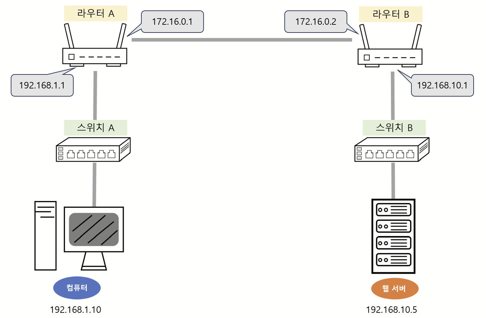
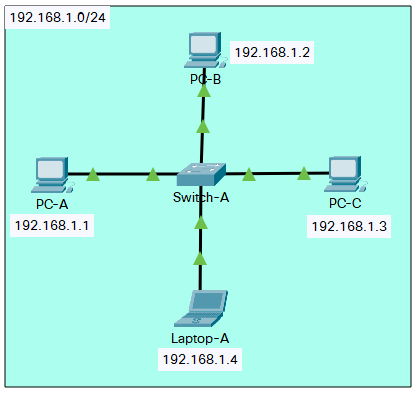
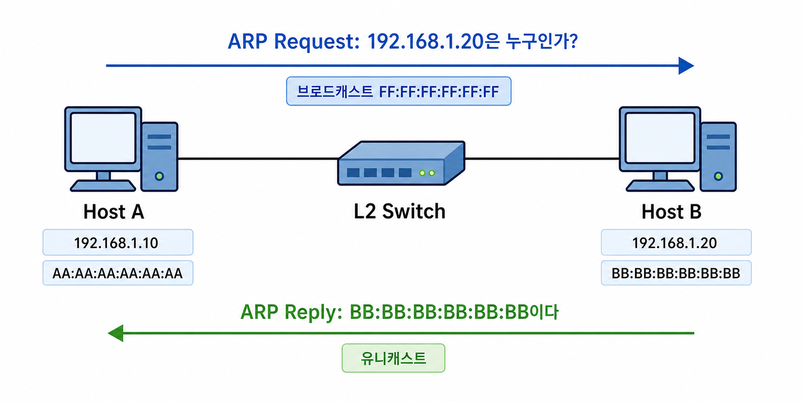
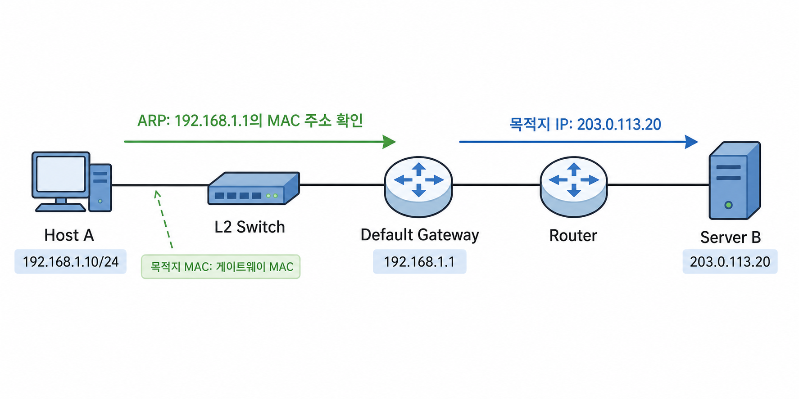
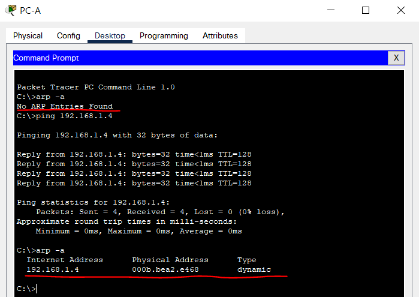
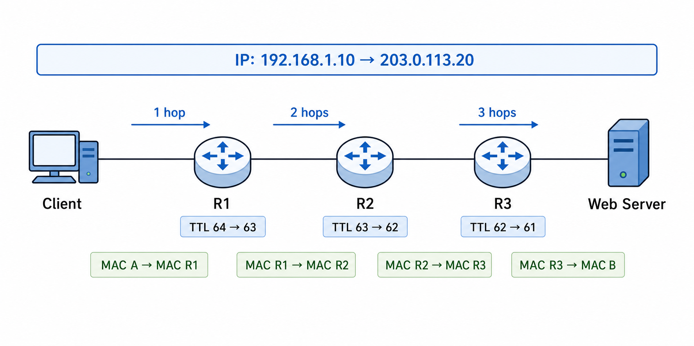
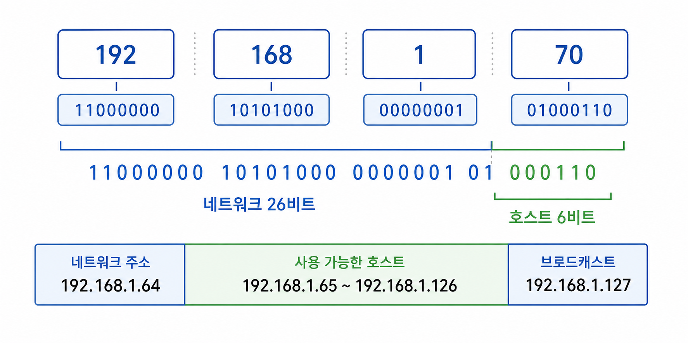
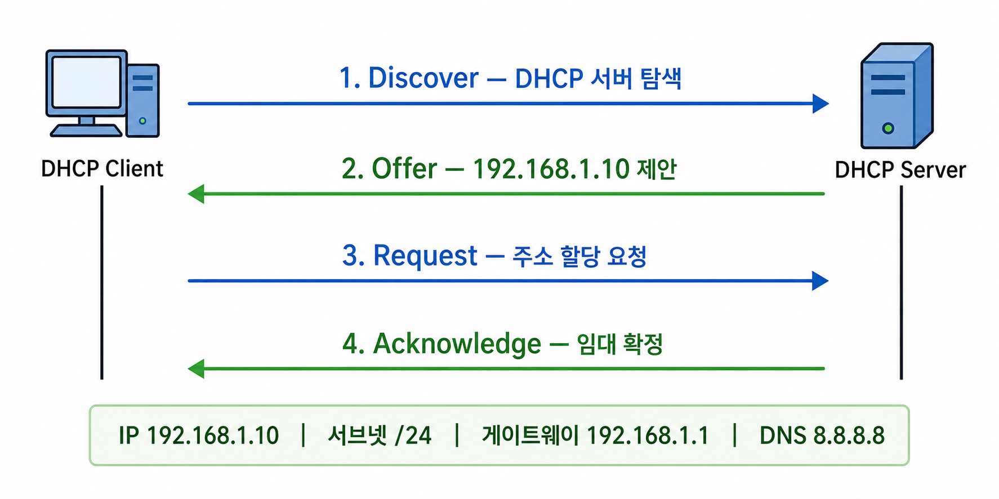
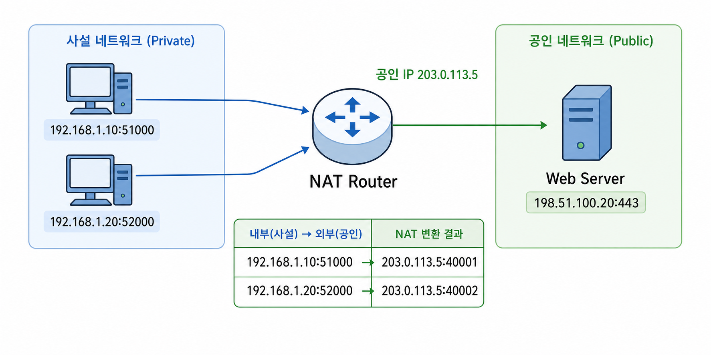

# IP 주소

IP 주소는 TCP/IP의 인터넷 계층에서 네트워크에 연결된 인터페이스를 식별하고, 패킷을 목적지 네트워크까지 전달하기 위해 사용하는 논리 주소다. 라우터와 L3 스위치는 목적지 IP 주소를 라우팅 테이블과 비교해 패킷을 보낼 다음 경로를 선택한다.

하지만 IP 주소만 안다고 Ethernet 프레임을 바로 전송할 수 있는 것은 아니다. 호스트는 목적지가 자신과 같은 네트워크에 있는지 먼저 판단하고, 실제로 프레임을 전달할 다음 장치의 MAC 주소를 알아내야 한다. 같은 네트워크의 목적지라면 목적지 호스트가 다음 장치가 되고, 다른 네트워크의 목적지라면 기본 게이트웨이가 다음 장치가 된다. IPv4에서는 이때 IP 주소에 대응하는 MAC 주소를 알아내기 위해 ARP를 사용한다.



이처럼 IP 주소는 최종 목적지를 정하고, MAC 주소는 각 네트워크 구간에서 만날 다음 장치까지 프레임을 전달하는 데 사용된다. 네트워크 기기 파트에서 살펴본 라우터, L3 스위치와 L2 스위치의 동작을 주소 관점에서 이어서 살펴보자.

## 2.4.1 ARP

ARP(Address Resolution Protocol)는 같은 IPv4 네트워크에서 **IP 주소에 대응하는 MAC 주소를 알아내는 프로토콜**이다. IP 패킷을 Ethernet과 같은 링크를 통해 보내려면 프레임의 목적지 MAC 주소가 필요하기 때문에 사용한다.

ARP가 IP 주소를 MAC 주소로 바꾼다고 표현하기도 하지만, 주소 자체를 변환하는 것은 아니다. IP 주소와 MAC 주소 사이의 대응 관계를 질의하고 그 결과를 일정 시간 저장하는 과정에 가깝다.

### ARP의 동작 과정

같은 LAN에 `192.168.1.10`과 `192.168.1.20`이 있고, 두 호스트의 서브넷 마스크가 `255.255.255.0`이라고 가정해 보자. `192.168.1.10`이 `192.168.1.20`으로 패킷을 보내려면 다음 과정을 거친다.



1. 송신 호스트는 자신의 ARP 캐시에 `192.168.1.20`의 MAC 주소가 있는지 확인한다.
2. 캐시에 없다면 "192.168.1.20을 사용하는 장치는 MAC 주소를 알려 달라"는 ARP 요청을 브로드캐스트한다.
3. 같은 브로드캐스트 도메인의 모든 장치가 요청을 받지만, 해당 IP 주소를 사용하는 장치만 자신의 MAC 주소를 담은 ARP 응답을 보낸다.
4. 송신 호스트는 응답받은 IP 주소와 MAC 주소의 관계를 ARP 캐시에 저장한다.
5. 알아낸 MAC 주소를 목적지로 하는 Ethernet 프레임에 IP 패킷을 담아 전송한다.



ARP 요청의 Ethernet 목적지 주소는 브로드캐스트 주소인 `FF:FF:FF:FF:FF:FF`이다. 따라서 L2 스위치는 요청을 수신한 포트를 제외한 같은 VLAN의 포트로 플러딩한다. ARP 응답은 요청을 보낸 호스트의 MAC 주소를 알고 있으므로 일반적으로 유니캐스트로 보낸다.

### 다른 네트워크로 보낼 때의 ARP

목적지가 다른 네트워크에 있다면 송신 호스트는 최종 목적지 호스트의 MAC 주소를 알아내지 않는다. ARP 브로드캐스트는 일반적으로 라우터를 넘어가지 않으며, 멀리 있는 목적지의 MAC 주소는 현재 LAN에서 프레임을 보내는 데 필요하지 않기 때문이다.

예를 들어 `192.168.1.10/24`가 `203.0.113.20`으로 패킷을 보낸다면 다음과 같이 동작한다.

1. 서브넷 마스크를 이용해 `203.0.113.20`이 다른 네트워크에 있음을 판단한다.
2. 라우팅 테이블에서 기본 게이트웨이 `192.168.1.1`을 다음 홉으로 선택한다.
3. ARP를 사용해 `192.168.1.1`의 MAC 주소를 알아낸다.
4. IP 패킷의 목적지 IP 주소는 `203.0.113.20`으로 유지하고, Ethernet 프레임의 목적지 MAC 주소는 기본 게이트웨이의 MAC 주소로 설정한다.
5. 게이트웨이는 프레임에서 IP 패킷을 꺼내고 목적지 IP 주소를 기준으로 다음 경로를 선택한다.



즉, ARP가 해결하는 대상은 항상 **현재 링크에서 직접 프레임을 전달할 다음 장치**다. 목적지가 같은 네트워크이면 목적지 호스트이고, 다른 네트워크이면 대개 기본 게이트웨이다.

### ARP 캐시

매번 통신할 때마다 ARP 요청을 브로드캐스트하면 불필요한 트래픽과 대기 시간이 발생한다. 호스트와 라우터는 알아낸 IP 주소와 MAC 주소의 관계를 ARP 캐시에 일정 시간 저장하고 재사용한다.

ARP 캐시 항목은 네트워크 변화에 대응할 수 있도록 일정 시간이 지나면 만료된다. 운영체제에 따라 사용 중인 항목을 다시 확인하거나 만료 시간을 연장하기도 한다. 장비가 교체되어 MAC 주소가 바뀌었는데 오래된 캐시가 남아 있으면 새 장비와의 통신이 잠시 실패할 수 있다.

운영체제에서는 `arp -a` 또는 `ip neigh` 명령어로 이웃 주소 정보를 확인할 수 있다. IPv6의 이웃 정보도 함께 다룰 수 있다는 점에서 Linux에서는 `ip neigh`가 더 일반적인 도구다.



### Gratuitous ARP와 ARP 스푸핑

**Gratuitous ARP**는 일반적인 질의에 대한 응답이 아니라, 호스트가 자신의 IP 주소와 MAC 주소 관계를 네트워크에 스스로 알리는 ARP 메시지다. IP 주소 중복을 감지하거나, 장비 장애 조치 후 가상 IP 주소를 넘겨받은 새 장비의 MAC 주소를 주변 장치에 빠르게 알리는 데 사용할 수 있다.

ARP에는 응답 내용이 신뢰할 수 있는지 확인하는 인증 기능이 없다. 공격자가 기본 게이트웨이의 IP 주소가 자신의 MAC 주소와 대응한다고 거짓 ARP 메시지를 보내면 다른 호스트의 트래픽을 가로채거나 차단할 수 있다. 이를 **ARP 스푸핑(ARP Spoofing**) 또는 ARP 캐시 포이즈닝이라고 한다. 정적 ARP 항목, 스위치의 DHCP 스누핑과 동적 ARP 검사 같은 기능으로 위험을 줄일 수 있지만 네트워크 환경에 맞는 구성이 필요하다.

ARP는 IPv4에서 사용한다. IPv6에서는 ARP 대신 ICMPv6를 기반으로 하는 **NDP(Neighbor Discovery Protocol**)가 이웃의 링크 계층 주소 확인, 라우터 탐색 등의 기능을 수행한다.

## 2.4.2 홉바이홉 통신

IP 패킷은 출발지에서 목적지까지 항상 한 번에 전달되지 않는다. 여러 라우터를 차례로 거치며 각 라우터가 패킷을 다음 장치로 전달한다. 이처럼 패킷이 라우터와 라우터 사이를 한 구간씩 이동하는 방식을 **홉바이홉(Hop-by-Hop**) 통신이라고 한다.

여기서 **홉(Hop**)은 패킷이 하나의 라우터나 네트워크 구간을 지나 다음 라우터로 이동하는 단계를 의미하고, **다음 홉(Next Hop**)은 현재 장치가 패킷을 다음으로 전달할 라우터나 직접 연결된 목적지다.



각 라우터는 목적지까지의 전체 전달 과정을 지시하지 않는다. 자신의 라우팅 테이블을 확인해 현재 위치에서 보낼 다음 홉과 출력 인터페이스만 결정한다. 다음 라우터도 같은 판단을 반복하며, 이 과정이 목적지 네트워크에 도착할 때까지 이어진다.

### 라우팅과 포워딩

**라우팅(Routing**)은 목적지 네트워크까지 도달할 수 있는 경로 정보를 학습하고 라우팅 테이블을 만드는 과정이다. 관리자가 정적 경로를 설정하거나, OSPF·BGP 같은 라우팅 프로토콜을 통해 다른 라우터와 경로 정보를 교환할 수 있다.

**포워딩(Forwarding**)은 실제로 패킷이 들어왔을 때 목적지 IP 주소를 라우팅 테이블과 비교하고 적절한 출력 인터페이스로 내보내는 동작이다. 일상적으로 두 과정을 모두 라우팅이라고 부르기도 하지만, 경로를 만드는 제어 과정과 패킷을 전달하는 데이터 처리 과정이라는 차이가 있다.

라우팅 테이블에는 일반적으로 다음과 같은 정보가 들어간다.

| 항목 | 의미 |
| --- | --- |
| 목적지 네트워크 | 해당 경로가 적용되는 IP 주소 범위와 접두사 길이 |
| 다음 홉 또는 게이트웨이 | 패킷을 다음으로 전달할 라우터의 IP 주소 |
| 출력 인터페이스 | 패킷을 내보낼 네트워크 인터페이스 |
| 메트릭 | 같은 목적지에 여러 경로가 있을 때 우선순위를 비교하는 값 |

다음은 개념을 단순화한 라우팅 테이블의 예다.

| 목적지 | 다음 홉 | 인터페이스 |
| --- | --- | --- |
| `192.168.1.0/24` | 직접 연결 | `eth0` |
| `10.0.0.0/8` | `192.168.1.2` | `eth0` |
| `0.0.0.0/0` | `192.168.1.1` | `eth0` |

목적지 `192.168.1.20`은 첫 번째 경로를 사용해 직접 전달한다. `10.20.30.40`은 두 번째 경로와 일치하므로 `192.168.1.2`로 전달하고, 그 밖의 목적지는 더 구체적인 경로가 없을 때 기본 경로인 `0.0.0.0/0`을 사용한다.

### 최장 접두사 일치

하나의 목적지 IP 주소가 여러 경로와 일치할 수 있다. 이때 라우터는 일반적으로 네트워크 접두사가 가장 길어 목적지 범위를 가장 구체적으로 나타내는 경로를 선택한다. 이를 **최장 접두사 일치(Longest Prefix Match**)라고 한다.

예를 들어 라우팅 테이블에 다음 경로가 있고 목적지가 `10.1.2.30`이라면 세 경로가 모두 일치한다.

```text
0.0.0.0/0
10.0.0.0/8
10.1.2.0/24
```

이 중 `/24`가 가장 긴 접두사이므로 `10.1.2.0/24` 경로를 선택한다. 메트릭은 보통 접두사 길이가 같은 후보 경로 사이의 우선순위를 정할 때 비교한다. 먼저 가장 구체적인 경로를 찾고, 그다음 해당 경로를 어떤 방식으로 학습했는지와 메트릭 등을 고려한다.

### 기본 게이트웨이와 기본 경로

**기본 게이트웨이(Default Gateway**)는 호스트가 더 구체적인 경로를 알지 못하는 외부 네트워크로 패킷을 보낼 때 사용하는 라우터다. 호스트의 라우팅 테이블에는 보통 기본 게이트웨이를 다음 홉으로 하는 기본 경로가 등록된다.

IPv4의 기본 경로 `0.0.0.0/0`은 모든 IPv4 주소와 일치하지만 접두사 길이가 0이므로 가장 덜 구체적이다. 따라서 직접 연결된 네트워크나 별도로 등록된 경로가 있으면 그 경로를 먼저 사용하고, 일치하는 다른 경로가 없을 때만 기본 경로를 사용한다. IPv6의 기본 경로는 `::/0`이다.

기본 게이트웨이는 목적지까지 모든 경로를 대신 아는 주소라기보다, 호스트가 자신이 모르는 목적지의 처리를 넘기는 첫 번째 라우터다. 이후의 라우터들은 각자의 라우팅 테이블에 따라 다시 다음 홉을 선택한다.

### 홉마다 달라지는 정보

라우터가 Ethernet 네트워크 사이에서 패킷을 전달할 때는 수신한 프레임을 제거하고, 다음 링크에 맞는 새 프레임으로 IP 패킷을 감싼다. 따라서 NAT가 없는 일반적인 IPv4 통신에서는 주소가 다음과 같이 변한다.

| 정보 | 라우터를 지날 때의 변화 |
| --- | --- |
| 출발지·목적지 IP 주소 | 일반적으로 종단 사이에서 유지 |
| 출발지·목적지 MAC 주소 | 각 링크의 송신 장치와 다음 장치에 맞게 변경 |
| TTL | 라우터를 지날 때마다 1 감소 |
| IPv4 헤더 체크섬 | TTL 변경을 반영해 다시 계산 |

NAT를 수행하는 라우터를 지나면 출발지 또는 목적지 IP 주소와 포트 번호도 바뀔 수 있다. 또한 모든 네트워크 구간이 Ethernet을 사용하는 것은 아니므로, 링크의 종류에 따라 MAC 주소가 없는 다른 형식의 프레임을 사용할 수도 있다. 핵심은 IP 패킷을 다음 링크에서 전달할 수 있는 형태로 매 홉 다시 구성한다는 점이다.

TTL(Time To Live)은 이름과 달리 IPv4에서 실제 시간을 재는 값이 아니라 라우터를 통과할 수 있는 횟수를 제한하는 값으로 사용된다. 라우터는 TTL을 1 감소시키고 0이 되면 패킷을 폐기한 뒤 일반적으로 ICMP 시간 초과 메시지를 보낸다. 이를 통해 라우팅 오류가 발생해도 패킷이 네트워크를 무한히 순환하는 것을 막는다.

`traceroute`나 `tracert`는 TTL 또는 IPv6의 Hop Limit을 작은 값부터 늘려 가며 패킷을 보내고, 각 라우터가 반환하는 ICMP 메시지를 이용해 목적지까지의 홉을 추정한다. 다만 라우터나 방화벽이 ICMP 응답을 제한할 수 있고 왕복 경로가 서로 다를 수도 있으므로 출력된 결과가 항상 전체 실제 경로를 정확히 보여 주는 것은 아니다.

## 2.4.3 IP 주소 체계

IP 주소는 네트워크 부분과 호스트 부분으로 나뉜다. 네트워크 부분은 어느 네트워크에 속하는지를 나타내고, 호스트 부분은 그 네트워크 안의 인터페이스를 구분한다. 두 부분의 경계는 서브넷 마스크나 CIDR 접두사 길이로 표현한다.

### IPv4와 IPv6

IPv4 주소는 32비트이며, 8비트씩 네 부분으로 나누어 10진수로 표기한다. 각 부분은 `0`부터 `255`까지의 값을 가질 수 있다.

```text
11000000.10101000.00000001.00001010
     192.     168.       1.      10
```

32비트로 만들 수 있는 주소는 약 43억 개다. 인터넷에 연결되는 장치가 늘면서 IPv4 주소가 부족해졌고, 사설 주소와 NAT, CIDR 같은 기술로 주소를 효율적으로 사용해 왔다.

IPv6 주소는 128비트이며 16비트씩 여덟 부분으로 나누어 16진수로 표기한다.

```text
2001:0db8:0000:0000:0000:ff00:0042:8329
```

각 부분의 앞쪽 0은 생략할 수 있고, 연속된 0 부분은 한 주소에서 한 번만 `::`로 줄일 수 있다. 따라서 위 주소는 `2001:db8::ff00:42:8329`로 표현할 수 있다. IPv6는 매우 큰 주소 공간을 제공하며 브로드캐스트 대신 멀티캐스트를 사용한다. 또한 앞에서 살펴본 것처럼 ARP 대신 NDP를 사용하고, IPv4의 TTL에 해당하는 필드의 이름은 Hop Limit이다.

IPv4와 IPv6는 주소 길이만 다른 동일한 프로토콜이 아니며 헤더 구조와 주변 프로토콜도 다르다. 한쪽만 지원하는 장치와 통신하려면 듀얼 스택, 터널링, 변환 기술 등이 필요할 수 있다.

| 구분 | IPv4 | IPv6 |
| --- | --- | --- |
| 주소 길이 | 32비트 | 128비트 |
| 표기 예 | `192.168.1.10` | `2001:db8::10` |
| 주소 확인 | ARP | ICMPv6 기반 NDP |
| 브로드캐스트 | 사용 | 사용하지 않음 |
| 홉 제한 필드 | TTL | Hop Limit |

### 서브넷 마스크와 CIDR

서브넷 마스크는 IPv4 주소에서 네트워크 부분을 1로, 호스트 부분을 0으로 나타낸 32비트 값이다. IP 주소와 서브넷 마스크를 비트 AND 연산하면 네트워크 주소를 구할 수 있다.

```text
IP 주소       192.168.1.70   = 11000000.10101000.00000001.01000110
서브넷 마스크 255.255.255.0  = 11111111.11111111.11111111.00000000
AND 결과      192.168.1.0    = 11000000.10101000.00000001.00000000
```

`255.255.255.0`처럼 앞에서부터 연속된 1이 24개인 서브넷 마스크는 CIDR(Classless Inter-Domain Routing) 표기법으로 `/24`라고 쓴다. 따라서 `192.168.1.70/24`의 네트워크 주소는 `192.168.1.0`이고 주소 범위는 `192.168.1.0`부터 `192.168.1.255`까지다.

전통적인 IPv4 서브넷에서는 호스트 부분이 모두 0인 주소를 **네트워크 주소**, 모두 1인 주소를 **브로드캐스트 주소**로 사용한다. 일반 호스트에는 그 사이의 주소를 할당한다.

| 구분 | `192.168.1.0/24`의 예 |
| --- | --- |
| 네트워크 주소 | `192.168.1.0` |
| 일반적인 호스트 범위 | `192.168.1.1` ~ `192.168.1.254` |
| 브로드캐스트 주소 | `192.168.1.255` |

접두사 길이가 `/n`이라면 호스트 부분은 `32-n`비트이고 전체 주소 수는 `2^(32-n)`개다. 일반적인 서브넷에서 네트워크 주소와 브로드캐스트 주소를 제외하면 호스트에 할당할 수 있는 주소 수는 `2^(32-n)-2`개다. 다만 점대점 링크에 사용하는 `/31`과 단일 호스트 경로를 나타내는 `/32`는 이 공식을 그대로 적용하지 않는다.

예를 들어 `192.168.1.64/26`은 호스트 부분이 6비트이므로 전체 주소가 64개다. 범위는 `192.168.1.64`부터 `192.168.1.127`까지이며, 일반적인 호스트 주소는 `192.168.1.65`부터 `192.168.1.126`까지다.



서브넷을 나누면 주소를 필요한 크기로 배분하고 브로드캐스트 도메인을 분리할 수 있다. 서로 다른 서브넷끼리 통신하려면 라우터나 L3 스위치가 패킷을 라우팅해야 한다.

### 클래스 기반 주소와 CIDR

과거에는 IPv4 주소의 앞부분에 따라 네트워크와 호스트 부분을 A, B, C 클래스로 고정해서 나누는 클래스 기반 주소 체계를 사용했다.

| 클래스 | 첫 옥텟 범위 | 기본 접두사 | 일반적인 용도 |
| --- | --- | --- | --- |
| A | `1` ~ `126` | `/8` | 매우 큰 네트워크 |
| B | `128` ~ `191` | `/16` | 중간 규모 네트워크 |
| C | `192` ~ `223` | `/24` | 작은 네트워크 |

`127.0.0.0/8`은 루프백 용도로 예약되어 있어 일반적인 A 클래스 네트워크로 할당하지 않는다. D 클래스 범위였던 `224.0.0.0/4`는 멀티캐스트, E 클래스 범위였던 `240.0.0.0/4`는 예약 용도로 분류했다.

클래스 단위로만 주소를 할당하면 필요한 수보다 지나치게 크거나 작은 주소 블록을 받게 되어 낭비가 발생한다. 현재는 클래스 경계와 관계없이 `/20`, `/27`처럼 접두사 길이로 네트워크 크기를 정하는 CIDR 방식을 사용한다. 클래스 개념은 주소 체계의 역사와 오래된 표현을 이해하는 데 의미가 있지만, 실제 네트워크 범위는 반드시 명시된 접두사 길이를 기준으로 판단해야 한다.

### 공인 IP 주소와 사설 IP 주소

**공인 IP 주소(Public IP Address**)는 인터넷에서 전역적으로 라우팅할 수 있도록 고유하게 할당되는 주소다. **사설 IP 주소(Private IP Address**)는 조직이나 가정의 내부 네트워크에서 자유롭게 사용할 수 있도록 예약된 주소이며 공용 인터넷에서는 직접 라우팅하지 않는다.

IPv4의 사설 주소 범위는 다음과 같다.

| 범위 | CIDR |
| --- | --- |
| `10.0.0.0` ~ `10.255.255.255` | `10.0.0.0/8` |
| `172.16.0.0` ~ `172.31.255.255` | `172.16.0.0/12` |
| `192.168.0.0` ~ `192.168.255.255` | `192.168.0.0/16` |

`172`로 시작하는 모든 주소가 사설 주소인 것은 아니며 두 번째 옥텟이 `16`부터 `31`인 범위만 해당한다. 서로 다른 사설 네트워크에서는 같은 주소를 중복해서 사용할 수 있지만, 두 네트워크를 VPN 등으로 연결할 때 주소 범위가 겹치면 어느 쪽으로 라우팅할지 모호해질 수 있다.

그 밖에 자주 접하는 특수 목적 IPv4 주소가 있다.

| 주소 범위 | 의미 |
| --- | --- |
| `127.0.0.0/8` | 자기 자신을 가리키는 루프백 주소, 대표적으로 `127.0.0.1` |
| `169.254.0.0/16` | DHCP 등에 실패했을 때 사용할 수 있는 링크 로컬 주소 |
| `0.0.0.0` | 문맥에 따라 아직 정해지지 않은 주소 또는 모든 로컬 인터페이스 |
| `255.255.255.255` | 현재 로컬 네트워크의 제한된 브로드캐스트 주소 |
| `224.0.0.0/4` | IPv4 멀티캐스트 주소 |

주소의 의미는 사용되는 문맥에 따라 달라질 수 있다. 예를 들어 서버가 `0.0.0.0`에 바인딩한다는 것은 호스트의 모든 IPv4 인터페이스에서 연결을 받겠다는 의미이지, 원격 접속 대상의 실제 주소가 `0.0.0.0`이라는 뜻은 아니다.

### DHCP를 이용한 IP 주소 할당

IP 주소, 서브넷 마스크, 기본 게이트웨이와 DNS 서버 주소를 장치마다 직접 설정할 수 있지만, 규모가 커질수록 중복과 설정 오류를 관리하기 어렵다. DHCP(Dynamic Host Configuration Protocol)는 호스트가 네트워크 설정을 자동으로 받을 수 있게 하는 애플리케이션 계층 프로토콜이다.

IPv4에서 새로운 클라이언트가 주소를 할당받는 대표적인 과정은 흔히 DORA라고 부른다.

1. **Discover**: 클라이언트가 사용할 DHCP 서버를 찾는 메시지를 보낸다.
2. **Offer**: DHCP 서버가 할당 가능한 IP 주소와 설정을 제안한다.
3. **Request**: 클라이언트가 사용할 제안을 선택해 주소 할당을 요청한다.
4. **Acknowledge**: 서버가 임대 정보를 확정하고 네트워크 설정을 전달한다.



클라이언트는 주소를 영구 소유하는 것이 아니라 정해진 시간 동안 **임대(Lease**)받고, 만료되기 전에 갱신한다. DHCP 메시지는 초기에는 클라이언트가 자신의 주소와 서버의 위치를 모를 수 있어 브로드캐스트를 사용한다. 라우터는 일반적으로 브로드캐스트를 전달하지 않으므로 DHCP 서버가 다른 네트워크에 있다면 DHCP 릴레이가 요청을 서버까지 중계할 수 있다.

### NAT

NAT(Network Address Translation)는 라우터나 방화벽이 패킷의 IP 주소를 다른 주소로 변환하는 기술이다. 가정이나 조직에서는 여러 사설 IP 주소를 하나 또는 소수의 공인 IP 주소로 변환해 인터넷에 접속하는 데 주로 사용한다.

여러 내부 호스트가 하나의 공인 IP 주소를 공유하려면 IP 주소뿐 아니라 TCP·UDP 포트 번호도 함께 변환해 연결을 구분한다. 이를 NAPT(Network Address Port Translation) 또는 PAT(Port Address Translation)라고 하며, 일상적으로는 이 방식도 NAT라고 부르는 경우가 많다.



NAT 장비는 변환 관계를 테이블에 기록한다. 외부 서버의 응답이 공인 주소와 변환된 포트로 돌아오면 테이블을 확인해 원래 사설 주소와 포트로 되돌려 전달한다.

NAT는 IPv4 공인 주소를 절약하고 내부 주소 체계를 외부와 분리할 수 있게 하지만, 종단 간 주소가 그대로 유지된다는 IP의 원칙을 약화한다. 외부에서 내부 호스트로 먼저 연결하려면 포트 포워딩 같은 별도 설정이 필요하고, IP 주소나 포트 정보를 메시지 안에 포함하는 일부 프로토콜은 추가 처리가 필요할 수 있다.

NAT 자체를 방화벽과 같다고 보아서는 안 된다. 주소 변환 과정에서 외부의 임의 연결이 자연스럽게 제한되는 경우가 많지만, 접근 허용 여부를 정책에 따라 검사하고 차단하는 것이 방화벽의 역할이다.

## 2.4.4 IP 주소를 이용한 위치 정보

IP 주소는 지리 좌표를 직접 포함하지 않는다. 주소의 네트워크 부분은 패킷을 라우팅하기 위한 논리적인 구분이며, 우편번호처럼 주소만 해석해서 실제 위치를 정확히 알아낼 수 있는 구조가 아니다.

다만 공인 IP 주소 블록은 인터넷 서비스 제공자(ISP), 클라우드 사업자와 조직 등에 할당된다. IP 위치 정보 서비스는 주소 할당 기관의 공개 정보, ISP가 제공하는 정보, 네트워크 관측 결과와 여러 수집 자료를 조합한 데이터베이스를 이용해 국가, 지역, 도시, ISP 등을 **추정**한다.

추정 결과의 정확도는 주소와 환경에 따라 다르다.

- 국가 수준에서는 비교적 정확할 수 있지만 도시나 세부 위치는 실제 접속 장소와 다를 수 있다.
- 이동 통신망이나 회사망에서는 여러 지역의 사용자가 중앙 게이트웨이의 공인 IP 주소를 공유할 수 있다.
- NAT나 CGNAT 환경에서는 여러 사용자가 하나의 공인 IP 주소를 함께 사용할 수 있다.
- VPN이나 프록시를 사용하면 서비스에는 사용자의 실제 접속망이 아니라 중계 서버의 공인 IP 주소가 보인다.
- 클라우드 주소, 새로 이전된 주소 블록과 동적으로 할당되는 주소는 데이터베이스 갱신이 늦어 잘못 표시될 수 있다.

따라서 IP 주소만으로 특정 사용자의 정확한 집, 실시간 좌표나 신원을 확정할 수 없다. 웹 서비스는 IP 기반 위치 정보를 국가별 콘텐츠 제공, 언어와 시간대의 초깃값, 이상 접속 탐지 등에 참고할 수 있지만 중요한 판단에는 계정 정보, 사용자 동의로 얻은 위치, 추가 인증과 같은 다른 신호를 함께 사용해야 한다.

사설 IP 주소는 서로 다른 내부 네트워크에서 반복해서 사용하므로 인터넷상의 지리적 위치를 추정하는 데 사용할 수 없다. 외부 서비스가 일반적으로 확인하는 주소는 NAT를 통과한 뒤의 공인 IP 주소다.

IP 주소는 단독으로 개인을 정확히 식별하지 못하더라도 다른 정보와 결합하면 사용자의 활동이나 대략적인 위치를 추적하는 단서가 될 수 있다. 따라서 로그를 수집하고 보관할 때는 서비스 목적에 필요한 범위, 접근 권한과 보존 기간을 고려해야 한다.

## 예상 면접 질문

IP 주소는 주소의 정의만 외우기보다, 호스트가 목적지까지 패킷을 보내기 위해 어떤 주소와 테이블을 확인하는지 설명할 수 있어야 한다. 질문을 누르면 답변을 확인할 수 있다.

<details>
<summary><strong>1. IP 주소와 MAC 주소는 각각 어디에 사용하나요?</strong></summary>

IP 주소는 인터넷 계층에서 최종 목적지 네트워크와 인터페이스를 식별하고 라우터가 경로를 선택하는 데 사용한다. MAC 주소는 Ethernet 같은 현재 네트워크 구간에서 프레임을 다음 장치까지 전달하는 데 사용한다. NAT가 없는 일반적인 통신에서는 종단의 IP 주소가 유지되지만 MAC 주소는 라우터를 지날 때마다 각 링크에 맞게 바뀐다.

</details>

<details>
<summary><strong>2. ARP는 무엇이며 어떻게 동작하나요?</strong></summary>

ARP는 같은 IPv4 네트워크에서 IP 주소에 대응하는 MAC 주소를 알아내는 프로토콜이다. 호스트는 먼저 ARP 캐시를 확인하고, 정보가 없으면 ARP 요청을 브로드캐스트한다. 해당 IP 주소를 가진 장치가 자신의 MAC 주소로 응답하면 그 관계를 캐시에 저장하고 Ethernet 프레임을 전송한다. IPv6에서는 ARP 대신 NDP를 사용한다.

</details>

<details>
<summary><strong>3. 다른 네트워크의 서버로 보낼 때 어떤 주소를 ARP로 조회하나요?</strong></summary>

최종 목적지 서버가 아니라 현재 네트워크의 다음 홉인 기본 게이트웨이의 IP 주소를 조회한다. IP 패킷의 목적지 IP 주소에는 최종 서버 주소를 넣고, Ethernet 프레임의 목적지 MAC 주소에는 기본 게이트웨이의 MAC 주소를 넣는다. ARP 브로드캐스트는 일반적으로 라우터를 넘어가지 않는다.

</details>

<details>
<summary><strong>4. 홉바이홉 통신이란 무엇인가요?</strong></summary>

출발지에서 목적지까지 패킷이 여러 라우터를 한 단계씩 거쳐 전달되는 방식이다. 각 라우터는 목적지까지의 모든 전달 과정을 지시하지 않고 자신의 라우팅 테이블을 기준으로 다음 홉과 출력 인터페이스를 선택한다. 다음 라우터가 같은 과정을 반복해 최종 목적지에 도달한다.

</details>

<details>
<summary><strong>5. 라우팅과 포워딩의 차이는 무엇인가요?</strong></summary>

라우팅은 정적 설정이나 라우팅 프로토콜을 이용해 목적지 네트워크까지의 경로를 학습하고 라우팅 테이블을 만드는 과정이다. 포워딩은 실제 패킷의 목적지 IP 주소를 테이블과 비교해 선택한 출력 인터페이스로 내보내는 동작이다.

</details>

<details>
<summary><strong>6. 최장 접두사 일치란 무엇인가요?</strong></summary>

목적지 IP 주소와 일치하는 경로가 여러 개일 때 가장 긴 접두사, 즉 가장 구체적인 네트워크 범위를 가진 경로를 선택하는 방식이다. 예를 들어 목적지 `10.1.2.30`에 대해 `/0`, `10.0.0.0/8`, `10.1.2.0/24`가 모두 일치하면 `/24` 경로를 선택한다.

</details>

<details>
<summary><strong>7. 서브넷 마스크는 왜 필요한가요?</strong></summary>

IP 주소에서 네트워크 부분과 호스트 부분의 경계를 나타내기 위해 필요하다. 호스트는 자신의 IP 주소와 목적지 IP 주소에 서브넷 마스크를 적용해 같은 네트워크인지 판단한다. 같은 네트워크이면 직접 프레임을 보내고, 다른 네트워크이면 라우팅 테이블에 따라 기본 게이트웨이 등의 다음 홉으로 보낸다.

</details>

<details>
<summary><strong>8. `192.168.1.70/26`의 네트워크 범위는 어떻게 되나요?</strong></summary>

`/26`은 호스트 부분이 6비트이므로 서브넷 하나에 주소가 64개씩 들어간다. `192.168.1.70`은 `64`부터 `127`까지의 범위에 있으므로 네트워크 주소는 `192.168.1.64`, 브로드캐스트 주소는 `192.168.1.127`이다. 일반적으로 호스트에 할당할 수 있는 범위는 `192.168.1.65`부터 `192.168.1.126`까지다.

</details>

<details>
<summary><strong>9. 공인 IP 주소와 사설 IP 주소의 차이는 무엇인가요?</strong></summary>

공인 IP 주소는 인터넷에서 전역적으로 고유하게 할당되고 라우팅할 수 있는 주소다. 사설 IP 주소는 내부 네트워크에서 사용할 수 있도록 예약된 주소이며 공용 인터넷에서는 직접 라우팅하지 않는다. 사설 주소를 사용하는 호스트가 인터넷에 접속할 때는 일반적으로 NAT를 통해 공인 주소로 변환한다.

</details>

<details>
<summary><strong>10. DHCP의 DORA 과정을 설명해 주세요.</strong></summary>

클라이언트가 DHCP 서버를 찾는 Discover를 보내면 서버가 사용할 수 있는 주소를 Offer한다. 클라이언트는 선택한 주소를 Request하고, 서버가 Acknowledge로 임대를 확정하며 IP 주소, 서브넷 마스크, 기본 게이트웨이와 DNS 서버 등의 설정을 전달한다.

</details>

<details>
<summary><strong>11. NAT와 방화벽은 같은 기능인가요?</strong></summary>

같지 않다. NAT는 패킷의 IP 주소나 포트 번호를 변환하는 기술이고, 방화벽은 설정된 보안 정책에 따라 트래픽의 허용 여부를 판단한다. NAT 환경에서 외부의 임의 연결이 제한되는 효과가 생길 수 있지만 주소 변환 자체가 방화벽의 접근 제어를 대신하지는 않는다.

</details>

<details>
<summary><strong>12. IP 주소만으로 사용자의 정확한 위치를 알 수 있나요?</strong></summary>

알 수 없다. IP 위치 정보는 주소 블록의 할당 정보와 여러 관측 자료를 이용한 추정값이다. NAT, 이동 통신망, VPN, 프록시, 동적 주소 할당과 데이터베이스 갱신 지연 때문에 실제 위치와 다를 수 있다. 국가나 대략적인 지역을 추정하는 참고 정보로 사용할 수 있지만 정확한 좌표나 개인의 신원을 확정하는 정보로 보아서는 안 된다.

</details>
