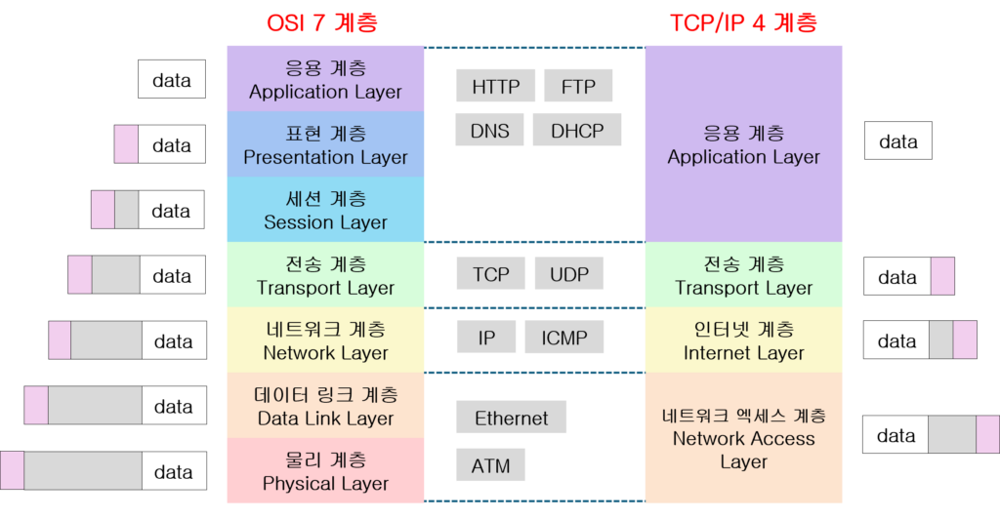
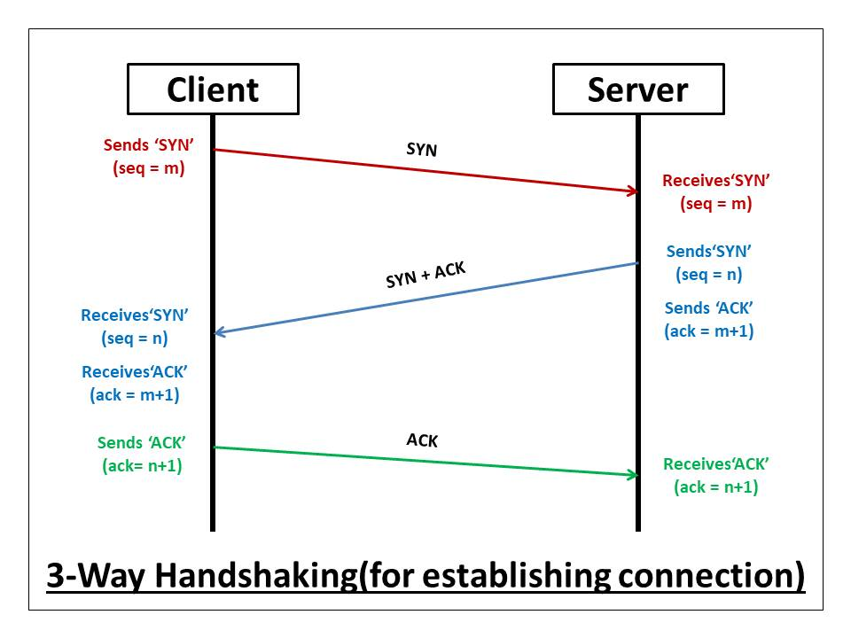
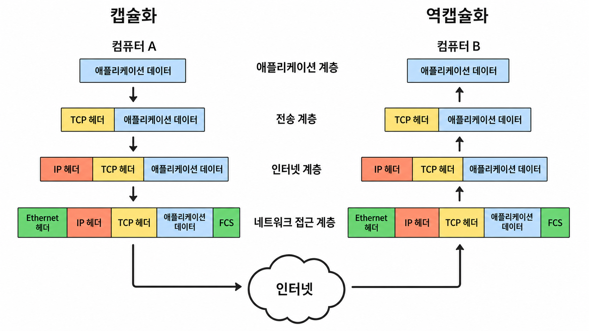

# TCP/IP 4계층 모델

오늘의 CS는 네트워크의 **TCP/IP 4계층 모델**에 대해서 알아보겠다.

네트워크의 통신 과정을 계층으로 나눈 대표적인 모델에는 **OSI 7계층**과 **TCP/IP 4계층**이 있다. 두 모델 모두 복잡한 네트워크 통신 과정을 계층별로 나누어 설명하지만, 계층의 수와 구분 방식에는 차이가 있다.

## OSI 7계층이란?

OSI(Open Systems Interconnection) 7계층은 네트워크 통신 과정을 일곱 개의 계층으로 나눈 모델이다.

서로 다른 컴퓨터나 네트워크 장비가 통신하기 위해서는 공통된 기준이 필요하다. OSI 7계층은 네트워크에서 일어나는 통신 과정을 단계별로 나누고 각 단계의 역할을 정의한 참조 모델이다.

통신 과정을 계층별로 구분하기 때문에 네트워크의 동작을 이해하기 쉽고, 문제가 발생했을 때 어느 계층에서 문제가 생겼는지 확인하는 데 도움이 된다.

OSI 7계층은 위에서부터 애플리케이션 계층, 표현 계층, 세션 계층, 전송 계층, 네트워크 계층, 데이터 링크 계층, 물리 계층으로 구성된다.

## TCP/IP 4계층이란?

TCP/IP 4계층은 인터넷에서 데이터를 주고받을 때 사용하는 프로토콜을 역할에 따라 네 개의 계층으로 나눈 모델이다. OSI 7계층이 네트워크 통신을 설명하기 위한 참조 모델이라면, TCP/IP 4계층은 인터넷에서 실제로 사용하는 프로토콜을 중심으로 구성된 모델이다.

여기서 TCP/IP는 TCP와 IP 두 개만을 의미하는 것이 아니다. 인터넷에서 통신하기 위해 사용하는 여러 프로토콜의 집합을 뜻하며, 이를 **인터넷 프로토콜 스위트(Internet Protocol Suite)** 라고도 한다. TCP와 IP가 이 프로토콜 집합의 중심이기 때문에 보통 TCP/IP라고 부른다.

TCP/IP 모델도 계층을 나누었기 때문에 특정 계층의 기술이나 프로토콜이 변경되어도 다른 계층에 미치는 영향을 줄일 수 있다.

TCP/IP 모델은 애플리케이션 계층, 전송 계층, 인터넷 계층, 네트워크 접근 계층으로 구성된다.

자료에 따라 네트워크 접근 계층을 링크 계층과 물리 계층으로 나누어 TCP/IP 5계층으로 설명하기도 한다. 하지만 여기서는 4계층을 기준으로 학습하겠다.

## 2.2.1 계층 구조

TCP/IP 4계층을 자세히 알아보기 전에 OSI 7계층이 어떻게 구성되는지 간단하게 살펴보겠다.

### OSI 7계층

OSI 7계층의 각 계층이 담당하는 역할은 다음과 같다.

- **7계층 - 애플리케이션 계층**: 이메일, 파일 전송, 웹과 같은 네트워크 서비스 제공
- **6계층 - 표현 계층**: 데이터 형식 변환, 인코딩, 압축, 암호화 처리
- **5계층 - 세션 계층**: 통신 세션 설정, 유지, 종료
- **4계층 - 전송 계층**: 프로세스 사이의 데이터 전송, 신뢰성 및 흐름 제어 담당
- **3계층 - 네트워크 계층**: 목적지까지의 경로 설정 및 패킷 전달
- **2계층 - 데이터 링크 계층**: MAC 주소를 이용한 프레임 전달 및 오류 확인
- **1계층 - 물리 계층**: 데이터를 전기 신호나 무선 신호로 변환 및 전송

OSI 7계층은 통신 과정을 세부적으로 구분한다. TCP/IP 모델에서는 이 역할들을 네 개의 계층으로 묶어서 표현한다.

### OSI 7계층과 TCP/IP 4계층의 대응 관계

두 모델의 계층은 다음과 같이 대응된다.



그림 가운데에는 각 계층에서 사용하는 대표적인 프로토콜과 기술이 표시되어 있다. DHCP는 IP 주소와 네트워크 설정을 자동으로 제공하는 애플리케이션 계층 프로토콜이고, ATM은 Ethernet과 마찬가지로 네트워크 접근 계층에 포함되는 기술이다. 양옆의 `data`는 계층을 내려가면서 헤더와 트레일러가 추가되는 캡슐화 과정을 간단하게 표현한 것이다.

그림의 `네트워크 엑세스 계층`은 **네트워크 액세스 계층**의 잘못된 표기다. 계층 대응 관계에는 문제가 없으며, ATM은 현재 LAN에서 흔히 사용하는 기술은 아니지만 네트워크 접근 계층에 속하는 것은 맞다.

- OSI **애플리케이션 계층, 표현 계층, 세션 계층** → TCP/IP **애플리케이션 계층**
- OSI **전송 계층** → TCP/IP **전송 계층**
- OSI **네트워크 계층** → TCP/IP **인터넷 계층**
- OSI **데이터 링크 계층, 물리 계층** → TCP/IP **네트워크 접근 계층**

### TCP/IP 4계층

이제 TCP/IP 4계층의 각 계층을 자세히 알아보겠다. TCP/IP 모델은 위에서부터 애플리케이션 계층, 전송 계층, 인터넷 계층, 네트워크 접근 계층으로 나뉜다.

데이터를 보낼 때는 위에서 아래로 이동하고, 데이터를 받을 때는 아래에서 위로 이동한다. 우선 가장 위에 있는 애플리케이션 계층부터 살펴보겠다.

#### 애플리케이션 계층 (Application Layer)

애플리케이션 계층은 사용자와 가장 가까운 곳에서 실제로 주고받을 데이터를 만드는 계층이다.

웹 브라우저에서 서버로 요청을 보내려면 서로 알아볼 수 있는 형식이 필요하다. 브라우저가 마음대로 메시지를 만들어 보내면 서버가 그 의미를 알 수 없기 때문이다. 애플리케이션 계층의 프로토콜은 요청과 응답의 형식, 메시지를 주고받는 순서, 오류를 표현하는 방법과 같은 통신 규칙을 정한다.

여기서 애플리케이션 계층은 브라우저나 메신저 프로그램 자체를 뜻하기보다, 프로그램이 네트워크 기능을 사용할 수 있도록 제공되는 프로토콜과 서비스를 의미한다. 애플리케이션은 운영체제가 제공하는 **소켓(Socket**)을 통해 전송 계층에 데이터를 전달하거나 전송 계층에서 데이터를 받는다.

대표적인 프로토콜은 다음과 같다.

- **HTTP, HTTPS**: 웹 클라이언트와 서버 사이의 요청과 응답, HTTPS는 TLS를 이용한 통신 암호화
- **DNS**: 도메인 이름을 IP 주소로 변환
- **DHCP**: IP 주소, 기본 게이트웨이, DNS 서버 등의 네트워크 설정 자동 할당
- **FTP**: 파일 전송
- **SMTP**: 이메일 전송

각 프로토콜은 목적에 맞는 통신 방식을 가진다. 예를 들어 HTTP는 클라이언트가 요청을 보내고 서버가 응답하는 방식으로 동작하고, DNS는 도메인 이름에 해당하는 IP 주소를 질의하고 응답받는 방식으로 동작한다. 따라서 같은 애플리케이션 계층에 속하더라도 메시지의 구조와 통신 과정은 서로 다를 수 있다.

#### 전송 계층 (Transport Layer)

이어서 전송 계층은 데이터를 주고받을 **프로세스**를 연결한다.

하나의 컴퓨터에서는 웹 브라우저, 메신저, 게임처럼 여러 프로그램이 동시에 네트워크를 사용한다. IP 주소만으로는 컴퓨터까지 찾아갈 수 있을 뿐, 그 안의 어떤 프로그램에 데이터를 전달해야 하는지는 알 수 없다. 전송 계층은 **포트 번호**를 사용해 이 프로그램들을 구분한다.

여기서 사용할 수 있는 대표적인 프로토콜이 TCP와 UDP다. 둘 다 프로세스 사이에서 데이터를 전달하지만, 전달하는 방식에는 차이가 있다.

송신 측 전송 계층은 애플리케이션 데이터에 헤더를 붙인다. TCP는 연속된 데이터를 여러 세그먼트로 나누고, UDP는 애플리케이션이 한 번에 넘긴 메시지를 하나의 데이터그램으로 다룬다. 수신 측에서는 헤더의 목적지 포트 번호를 확인해 알맞은 프로세스로 전달한다. 여러 애플리케이션의 데이터를 IP 계층으로 내려보내고, IP 계층에서 올라온 데이터를 다시 각 애플리케이션으로 나누는 이 과정을 **다중화와 역다중화**라고 한다.

IP 주소와 포트 번호를 함께 사용하면 통신의 끝점인 소켓을 구분할 수 있다. TCP 연결은 일반적으로 `출발지 IP, 출발지 포트, 목적지 IP, 목적지 포트`의 조합으로 식별되므로, 하나의 서버 포트에도 여러 클라이언트가 동시에 연결될 수 있다.

##### TCP (Transmission Control Protocol)

TCP는 데이터를 보내기 전에 상대방과 연결을 설정하고, 데이터를 손실 없이 순서대로 전달하도록 관리하는 **연결 지향형 프로토콜**이다.

TCP가 애플리케이션에 제공하는 것은 경계가 구분된 메시지가 아니라 연속된 **바이트 스트림(Byte Stream**)이다. 송신 측은 이 바이트 스트림을 여러 세그먼트로 나누어 전송하고, 수신 측은 다시 순서대로 조립해 애플리케이션에 전달한다. 따라서 애플리케이션은 TCP 위에서 메시지의 길이나 구분 방법을 별도로 정해야 한다.

TCP의 신뢰성은 단순히 ACK 하나로 만들어지는 것이 아니다. 각 바이트의 위치를 나타내는 **순서 번호**, 다음에 받을 바이트를 알리는 **확인 응답 번호**, 응답을 기다리는 **재전송 타이머**, 데이터가 손상되었는지 검사하는 **체크섬**이 함께 사용된다.

- **순서 번호(Sequence Number)**: 세그먼트의 데이터가 전체 바이트 스트림에서 시작하는 위치 표시
- **확인 응답 번호(Acknowledgment Number)**: 수신 측이 다음으로 받기를 기대하는 바이트의 순서 번호 표시
- **체크섬(Checksum)**: TCP 헤더와 데이터의 전송 중 오류 확인
- **재전송(Retransmission)**: 손실되었거나 손상된 것으로 판단한 데이터의 재전송

예를 들어 수신 측이 `ACK 1001`을 보냈다면 1000번까지의 바이트를 연속해서 받았고 다음에는 1001번 바이트를 기대한다는 의미다. 이처럼 TCP의 ACK는 일반적으로 마지막까지 연속해서 받은 범위를 한 번에 확인하는 **누적 확인 응답**이다. 세그먼트가 순서와 다르게 도착하면 순서 번호를 이용해 재배열할 수 있고, 일정 시간 동안 ACK가 오지 않으면 재전송 타이머가 만료되어 해당 데이터를 다시 보낸다. 같은 ACK가 반복되는 경우에는 중간 세그먼트가 빠졌다고 판단해 타이머 만료 전 재전송할 수도 있다.

ACK는 상대방 운영체제의 TCP가 해당 바이트를 수신했다는 의미다. 상대 애플리케이션이 데이터를 읽었거나 요청에 대한 처리를 끝냈다는 뜻은 아니다. 애플리케이션의 처리 성공 여부까지 확인하려면 HTTP 상태 코드와 같이 애플리케이션 계층에서 별도의 응답을 주고받아야 한다.

연결을 시작할 때는 **3-way handshake**를 수행한다. 이 과정은 단순히 서버가 켜져 있는지만 확인하는 것이 아니라, 양쪽이 서로 통신할 수 있는지 확인하고 이후 데이터 전송에 사용할 초기 순서 번호를 동기화하는 과정이다.

3-way handshake는 다음 순서로 이루어진다.



- **클라이언트 → 서버**: 자신의 초기 순서 번호를 담은 SYN 전송, `SYN-SENT` 상태 진입
- **서버 → 클라이언트**: 클라이언트의 SYN에 대한 ACK와 자신의 SYN 전송, `SYN-RECEIVED` 상태 진입
- **클라이언트 → 서버**: 서버의 SYN에 대한 ACK 전송, 서버가 이를 받으면 양쪽 모두 `ESTABLISHED` 상태 진입

SYN은 연결 설정과 초기 순서 번호 동기화에 사용하는 제어 비트이고, ACK는 확인 응답 번호가 유효하다는 것을 나타내는 제어 비트다. 마지막 ACK가 전송 중 사라지면 서버는 `SYN-RECEIVED` 상태에서 SYN+ACK를 다시 보낸다. 클라이언트는 이를 보고 ACK를 다시 보내므로 연결 설정을 이어 갈 수 있다.

SYN을 보낸 뒤 SYN+ACK가 오지 않는 경우에도 TCP는 즉시 원인을 단정하지 않는다. 네트워크에서 SYN이나 SYN+ACK가 손실되었을 수도 있고, 방화벽이 패킷을 조용히 버렸거나 서버가 응답할 수 없는 상태일 수도 있기 때문이다. TCP는 타이머가 만료되면 SYN을 재전송하고, 정해진 횟수만큼 응답이 없으면 연결 시간 초과로 처리한다.

반면 서버까지 요청은 도착했지만 해당 포트에서 대기 중인 프로그램이 없다면 **RST(Reset**)가 돌아와 연결이 거부되었음을 바로 알 수 있다. 라우터나 호스트가 목적지에 도달할 수 없다는 **ICMP 오류 메시지**를 보낼 수도 있다. 따라서 아무 응답이 없어 발생한 시간 초과, RST를 받은 연결 거부, ICMP로 확인된 경로 오류는 서로 다른 상황이다.

연결 후 데이터를 전송할 때는 **흐름 제어**와 **혼잡 제어**도 수행한다.

- **흐름 제어**: 수신 측의 처리 속도와 버퍼 크기를 넘지 않도록 송신량 조절
- **혼잡 제어**: 네트워크 내부의 혼잡 정도에 따라 송신량 조절

흐름 제어는 수신 측이 TCP 헤더의 윈도우 크기로 받을 수 있는 양을 알리는 방식으로 이루어진다. 혼잡 제어는 손실이나 지연을 네트워크 혼잡의 신호로 보고 전송량을 줄이거나, 상태가 나아지면 다시 늘리는 방식으로 이루어진다. 둘 다 전송량을 조절하지만 보호하려는 대상이 수신자와 네트워크로 다르다.

TCP 연결을 정상적으로 종료할 때는 보통 FIN과 ACK를 주고받는다. TCP는 양방향 통신이므로 한쪽이 데이터 전송을 끝냈더라도 반대 방향의 데이터가 남아 있을 수 있다. 이 때문에 연결 설정은 3단계지만 종료 과정은 각 방향을 따로 닫는 **4-way handshake**로 나타나는 경우가 많다. 즉, FIN은 더 이상 보낼 데이터가 없다는 의미이며 상대방이 보낸 데이터까지 받을 수 없다는 의미는 아니다.

먼저 연결 종료를 요청한 쪽은 마지막 ACK를 보낸 뒤 일정 시간 동안 **TIME_WAIT** 상태를 유지한다. 마지막 ACK가 손실되어 상대방이 FIN을 다시 보낼 경우 ACK를 재전송하고, 이전 연결의 지연된 세그먼트가 사라질 시간을 확보하기 위해서다. 따라서 연결이 끝난 뒤에도 소켓이 잠시 남아 있는 것은 TCP의 정상적인 동작이다.

이메일이나 파일 전송처럼 데이터의 정확성이 중요한 경우에 주로 사용한다.

##### UDP (User Datagram Protocol)

UDP는 상대방과 연결을 설정하는 과정 없이 독립된 데이터그램을 전송하는 **비연결형 프로토콜**이다.

UDP는 애플리케이션이 보낸 데이터의 경계를 유지한다. 한 번 보낸 데이터는 하나의 데이터그램으로 전달되며, TCP처럼 여러 번 보낸 데이터가 하나의 바이트 스트림으로 합쳐지지 않는다. 다만 데이터그램이 목적지에 도착했는지, 순서대로 도착했는지, 중복으로 도착하지 않았는지는 보장하지 않는다.

UDP 헤더에는 출발지 포트, 목적지 포트, 길이, 체크섬만 들어간다. 체크섬으로 데이터 손상 여부는 확인할 수 있지만 UDP 자체에는 손상되거나 손실된 데이터를 재전송하는 기능이 없다. 신뢰성이나 순서 제어가 필요하면 애플리케이션 프로토콜에서 직접 구현해야 한다.

연결 설정과 재전송, 흐름 제어 과정이 없기 때문에 제어 비용이 작고 애플리케이션이 전송 시점을 직접 조절하기 쉽다. 이 특성 때문에 일부 데이터가 늦게 도착하는 것보다 버리는 편이 나은 실시간 음성·영상, 빠른 질의와 응답이 필요한 DNS 등에 사용된다. 다만 UDP를 사용한다고 언제나 지연 시간이 짧아지는 것은 아니며, 네트워크 혼잡과 애플리케이션의 구현 방식에도 영향을 받는다.

TCP와 UDP의 차이를 정리하면 다음과 같다.

- **연결 방식**: TCP는 연결 지향형, UDP는 비연결형
- **신뢰성**: TCP는 데이터의 도착과 순서를 보장, UDP는 보장하지 않음
- **데이터 형태**: TCP는 바이트 스트림, UDP는 메시지 경계가 유지되는 데이터그램
- **제어 기능**: TCP는 재전송·흐름 제어·혼잡 제어 제공, UDP는 애플리케이션에서 필요에 따라 구현
- **처리 비용**: TCP는 연결 및 신뢰성 관리로 상대적으로 큰 오버헤드, UDP는 단순한 헤더와 동작으로 작은 오버헤드
- **사용 예시**: TCP는 웹, 이메일, 파일 전송 / UDP는 DNS, 스트리밍, 온라인 게임, 음성 통신

#### 인터넷 계층 (Internet Layer)

전송 계층에서 데이터가 도착할 프로그램을 정했다면 이제 그 프로그램이 실행 중인 장치를 찾아가야 한다. 이때 필요한 것이 인터넷 계층이다.

전송 계층이 포트 번호로 프로세스를 구분했다면, 인터넷 계층은 **IP 주소**로 네트워크에 연결된 장치를 구분한다.

데이터가 목적지에 도착하려면 여러 네트워크와 라우터를 거칠 수 있다. 라우터는 패킷의 목적지 IP 주소를 라우팅 테이블과 비교해 다음으로 보낼 장치인 **다음 홉(Next Hop**)과 출력 인터페이스를 결정한다.

엄밀히 구분하면 라우팅은 목적지까지 사용할 경로를 학습하고 라우팅 테이블을 만드는 과정이고, 포워딩은 도착한 패킷을 라우팅 테이블에 따라 실제 출력 인터페이스로 보내는 과정이다. 일반적으로는 이 두 과정을 묶어 라우팅이라고 표현하기도 한다.

대표적인 프로토콜은 다음과 같다.

- **IP**: IP 주소를 이용한 목적지까지의 패킷 전달
- **ICMP**: 데이터 전달 중 발생한 오류나 네트워크 상태 전달, `ping`, `traceroute` 등에 활용

IP 헤더에는 출발지와 목적지 IP 주소 외에도 상위 계층 프로토콜, 패킷의 생존 범위를 나타내는 TTL 등의 정보가 들어간다. 라우터를 하나 지날 때마다 TTL이 1씩 감소하며 0이 되면 패킷은 폐기된다. 이 동작은 라우팅 오류로 패킷이 네트워크를 계속 순환하는 것을 방지하고, `traceroute`는 라우터가 보내는 ICMP 시간 초과 메시지를 이용해 경로를 확인한다.

IP는 패킷을 목적지까지 전달하기 위해 노력하지만, 패킷이 반드시 도착하거나 순서대로 전달되는 것을 보장하지는 않는다. 데이터의 신뢰성이 필요한 경우에는 전송 계층의 TCP가 이를 보완한다.

이러한 IP의 전달 방식을 **최선형 전달(Best-effort Delivery**)이라고 한다. 패킷 전달을 위해 최선을 다하지만 전달 여부, 도착 순서, 지연 시간까지 보장하지는 않는다는 의미다.

IP 패킷의 크기가 한 네트워크 구간에서 전송할 수 있는 최대 크기인 **MTU(Maximum Transmission Unit**)보다 크면 한 번에 보낼 수 없다. IPv4에서는 라우터나 송신 호스트가 패킷을 조각화할 수 있지만 조각 하나만 손실되어도 전체 패킷을 복원하기 어렵고 처리 비용도 증가한다. 그래서 실제 통신에서는 경로에서 사용할 수 있는 MTU를 파악하고, 전송 계층에서 그보다 작은 크기로 데이터를 나누는 방법을 주로 사용한다.

#### 네트워크 접근 계층 (Network Access Layer)

목적지 IP 주소와 이동할 경로를 정해도 데이터가 저절로 이동하는 것은 아니다. 실제 유선이나 무선 네트워크에 데이터를 실어 보내는 과정이 필요하다.

이 과정을 담당하는 곳이 네트워크 접근 계층이다. 인터넷 계층에서 만들어진 패킷을 Ethernet이나 Wi-Fi에서 전송할 수 있는 형태로 바꾸고, 연결된 네트워크 장치로 전달한다.

데이터를 프레임으로 만들고 같은 네트워크 구간의 장치에 전달하는 과정부터, 프레임을 전기 신호나 무선 신호로 바꾸는 과정까지 이 계층에 포함된다. OSI 모델의 데이터 링크 계층과 물리 계층을 함께 묶은 범위다.

네트워크 접근 계층에서는 주로 **MAC 주소**를 사용한다. IP 주소가 최종 목적지 장치를 찾기 위해 사용된다면, MAC 주소는 현재 연결된 네트워크 구간에서 데이터를 전달할 장치를 찾는 데 사용된다.

대표적인 기술은 다음과 같다.

- **Ethernet**: 유선 LAN 환경에서 데이터 전달
- **Wi-Fi**: 무선 LAN 환경에서 데이터 전달

Ethernet 프레임의 헤더에는 출발지와 목적지 MAC 주소가 들어가고, 트레일러에는 전송 중 프레임이 손상되었는지 확인하는 FCS가 들어간다. FCS 검사에 실패한 프레임은 일반적으로 폐기되며, Ethernet 자체가 이를 종단 간에 다시 보내 주지는 않는다. 신뢰성이 필요한 통신이라면 상위 계층의 TCP 등이 손실을 감지하고 재전송한다.

같은 LAN 안에서는 스위치가 MAC 주소 테이블을 참고해 프레임을 전달한다. 목적지가 다른 네트워크에 있다면 송신 장치는 최종 목적지의 MAC 주소가 아니라 **기본 게이트웨이**의 MAC 주소를 목적지로 사용한다. 최종 목적지의 IP 주소는 그대로 두고, 우선 현재 네트워크에서 만날 다음 장치에 프레임을 보내는 것이다.

송신 장치가 다음 장치의 IPv4 주소만 알고 MAC 주소를 모를 때는 **ARP(Address Resolution Protocol**)를 사용한다. 같은 네트워크에 ARP 요청을 브로드캐스트하고 해당 IP 주소를 가진 장치의 ARP 응답을 받아 MAC 주소를 알아낸다. 따라서 목적지 IP까지의 경로가 정상이어도 게이트웨이의 MAC 주소를 알아내지 못하면 첫 번째 프레임부터 보낼 수 없다.

라우터는 수신한 프레임에서 IP 패킷을 꺼내 목적지 IP 주소와 TTL을 확인한 뒤, 다음 네트워크에 맞는 새로운 프레임으로 다시 감싼다. 따라서 일반적인 통신에서 출발지와 목적지 IP 주소는 종단 사이에서 유지되지만, 출발지와 목적지 MAC 주소는 라우터를 지날 때마다 다음 구간에 맞게 바뀐다. NAT가 사용되면 IP 주소도 변환될 수 있다.

#### 계층 간 데이터 전달 과정

애플리케이션 계층에서 만들어진 데이터가 네트워크를 통해 전달되는 과정을 살펴보겠다.

전송 계층에서는 애플리케이션 데이터에 TCP 헤더를 추가한다. TCP 헤더에는 출발지와 목적지의 포트 번호처럼 프로세스를 구분하고 데이터의 전송 상태를 관리하기 위한 정보가 들어간다.

인터넷 계층에서는 TCP 헤더가 추가된 데이터에 IP 헤더를 추가한다. IP 헤더에는 출발지 IP 주소와 목적지 IP 주소처럼 패킷을 목적지 장치까지 전달하기 위한 정보가 들어간다.

네트워크 접근 계층에서는 IP 패킷에 Ethernet 헤더와 트레일러를 추가한다. 여기에는 MAC 주소와 데이터 전송 중 오류가 발생했는지 확인하기 위한 정보 등이 들어간다.

이처럼 상위 계층의 데이터를 하위 계층의 페이로드로 넣고 새로운 헤더를 붙이는 과정을 **캡슐화**라고 한다. 정리하면 데이터는 다음과 같은 순서로 이동한다.

```text
애플리케이션 계층: 데이터 생성
        ↓
전송 계층: TCP 헤더 추가
        ↓
인터넷 계층: IP 헤더 추가
        ↓
네트워크 접근 계층: Ethernet 헤더와 트레일러 추가
        ↓
네트워크를 통해 데이터 전송
```

데이터를 받는 쪽에서는 반대 순서로 각 계층의 정보를 확인하고 제거한다. 마지막에는 원래의 데이터가 애플리케이션 계층에 전달된다.

각 계층은 자신의 범위에서 데이터를 전달한다. 네트워크 접근 계층은 한 네트워크 구간의 다음 장치까지, 인터넷 계층은 여러 네트워크를 지나 목적지 호스트까지, 전송 계층은 목적지 호스트 안의 프로세스까지 전달한다. 따라서 통신 장애도 계층별 단서를 이용해 범위를 좁힐 수 있다.

- **링크 연결 또는 Wi-Fi 연결 실패**: 네트워크 접근 계층 확인
- **게이트웨이 이후 목적지 IP에 도달하지 못함**: 인터넷 계층과 라우팅 경로 확인
- **목적지에는 도달하지만 특정 포트만 연결 거부**: 전송 계층과 서버 프로세스 확인
- **TCP 연결은 되지만 잘못된 HTTP 응답 수신**: 애플리케이션 계층 확인

## 2.2.2 PDU

PDU(Protocol Data Unit)는 네트워크의 각 계층에서 처리하고 전달하는 **데이터의 단위**를 의미한다.

같은 데이터라도 어느 계층에서 처리되고 있는지에 따라 부르는 이름이 달라진다. 각 계층이 자신의 역할을 수행하는 데 필요한 정보를 데이터에 추가하기 때문이다.

PDU는 크게 **헤더(Header)**와 **페이로드(Payload)**로 나눌 수 있다. 헤더에는 주소나 순서 번호처럼 데이터를 전달하고 제어하기 위한 정보가 들어간다. 페이로드는 해당 계층이 실제로 전달하려는 내용이며, 보통 상위 계층에서 전달받은 PDU가 여기에 들어간다.

즉, 같은 데이터가 계층을 내려갈 때 사라지고 새로 만들어지는 것이 아니다. 애플리케이션 데이터 전체가 TCP 세그먼트의 페이로드가 되고, TCP 세그먼트 전체가 다시 IP 패킷의 페이로드가 되는 방식으로 감싸진다.

TCP/IP 모델의 계층별 PDU는 다음과 같다.

- **애플리케이션 계층**: 데이터 또는 메시지
- **전송 계층**: 세그먼트(TCP), 데이터그램(UDP)
- **인터넷 계층**: 패킷
- **네트워크 접근 계층**: 프레임
- **네트워크 매체에서의 전송 형태**: 비트

TCP를 사용하는 경우 전송 계층의 PDU를 **세그먼트**라고 하고, UDP를 사용하는 경우에는 **데이터그램**이라고 한다.

인터넷 계층의 PDU는 **패킷**이라고 한다. 패킷에는 출발지와 목적지의 IP 주소가 포함된다.

네트워크 접근 계층의 PDU는 **프레임**이라고 한다. 프레임에는 현재 네트워크 구간에서 데이터를 전달하기 위한 MAC 주소와 오류 확인 정보 등이 포함된다.

프레임은 실제 유선이나 무선 네트워크를 통해 전송될 때 0과 1로 이루어진 비트 형태의 신호로 변환된다.

### 캡슐화와 역캡슐화

송신 측 컴퓨터 A에서는 데이터가 상위 계층에서 하위 계층으로 내려가며 캡슐화되고, 수신 측 컴퓨터 B에서는 하위 계층에서 상위 계층으로 올라가며 역캡슐화된다.



#### 캡슐화 (Encapsulation)

캡슐화는 데이터를 보내는 쪽에서 상위 계층의 데이터에 각 계층이 필요한 정보를 추가하는 과정이다.

각 계층은 상위 계층에서 받은 데이터를 자신의 데이터로 취급하고, 그 앞에 헤더를 추가해 하위 계층으로 전달한다. 네트워크 접근 계층에서는 헤더뿐만 아니라 데이터의 뒤에 트레일러도 추가할 수 있다.

각 계층에서 추가하는 대표적인 정보는 다음과 같다.

- **TCP 헤더**: 출발지·목적지 포트 번호, 순서 번호, 확인 응답 번호, 제어 비트, 윈도우 크기, 체크섬
- **IP 헤더**: 출발지·목적지 IP 주소, 상위 프로토콜, TTL
- **Ethernet 헤더**: 출발지·목적지 MAC 주소, 상위 프로토콜의 종류
- **Ethernet 트레일러**: 프레임 오류 확인을 위한 FCS

이처럼 데이터에 여러 계층의 헤더와 트레일러가 차례대로 추가되기 때문에 캡슐화라고 부른다.

#### 역캡슐화 (Decapsulation)

역캡슐화는 데이터를 받는 쪽에서 각 계층의 헤더와 트레일러를 확인한 뒤 제거하는 과정이다.

네트워크 접근 계층은 목적지 MAC 주소와 FCS를 확인한다. 자신이 처리할 프레임이고 오류가 없다면 Ethernet 헤더와 트레일러를 제거한 뒤, 헤더에 기록된 상위 프로토콜 종류에 따라 IP 등의 인터넷 계층 프로토콜로 전달한다.

인터넷 계층은 목적지 IP 주소를 확인하고 IP 헤더를 제거한다. 이후 IP 헤더의 프로토콜 필드를 보고 TCP 세그먼트는 TCP로, UDP 데이터그램은 UDP로 전달한다.

전송 계층은 체크섬과 순서 정보 등을 처리한 뒤 목적지 포트 번호에 연결된 소켓으로 데이터를 전달한다. 이처럼 역캡슐화는 헤더를 단순히 제거하는 작업이 아니라, 각 계층이 헤더의 정보를 검사하고 다음에 처리할 상위 프로토콜이나 프로세스를 결정하는 과정이다.

결국 송신 측에서는 데이터가 상위 계층에서 하위 계층으로 내려가면서 캡슐화가 일어나고, 수신 측에서는 데이터가 하위 계층에서 상위 계층으로 올라가면서 역캡슐화가 일어난다.

각 계층은 서로 다른 정보를 이용해 데이터를 전달한다. 전송 계층은 포트 번호로 프로세스를 구분하고, 인터넷 계층은 IP 주소로 목적지 장치를 찾으며, 네트워크 접근 계층은 MAC 주소로 현재 네트워크 구간에서 데이터를 전달한다. 이러한 계층별 동작이 함께 이루어져 애플리케이션의 데이터가 최종 목적지까지 전달된다.

## 예상 면접 질문

단순히 TCP/IP 4계층의 이름을 묻는 질문보다는, 실제 통신 상황을 주고 어느 계층에서 어떤 근거로 문제를 좁힐 수 있는지 묻는 질문이 나올 수 있다.

### 1. TCP/IP 계층 구분

- **Q)** TCP/IP 4계층 모델을 설명해 주세요.
- **꼬리질문)** OSI 7계층과 대응하면 어떻게 되나요?
- **꼬리질문)** TCP/IP 4계층의 정확한 계층 이름은 무엇인가요?

### 2. 애플리케이션 계층 프로토콜

- **Q)** 애플리케이션 계층에는 어떤 프로토콜이 있나요?
- **꼬리질문)** HTTP, HTTPS 말고 다른 프로토콜도 예시를 들어볼 수 있나요?
- **꼬리질문)** DNS나 DHCP도 애플리케이션 계층으로 보는 이유는 무엇인가요?

### 3. 전송 계층의 필요성

- **Q)** IP 주소만 있으면 목적지 컴퓨터까지 갈 수 있는데, 전송 계층은 왜 필요할까요?
- **꼬리질문)** 포트 번호는 어떤 역할을 하나요?
- **꼬리질문)** 하나의 서버 포트에 여러 클라이언트가 동시에 접속할 수 있는 이유는 무엇인가요?

### 4. TCP와 UDP

- **Q)** TCP와 UDP의 차이를 설명해 주세요.
- **꼬리질문)** UDP는 신뢰성을 보장하지 않는데 왜 사용하나요?
- **꼬리질문)** 실시간 음성 통신이나 게임에서 TCP보다 UDP를 사용하는 이유는 무엇인가요?

### 5. TCP 신뢰성

- **Q)** TCP는 어떻게 신뢰성 있는 전송을 보장하나요?
- **꼬리질문)** Sequence Number와 ACK Number는 각각 어떤 역할을 하나요?
- **꼬리질문)** ACK를 받지 못하면 TCP는 어떻게 동작하나요?

### 6. 3-way handshake

- **Q)** TCP의 3-way handshake 과정을 설명해 주세요.
- **꼬리질문)** 왜 2-way가 아니라 3-way가 필요한가요?
- **꼬리질문)** 마지막 ACK가 유실되면 어떻게 되나요?

### 7. TCP 연결 실패

- **Q)** 클라이언트가 SYN을 보냈는데 SYN+ACK가 오지 않습니다. 어떤 원인을 의심할 수 있나요?
- **꼬리질문)** timeout과 connection refused는 어떻게 다른가요?
- **꼬리질문)** RST가 돌아온다면 어떤 상황이라고 볼 수 있나요?

### 8. 흐름 제어와 혼잡 제어

- **Q)** TCP의 흐름 제어와 혼잡 제어의 차이를 설명해 주세요.
- **꼬리질문)** 윈도우 사이즈를 이용하는 것은 흐름 제어인가요, 혼잡 제어인가요?
- **꼬리질문)** 혼잡 제어는 무엇을 보호하기 위한 메커니즘인가요?

### 9. IP와 Best-effort

- **Q)** IP 프로토콜의 특징을 설명해 주세요.
- **꼬리질문)** Best-effort delivery란 무엇인가요?
- **꼬리질문)** IP는 패킷의 도착이나 순서를 보장하나요?

### 10. IP 주소와 MAC 주소

- **Q)** IP 주소와 MAC 주소의 차이를 설명해 주세요.
- **꼬리질문)** IP 주소만으로 통신하면 안 되나요?
- **꼬리질문)** 같은 네트워크 안에서는 어떤 주소를 기준으로 전달되나요?

### 11. ARP

- **Q)** IP 주소와 MAC 주소를 연결하는 프로토콜은 무엇인가요?
- **꼬리질문)** ARP는 어떻게 동작하나요?
- **꼬리질문)** ARP Request와 ARP Reply는 각각 브로드캐스트인가요, 유니캐스트인가요?

### 12. 기본 게이트웨이

- **Q)** 목적지가 다른 네트워크에 있을 때 목적지 MAC 주소는 누구의 MAC 주소가 되나요?
- **꼬리질문)** 최종 서버의 MAC 주소를 바로 알 수 있나요?
- **꼬리질문)** 기본 게이트웨이의 MAC 주소가 필요한 이유는 무엇인가요?

### 13. 라우터를 지날 때 주소 변화

- **Q)** 라우터를 지날 때 IP 주소와 MAC 주소는 어떻게 바뀌나요?
- **꼬리질문)** 출발지와 목적지 IP는 유지되는데 MAC 주소는 바뀌는 이유는 무엇인가요?
- **꼬리질문)** NAT 환경에서는 어떤 예외가 생길 수 있나요?

### 14. ICMP

- **Q)** ICMP는 어떤 역할을 하나요?
- **꼬리질문)** ping이 실패하면 서버 접속도 반드시 실패한다고 볼 수 있나요?
- **꼬리질문)** traceroute는 어떤 원리로 경로를 확인하나요?

### 15. 캡슐화와 역캡슐화

- **Q)** HTTP 요청이 서버까지 갈 때 TCP/IP 계층에서는 어떤 일이 일어나나요?
- **꼬리질문)** 각 계층은 어떤 헤더를 추가하나요?
- **꼬리질문)** 수신 측에서는 어떤 순서로 헤더를 확인하고 제거하나요?

### 16. PDU

- **Q)** TCP 세그먼트, IP 패킷, Ethernet 프레임은 어떻게 다른가요?
- **꼬리질문)** 계층별 PDU 이름이 달라지는 이유는 무엇인가요?
- **꼬리질문)** FCS는 어느 계층에서 사용되며 어떤 역할을 하나요?

### 17. ping은 되지만 웹 접속은 안 되는 경우

- **Q)** 서버에 ping은 되는데 웹 접속은 안 됩니다. 어디를 의심해야 할까요?
- **꼬리질문)** ICMP 응답이 된다는 것과 TCP 80/443 포트가 열린 것은 같은 의미인가요?
- **꼬리질문)** 이 상황에서 방화벽, 포트 리스닝, 웹 서버 프로세스를 어떻게 구분해 확인할 수 있을까요?

### 18. 특정 포트만 접속되지 않는 경우

- **Q)** 같은 서버에서 80번 포트는 접속되는데 443번 포트만 접속되지 않습니다. 어떤 원인을 확인해야 할까요?
- **꼬리질문)** 이 문제는 인터넷 계층 문제에 가까울까요, 전송 계층 또는 애플리케이션 계층 문제에 가까울까요?
- **꼬리질문)** 패킷 캡처에서 SYN 재전송 또는 RST가 보인다면 각각 어떻게 해석할 수 있을까요?

### 19. 도메인 접속 실패

- **Q)** IP 주소로는 접속되는데 도메인으로는 접속되지 않습니다. 어떤 문제를 의심할 수 있나요?
- **꼬리질문)** DNS 조회 실패와 TCP 연결 실패는 어떻게 구분할 수 있나요?
- **꼬리질문)** DNS는 TCP/IP 4계층 중 어디에 속하나요?

### 20. 요청이 애플리케이션 로그에 남지 않는 경우

- **Q)** 클라이언트는 접속 실패를 보고하는데 서버 애플리케이션 로그에는 요청이 남지 않습니다. 어느 계층까지 도달했는지 어떻게 판단할 수 있을까요?
- **꼬리질문)** TCP 연결 자체가 실패한 경우와 TCP 연결은 성공했지만 애플리케이션까지 전달되지 않은 경우를 어떻게 구분할 수 있을까요?
- **꼬리질문)** 이때 패킷 캡처나 서버의 포트 상태를 어떻게 활용할 수 있을까요?
