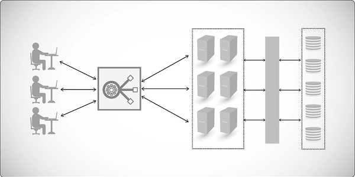
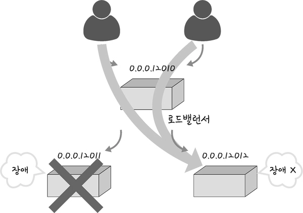
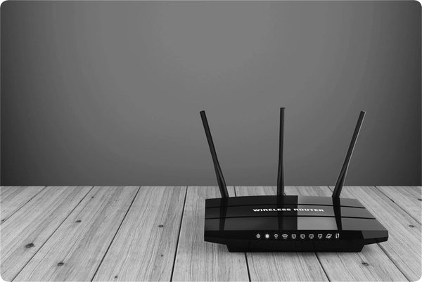
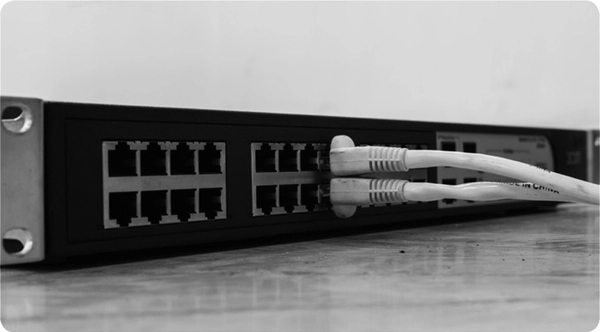
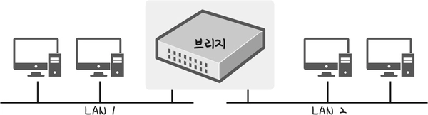
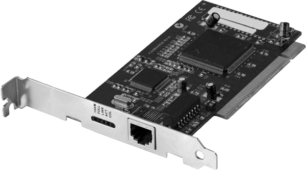
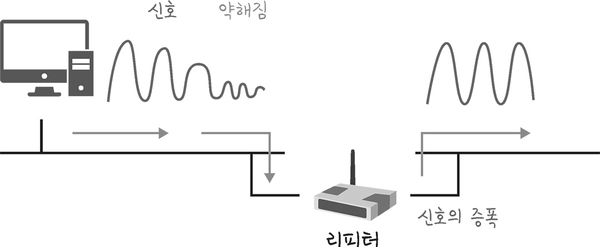
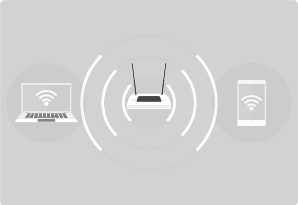

# 네트워크 기기

네트워크 기기는 네트워크에서 데이터를 송수신하고 목적지까지 전달하거나, 여러 서버로 트래픽을 분산하는 장비다. NIC, 스위치, 라우터, AP, 로드밸런서 등이 여기에 해당한다.

장비마다 데이터를 처리하는 범위와 판단 기준이 다르다. 어떤 장비는 전기·무선 신호를 전달하고, 어떤 장비는 MAC 주소나 IP 주소를 확인하며, 어떤 장비는 HTTP 요청의 URL과 헤더까지 확인한다. 따라서 각 장비가 어느 계층의 정보를 기준으로 동작하는지 이해하면 데이터의 이동 과정과 장애가 발생한 위치를 파악하기 쉬워진다.

## 2.3.1 네트워크 기기의 처리 범위

네트워크 기기는 TCP/IP 4계층과 OSI 7계층 중 어느 모델로도 설명할 수 있다. TCP/IP 모델을 기준으로 보면 L7·L4 로드밸런서는 각각 애플리케이션·전송 계층, 라우터와 L3 스위치는 인터넷 계층, L2 스위치와 NIC는 네트워크 접근 계층에서 동작한다.

다만 `L2 스위치`, `L3 스위치`처럼 장비 이름에 붙는 계층 번호는 OSI 7계층에서 가져온 것이다. TCP/IP 모델은 OSI의 데이터 링크 계층과 물리 계층을 네트워크 접근 계층 하나로 묶기 때문에 장비의 세부적인 처리 범위를 구분할 때는 OSI 계층 번호를 함께 사용한다.

| 장비 | OSI 7계층 기준 | TCP/IP 4계층 기준 | 주로 확인하는 정보 |
| --- | --- | --- | --- |
| L7 스위치·로드밸런서 | 애플리케이션 계층(L7) | 애플리케이션 계층 | URL, HTTP 헤더, 쿠키 등 |
| L4 스위치·로드밸런서 | 전송 계층(L4) | 전송 계층 | IP 주소, 프로토콜, 포트 번호 등 |
| 라우터, L3 스위치 | 네트워크 계층(L3) | 인터넷 계층 | 목적지 IP 주소, 라우팅 테이블 |
| L2 스위치, 브리지 | 데이터 링크 계층(L2) | 네트워크 접근 계층 | MAC 주소, 이더넷 프레임 |
| AP, NIC | 데이터 링크·물리 계층(L2·L1) | 네트워크 접근 계층 | 프레임, MAC 주소, 물리 신호 |
| 리피터, 허브 | 물리 계층(L1) | 네트워크 접근 계층 | 비트, 전기·광 신호 |

### 스위치 명칭 앞의 L은 무엇인가?

`L`은 계층을 의미하는 **Layer**의 첫 글자이고, 뒤의 숫자는 장비가 트래픽을 전달할 때 주로 확인하는 OSI 계층을 나타낸다. 따라서 TCP/IP 모델로 장비를 설명하더라도 L2, L3, L4, L7의 숫자 자체는 TCP/IP 계층 번호가 아니라 OSI 계층 번호다.

- **L2 스위치**는 데이터 링크 계층의 MAC 주소를 보고 프레임을 전달한다.
- **L3 스위치**는 네트워크 계층의 IP 주소와 라우팅 테이블을 보고 패킷을 전달한다.
- **L4 스위치**는 전송 계층의 IP 주소, 프로토콜과 포트 번호 등을 보고 연결을 분산한다.
- **L7 스위치**는 애플리케이션 계층의 URL, HTTP 헤더, 쿠키 등을 보고 요청을 분산한다.

여기서 **스위치(switch**)는 입력된 트래픽을 조건에 따라 적절한 출력 경로나 대상으로 전환한다는 의미로 사용된다. 하지만 모든 스위치가 같은 종류의 장비인 것은 아니다.

L2 스위치는 일반적인 Ethernet 스위치이고, L3 스위치는 L2 스위칭과 라우팅 기능을 결합한 멀티레이어 스위치다. L3 스위치가 IP 패킷을 다른 네트워크로 전달하는 동작 자체는 라우팅이지만, LAN에서 여러 포트와 VLAN을 연결하는 스위치 형태의 장비이기 때문에 L3 스위치라고 부른다.

반면 L4 스위치와 L7 스위치는 일반적인 L2 스위치라기보다 여러 서버 중 트래픽을 전달할 대상을 선택하는 **로드밸런서**를 가리키는 경우가 많다. 즉, `L숫자`는 장비가 해당 계층에서만 동작한다는 의미가 아니라 **전달 대상을 결정할 때 어느 계층의 정보까지 확인하는지**를 강조한 명칭이다.

이 분류는 장비가 **주로 어떤 정보를 기준으로 전달 여부를 결정하는지**를 보여준다. 실제 장비가 한 계층의 기능만 수행한다는 뜻은 아니다. 예를 들어 NIC는 프레임의 MAC 정보를 처리하면서 이를 물리 신호로 변환하므로 데이터 링크 계층과 물리 계층에 걸쳐 동작한다. AP도 무선 신호를 송수신하는 물리 계층 기능과 유선·무선 LAN 사이에서 프레임을 전달하는 데이터 링크 계층 기능을 함께 수행한다.

또한 상위 계층 장비는 통신을 위해 하위 계층 기능을 이용하지만, 모든 하위 계층 장비의 역할을 대신하는 것은 아니다. L7 로드밸런서가 HTTP 요청을 분석할 수 있다고 해서 라우터나 스위치 없이 네트워크를 구성할 수 있는 것은 아니다.

### 데이터가 네트워크 기기를 지나는 과정

다른 네트워크에 있는 웹 서버로 요청을 보낸다고 가정해 보자.

```text
클라이언트
   ↓ NIC가 데이터를 프레임과 신호로 변환
L2 스위치 또는 AP
   ↓ MAC 주소를 기준으로 기본 게이트웨이에 전달
라우터 또는 L3 스위치
   ↓ 목적지 IP 주소와 라우팅 테이블을 기준으로 다음 경로 선택
L4 또는 L7 로드밸런서
   ↓ 연결 정보나 HTTP 요청을 기준으로 서버 선택
서버의 NIC
   ↓ 프레임을 받아 원래의 애플리케이션 데이터로 전달
웹 서버
```

목적지가 같은 LAN에 있다면 라우터를 거치지 않고 L2 스위치나 AP를 통해 직접 프레임을 전달할 수 있다. 목적지가 다른 네트워크에 있다면 클라이언트는 프레임을 기본 게이트웨이로 보내고, 라우터는 IP 패킷을 다음 네트워크로 전달한다. 목적지 서비스 앞에 로드밸런서가 구성되어 있다면 로드밸런서가 여러 서버 중 요청을 처리할 서버를 선택한다.

## 2.3.2 애플리케이션 계층과 전송 계층을 처리하는 기기

TCP/IP 모델과 OSI 모델은 모두 애플리케이션 계층과 전송 계층이라는 이름을 사용한다. 다만 TCP/IP의 애플리케이션 계층은 OSI의 애플리케이션·표현·세션 계층을 합친 범위다.

이 계층들에서 트래픽을 분산하는 대표적인 장비로 L7 스위치와 L4 스위치가 있다. 두 장비 모두 여러 서버에 트래픽을 나누어 전달하는 로드밸런서로 사용할 수 있지만, 요청을 판단하는 기준이 다르다.

### L7 스위치

L7 스위치는 애플리케이션 계층의 정보를 확인해 트래픽을 분산하는 장비다. 일반적으로 HTTP와 HTTPS 요청의 호스트, URL 경로, 헤더, 쿠키, 요청 메서드 등을 기준으로 요청을 서로 다른 서버 그룹에 전달한다.



예를 들어 `/images` 요청은 이미지 서버로 보내고 `/api` 요청은 API 서버로 보낼 수 있다. HTTP 요청의 내용을 이해하기 때문에 서비스별로 세밀한 분배 정책을 설정할 수 있고, 제품이나 구성에 따라 TLS 종료, 세션 유지, 요청 제한 같은 기능을 제공하기도 한다.

로드밸런서는 라운드 로빈, 최소 연결, 가중치 기반 방식 등으로 서버를 선택할 수 있다.

- **라운드 로빈(Round Robin)**: 서버를 순서대로 선택한다.
- **최소 연결(Least Connections)**: 현재 연결 수가 적은 서버를 선택한다.
- **가중치 기반(Weighted)**: 성능이 좋은 서버가 더 많은 요청을 받도록 가중치를 적용한다.

### L4 스위치와 L7 스위치의 차이

L4 스위치는 전송 계층의 TCP·UDP 연결 정보를 기준으로 트래픽을 분산한다. 애플리케이션 메시지의 의미를 직접 분석하지 않고 출발지·목적지 IP 주소, 포트 번호, 프로토콜 같은 정보를 사용한다.

| 구분 | L4 스위치 | L7 스위치 |
| --- | --- | --- |
| 판단 기준 | IP 주소, 포트 번호, TCP·UDP 정보 | URL, HTTP 헤더, 쿠키, 요청 메서드 등 |
| 처리 단위 | 연결 또는 흐름 | 애플리케이션 요청 |
| 장점 | 구조가 단순하고 다양한 TCP·UDP 트래픽 처리 가능 | 요청 내용에 따른 세밀한 라우팅 가능 |
| 대표 사용 예 | TCP·UDP 서비스, 게임, 스트리밍 | 웹 서비스, HTTP API, 마이크로서비스 |
| AWS의 대표 서비스 | NLB(Network Load Balancer) | ALB(Application Load Balancer) |

L4 로드밸런서도 TCP와 UDP 기반 스트리밍 트래픽을 처리할 수 있다. 핵심 차이는 스트리밍 사용 가능 여부가 아니라 **애플리케이션 요청의 내용을 이해하여 분배할 수 있는가**에 있다.

### 헬스 체크

로드밸런서가 장애가 발생한 서버에도 계속 요청을 보내면 서비스 오류가 발생한다. 이를 막기 위해 로드밸런서는 일정한 주기로 서버의 상태를 확인하는 헬스 체크를 수행한다.

TCP 헬스 체크는 대상 포트에 연결할 수 있는지 확인한다. HTTP 헬스 체크는 `/health` 같은 경로로 요청을 보내고 응답 상태 코드나 응답 내용을 확인할 수 있다. 연속으로 일정 횟수 이상 검사에 실패한 서버는 분배 대상에서 제외하고, 다시 정상 응답을 보내면 분배 대상에 포함한다.

헬스 체크가 성공했다고 해서 애플리케이션의 모든 기능이 정상이라는 뜻은 아니다. 데이터베이스 연결이나 외부 서비스 의존성까지 확인할 것인지에 따라 헬스 체크의 범위와 비용이 달라지므로, 서비스에 필요한 수준으로 검사 항목과 주기를 정해야 한다.

### 로드밸런서를 이용한 서버 이중화

서버가 한 대뿐이면 해당 서버에 장애가 발생했을 때 서비스를 계속 제공하기 어렵다. 여러 서버를 준비하고 로드밸런서가 정상 서버에만 요청을 전달하면 서버 한 대가 중단되어도 다른 서버가 요청을 처리할 수 있다.



클라이언트는 개별 서버의 주소를 직접 선택하지 않고 로드밸런서가 제공하는 하나의 접점으로 요청을 보낸다. 로드밸런서는 헬스 체크 결과와 분배 정책을 기준으로 사용할 수 있는 서버를 선택한다. 이를 통해 가용성을 높이고, 트래픽이 증가했을 때 서버를 추가하여 처리량을 확장할 수 있다.

다만 로드밸런서 자체가 한 대뿐이면 새로운 단일 장애 지점이 될 수 있다. 실제 환경에서는 관리형 로드밸런서를 사용하거나 여러 로드밸런서를 이중화해 이 문제를 줄인다.

## 2.3.3 인터넷 계층을 처리하는 기기

TCP/IP의 인터넷 계층은 OSI의 네트워크 계층(L3)에 대응한다. 이 계층을 처리하는 대표적인 기기는 라우터와 L3 스위치다. 두 장비 모두 목적지 IP 주소와 라우팅 테이블을 이용해 서로 다른 네트워크 사이로 패킷을 전달한다.

### 라우터

라우터(router)는 서로 다른 네트워크를 연결하고 IP 패킷을 다음 네트워크로 전달하는 장비다.



라우터는 패킷의 목적지 IP 주소를 라우팅 테이블과 비교해 다음으로 보낼 인터페이스와 다음 홉을 결정한다. 여러 경로가 일치하면 일반적으로 목적지와 가장 구체적으로 일치하는 경로를 선택하는 **최장 접두사 일치(Longest Prefix Match**)를 사용한다.

호스트가 다른 네트워크로 패킷을 보낼 때는 기본 게이트웨이로 설정된 라우터에 먼저 프레임을 전달한다. 라우터는 다음과 같은 과정을 수행한다.

1. 수신한 프레임의 헤더와 트레일러를 확인하고 제거한다.
2. IP 패킷의 목적지 주소와 라우팅 테이블을 확인한다.
3. IPv4 패킷의 TTL을 1 감소시키고 헤더 체크섬을 갱신한다.
4. 다음 네트워크에 맞는 새로운 프레임으로 IP 패킷을 감싼다.
5. 선택한 인터페이스를 통해 다음 홉으로 전송한다.

따라서 NAT가 없는 일반적인 라우팅에서는 출발지와 목적지 IP 주소는 유지되지만, 프레임의 출발지와 목적지 MAC 주소는 라우터를 지날 때마다 다음 구간에 맞게 바뀐다.

### L3 스위치

L3 스위치는 L2 스위칭 기능과 L3 라우팅 기능을 함께 제공하는 장비다. 같은 VLAN 안에서는 MAC 주소를 기준으로 프레임을 전달하고, 서로 다른 VLAN 사이에서는 IP 주소와 라우팅 테이블을 기준으로 패킷을 전달할 수 있다. 이를 **인터 VLAN 라우팅(Inter-VLAN Routing**)이라고 한다.

라우터와 L3 스위치는 모두 라우팅할 수 있으므로 단순히 소프트웨어 방식과 하드웨어 방식으로 구분하면 정확하지 않다. 현대의 라우터와 L3 스위치는 모두 하드웨어 기반의 고속 포워딩을 사용할 수 있다. 일반적인 사용 목적에는 다음과 같은 차이가 있다.

| 구분 | L3 스위치 | 라우터 |
| --- | --- | --- |
| 주 사용 위치 | 사내 LAN의 코어·분배 계층 | 서로 다른 네트워크나 LAN과 WAN의 경계 |
| 주요 목적 | 다수의 LAN 포트와 VLAN 사이의 고속 라우팅 | 다양한 네트워크 연결과 경로 제어 |
| 인터페이스 | Ethernet 포트 중심 | Ethernet을 포함한 다양한 WAN 인터페이스 지원 가능 |
| 부가 기능 | VLAN, STP, 링크 집계 등 스위칭 기능 중심 | NAT, VPN, 방화벽, WAN 연결 기능 등을 제공할 수 있음 |

이 차이는 일반적인 경향이며 제품에 따라 기능이 겹칠 수 있다. 장비 이름보다 실제로 지원하는 인터페이스, 라우팅 프로토콜, 보안 기능과 처리 성능을 확인해야 한다.

## 2.3.4 네트워크 접근 계층에서 프레임을 처리하는 기기

TCP/IP의 네트워크 접근 계층은 OSI의 데이터 링크 계층과 물리 계층을 합친 범위다. 이 중 데이터 링크 계층(L2)의 장비는 같은 LAN 안에서 MAC 주소를 기준으로 프레임을 전달한다. 대표적인 장비로 L2 스위치와 브리지가 있다.

### L2 스위치

L2 스위치는 수신한 이더넷 프레임의 MAC 주소를 확인하고 적절한 포트로 전달하는 장비다.



L2 스위치가 프레임을 처리하는 과정은 다음과 같다.

1. 프레임이 들어온 포트와 출발지 MAC 주소를 확인한다.
2. 출발지 MAC 주소와 수신 포트의 관계를 MAC 주소 테이블에 기록한다.
3. 목적지 MAC 주소를 MAC 주소 테이블에서 조회한다.
4. 목적지 포트를 알고 있으면 해당 포트로만 프레임을 전달한다.
5. 목적지 MAC 주소를 모르면 수신 포트를 제외한 같은 VLAN의 포트로 프레임을 플러딩한다.

MAC 주소 테이블의 항목은 영구적으로 유지되지 않는다. 일정 시간 동안 해당 주소에서 프레임이 들어오지 않으면 오래된 항목을 삭제하는 에이징(aging)이 일어난다. 이후 같은 주소로 프레임을 보내야 하는데 테이블에 항목이 없다면 다시 플러딩하고 응답을 통해 포트를 학습한다.

일반적인 L2 스위치는 IP 주소를 기준으로 다른 네트워크까지 경로를 선택하지 않는다. VLAN을 사용하면 하나의 물리적인 스위치 안에서도 논리적으로 브로드캐스트 도메인을 나눌 수 있으며, 서로 다른 VLAN이 통신하려면 라우터나 L3 스위치의 라우팅이 필요하다.

### 브리지

브리지(bridge)는 두 개 이상의 LAN 구간을 연결하고 MAC 주소를 기준으로 프레임을 전달하거나 차단하는 장비다.



브리지와 L2 스위치의 기본 동작 원리는 같다. 둘 다 출발지 MAC 주소를 학습하고 목적지 MAC 주소를 기준으로 프레임을 전달한다. 전통적인 브리지는 적은 수의 LAN 구간을 연결하는 장비를 의미했고, 스위치는 이러한 브리지 기능을 여러 포트에서 고속으로 수행하도록 발전한 **다중 포트 브리지**로 볼 수 있다.

### 허브와 L2 스위치의 차이

허브는 물리 계층에서 동작하는 다중 포트 리피터다. 한 포트에서 받은 신호를 목적지와 관계없이 다른 모든 포트로 전달한다. 반면 L2 스위치는 MAC 주소를 학습해 필요한 포트로만 프레임을 전달한다.

| 구분 | 허브 | L2 스위치 |
| --- | --- | --- |
| 동작 계층 | 물리 계층 | 데이터 링크 계층 |
| 확인 정보 | 주소를 확인하지 않음 | MAC 주소 확인 |
| 전달 방식 | 다른 모든 포트로 신호 전달 | 목적지가 연결된 포트로 프레임 전달 |
| 충돌 도메인 | 모든 포트가 하나의 충돌 도메인 공유 | 포트마다 충돌 도메인 분리 |
| 사용 현황 | 현재는 거의 사용하지 않음 | 현대 Ethernet LAN의 기본 장비 |

## 2.3.5 네트워크 접근 계층에서 신호와 접속을 처리하는 기기

TCP/IP에서는 물리적인 신호 처리도 네트워크 접근 계층에 포함한다. OSI의 물리 계층에서는 비트를 전기·광·무선 신호로 변환해 전송한다. 다만 NIC와 AP처럼 물리적인 신호 처리와 데이터 링크 계층의 프레임 처리를 함께 수행하는 장비도 있다.

### NIC

NIC(Network Interface Card)는 컴퓨터나 서버를 네트워크에 연결하는 인터페이스다. LAN 카드라고도 부르지만 반드시 별도의 확장 카드 형태인 것은 아니다. 메인보드에 내장되거나 USB 장치, 가상 머신의 가상 네트워크 인터페이스 형태로도 존재한다.



NIC는 데이터 링크 계층에서 Ethernet이나 Wi-Fi 프레임과 MAC 주소를 처리하고, 물리 계층에서 비트를 전기·광·무선 신호로 변환하거나 반대로 복원한다. 운영체제는 NIC의 드라이버를 통해 프레임 송수신, 속도와 연결 상태 등을 제어한다.

각 네트워크 인터페이스에는 통신에 사용할 MAC 주소가 있다. 제조사가 기본 주소를 할당하는 경우가 많지만 운영체제나 가상화 환경에서 변경할 수도 있으므로, MAC 주소를 변경 불가능한 신원 정보처럼 보아서는 안 된다.

### 리피터

리피터(repeater)는 전송 과정에서 약해지거나 왜곡된 신호를 받아 파형을 복원하고 다시 전송하는 물리 계층 장비다.



리피터는 MAC 주소나 IP 주소를 확인하지 않으며 프레임과 패킷의 의미도 이해하지 않는다. 단순히 잡음까지 함께 크게 만드는 증폭기라기보다, 수신한 디지털 신호를 판별해 정상적인 형태로 재생성하는 장치에 가깝다. 과거 유선 LAN의 전송 거리를 늘리는 데 사용했지만, 현대의 스위치 기반 Ethernet 환경에서는 독립된 장비로 사용하는 경우가 드물다.

### AP

AP(Access Point)는 무선 단말이 Wi-Fi를 통해 유선 LAN에 접속할 수 있도록 연결해 주는 장비다.



AP는 무선 신호를 송수신하면서 무선 LAN의 802.11 프레임과 유선 LAN의 Ethernet 프레임 사이를 연결한다. 일반적으로 같은 LAN 안에서 프레임을 전달하는 L2 브리지 역할을 하며, 무선 단말의 연결, 인증, 암호화 같은 무선 LAN 기능도 처리한다.

AP 자체가 반드시 라우팅, NAT, DHCP 기능을 제공하는 것은 아니다. 가정에서 사용하는 무선 공유기는 AP, L2 스위치, 라우터, NAT, DHCP 서버 등의 기능을 한 장비에 합친 것이다.

| 구분 | AP | 무선 공유기 |
| --- | --- | --- |
| 주요 역할 | 무선 단말을 기존 LAN에 연결 | 내부 LAN과 외부 네트워크를 연결하고 무선 접속 제공 |
| 일반적인 동작 | L2 브리지 | 라우팅, NAT, DHCP, 스위칭, AP 기능 통합 |
| IP 네트워크 분리 | 일반적으로 직접 수행하지 않음 | 내부망과 외부망을 서로 다른 네트워크로 구분 |

## 예상 면접 질문

네트워크 기기는 장비의 정의만 외우기보다, 장비가 어떤 주소를 보고 데이터를 어떻게 전달하는지 설명할 수 있어야 한다. 질문을 누르면 답변을 확인할 수 있다.

<details>
<summary><strong>1. L2 스위치는 MAC 주소 테이블을 어떻게 학습하나요?</strong></summary>

L2 스위치는 프레임을 수신하면 출발지 MAC 주소와 프레임이 들어온 포트를 확인해 MAC 주소 테이블에 기록한다. 이후 목적지 MAC 주소가 테이블에 있으면 연결된 포트로만 프레임을 전달한다. 목적지 주소가 없다면 수신 포트를 제외한 같은 VLAN의 포트로 플러딩한다.

</details>

<details>
<summary><strong>2. L2 스위치와 L3 스위치의 차이는 무엇인가요?</strong></summary>

L2 스위치는 MAC 주소 테이블을 이용해 같은 LAN이나 VLAN 안에서 프레임을 전달한다. L3 스위치는 L2 스위칭 기능에 IP 주소와 라우팅 테이블을 이용한 라우팅 기능이 추가된 장비다. 따라서 서로 다른 VLAN 사이의 통신도 처리할 수 있다.

</details>

<details>
<summary><strong>3. 라우터를 통과할 때 IP 주소와 MAC 주소는 어떻게 변하나요?</strong></summary>

NAT가 없는 일반적인 라우팅에서는 패킷의 출발지와 목적지 IP 주소는 유지된다. 반면 Ethernet 프레임은 각 네트워크 구간에 맞게 새로 만들어지므로 출발지와 목적지 MAC 주소는 라우터를 지날 때마다 바뀐다. IPv4 패킷의 TTL도 라우터를 통과할 때마다 1씩 감소한다.

</details>

<details>
<summary><strong>4. 라우터와 L3 스위치는 무엇이 다른가요?</strong></summary>

두 장비 모두 IP 주소와 라우팅 테이블을 이용해 패킷을 전달할 수 있다. L3 스위치는 일반적으로 사내 LAN에서 다수의 Ethernet 포트와 VLAN 사이를 고속으로 연결하는 데 초점을 둔다. 라우터는 서로 다른 네트워크나 LAN과 WAN의 경계에서 경로 제어, NAT, VPN 같은 기능을 제공하는 경우가 많다. 다만 현대 장비는 기능이 겹치므로 소프트웨어 방식과 하드웨어 방식만으로 구분하면 정확하지 않다.

</details>

<details>
<summary><strong>5. L4 로드밸런서와 L7 로드밸런서의 차이는 무엇인가요?</strong></summary>

L4 로드밸런서는 IP 주소, 포트 번호, TCP·UDP 정보처럼 전송 계층의 연결 정보를 기준으로 트래픽을 분산한다. L7 로드밸런서는 URL, HTTP 헤더, 쿠키처럼 애플리케이션 요청의 내용을 확인해 서버를 선택한다. L4는 다양한 TCP·UDP 트래픽을 비교적 단순하게 처리하고, L7은 HTTP 요청에 대한 세밀한 라우팅 정책을 적용할 수 있다.

</details>

<details>
<summary><strong>6. 로드밸런서의 헬스 체크는 왜 필요한가요?</strong></summary>

장애가 발생한 서버를 트래픽 분산 대상에서 제외하기 위해 필요하다. 로드밸런서는 TCP 연결이나 HTTP 요청 등을 주기적으로 보내 서버 상태를 확인한다. 검사에 반복해서 실패한 서버에는 요청을 보내지 않고, 다시 정상 상태가 확인되면 분산 대상에 포함한다.

</details>

<details>
<summary><strong>7. 허브와 스위치의 차이는 무엇인가요?</strong></summary>

허브는 물리 계층 장비로, 한 포트에서 받은 신호를 다른 모든 포트로 전달한다. L2 스위치는 데이터 링크 계층에서 MAC 주소를 학습하고 목적지가 연결된 포트로만 프레임을 전달한다. 허브는 모든 포트가 하나의 충돌 도메인을 공유하지만 스위치는 포트마다 충돌 도메인을 분리한다.

</details>

<details>
<summary><strong>8. AP와 무선 공유기의 차이는 무엇인가요?</strong></summary>

AP는 주로 무선 단말을 기존 유선 LAN에 연결하는 L2 브리지 역할을 한다. 무선 공유기는 AP 기능뿐만 아니라 라우터, NAT, DHCP 서버, L2 스위치 등의 기능을 하나의 장비에 통합한 경우가 많다.

</details>

<details>
<summary><strong>9. NIC와 AP를 하나의 계층으로만 분류하기 어려운 이유는 무엇인가요?</strong></summary>

NIC는 MAC 주소와 프레임을 처리하는 데이터 링크 계층 기능과 비트를 물리 신호로 변환하는 물리 계층 기능을 함께 수행한다. AP도 무선 신호를 송수신하면서 유선·무선 LAN 사이에서 프레임을 전달한다. 따라서 두 장비 모두 물리 계층과 데이터 링크 계층에 걸쳐 동작한다고 설명하는 편이 정확하다.

</details>

<details>
<summary><strong>10. L2, L3, L4, L7 스위치의 숫자는 무엇을 의미하나요?</strong></summary>

`L`은 Layer를 의미하고 숫자는 트래픽의 전달 대상을 결정할 때 주로 확인하는 OSI 계층을 나타낸다. L2 스위치는 MAC 주소, L3 스위치는 IP 주소와 라우팅 테이블, L4 스위치는 포트 번호와 TCP·UDP 정보, L7 스위치는 URL과 HTTP 헤더 같은 애플리케이션 정보를 확인한다. TCP/IP 모델로 대응하면 L2는 네트워크 접근 계층, L3는 인터넷 계층, L4는 전송 계층, L7은 애플리케이션 계층에 해당한다.

</details>
