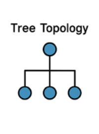
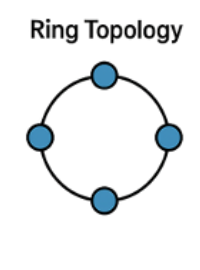
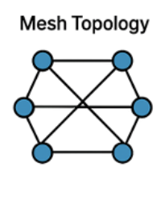

# 네트워크의 기초

이번주의 CS는 네트워크의 첫 번째 **네트워크의 기초**에 대해서 알아볼 것이다.

그럼 먼저 네트워크란 무엇인가에 대해 알아보겠다.

네트워크는 **노드와 링크가 서로 연결되어 데이터를 주고받을 수 있는 구조**라고 한다.

여기서 **노드**는 네트워크에 연결된 장치를 의미한다. 컴퓨터, 서버, 라우터, 스위치 같은 장치들이 노드에 해당한다. **링크**는 노드와 노드를 이어주는 통신 경로다. 유선 케이블이나 무선 통신처럼 데이터가 이동할 수 있는 길이라고 보면 된다.

네트워크를 통해 노드들은 데이터뿐만 아니라 파일, 인터넷 접속, 컴퓨팅 자원 같은 여러 리소스를 공유할 수 있다. 결국 네트워크는 장치들이 서로 통신하고 자원을 함께 사용하기 위한 기반 구조라고 볼 수 있다.

이제 네트워크의 기초 개념들을 하나씩 알아보겠다.

## 2.1.1 처리량과 지연 시간

네트워크의 성능을 볼 때 자주 나오는 개념이 **처리량**과 **지연 시간**이다.

### 처리량 (Throughput)

처리량은 일정 시간 동안 네트워크를 통해 전달되는 데이터의 양을 의미한다. 단위로는 `bps`, `Kbps`, `Mbps`, `Gbps` 등을 사용한다.

`bps`는 `bits per second`의 줄임말로, 1초 동안 몇 비트의 데이터를 보낼 수 있는지를 나타낸다.

처리량을 이해할 때는 **트래픽**과 **대역폭**도 같이 보면 좋다.

- **트래픽**: 네트워크를 통해 흐르는 데이터의 양
- **대역폭**: 네트워크가 이론적으로 전송할 수 있는 최대 용량
- **처리량**: 실제로 성공적으로 전달된 데이터의 양

대역폭이 크다고 해서 처리량이 항상 같은 크기로 나오는 것은 아니다. 사용자 수, 장비 성능, 트래픽 상태, 패킷 손실, 재전송 여부 등에 따라 실제 처리량은 달라질 수 있다.

처리량이 높다는 것은 같은 시간 동안 더 많은 데이터를 보낼 수 있다는 뜻이다.

### 지연 시간 (Latency)

지연 시간은 데이터가 출발지에서 목적지까지 도착하는 데 걸리는 시간을 의미한다.

지연 시간이 낮을수록 요청에 대한 응답이 빠르게 돌아온다. 반대로 지연 시간이 높으면 데이터를 보내고 응답을 받기까지 시간이 오래 걸린다.

지연 시간은 보통 `ms` 단위로 측정한다. 여기서 `ms`는 밀리초를 의미한다.

지연 시간은 하나의 원인으로만 정해지지 않는다. 여러 종류의 지연이 합쳐져서 전체 지연 시간이 된다.

- **전송 지연(Transmission Delay)**: 데이터를 링크에 올려 보내는 데 걸리는 시간
- **전파 지연(Propagation Delay)**: 신호가 물리적인 거리를 이동하는 데 걸리는 시간
- **처리 지연(Processing Delay)**: 라우터, 스위치, 서버 등이 패킷을 처리하는 데 걸리는 시간
- **큐잉 지연(Queuing Delay)**: 네트워크 장비 안에서 패킷이 대기하는 시간

처리량과 지연 시간은 서로 다른 개념이다. 처리량은 얼마나 많은 데이터를 보낼 수 있는지를 나타내고, 지연 시간은 데이터가 얼마나 빨리 도착하는지를 나타낸다.

## 2.1.2 네트워크 토폴로지와 병목 현상

### 네트워크 토폴로지 (Network Topology)

네트워크 토폴로지는 노드와 링크가 어떤 형태로 연결되어 있는지를 의미한다.

같은 수의 장치가 연결되어 있어도 연결 구조에 따라 성능, 안정성, 확장성, 장애 대응 방식이 달라진다. 그래서 네트워크를 설계하거나 문제를 분석할 때는 토폴로지를 이해하는 것이 중요하다.

대표적인 토폴로지에는 버스, 스타, 트리, 링, 메시가 있다.

#### 버스 토폴로지 (Bus Topology)


버스 토폴로지는 하나의 중앙 통신 회선에 여러 노드가 연결되는 방식이다.

- 장점:
  - 구조가 단순해서 설치가 쉽다.
  - 필요한 케이블의 양이 적어 비용이 비교적 적게 든다.
  - 한 노드에 문제가 생겨도 다른 노드에 바로 영향을 주지는 않는다.

- 단점:
  - 중앙 통신 회선에 문제가 생기면 전체 네트워크가 영향을 받는다.
  - 하나의 회선을 여러 노드가 공유하기 때문에 트래픽이 많아지면 충돌이나 성능 저하가 발생할 수 있다.
  - 문제가 발생했을 때 장애 위치를 찾기 어렵다.

#### 스타 토폴로지 (Star Topology)


스타 토폴로지는 중앙 노드를 기준으로 다른 노드들이 연결되는 방식이다.

- 장점:
  - 중앙 노드가 아닌 다른 노드에 장애가 생겨도 전체 네트워크에 미치는 영향이 적다.
  - 노드를 추가하거나 제거하기 쉽다.
  - 문제가 생긴 노드를 찾기 비교적 쉽다.

- 단점:
  - 중앙 노드에 의존하는 구조다.
  - 중앙 노드에 장애가 생기면 전체 네트워크가 정상적으로 동작하기 어렵다.
  - 중앙 노드의 성능이 전체 네트워크 성능에 큰 영향을 준다.

#### 트리 토폴로지 (Tree Topology)



트리 토폴로지는 계층형 구조를 가지는 방식이다. 상위 노드에서 하위 노드로 가지가 뻗어나가는 형태다.

버스 토폴로지와 스타 토폴로지가 섞인 형태로 볼 수 있고, 계층적 토폴로지라고도 한다.

- 장점:
  - 계층 구조라 네트워크를 관리하기 쉽다.
  - 하위 노드를 기준으로 확장하기 쉽다.
  - 리프 노드에 문제가 생겨도 다른 구간에 미치는 영향이 비교적 적다.

- 단점:
  - 상위 노드나 상위 링크에 문제가 생기면 하위 네트워크 전체가 영향을 받을 수 있다.
  - 특정 상위 노드에 트래픽이 몰리면 그 아래 구간의 성능이 함께 떨어질 수 있다.
  - 계층이 깊어질수록 구조가 복잡해질 수 있다.

#### 링 토폴로지 (Ring Topology)



링 토폴로지는 각 노드가 양옆의 노드와 연결되어 원형 구조를 이루는 방식이다.

- 장점:
  - 데이터가 일정한 방향으로 이동하기 때문에 흐름을 예측하기 쉽다.
  - 충돌이 적은 편이다.
  - 노드 수가 늘어나도 비교적 안정적인 전송 구조를 유지할 수 있다.

- 단점:
  - 노드나 링크 하나에 문제가 생기면 전체 네트워크가 영향을 받을 수 있다.
  - 장애가 발생했을 때 우회 경로가 없다면 통신이 끊길 수 있다.
  - 노드를 추가하거나 제거할 때 전체 연결 구조에 영향을 줄 수 있다.

#### 메시 토폴로지 (Mesh Topology)



메시 토폴로지는 노드들이 서로 여러 경로로 연결되는 방식이다.

- 장점:
  - 하나의 링크에 문제가 생겨도 다른 경로로 데이터를 보낼 수 있다.
  - 안정성과 신뢰성이 높다.
  - 트래픽을 여러 경로로 분산시킬 수 있다.

- 단점:
  - 연결해야 하는 링크가 많아 구축 비용이 크다.
  - 노드가 많아질수록 구조가 복잡해진다.
  - 관리해야 할 경로가 많아 운영 난이도가 올라간다.

### 병목 현상

병목 현상은 전체 시스템의 성능이 하나의 구성 요소 때문에 제한되는 상황을 말한다.

네트워크에서는 특정 링크, 장비, 서버 등에 트래픽이 몰리거나 처리 능력이 부족할 때 병목 현상이 발생한다. 이 지점에서 데이터 흐름이 느려지면 다른 구간의 성능이 좋아도 전체 네트워크가 느리게 동작한다.

토폴로지가 중요한 이유 중 하나도 병목 현상과 관련이 있다. 토폴로지를 알아야 데이터가 어떤 경로로 이동하는지, 어느 노드나 링크에 트래픽이 집중되는지 파악할 수 있다. 그래야 회선을 추가할지, 서버를 늘릴지, 장비를 교체할지 같은 방향을 정할 수 있다.

병목 현상의 원인은 보통 다음과 같다.

- 특정 장비에 트래픽이 집중되는 경우
- 네트워크 대역폭이 부족한 경우
- 라우터나 스위치의 처리 성능이 부족한 경우
- 서버의 처리 성능이 부족한 경우
- CPU, 메모리 같은 하드웨어 자원이 부족한 경우
- 네트워크 구성이 비효율적인 경우

해결 방안은 병목이 생긴 원인에 따라 달라진다.

- 대역폭이 부족하면 링크 용량을 늘린다.
- 특정 장비의 성능이 부족하면 장비를 교체하거나 성능을 높인다.
- 서버에 요청이 몰리면 서버를 늘리거나 로드 밸런싱을 적용한다.
- 특정 경로에 트래픽이 몰리면 라우팅 경로를 조정한다.
- 네트워크 구조 자체가 비효율적이면 토폴로지를 다시 설계한다.

## 2.1.3 네트워크 분류

네트워크는 규모에 따라 분류할 수 있다. 대표적으로 LAN, MAN, WAN이 있다.

### LAN (Local Area Network, 근거리 통신망)

LAN은 가까운 지역 안에서 구성되는 네트워크다.

범위가 좁기 때문에 비교적 속도가 빠르고 지연 시간이 낮은 편이다. 설치와 관리가 비교적 단순하고, 제한된 공간 안에서 장치와 자원을 연결하는 데 사용된다.

### MAN (Metropolitan Area Network, 도시권 통신망)

MAN은 도시 정도의 범위를 연결하는 네트워크다.

LAN보다 넓고 WAN보다는 좁은 범위를 가진다. 여러 개의 LAN을 더 큰 지역 단위로 묶는 형태로 볼 수 있고, 보통 고속 통신을 위해 전용 회선이나 광케이블 같은 기술이 사용된다.

### WAN (Wide Area Network, 광역 통신망)

WAN은 넓은 지역을 연결하는 네트워크다.

지역, 국가, 대륙처럼 넓은 범위를 연결할 수 있다. 범위가 넓은 만큼 여러 네트워크 장비와 통신망을 거치게 되고, LAN보다 지연 시간이 커질 수 있다. 넓은 범위를 연결하는 만큼 관리가 복잡하고 비용도 커질 수 있다.

규모로만 보면 LAN이 가장 작고, MAN이 그보다 크고, WAN이 가장 넓은 범위를 가진다.

## 2.1.4 네트워크 성능 분석 명령어

네트워크 상태를 확인할 때 사용하는 명령어들이 있다. 연결 여부, 응답 시간, 경로, 포트 상태, DNS 변환 결과 등을 확인할 수 있다.

### ping

`ping`은 특정 대상과 통신이 가능한지 확인하는 명령어다. 패킷을 보내고 응답이 돌아오는지 확인한다.

```bash
ping [도메인 또는 IP]
```

`ping` 결과에서는 응답 시간과 패킷 손실 여부를 볼 수 있다. 응답 시간이 길면 지연 시간이 크다는 뜻이고, 패킷 손실이 발생하면 네트워크 상태가 불안정할 수 있다.

### netstat

`netstat`은 현재 네트워크 연결 상태를 확인하는 명령어다. 연결된 주소, 사용 중인 포트, 라우팅 정보 등을 볼 수 있다.

```bash
netstat -an
```

포트가 열려 있는지, 어떤 연결이 맺어져 있는지 확인할 때 사용한다.

### ss

`ss`는 소켓 상태를 확인하는 명령어다. 연결 상태, 열려 있는 포트, TCP/UDP 소켓 정보를 볼 수 있다.

```bash
ss -tuln
```

Linux에서는 `netstat` 대신 `ss`를 사용하는 경우가 많다.

### nslookup

`nslookup`은 도메인 이름이 어떤 IP 주소로 변환되는지 확인하는 명령어다.

```bash
nslookup [도메인]
```

DNS가 정상적으로 동작하는지 확인할 때 사용한다.

### dig

`dig`는 DNS 정보를 조회하는 명령어다. `nslookup`보다 더 자세한 DNS 응답 정보를 확인할 수 있다.

```bash
dig [도메인]
```

도메인의 IP 주소, DNS 응답 시간, 질의한 DNS 서버 등을 확인할 때 사용한다.

### tracert / traceroute

`tracert` 또는 `traceroute`는 목적지까지 패킷이 어떤 경로를 거쳐 가는지 확인하는 명령어다.

Windows에서는 `tracert`를 사용한다.

```bash
tracert [도메인 또는 IP]
```

macOS나 Linux에서는 `traceroute`를 사용한다.

```bash
traceroute [도메인 또는 IP]
```

중간 경로를 확인할 수 있기 때문에 어느 구간에서 지연이 발생하는지 볼 때 사용한다.

### mtr

`mtr`은 `ping`과 `traceroute`를 합친 것처럼 동작하는 명령어다. 목적지까지의 경로를 계속 확인하면서 각 구간의 지연 시간과 패킷 손실을 보여준다.

```bash
mtr [도메인 또는 IP]
```

일시적인 지연인지, 특정 구간에서 계속 문제가 발생하는지 확인할 때 유용하다.

### curl

`curl`은 URL로 요청을 보내고 응답을 확인하는 명령어다. 웹 서버가 응답하는지, HTTP 상태 코드가 무엇인지 확인할 수 있다.

```bash
curl -I [URL]
```

네트워크 연결뿐만 아니라 애플리케이션 레벨에서 서버가 정상적으로 응답하는지도 확인할 수 있다.

### ipconfig / ifconfig / ip

`ipconfig`, `ifconfig`, `ip`는 현재 장치의 네트워크 설정을 확인하는 명령어다. IP 주소, 게이트웨이, 네트워크 인터페이스 상태 등을 볼 수 있다.

Windows에서는 `ipconfig`를 사용한다.

```bash
ipconfig
```

macOS나 Linux에서는 `ifconfig` 또는 `ip`를 사용한다.

```bash
ifconfig
ip addr
```

내 장치가 어떤 네트워크 주소를 가지고 있는지 확인할 때 사용한다.

## 2.1.5 네트워크 프로토콜 표준화

프로토콜은 네트워크에서 데이터를 주고받기 위한 규칙이다.

서로 다른 장치들이 통신하려면 같은 규칙을 따라야 한다. 데이터를 어떤 형식으로 보낼지, 어떤 순서로 처리할지, 오류가 생기면 어떻게 처리할지 같은 내용이 프로토콜에 포함된다.

프로토콜이 표준화되어 있으면 서로 다른 제조사, 운영체제, 장비를 사용하더라도 통신할 수 있다.

대표적인 프로토콜은 다음과 같다.

- **IP**: 패킷을 목적지까지 보내기 위한 주소 체계와 전달 방식
- **TCP**: 데이터가 순서대로 도착하도록 보장하는 전송 프로토콜
- **UDP**: 연결 과정과 신뢰성 보장을 줄이고 빠른 전송을 우선하는 전송 프로토콜
- **HTTP**: 웹에서 클라이언트와 서버가 데이터를 주고받는 방식
- **DNS**: 도메인 이름을 IP 주소로 변환하는 시스템

네트워크 표준은 IETF, IEEE 같은 기관에서 관리한다.

IETF는 인터넷에서 사용하는 프로토콜 표준을 다룬다. RFC 문서를 통해 IP, TCP, HTTP 같은 프로토콜의 동작 방식을 정의한다.

IEEE는 LAN이나 무선 네트워크 같은 기술 표준과 관련이 있다. 이더넷은 IEEE 802.3, Wi-Fi는 IEEE 802.11 표준으로 관리된다.

결국 네트워크 프로토콜 표준화는 서로 다른 시스템이 같은 규칙으로 통신할 수 있게 만든다.
