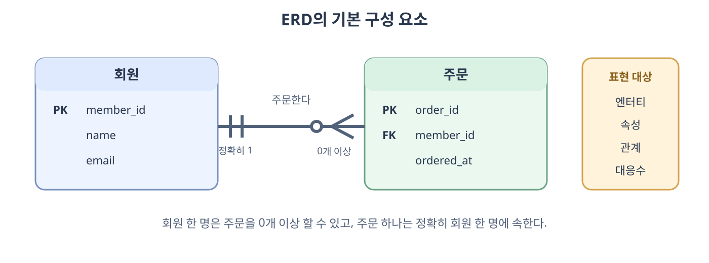
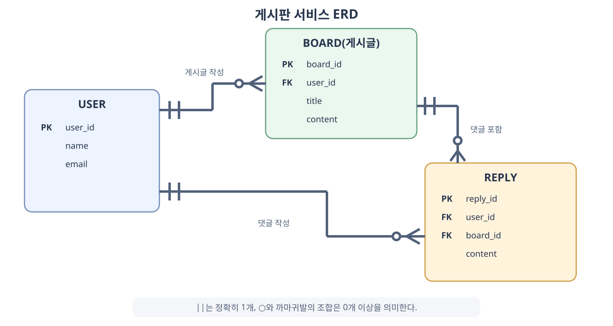
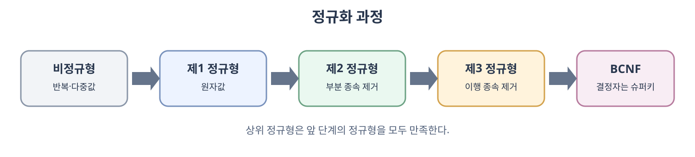
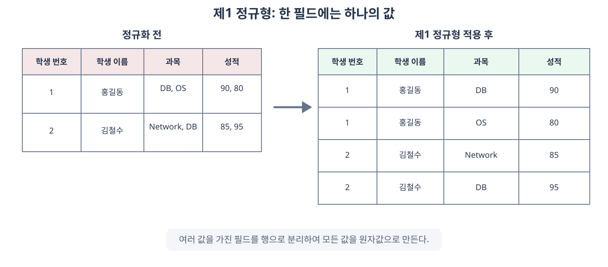
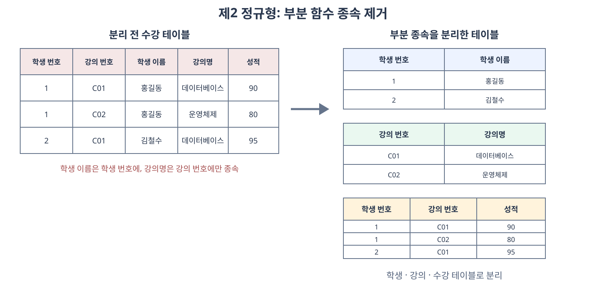
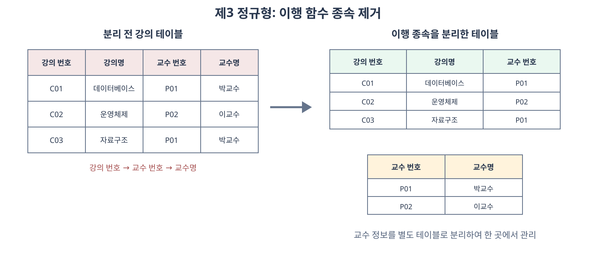

# ERD와 정규화 과정

데이터베이스를 설계할 때는 어떤 데이터를 저장할지뿐만 아니라 데이터들이 서로 어떤 관계를 가지는지도 결정해야 한다. **ERD**(**Entity Relationship Diagram**)는 엔터티와 엔터티 사이의 관계를 그림으로 표현한 설계도이고, **정규화**(**Normalization**)는 중복과 이상 현상을 줄이도록 릴레이션을 올바른 구조로 나누는 과정이다.

ERD가 데이터베이스의 전체 구조를 시각화한다면 정규화는 각 테이블의 내부 구조를 다듬는다. 두 과정 모두 요구사항을 실제 데이터베이스 구조로 변환하는 데이터 모델링 과정에 포함된다.

## 4.2.1 ERD의 중요성

ERD는 **개체-관계 모델**(**Entity-Relationship Model**)을 다이어그램으로 나타낸 것이다. 시스템의 엔터티, 각 엔터티가 가진 속성, 엔터티 사이의 관계를 표현한다.

ERD는 다음과 같은 역할을 한다.

- 요구사항에 등장하는 데이터를 엔터티와 속성으로 구체화한다.
- 엔터티 사이의 관계와 대응수를 명확하게 표현한다.
- 테이블을 구현하기 전에 전체 데이터 구조를 검토할 수 있게 한다.
- 개발자와 기획자 등 여러 구성원이 데이터 구조를 공통으로 이해하도록 돕는다.
- 데이터베이스 구축 이후에도 구조를 파악하고 변경하는 설계도로 사용된다.

ERD는 관계형 데이터처럼 구조가 명확한 데이터를 표현하는 데 유용하다. 반면 이미지, 영상, 자유 형식 문서처럼 구조가 일정하지 않은 비정형 데이터를 충분히 표현하기에는 한계가 있다.

### ERD의 기본 구성 요소



- **엔터티**(**Entity**)는 데이터를 저장할 대상이며 관계형 데이터베이스에서는 일반적으로 테이블로 구현된다.
- **속성**(**Attribute**)은 엔터티를 설명하는 정보이며 일반적으로 테이블의 필드로 구현된다.
- **관계**(**Relationship**)는 하나 이상의 엔터티 타입이 서로 연관되는 방식을 나타낸다. 하나의 엔터티가 자기 자신과 맺는 재귀 관계도 포함한다.
- **대응 카디널리티**(**Mapping Cardinality**) 또는 **대응수**는 한쪽 엔터티의 인스턴스 하나가 다른 쪽의 인스턴스 몇 개와 연결될 수 있는지를 나타낸다. `1:1`, `1:N`, `N:M`이 이에 해당한다.
- **선택성**(**Optionality**)은 관계 참여가 필수인지 선택인지를 나타낸다.

여기서 대응 카디널리티와 차수를 혼동하면 안 된다. ER 모델에서 **관계 차수**(**Relationship Degree**)는 하나의 관계에 참여하는 엔터티 타입의 수다. 회원과 주문처럼 두 엔터티 타입이 참여하면 **이항 관계**(**Binary Relationship**), 세 타입이 참여하면 **삼항 관계**(**Ternary Relationship**)라고 한다.

관계형 모델에서도 용어의 의미가 다르다. **릴레이션의 차수**(**Degree**)는 속성의 개수이고 **릴레이션의 카디널리티**(**Cardinality**)는 튜플의 개수다. 따라서 ERD의 `1:N`을 설명할 때는 `대응수` 또는 `대응 카디널리티`라고 쓰는 것이 문맥을 구분하기 쉽다.

이 문서의 ERD 그림은 **까마귀발 표기법**(**Crow's Foot Notation**)을 사용한다. 선 끝의 기호를 조합하여 관계에 참여할 수 있는 최소 개수와 최대 개수를 표현한다.

| 기호 | 의미 |
| --- | --- |
| `○` | 최소 0개로 관계 참여가 선택이다. |
| <code>&#124;</code> | 1개를 의미하며 다른 기호와 조합하여 최소·최대 개수를 표현한다. |
| 까마귀발 | 최대 여러 개다. |
| <code>○&#124;</code> | 0개 또는 1개다. |
| <code>&#124;&#124;</code> | 정확히 1개다. |
| <code>&#124;&lt;</code> | 1개 이상이다. |
| <code>○&lt;</code> | 0개 이상이다. |

ERD 도구에 따라 기호와 표현 방식이 조금씩 다르므로, 그림을 읽을 때 해당 도구가 사용하는 표기법을 먼저 확인해야 한다.

## 4.2.2 예제로 배우는 ERD

이 부분은 교재가 없으므로 AI와 함께 예제를 만들어 보겠다.
게시판 서비스에 다음 요구사항이 있다고 가정한다.

이 예제에서 `BOARD`는 게시판 전체가 아니라 게시글 한 건을 나타낸다. 일반적으로는 `POST`와 같은 이름을 사용할 수도 있지만 여기서는 교재의 용어에 맞추어 `BOARD`를 사용한다.

- 사용자는 여러 게시글을 작성할 수 있다.
- 게시글은 반드시 한 명의 사용자가 작성한다.
- 사용자는 여러 댓글을 작성할 수 있다.
- 댓글은 반드시 한 명의 사용자가 작성한다.
- 게시글에는 여러 댓글이 달릴 수 있다.
- 댓글은 반드시 하나의 게시글에 속한다.



### 사용자와 게시글

사용자 한 명은 게시글을 작성하지 않거나 여러 개 작성할 수 있으므로 사용자에서 게시글로는 `1:N` 관계다. 게시글은 반드시 한 명의 작성자를 가져야 하므로 게시글 테이블의 `user_id`는 사용자 테이블의 기본키를 참조하는 외래키가 된다.

### 사용자와 댓글

사용자 한 명은 댓글을 작성하지 않거나 여러 개 작성할 수 있으므로 사용자에서 댓글로도 `1:N` 관계다. 댓글 테이블의 `user_id`는 댓글 작성자를 나타낸다.

### 게시글과 댓글

게시글 하나에는 댓글이 없거나 여러 개 달릴 수 있으므로 게시글에서 댓글로는 `1:N` 관계다. 댓글은 반드시 하나의 게시글에 속하므로 댓글 테이블의 `board_id`는 게시글 테이블의 기본키를 참조한다.

이 예제에서 외래키는 모두 `N`에 해당하는 테이블에 위치한다.

```text
USER 1 ─── N BOARD
USER 1 ─── N REPLY
BOARD 1 ── N REPLY
```

### 요구사항에서 ERD를 만드는 순서

1. 요구사항에서 관리해야 할 대상을 찾아 엔터티 후보를 정한다.
2. 각 엔터티를 식별할 기본키와 필요한 속성을 정한다.
3. 엔터티 사이에 어떤 업무 관계가 있는지 찾는다.
4. 관계의 최소·최대 개수를 판단하여 대응수와 선택성을 정한다.
5. 일대다 관계의 외래키와 다대다 관계의 연결 테이블을 결정한다.
6. 중복된 데이터와 이상 현상이 발생하지 않는지 검토한다.

ERD는 실제 요구사항과 일치해야 한다. 예를 들어 사용자가 탈퇴할 때 게시글을 함께 삭제할지, 작성자를 알 수 없는 상태로 게시글을 보존할지에 따라 외래키의 `NULL` 허용 여부와 삭제 정책이 달라진다.

## 4.2.3 정규화 과정

**정규화**(**Normalization**)는 릴레이션을 여러 개로 분리하여 데이터 중복을 줄이고 데이터의 무결성을 유지하기 쉽게 만드는 과정이다. 정규화를 적용한 정도를 **정규형**(**Normal Form**)이라고 한다.

정규화는 다음 원칙을 따른다.

- 같은 의미를 표현하면서 더 좋은 구조를 가진 릴레이션으로 만든다.
- 중복 데이터를 가능한 한 줄인다.
- 서로 독립적인 관계는 별개의 릴레이션으로 표현한다.
- 릴레이션을 분해한 뒤에도 필요한 정보를 다시 결합할 수 있어야 한다.

릴레이션을 분해한 뒤 자연 조인으로 원래 정보를 정확히 복원할 수 있는 성질을 **무손실 분해**(**Lossless Decomposition**)라고 한다. 분해 전의 함수 종속을 분해된 릴레이션에서 별도의 조인 없이 검사할 수 있는 성질은 **종속성 보존**(**Dependency Preservation**)이라고 한다. 정규화에서는 데이터 중복뿐만 아니라 이러한 분해의 성질도 함께 고려해야 한다.

### 이상 현상

한 테이블에 서로 다른 사실을 함께 저장하면 데이터 중복으로 인해 **이상 현상**(**Anomaly**)이 발생할 수 있다.

- **삽입 이상**(**Insertion Anomaly**)은 필요한 다른 정보가 없어서 새로운 데이터를 저장하지 못하는 현상이다.
- **갱신 이상**(**Update Anomaly**)은 중복된 값 중 일부만 수정하여 서로 다른 값이 남는 현상이다.
- **삭제 이상**(**Deletion Anomaly**)은 한 데이터를 삭제하면서 보존해야 할 다른 정보까지 함께 사라지는 현상이다.

예를 들어 학생의 수강 정보와 강의 정보를 한 테이블에 저장하면 같은 강의명과 교수명이 수강 학생 수만큼 반복된다. 교수명이 변경될 때 모든 행을 수정하지 않으면 갱신 이상이 발생하고, 마지막 수강 정보를 삭제하면 강의 정보까지 사라지는 삭제 이상이 발생할 수 있다.

### 함수 종속

**함수 종속**(**Functional Dependency**)은 어떤 속성의 값을 알면 다른 속성의 값이 하나로 결정되는 관계다. `X → Y`로 나타내며 X를 **결정자**(**Determinant**), Y를 **종속자**(**Dependent**)라고 한다.

```text
학생 번호 → 학생 이름
강의 번호 → 강의명, 교수 번호
교수 번호 → 교수명
학생 번호, 강의 번호 → 성적
```

함수 종속은 실제 데이터 몇 행만 보고 판단하는 것이 아니라 업무 규칙을 기준으로 판단해야 한다. 현재 우연히 값이 중복되지 않는 것과 속성이 다른 속성을 논리적으로 결정하는 것은 다르다.



상위 정규형은 하위 정규형을 만족해야 한다. 예를 들어 제3 정규형을 만족하려면 먼저 제1 정규형과 제2 정규형을 만족해야 한다.

### 제1 정규형

**제1 정규형**(**First Normal Form, 1NF**)은 모든 속성이 해당 도메인에서 하나의 원자값만 가지도록 만든 정규형이다. 원자값은 절대적으로 더 나눌 수 없다는 뜻이 아니라 현재 업무와 도메인에서 하나의 값으로 취급한다는 뜻이다. 한 칸에 여러 값을 넣거나 같은 종류의 필드를 반복해서 두지 않는다.



정규화 전에는 과목과 성적 필드 하나에 여러 값이 들어 있어 개별 과목을 조건으로 조회하거나 제약 조건을 적용하기 어렵다. 각 수강 과목을 하나의 행으로 분리하면 모든 필드가 원자값을 가지게 된다.

제1 정규형을 만족해도 학생 이름과 과목명은 여러 행에 반복될 수 있다. 제1 정규형은 반복 값 자체를 모두 제거하는 것이 아니라 한 필드에 여러 값이 들어가는 문제를 해결한다.

### 제2 정규형

**제2 정규형**(**Second Normal Form, 2NF**)은 제1 정규형을 만족하면서 모든 비주요 속성이 모든 후보키 전체에 완전 함수 종속되도록 만든 정규형이다. **주요 속성**(**Prime Attribute**)은 하나 이상의 후보키에 포함되는 속성이고, **비주요 속성**(**Non-prime Attribute**)은 어떤 후보키에도 포함되지 않는 속성이다.

**부분 함수 종속**(**Partial Functional Dependency**)은 후보키의 진부분집합만으로 비주요 속성이 결정되는 관계다. 복합 후보키를 구성하는 일부 속성만으로 비주요 속성이 결정되면 제2 정규형을 위반한다.



수강 테이블의 복합 기본키가 `{학생 번호, 강의 번호}`라고 가정한다.

- 학생 이름은 학생 번호만으로 결정된다.
- 강의명은 강의 번호만으로 결정된다.
- 성적은 학생 번호와 강의 번호를 모두 알아야 결정된다.

학생 이름과 강의명은 복합 기본키의 일부에만 종속되므로 학생 테이블과 강의 테이블로 분리한다. 수강 테이블에는 두 키의 조합에 완전 함수 종속되는 성적만 남긴다.

모든 후보키가 하나의 속성으로만 구성되어 있다면 후보키의 진부분집합에 대한 종속이 존재할 수 없으므로 제1 정규형을 만족하는 릴레이션은 자동으로 제2 정규형을 만족한다.

### 제3 정규형

**제3 정규형**(**Third Normal Form, 3NF**)은 제2 정규형을 만족하고, 모든 자명하지 않은 함수 종속 `X → A`에서 X가 슈퍼키이거나 A가 주요 속성인 정규형이다. 후보키가 하나인 일반적인 예제에서는 비주요 속성이 다른 비주요 속성에 종속되는 이행 함수 종속을 제거하는 것으로 이해할 수 있다.

**이행 함수 종속**(**Transitive Functional Dependency**)은 `X → Y`이고 `Y → Z`일 때 `X → Z`가 성립하는 관계다.



강의 테이블에서 `강의 번호 → 교수 번호`, `교수 번호 → 교수명`이 성립하면 교수명은 강의 번호에 이행적으로 종속된다. 교수 번호와 교수명을 교수 테이블로 분리하고 강의 테이블에는 교수 번호만 외래키로 남긴다.

이제 교수명이 변경되어도 교수 테이블의 한 행만 수정하면 되므로 중복과 갱신 이상을 줄일 수 있다.

### 보이스-코드 정규형

**보이스-코드 정규형**(**Boyce-Codd Normal Form, BCNF**)은 모든 자명하지 않은 함수 종속 `X → Y`에서 결정자 X가 슈퍼키가 되도록 만든 정규형이다. 제3 정규형보다 더 엄격한 정규형이며, 후보키가 여러 개이고 서로 겹치는 복잡한 관계에서 제3 정규형으로 제거되지 않는 이상 현상을 해결한다.

예를 들어 다음 업무 규칙이 있다고 가정한다.

```text
학생 번호, 과목 → 교수
교수 → 과목
```

한 교수가 하나의 과목만 담당한다면 교수는 과목을 결정한다. 그러나 교수 하나만으로 수강 레코드를 유일하게 식별할 수 없으므로 교수는 슈퍼키가 아니다. 이 경우 모든 결정자가 슈퍼키여야 한다는 BCNF 조건을 위반한다.

```text
수강 교수(학생 번호, 교수)
교수 과목(교수, 과목)
```

두 릴레이션으로 분해하면 각 릴레이션의 결정자가 슈퍼키가 된다.

### 정규화의 장점과 고려사항

정규화는 데이터 중복을 줄이고 삽입·갱신·삭제 이상을 완화하며 데이터 무결성을 유지하기 쉽게 만든다. 각 테이블이 하나의 명확한 사실을 표현하게 되어 구조를 이해하고 변경하기도 쉬워진다.

반면 테이블이 여러 개로 분리되면 데이터를 조회할 때 조인이 늘어날 수 있다. 읽기 성능이나 구현 단순화를 위해 의도적으로 데이터를 합치거나 중복해서 저장하는 과정을 **반정규화**(**Denormalization**)라고 한다. 반정규화는 정규화를 이해하고 실제 조회 패턴과 성능 측정 결과를 근거로 적용해야 하며, 중복 데이터의 일관성을 유지할 방법도 함께 마련해야 한다.
