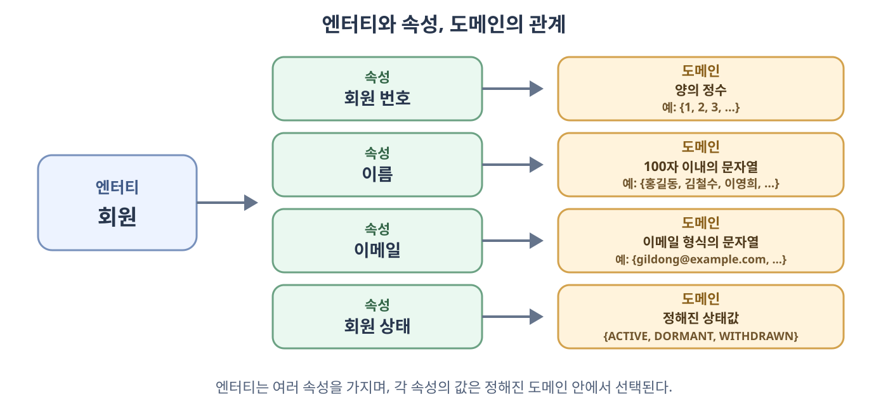
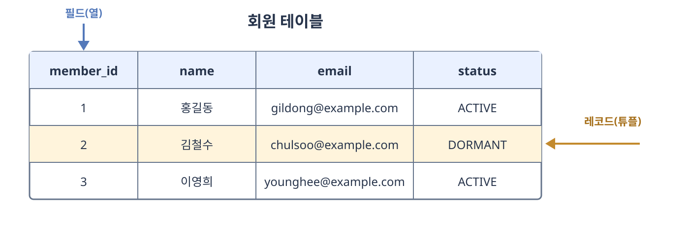
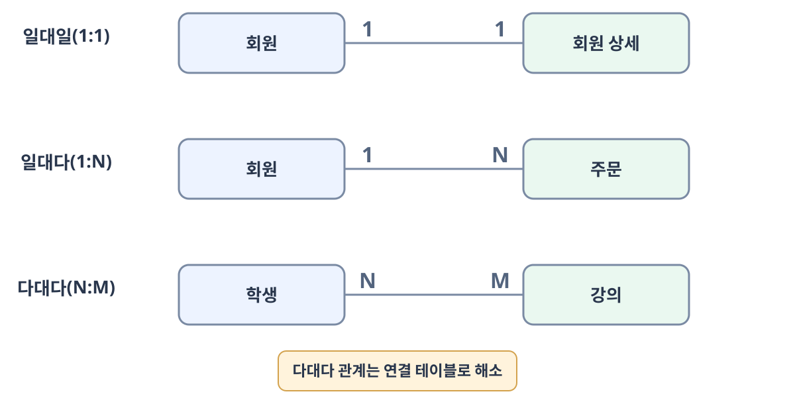
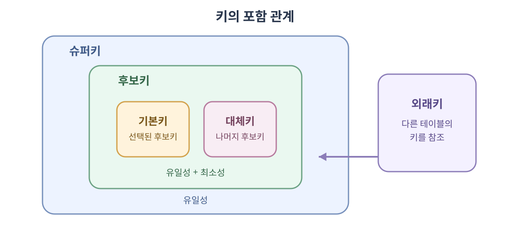

# 데이터베이스의 기본

**데이터베이스**(**Database**)는 여러 사용자가 공유하여 사용할 수 있도록 데이터를 일정한 규칙에 따라 통합하고 관리하는 데이터의 집합이다. 단순히 파일을 모아 둔 것이 아니라 필요한 데이터를 쉽게 저장하고 조회할 수 있도록 구조화한 저장소다.

데이터베이스의 대표적인 특징은 다음과 같다.

- **실시간 접근성**(**Real-time Accessibility**)은 사용자의 요청에 필요한 데이터를 즉시 제공할 수 있는 성질이다.
- **계속적인 변화**(**Continuous Evolution**)는 데이터의 삽입·수정·삭제를 통해 현재 상태를 지속해서 반영하는 성질이다.
- **동시 공유**(**Concurrent Sharing**)는 여러 사용자가 같은 데이터에 동시에 접근하고 이용할 수 있는 성질이다.
- **내용에 의한 참조**(**Content Reference**)는 데이터가 저장된 위치가 아니라 데이터의 값이나 조건을 이용해 원하는 데이터를 찾는 성질이다.

**DBMS**(**Database Management System**)는 데이터베이스를 관리하는 소프트웨어다. 응용 프로그램은 데이터베이스에 직접 접근하기보다 DBMS에 쿼리를 전달하고, DBMS는 데이터의 저장·조회·수정·삭제와 접근 제어, 동시성 제어, 복구 등을 담당한다. MySQL, PostgreSQL, Oracle Database, MongoDB 등이 DBMS에 해당한다.


데이터를 다루는 기본 연산을 **CRUD**(**Create, Read, Update, Delete**)라고 한다.

| 연산 | 의미 | SQL의 대표 명령어 |
| --- | --- | --- |
| **생성**(**Create**) | 새로운 데이터를 저장한다. | `INSERT` |
| **조회**(**Read**) | 저장된 데이터를 읽는다. | `SELECT` |
| **수정**(**Update**) | 저장된 데이터를 변경한다. | `UPDATE` |
| **삭제**(**Delete**) | 저장된 데이터를 제거한다. | `DELETE` |

## 4.1.1 엔터티

**엔터티**(**Entity**)는 사람, 장소, 사물, 사건처럼 업무에서 독립적으로 구별하고 데이터를 저장할 필요가 있는 대상이다. 쇼핑몰을 예로 들면 회원, 상품, 주문이 각각 엔터티가 될 수 있다.

엔터티는 자신을 설명하는 여러 속성을 가진다. 예를 들어 회원 엔터티는 회원 번호, 이름, 이메일 같은 속성을 가질 수 있다. 실제 회원 한 명처럼 엔터티를 구성하는 개별 대상을 **엔터티 인스턴스**(**Entity Instance**)라고 한다.

### 강한 엔터티와 약한 엔터티

- **강한 엔터티**(**Strong Entity**)는 다른 엔터티가 없어도 독립적으로 존재하고 식별될 수 있는 엔터티다.
- **약한 엔터티**(**Weak Entity**)는 자신의 속성만으로는 완전하게 식별하기 어렵고 다른 엔터티의 존재와 식별자에 의존하는 엔터티다.

예를 들어 주문은 주문 번호만으로 식별할 수 있으므로 강한 엔터티가 될 수 있다. 주문 상세가 `주문 번호 + 상품 번호`로 식별되고 주문이 삭제되면 함께 존재할 수 없게 된다면 주문 상세는 주문에 의존하는 약한 엔터티로 볼 수 있다.

## 4.1.2 릴레이션

**릴레이션**(**Relation**)은 데이터베이스에서 엔터티에 관한 데이터를 구분하여 저장하는 기본 단위다. 관계형 데이터베이스에서는 릴레이션을 보통 **테이블**(**Table**)이라고 부르고, MongoDB와 같은 문서형 데이터베이스에서는 비슷한 저장 단위를 **컬렉션**(**Collection**)이라고 부른다.

관계형 데이터베이스의 구조는 일반적으로 다음과 같이 이해할 수 있다.

```text
데이터베이스
└── 테이블(릴레이션)
    ├── 열(필드·속성)
    └── 행(레코드·튜플)
```

관계형 데이터베이스와 MongoDB의 저장 계층을 비교하면 다음과 같다.

| 관계형 데이터베이스 | MongoDB | 의미 |
| --- | --- | --- |
| 데이터베이스 | 데이터베이스 | 여러 저장 단위를 관리하는 상위 공간 |
| 테이블 | 컬렉션 | 관련 데이터를 모아 두는 단위 |
| 레코드·행 | 도큐먼트 | 하나의 대상에 관한 데이터 |
| 필드·열 | 필드 | 개별 데이터 항목 |

MongoDB의 도큐먼트는 관계형 데이터베이스의 행과 비슷한 역할을 하지만 구조가 완전히 같지는 않다. 같은 컬렉션에 있는 도큐먼트도 서로 다른 필드를 가질 수 있고 배열이나 중첩 도큐먼트를 포함할 수 있다.

릴레이션은 수학적 관계를 기반으로 하는 개념이고 테이블은 이를 표 형태로 구현한 것이다. 실무에서는 두 용어를 비슷하게 사용하지만, 릴레이션에는 행과 열의 순서가 본질적인 의미를 갖지 않고 동일한 튜플이 중복되지 않는다는 이론적 성질이 있다.

## 4.1.3 속성

**속성**(**Attribute**)은 엔터티가 가진 특징이나 상태를 나타내는 논리적인 항목이다. 회원 엔터티의 회원 번호, 이름, 이메일, 가입일이 각각 속성에 해당한다.

어떤 속성을 정의할지는 서비스의 요구사항에 따라 달라진다. 배송이 필요한 서비스라면 주소가 필요하지만, 단순 뉴스 구독 서비스라면 이메일만으로 충분할 수 있다. 각 속성은 의미가 명확해야 하며 가능한 한 하나의 값만 표현하도록 설계한다.



그림에서 회원은 데이터를 저장할 대상인 엔터티이고, 회원 번호·이름·이메일·회원 상태는 회원을 설명하는 속성이다. 각 속성에 실제로 저장할 수 있는 값의 범위는 도메인이 결정한다. 데이터베이스 테이블을 만들면 이러한 속성이 일반적으로 필드에 대응한다.

### 속성의 종류

속성은 값의 구성과 저장 방식에 따라 다음과 같이 구분할 수 있다.

- **단순 속성**(**Simple Attribute**)은 더 작은 의미 단위로 나누기 어려운 속성이다. 회원 번호나 회원 상태가 이에 해당한다.
- **복합 속성**(**Composite Attribute**)은 여러 하위 속성으로 나눌 수 있는 속성이다. 주소를 시·구·도로명·상세 주소로 나누는 경우가 이에 해당한다.
- **단일값 속성**(**Single-valued Attribute**)은 하나의 엔터티 인스턴스가 하나의 값만 가지는 속성이다. 회원 한 명이 하나의 가입일을 가지는 경우가 이에 해당한다.
- **다중값 속성**(**Multi-valued Attribute**)은 하나의 엔터티 인스턴스가 여러 값을 가질 수 있는 속성이다. 회원이 여러 전화번호를 가지는 경우가 이에 해당한다.
- **저장 속성**(**Stored Attribute**)은 데이터베이스에 직접 저장하는 속성이다. 생년월일처럼 다른 값을 계산하는 데 사용되는 값이 이에 해당한다.
- **유도 속성**(**Derived Attribute**)은 다른 속성으로부터 계산할 수 있는 속성이다. 생년월일과 현재 날짜로 계산한 나이가 이에 해당한다.

다중값 속성을 한 필드에 쉼표로 구분하여 저장하면 개별 값을 검색하거나 제약 조건을 적용하기 어렵다. 관계형 데이터베이스에서는 전화번호처럼 여러 값을 가질 수 있는 데이터를 별도의 테이블로 분리하는 것이 일반적이다. 유도 속성도 원본 값으로 계산할 수 있다면 중복 저장하지 않는 편이 데이터 불일치를 줄이는 데 유리하다. 다만 조회 성능이나 특정 시점의 값을 보존해야 하는 요구사항에 따라 저장할 수도 있다.

### 속성을 정할 때 고려할 점

- 속성의 이름만 보고 의미를 알 수 있도록 명확하게 작성한다.
- 하나의 속성에는 가능한 한 하나의 의미와 하나의 값을 저장한다.
- 동일한 의미의 속성을 여러 곳에 불필요하게 중복하지 않는다.
- 계산으로 얻을 수 있는 값은 직접 저장할 필요가 있는지 검토한다.
- 현재 요구사항에 필요하지 않은 개인정보나 민감정보는 수집하지 않는다.

## 4.1.4 도메인

**도메인**(**Domain**)은 하나의 속성이 가질 수 있도록 허용된 값의 범위 또는 집합이다.

- 회원 번호의 도메인: 양의 정수
- 이메일의 도메인: 정해진 이메일 형식을 만족하는 문자열
- 회원 상태의 도메인: `{ACTIVE, DORMANT, WITHDRAWN}`
- 가입일의 도메인: 유효한 날짜와 시간

도메인을 정하면 잘못된 형태의 값이 저장되는 것을 제한할 수 있다. 데이터 타입뿐만 아니라 `NOT NULL`, `CHECK`, `DEFAULT` 같은 제약 조건도 실제 도메인을 구현하는 데 사용된다.

## 4.1.5 필드와 레코드

테이블은 열과 행으로 구성된다. **필드**(**Field**)는 테이블에서 세로 방향의 열을 의미하고, **레코드**(**Record**)는 하나의 대상에 관한 값들을 모은 가로 방향의 행을 의미한다. 관계형 모델에서는 레코드를 **튜플**(**Tuple**)이라고도 부른다.



그림에서 `member_id`, `name`, `email`, `status`는 필드이고, 각 회원의 값이 들어 있는 한 행은 레코드다. 속성이 논리적인 데이터 항목을 가리킨다면 필드는 그 속성이 테이블에 구현된 열을 가리키는 표현이다.

### 필드 타입

필드 타입은 해당 필드에 저장할 수 있는 값과 저장 공간, 비교 방법을 결정한다. DBMS마다 지원하는 타입과 크기는 다를 수 있다.

#### 숫자 타입

- `TINYINT`, `SMALLINT`, `MEDIUMINT`, `INT`, `BIGINT`는 정수를 저장한다.
- `DECIMAL`은 금액처럼 정확한 소수 계산이 필요한 값을 저장한다.
- `FLOAT`, `DOUBLE`은 넓은 범위의 근삿값을 저장하지만 정밀도 오차가 발생할 수 있다.

정수 타입은 단순히 저장할 수 있는 자릿수가 아니라 사용하는 바이트 수에 따라 값의 범위가 달라진다. 다음은 MySQL을 기준으로 한 정수 타입의 저장 크기와 범위다.

| 타입 | 저장 크기 | `SIGNED` 범위 | `UNSIGNED` 범위 |
| --- | ---: | ---: | ---: |
| `TINYINT` | 1바이트 | `-128` ~ `127` | `0` ~ `255` |
| `SMALLINT` | 2바이트 | `-32,768` ~ `32,767` | `0` ~ `65,535` |
| `MEDIUMINT` | 3바이트 | `-8,388,608` ~ `8,388,607` | `0` ~ `16,777,215` |
| `INT` | 4바이트 | `-2,147,483,648` ~ `2,147,483,647` | `0` ~ `4,294,967,295` |
| `BIGINT` | 8바이트 | `-2^63` ~ `2^63 - 1` | `0` ~ `2^64 - 1` |

**SIGNED**는 음수와 양수를 모두 저장하고 **UNSIGNED**는 음수를 저장하지 않는 대신 양수 범위를 넓힌다. 저장할 값의 범위를 먼저 예상한 뒤 이를 수용할 수 있는 가장 적절한 타입을 선택해야 한다.

##### TINYINT와 불리언

`TINYINT`는 `0`과 `1`만 저장하는 타입이 아니다. MySQL에서 `TINYINT`는 기본적으로 `-128`부터 `127`까지 저장할 수 있다. 다만 MySQL의 `BOOL`과 `BOOLEAN`이 `TINYINT(1)`의 별칭이기 때문에 참·거짓 상태를 저장할 때 자주 사용한다.

```sql
is_active TINYINT(1) NOT NULL DEFAULT 0
```

MySQL은 숫자 `0`을 거짓으로, `0`이 아닌 값을 참으로 평가한다. 따라서 `TINYINT(1)`이라고 선언해도 `2`와 같은 값의 저장이 자동으로 금지되는 것은 아니다. 반드시 `0`과 `1`만 허용하려면 다음과 같이 `CHECK` 제약 조건을 사용할 수 있다.

```sql
is_active TINYINT NOT NULL DEFAULT 0 CHECK (is_active IN (0, 1))
```

`TINYINT(1)`의 괄호 안 `1`은 저장 가능한 자릿수나 값의 범위를 뜻하지 않는다. 이는 과거 MySQL에서 사용하던 표시 너비이며 `TINYINT`의 저장 범위는 그대로다. DBMS에 따라 별도의 `BOOLEAN` 타입을 제공하거나 동작 방식이 다를 수 있으므로 해당 DBMS의 타입 명세를 확인해야 한다.

#### 날짜와 시간 타입

- `DATE`는 날짜를 저장한다.
- `TIME`은 시간을 저장한다.
- `DATETIME`, `TIMESTAMP`는 날짜와 시간을 함께 저장한다.

다음은 소수점 이하 초를 사용하지 않는 MySQL을 기준으로 한 저장 크기와 범위다.

| 타입 | 저장 크기 | 범위 | 용도 |
| --- | ---: | --- | --- |
| `DATE` | 3바이트 | `1000-01-01` ~ `9999-12-31` | 생년월일처럼 시간 없이 날짜만 필요한 값 |
| `TIME` | 3바이트 | `-838:59:59` ~ `838:59:59` | 시각 또는 경과 시간 |
| `DATETIME` | 5바이트 | `1000-01-01 00:00:00` ~ `9999-12-31 23:59:59` | 지역 시간 그대로 보존해야 하는 값 |
| `TIMESTAMP` | 4바이트 | `1970-01-01 00:00:01 UTC` ~ `2038-01-19 03:14:07 UTC` | 생성·수정 시각처럼 시간대 변환이 필요한 값 |

`DATETIME`은 입력한 날짜와 시간을 그대로 저장하며 세션 시간대에 따른 변환을 하지 않는다. `TIMESTAMP`는 값을 UTC로 변환해 저장하고 조회할 때 현재 세션의 시간대로 변환한다. 따라서 시간대가 다른 환경에서 동일한 순간을 나타내려면 `TIMESTAMP`가 유용하지만, 2038년 이후의 일정이나 역사적인 날짜에는 범위가 넓은 `DATETIME`이 적합하다.

`TIME`, `DATETIME`, `TIMESTAMP`는 `DATETIME(6)`처럼 소수점 이하 초의 정밀도를 지정할 수 있다. 정밀도에 따라 0바이트부터 3바이트까지 저장 공간이 추가된다. 날짜 타입의 범위와 시간대 처리 방식은 DBMS마다 다르므로 사용하는 DBMS의 명세를 확인해야 한다.

#### 문자 타입

- `CHAR`는 고정 길이 문자열에 적합하다.
- `VARCHAR`는 최대 길이 안에서 길이가 달라지는 문자열에 적합하다.
- `TEXT`는 비교적 긴 문자열을 저장할 때 사용한다.
- `BLOB`은 이미지나 파일 같은 바이너리 데이터를 저장할 때 사용한다.
- `ENUM`, `SET`은 일부 DBMS에서 정해진 값 중 하나 또는 여러 개를 저장할 때 지원한다.

##### CHAR와 VARCHAR

`CHAR(M)`과 `VARCHAR(M)`에서 `M`은 저장할 수 있는 최대 문자 수를 의미한다. 실제 바이트 수는 사용하는 문자 집합에 따라 달라질 수 있다. 예를 들어 MySQL의 `utf8mb4`에서는 한 문자가 최대 4바이트를 사용할 수 있다.

- `CHAR(M)`은 저장할 문자열의 길이가 거의 일정할 때 적합하다. 국가 코드, 고정 길이 코드와 같은 값에 사용할 수 있다.
- `VARCHAR(M)`은 실제 문자열 길이에 해당하는 데이터와 길이 정보 1바이트 또는 2바이트를 함께 저장한다. 이름, 이메일, 제목처럼 길이가 달라지는 값에 적합하다.

`CHAR(10)`과 `VARCHAR(10)`의 `10`은 바이트 수가 아니라 최대 문자 수다. 또한 정수 타입의 `TINYINT(1)`과 달리 `VARCHAR(10)`의 `10`은 실제로 저장 가능한 최대 길이를 제한한다.

##### TEXT와 BLOB

`TEXT`는 문자 집합과 정렬 규칙을 적용하는 긴 문자열이고, `BLOB`은 문자 해석 없이 바이트 그대로 다루는 바이너리 데이터다. MySQL에서는 최대 크기에 따라 다음과 같이 구분한다.

| 최대 크기 | 문자열 타입 | 바이너리 타입 |
| ---: | --- | --- |
| `255`바이트 | `TINYTEXT` | `TINYBLOB` |
| `65,535`바이트 | `TEXT` | `BLOB` |
| `16,777,215`바이트 | `MEDIUMTEXT` | `MEDIUMBLOB` |
| `4,294,967,295`바이트 | `LONGTEXT` | `LONGBLOB` |

`TEXT`에 저장할 수 있는 실제 문자 수는 문자 집합에 따라 달라진다. `utf8mb4`처럼 한 문자가 여러 바이트를 사용할 수 있는 문자 집합에서는 최대 바이트 수와 최대 문자 수가 같지 않다.

##### ENUM과 SET

`ENUM`은 미리 정의한 값 중 하나만 선택하고, `SET`은 미리 정의한 값 중 여러 개를 선택할 수 있는 MySQL의 문자열 타입이다.

```sql
status ENUM('ACTIVE', 'DORMANT', 'WITHDRAWN')
roles SET('USER', 'SELLER', 'ADMIN')
```

`ENUM`은 문자열을 내부적으로 숫자 인덱스에 대응시켜 저장하므로 가능한 값이 적고 거의 바뀌지 않을 때 저장 공간을 줄일 수 있다. 조회 결과에는 정의한 문자열이 표시되어 의미도 알아보기 쉽다. `SET`은 각 값을 비트에 대응시키며 최대 64개의 멤버를 정의할 수 있다.

반면 허용 값을 추가하거나 제거하려면 테이블 정의를 변경해야 하고, `ENUM`의 정렬 순서는 문자열의 사전 순서가 아니라 선언된 내부 인덱스 순서를 따른다. 값이 자주 변경되거나 각 값에 별도의 정보가 필요하다면 별도의 테이블로 분리하는 방법을 고려할 수 있다.

## 4.1.6 관계

**관계**(**Relationship**)는 두 엔터티 또는 테이블의 데이터가 서로 어떻게 연결되는지를 나타낸다. 관계의 수는 한쪽 엔터티의 인스턴스 하나가 다른 쪽 엔터티의 인스턴스 몇 개와 연결될 수 있는지에 따라 구분한다.



### 일대일 관계

**일대일 관계**(**1:1 Relationship**)는 한쪽의 데이터 하나가 다른 쪽의 데이터 하나와 연결되는 관계다. 예를 들어 회원 한 명이 하나의 회원 상세 정보를 갖도록 설계할 수 있다.

일대일 관계는 두 테이블 중 한쪽에 외래키를 두고 그 외래키에 `UNIQUE` 제약 조건을 설정하여 구현할 수 있다. 항상 함께 사용되는 데이터라면 두 테이블을 하나로 합치는 편이 적합한지도 검토해야 한다.

### 일대다 관계

**일대다 관계**(**1:N Relationship**)는 한쪽의 데이터 하나가 다른 쪽의 여러 데이터와 연결되는 관계다. 회원 한 명이 여러 주문을 생성하는 관계가 대표적이다.

관계형 데이터베이스에서는 일반적으로 다에 해당하는 주문 테이블에 회원 테이블을 참조하는 외래키를 둔다.

### 다대다 관계

**다대다 관계**(**N:M Relationship**)는 양쪽의 데이터 하나가 서로 여러 데이터와 연결되는 관계다. 학생은 여러 강의를 수강할 수 있고 하나의 강의에는 여러 학생이 참여할 수 있다.

관계형 데이터베이스에서는 다대다 관계를 직접 표현하기보다 수강처럼 두 엔터티를 연결하는 **연결 테이블**(**Junction Table**)을 만든다. 그러면 `학생 1:N 수강`, `강의 1:N 수강`이라는 두 개의 일대다 관계로 바뀐다.

## 4.1.7 키

**키**(**Key**)는 테이블의 레코드를 식별하거나 테이블 사이의 관계를 연결하기 위해 사용하는 하나 이상의 속성이다.



키를 이해할 때는 다음 두 성질을 구분해야 한다.

- **유일성**(**Uniqueness**)은 키의 값으로 각 레코드를 하나만 식별할 수 있는 성질이다.
- **최소성**(**Minimality**)은 레코드를 식별하는 데 불필요한 속성을 제거한 상태에서도 유일성을 유지해야 한다는 성질이다.

### 슈퍼키

**슈퍼키**(**Super Key**)는 레코드를 유일하게 식별할 수 있는 하나 이상의 속성 집합이다. 회원 번호만으로 회원을 식별할 수 있다면 `{회원 번호}`뿐만 아니라 불필요한 이름을 더한 `{회원 번호, 이름}`도 유일성을 만족하므로 슈퍼키다. 슈퍼키는 유일성을 만족하지만 반드시 최소성을 만족하지는 않는다.

### 후보키

**후보키**(**Candidate Key**)는 유일성과 최소성을 모두 만족하는 슈퍼키다. 회원 번호와 이메일이 각각 모든 회원을 유일하게 식별할 수 있다면 둘 다 후보키가 될 수 있다.

### 복합키

**복합키**(**Composite Key**)는 두 개 이상의 속성을 조합하여 만든 키다. 개별 속성만으로 레코드를 식별할 수 없지만 조합한 값이 유일하다면 복합 후보키 또는 복합 기본키로 사용할 수 있다.

예를 들어 수강 테이블에서 한 학생이 같은 강의를 한 번만 수강할 수 있다면 `{학생 번호, 강의 번호}`를 복합 기본키로 설정할 수 있다. 학생 번호와 강의 번호는 각각 중복될 수 있지만 두 값의 조합은 중복되지 않는다.

### 기본키

**기본키**(**Primary Key**)는 여러 후보키 중 테이블의 레코드를 대표하도록 선택한 키다. 기본키의 값은 중복될 수 없으며 `NULL`이 될 수 없다. 값이 자주 바뀌지 않고 단순한 키를 선택하는 것이 일반적이다.

- **자연키**(**Natural Key**)는 이메일, 주민등록번호처럼 업무에서 원래 의미를 가진 값을 기본키로 사용한 것이다.
- **인조키**(**Surrogate Key**)는 회원 번호처럼 레코드 식별을 위해 별도로 만든 인위적인 값이다.

자연키는 별도의 식별자가 필요 없지만 업무 규칙에 따라 값이 변경될 수 있다. 인조키는 업무 의미가 없지만 단순하고 안정적인 식별자를 만들기 쉽다.

### 대체키

**대체키**(**Alternate Key**)는 후보키 중 기본키로 선택되지 않은 나머지 키다. 회원 번호와 이메일이 후보키이고 회원 번호를 기본키로 선택했다면 이메일은 대체키가 된다. 대체키의 유일성은 `UNIQUE` 제약 조건으로 보장할 수 있다.

### 외래키

**외래키**(**Foreign Key**)는 한 테이블의 필드가 다른 테이블의 기본키 또는 고유한 키를 참조하도록 만든 키다. 주문 테이블의 `member_id`가 회원 테이블의 `member_id`를 참조하면 어떤 회원이 주문했는지 표현할 수 있다.

외래키 값은 참조 대상 테이블에 존재하는 값이어야 한다. 이러한 규칙을 **참조 무결성**(**Referential Integrity**)이라고 한다. 관계가 선택 사항이라면 외래키에 `NULL`을 허용할 수 있고, 동일한 외래키 값이 여러 레코드에 나타날 수도 있다.
