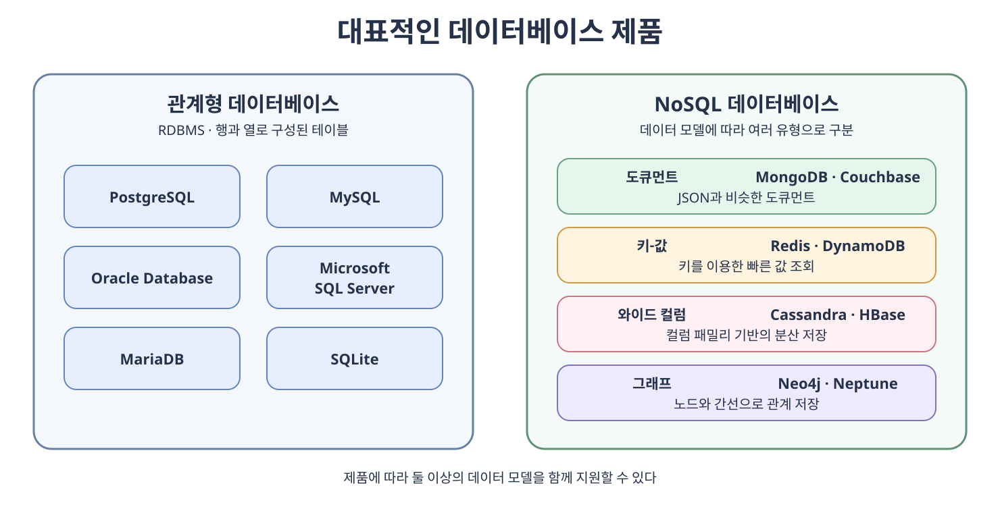
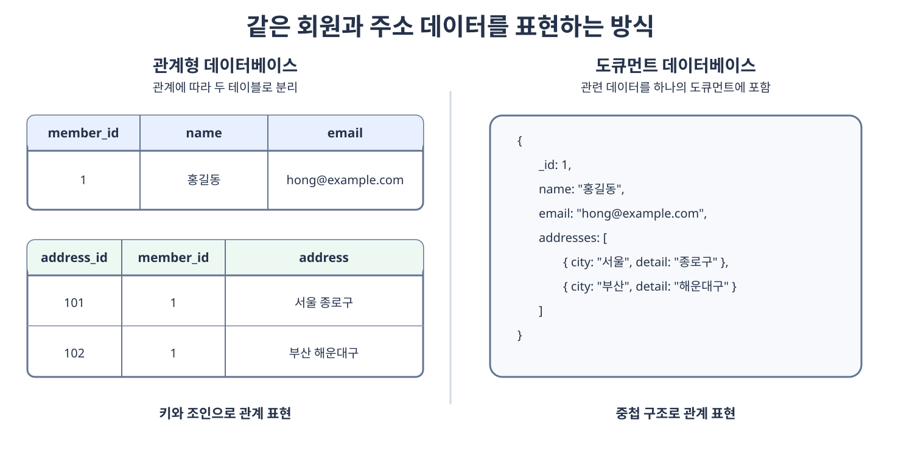
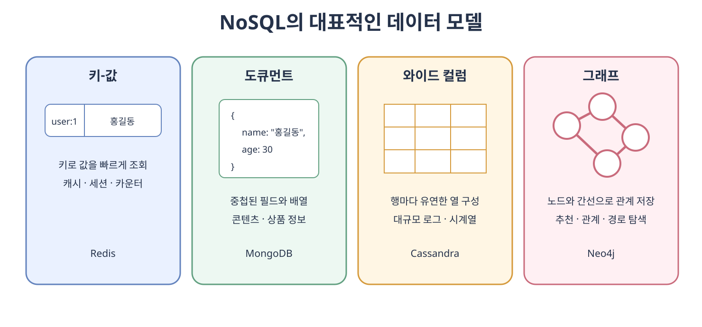

# 데이터베이스의 종류

데이터베이스는 데이터를 어떤 모델로 표현하고 저장하느냐에 따라 여러 종류로 나뉜다. 이 절에서는 교재에서 다루는 **관계형 데이터베이스**(**Relational Database**)와 **NoSQL 데이터베이스**(**Not Only SQL Database**)를 중심으로 살펴본다.

관계형 데이터베이스와 NoSQL 데이터베이스는 어느 한쪽이 항상 우수한 관계가 아니다. 데이터의 구조, 관계, 일관성 요구사항, 조회 패턴과 확장 방식을 기준으로 적합한 저장소를 선택해야 한다. 하나의 서비스에서 주문은 관계형 데이터베이스에, 캐시는 Redis에 저장하는 것처럼 여러 종류를 함께 사용하기도 한다.

대표적으로 사용되는 제품을 데이터 모델에 따라 구분하면 다음과 같다. 그림에 나열된 순서는 사용량이나 성능 순위가 아니다.



- MySQL, PostgreSQL, Oracle Database, Microsoft SQL Server, MariaDB와 SQLite는 관계형 데이터베이스에 해당한다.
- MongoDB는 도큐먼트, Redis는 키-값, Cassandra는 와이드 컬럼, Neo4j는 그래프 데이터 모델을 대표한다.
- 하나의 제품이 여러 데이터 모델을 지원하기도 한다. 이때는 해당 제품의 주된 데이터 모델과 현재 사용 목적을 기준으로 이해하는 것이 좋다.



## 4.4.1 관계형 데이터베이스

관계형 데이터베이스는 데이터를 행과 열로 이루어진 **릴레이션**(**Relation**)에 저장하고 릴레이션 사이의 관계를 키로 표현한다. 관계형 데이터베이스를 관리하는 시스템을 **관계형 데이터베이스 관리 시스템**(**Relational Database Management System, RDBMS**)이라고 한다.

RDBMS에서는 일반적으로 **SQL**(**Structured Query Language**)을 사용하여 스키마를 정의하고 데이터를 조회하거나 변경한다. SQL 표준이 있지만 DBMS마다 지원하는 기능, 데이터 타입, 함수와 문법에 차이가 있다.

SQL은 데이터베이스 제품명이 아니라 관계형 데이터베이스를 정의하고 조작하는 언어다. PostgreSQL과 MySQL은 SQL을 사용하는 서로 다른 RDBMS다.

### 대표적인 RDBMS

| 제품 | 특징 | 자주 사용되는 환경 |
| --- | --- | --- |
| **PostgreSQL** | 표준 SQL과 확장 기능, 다양한 데이터 타입을 폭넓게 지원한다. | 웹 백엔드, 복잡한 쿼리, 공간·JSON 데이터 |
| **MySQL** | 넓은 생태계와 운영 경험을 가진 대표적인 오픈 소스 RDBMS다. | 웹 서비스, 전자상거래, 일반적인 온라인 트랜잭션 |
| **Oracle Database** | 대규모 트랜잭션과 가용성·보안·관리 기능을 제공하는 상용 RDBMS다. | 금융, 공공기관, 대기업의 핵심 업무 시스템 |
| **Microsoft SQL Server** | Microsoft 생태계와 통합된 상용 RDBMS다. | .NET 기반 서비스, 기업 내부 시스템 |
| **MariaDB** | MySQL에서 파생되었으며 MySQL과 높은 호환성을 지향하는 오픈 소스 RDBMS다. | MySQL 대체 환경, 웹 서비스 |
| **SQLite** | 별도의 서버 없이 하나의 파일에 데이터를 저장하는 임베디드 RDBMS다. | 모바일 앱, 데스크톱 앱, 로컬 저장소, 테스트 |

`Microsoft SQL Server`, `SQL Server`, `MSSQL`은 일반적으로 같은 제품을 가리킨다. `Oracle`이라고 줄여 부르는 제품의 정식 명칭은 `Oracle Database`다.

### 관계형 데이터베이스의 특징

- 테이블마다 열의 이름과 데이터 타입, 제약 조건으로 구성된 스키마를 정의한다.
- 기본키와 외래키로 레코드를 식별하고 테이블 사이의 관계를 표현한다.
- 조인을 이용해 여러 테이블에 나누어 저장한 데이터를 결합할 수 있다.
- 정규화를 통해 중복과 이상 현상을 줄일 수 있다.
- 트랜잭션과 무결성 제약 조건으로 복잡한 데이터 변경의 일관성을 관리한다.

정해진 스키마는 데이터의 형태를 엄격하게 관리하는 장점이 있지만 구조를 변경할 때 마이그레이션이 필요할 수 있다. 여러 테이블을 자주 조인하거나 한 서버의 처리 한계를 넘어 수평 확장할 때는 데이터 분할과 분산 트랜잭션의 복잡성도 고려해야 한다.

### MySQL

**MySQL**은 여러 운영체제에서 사용할 수 있는 대표적인 오픈 소스 RDBMS다. 서버 계층과 스토리지 엔진 계층을 분리한 구조를 사용하여 테이블의 저장과 처리를 담당하는 엔진을 선택할 수 있다. 일반적으로 트랜잭션, 외래키와 행 수준 잠금을 지원하는 `InnoDB`가 기본 스토리지 엔진으로 사용된다.

MySQL의 주요 특징은 다음과 같다.

- `InnoDB`는 기본키를 기준으로 데이터를 저장하는 클러스터형 인덱스를 사용한다.
- 트랜잭션의 커밋과 롤백, 장애 복구와 다중 버전 동시성 제어를 지원한다.
- 복제와 파티셔닝 등 가용성 및 확장을 위한 기능을 제공한다.
- 사용자와 권한, 전송 구간 암호화 등 데이터베이스 보안 기능을 제공한다.

과거에 널리 사용된 `MyISAM`은 전문 검색과 공간 인덱스 같은 기능을 제공하지만 트랜잭션과 외래키를 지원하지 않는다. 따라서 엔진 이름만 보고 선택하지 말고 데이터의 일관성과 동시성 요구사항을 확인해야 한다.

### PostgreSQL

**PostgreSQL**은 객체-관계형 기능을 함께 제공하는 오픈 소스 RDBMS다. 표준 SQL을 폭넓게 지원하며 사용자 정의 타입, 배열, 범위 타입, `JSON`과 `JSONB` 등 다양한 데이터 타입과 확장 기능을 제공한다.

PostgreSQL의 주요 특징은 다음과 같다.

- 다중 버전 동시성 제어와 선행 기록 로그를 사용하여 트랜잭션과 장애 복구를 지원한다.
- 복잡한 쿼리, 윈도 함수, 공통 테이블 표현식 등 다양한 SQL 기능을 제공한다.
- 확장 모듈과 사용자 정의 함수, 연산자와 타입으로 기능을 확장할 수 있다.
- `JSONB`를 사용하면 관계형 데이터와 반정형 데이터를 한 시스템에서 다룰 수 있다.

PostgreSQL이 `JSONB`를 지원한다고 해서 문서형 데이터베이스와 완전히 같아지는 것은 아니다. 데이터 모델, 인덱스, 분산 방식과 운영 특성이 다르므로 실제 접근 패턴을 기준으로 선택해야 한다.

## 4.4.2 NoSQL 데이터베이스

**NoSQL**은 전통적인 관계형 테이블 모델에 한정되지 않는 데이터베이스를 가리킨다. 이름은 보통 **Not Only SQL**로 풀이한다. NoSQL이 SQL을 절대로 사용할 수 없다는 의미는 아니며, 제품마다 자체 쿼리 언어나 SQL과 비슷한 인터페이스를 제공하기도 한다.

NoSQL 데이터베이스는 데이터 모델에 따라 다음과 같이 구분할 수 있다.



| 종류 | 저장 구조 | 적합한 예 | 대표 제품 |
| --- | --- | --- | --- |
| **키-값 데이터베이스**(**Key-value Database**) | 키 하나에 값을 대응한다. | 캐시, 세션, 실시간 카운터 | Redis, Valkey, Amazon DynamoDB |
| **도큐먼트 데이터베이스**(**Document Database**) | 필드와 값을 가진 도큐먼트를 저장한다. | 콘텐츠, 상품 카탈로그, 이벤트 데이터 | MongoDB, Couchbase, Cloud Firestore |
| **와이드 컬럼 데이터베이스**(**Wide-column Database**) | 행마다 서로 다른 열을 가질 수 있는 컬럼 패밀리에 저장한다. | 대규모 로그, 시계열, 분산 쓰기 | Apache Cassandra, HBase, Google Cloud Bigtable |
| **그래프 데이터베이스**(**Graph Database**) | 노드와 간선을 이용해 관계를 직접 저장한다. | 추천, 소셜 관계, 경로 탐색 | Neo4j, Amazon Neptune |

Amazon DynamoDB는 키-값과 도큐먼트 모델을 함께 지원하는 것처럼 하나의 제품이 여러 분류에 포함될 수 있다. Elasticsearch와 OpenSearch는 넓은 의미에서 NoSQL 제품군에 함께 언급되기도 하지만 주된 목적은 전문 검색과 로그 분석이므로 일반적인 도큐먼트 데이터베이스와 역할을 구분해야 한다.

### NoSQL의 특징과 고려사항

- 하나의 레코드에 관련 데이터를 함께 저장하여 조인을 줄이는 비정규화된 모델을 자주 사용한다.
- 데이터 구조를 유연하게 바꾸거나 다양한 형태의 데이터를 저장하기 쉽다.
- 데이터 분산과 수평 확장을 주요 설계 목표로 삼은 제품이 많다.
- 제품과 설정에 따라 트랜잭션, 일관성 모델과 쿼리 기능이 크게 다르다.

`NoSQL은 스키마가 없다`, `NoSQL은 ACID를 지원하지 않는다`고 단정하면 안 된다. 명시적인 테이블 스키마가 없더라도 애플리케이션이 기대하는 데이터 구조는 존재하며 필요하면 검증 규칙을 적용해야 한다. MongoDB는 다중 도큐먼트 트랜잭션을 지원하고 Redis도 명령 묶음과 원자적 연산을 제공하는 등 제품별 기능이 계속 발전하고 있다.

### MongoDB

**MongoDB**는 데이터를 **BSON**(**Binary JSON**) 형식의 도큐먼트로 저장하는 도큐먼트 데이터베이스다. 컬렉션 안의 도큐먼트는 서로 다른 필드를 가질 수 있고 배열이나 중첩 도큐먼트를 포함할 수 있다.

```javascript
{
  _id: ObjectId("..."),
  name: "홍길동",
  email: "hong@example.com",
  addresses: [
    { city: "서울", detail: "종로구" },
    { city: "부산", detail: "해운대구" }
  ]
}
```

- 기본적으로 `_id` 필드에 고유 인덱스가 생성된다.
- `_id` 값을 지정하지 않으면 드라이버가 `ObjectId`를 생성할 수 있다. 일반적인 `ObjectId`는 타임스탬프, 프로세스별 난수와 카운터로 구성된 12바이트 값이다.
- 복제 세트로 고가용성을 구성하고 샤딩으로 데이터를 여러 서버에 분산할 수 있다.
- 도큐먼트 단위의 원자적 연산과 다중 도큐먼트 트랜잭션을 지원한다.

함께 조회하고 함께 변경하는 데이터는 하나의 도큐먼트에 포함하는 **임베딩**(**Embedding**)을 고려할 수 있다. 반대로 데이터가 독립적으로 변경되거나 무한히 증가하면 별도 도큐먼트로 나누고 참조하는 편이 적합하다. 도큐먼트 모델에서도 접근 패턴과 데이터 생명주기를 먼저 설계해야 한다.

### Redis

**Redis**는 데이터를 주로 메모리에 저장하는 키-값 기반의 데이터 저장소다. 단순 문자열뿐만 아니라 해시, 리스트, 집합, 정렬 집합, 스트림 등 여러 자료 구조와 각 구조에 맞는 원자적 명령을 제공한다.

Redis는 다음과 같은 용도에 적합하다.

- 자주 조회하는 데이터를 빠르게 제공하는 캐시
- 로그인 세션과 만료 시간이 있는 임시 데이터
- 정렬 집합을 활용한 실시간 순위표
- 카운터, 작업 대기열, 이벤트 스트림
- 발행·구독을 이용한 실시간 메시지 전달

Redis를 단순히 `메모리에만 있어 재시작하면 모두 사라지는 저장소`로 이해하면 안 된다. 스냅숏 방식인 `RDB`와 명령 로그 방식인 `AOF`로 데이터를 디스크에 지속할 수 있고 복제 및 클러스터 기능도 제공한다. 다만 영속성 설정에 따라 장애 시 유실 가능한 범위와 성능이 달라지므로 원본 데이터베이스인지 재생성 가능한 캐시인지 역할을 분명히 해야 한다.

### 관계형 데이터베이스와 NoSQL 선택 기준

| 판단 기준 | 관계형 데이터베이스가 적합한 경우 | NoSQL 데이터베이스를 고려할 경우 |
| --- | --- | --- |
| 데이터 구조 | 구조와 관계가 명확하고 변경이 비교적 적다. | 레코드마다 구조가 다르거나 빠르게 변한다. |
| 일관성 | 여러 테이블의 강한 트랜잭션과 제약 조건이 중요하다. | 제품이 제공하는 일관성 수준으로 요구사항을 충족할 수 있다. |
| 조회 방식 | 조인과 복잡한 조건·집계가 많다. | 키 조회나 특정 데이터 모델에 최적화된 접근이 중심이다. |
| 확장 | 단일 서버 확장이나 읽기 복제로 충분하다. | 많은 쓰기와 데이터의 수평 분산이 핵심 요구사항이다. |
| 중복 | 정규화하여 중복을 줄이는 것이 중요하다. | 조회 성능을 위해 중복을 허용하고 일관성을 관리할 수 있다. |

데이터베이스 종류만으로 성능과 확장성을 단정할 수는 없다. 예상 데이터 크기와 읽기·쓰기 비율, 가장 중요한 쿼리, 장애 허용 범위, 운영 경험을 바탕으로 후보를 정하고 실제 부하를 측정해야 한다.
