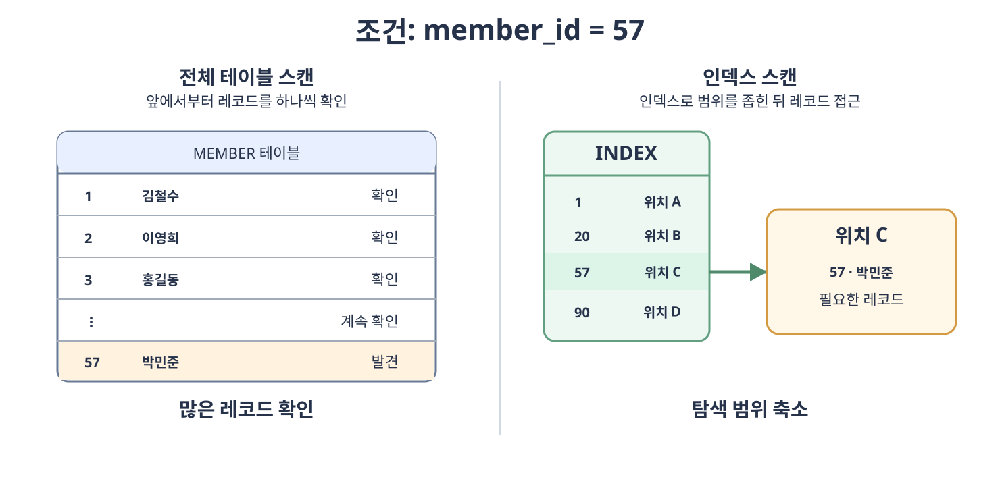
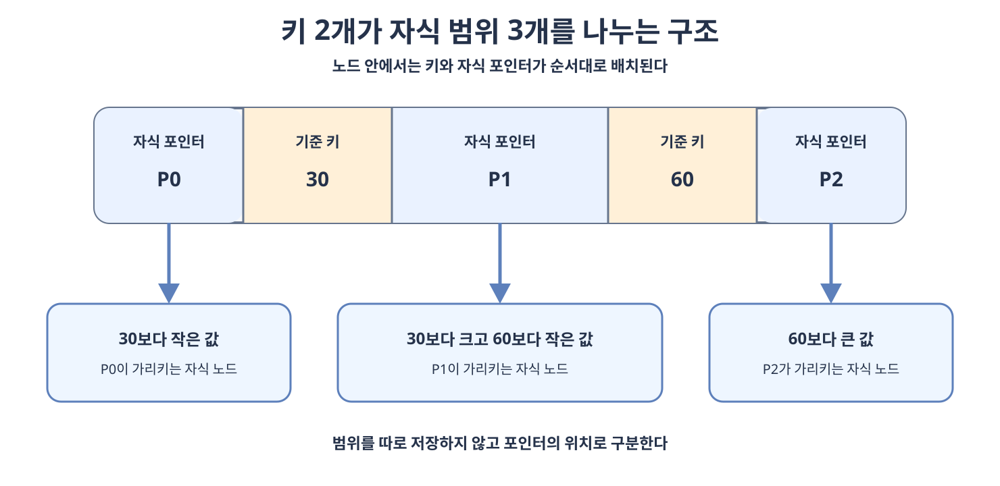
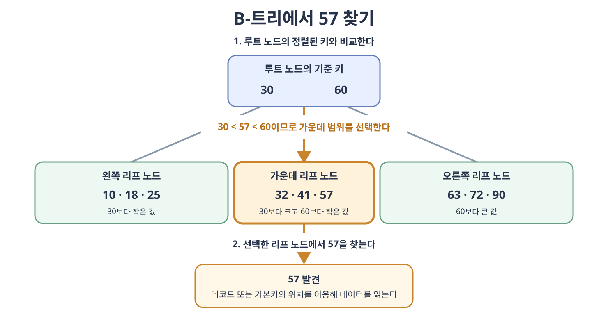
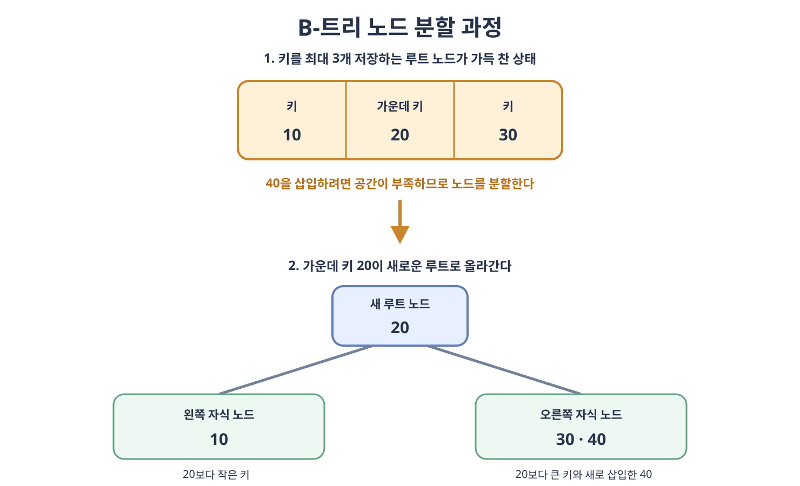
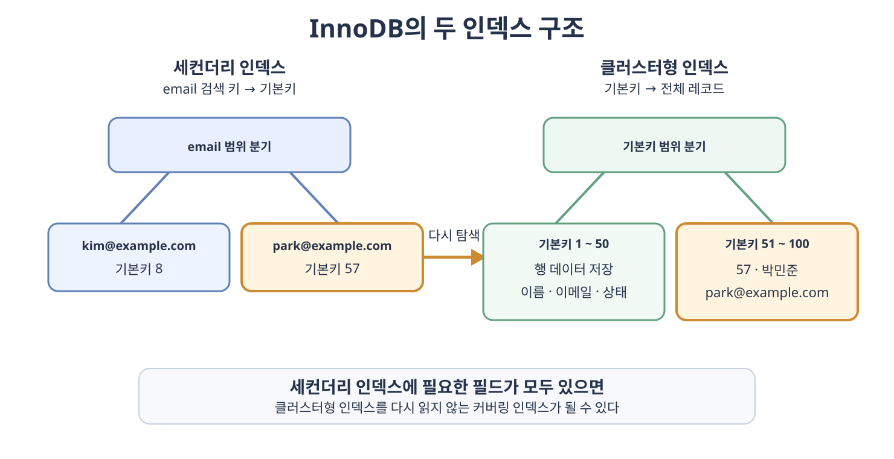
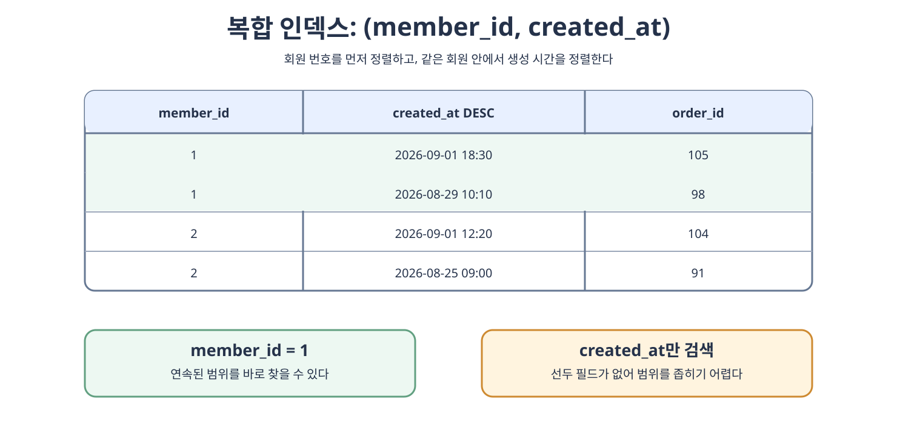

# 인덱스

**인덱스**(**Index**)는 테이블이나 컬렉션의 데이터를 빠르게 찾기 위해 별도로 유지하는 자료 구조다. 책의 찾아보기가 단어와 페이지 번호를 정렬해 두는 것처럼 데이터베이스 인덱스는 검색 키와 실제 레코드를 찾을 수 있는 정보를 저장한다.

인덱스는 조회 성능을 높일 수 있지만 저장 공간을 사용하고 데이터가 변경될 때 함께 갱신해야 한다. 따라서 모든 필드에 만드는 것이 아니라 실제 쿼리와 데이터 분포를 기준으로 설계해야 한다.

## 4.5.1 인덱스의 필요성

인덱스가 없는 테이블에서 조건에 맞는 레코드를 찾으려면 DBMS가 처음부터 끝까지 확인하는 **전체 테이블 스캔**(**Full Table Scan**)을 수행할 수 있다. 데이터가 많아질수록 읽어야 할 페이지도 증가한다.

인덱스가 있으면 정렬된 인덱스에서 조건에 맞는 키를 먼저 찾고, 필요한 경우 그 키가 가리키는 레코드에 접근한다. 이를 **인덱스 스캔**(**Index Scan**)이라고 한다.



인덱스는 다음과 같은 작업에 활용될 수 있다.

- `WHERE` 조건에 맞는 행을 빠르게 찾는다.
- 인덱스의 정렬 순서를 활용하여 `ORDER BY`의 별도 정렬을 줄인다.
- 인덱스의 선두 열을 기준으로 `GROUP BY`를 처리하는 데 도움을 줄 수 있다.
- 기본키와 고유 인덱스로 값의 중복을 검사한다.
- 조인 조건에 사용되는 키를 빠르게 찾는다.

인덱스가 있다고 항상 사용되는 것은 아니다. 조건에 맞는 행이 테이블의 대부분을 차지하면 인덱스를 거쳐 각 레코드에 접근하는 것보다 전체 테이블을 순차적으로 읽는 편이 저렴할 수 있다. 최적화기는 통계 정보와 예상 비용을 바탕으로 실행 계획을 선택한다.

### 카디널리티와 선택도

인덱스를 설계할 때는 값의 분포를 이해해야 한다.

- **카디널리티**(**Cardinality**)는 한 필드에 존재하는 서로 다른 값의 개수다. 회원 번호나 이메일은 카디널리티가 높고, 성별이나 사용 여부는 일반적으로 낮다.
- **선택도**(**Selectivity**)는 조건으로 선택되는 레코드의 비율이다. 보통 선택되는 행이 적을수록 선택도가 높다고 표현한다.

카디널리티가 높은 필드는 한 값을 검색했을 때 적은 행을 찾는 경우가 많아 단일 인덱스 후보가 되기 쉽다. 그러나 `status = 'PENDING'`처럼 값의 종류가 적어도 특정 값에 해당하는 행이 매우 적거나 다른 필드와 결합하여 자주 조회한다면 인덱스가 유용할 수 있다. 카디널리티만으로 인덱스의 유용성을 단정하면 안 된다.

## 4.5.2 B-트리

**B-트리**(**B-tree**)는 이진 트리가 아니며 `B`도 `Binary`를 의미하지 않는다.

B-트리는 정렬된 데이터를 빠르게 찾기 위한 **다진 균형 탐색 트리**(**Multi-way Balanced Search Tree**)다. 이름보다 먼저 다음 한 문장을 이해하면 된다.

> B-트리는 한 노드에 여러 키를 정렬해서 저장하고, 키 사이의 자식 포인터를 따라가며 검색 범위를 줄이는 트리다.

### B-트리를 구성하는 요소

- **키**(**Key**)는 정렬과 검색의 기준이 되는 값이다.
- **노드**(**Node**)는 여러 키와 포인터를 담는 저장 단위다. 데이터베이스의 B-트리 계열 인덱스에서는 일반적으로 노드 하나가 디스크나 메모리의 페이지 하나에 대응한다.
- **포인터**(**Pointer**)는 다음에 읽을 자식 노드 또는 실제 레코드의 위치를 가리킨다.
- 노드는 탐색을 시작하는 **루트 노드**(**Root Node**), 중간 경로를 선택하는 **브랜치 노드**(**Branch Node**), 가장 아래의 **리프 노드**(**Leaf Node**)로 구분한다.

### B-트리의 핵심 규칙

1. 한 노드에는 정렬된 키가 여러 개 들어갈 수 있다.
2. 내부 노드의 키가 `k`개라면 자식 포인터는 `k + 1`개다.
3. 각 자식 포인터는 키가 나눈 서로 다른 값의 범위를 담당한다.
4. 모든 리프 노드는 같은 깊이에 있다.
5. 노드가 너무 차거나 너무 비면 분할·재분배·병합하여 균형을 유지한다.

이 규칙으로 B-트리는 데이터가 삽입되거나 삭제되어도 한쪽으로 기울어지지 않는다. 따라서 어떤 키를 찾더라도 루트에서 리프까지 내려가는 단계 수가 비슷하다.

### 노드 하나의 이론적인 구조

내부 노드에 정렬된 키 `K1`, `K2`, ..., `Kn`이 있다면 자식 포인터는 키의 앞, 키 사이, 마지막 키의 뒤에 배치된다.

```text
P0 | K1 | P1 | K2 | P2 | ... | Kn | Pn
```

- `P0`은 `K1`보다 작은 키가 있는 자식 노드를 가리킨다.
- 키 사이의 포인터는 왼쪽 키보다 크고 오른쪽 키보다 작은 키가 있는 자식 노드를 가리킨다.
- `Pn`은 `Kn`보다 큰 키가 있는 자식 노드를 가리킨다.
- 일반 B-트리에서 찾는 값이 현재 노드의 키와 같다면 그 노드에서 검색이 끝난다.

값의 범위를 문장이나 숫자 구간으로 따로 저장하는 것은 아니다. 정렬된 키 사이에 자식 포인터가 놓인 구조 자체가 각 포인터의 담당 범위를 결정한다.

### 한 노드에 키를 여러 개 저장하는 이유

데이터베이스는 저장 장치에서 보통 페이지 단위로 데이터를 읽는다. 페이지를 한 번 읽었다면 그 안에서 키 하나만 확인하는 것보다 여러 키를 함께 확인하는 편이 효율적이다.

B-트리는 한 노드가 여러 자식과 연결되는 **팬아웃**(**Fan-out**)이 큰 구조다. 팬아웃이 커지면 같은 수의 데이터를 저장해도 트리의 높이가 낮아지고, 검색할 때 읽어야 하는 페이지 수도 감소한다.

노드에 들어가는 실제 키의 수는 페이지 크기, 키와 포인터의 크기 등에 따라 달라진다. 한 노드가 많은 자식과 연결될수록 트리의 높이가 낮아지고 검색에 필요한 페이지 접근 횟수도 줄어든다.

### 탐색 과정

B-트리는 루트부터 시작하여 현재 노드의 정렬된 키와 찾는 키를 비교한다. 같은 키가 있으면 검색을 끝내고, 없다면 찾는 키가 속할 범위의 자식 포인터를 따라 내려간다. 키를 찾거나 리프 노드에 도달할 때까지 이 과정을 반복한다.

한 노드 안에서는 순차 비교나 이진 탐색을 이용해 키의 위치를 찾을 수 있다. 전체 탐색 비용은 트리 높이에 비례하며 일반적으로 `O(log N)`으로 표현한다. 데이터베이스에서는 비교 횟수보다 저장 장치에서 몇 개의 페이지를 읽는지가 더 중요한 경우가 많다.

### 삽입·삭제와 균형 유지

- 삽입할 때는 알맞은 리프 노드에 키를 정렬하여 넣는다.
- 노드가 가득 차면 둘로 분할하고 가운데 키를 부모 노드로 올린다. 부모도 가득 차면 분할이 위쪽으로 이어진다.
- 삭제 후 키가 너무 적어지면 형제 노드에서 키를 빌리거나 형제와 합친다.
- 이러한 과정으로 모든 리프 노드의 깊이를 같게 유지한다. 균형은 모든 노드의 키 개수가 같다는 뜻이 아니라 모든 리프 노드가 같은 깊이에 있다는 뜻이다.

부모 노드의 기준 키는 임의로 정해 둔 값이 아니라 하위 노드가 분할되는 과정에서 올라온 값이다. 트리가 한쪽으로 기울어지지 않으므로 탐색·삽입·삭제의 시간 복잡도는 일반적으로 `O(log N)`이다.

### B-트리와 B+트리의 차이

교재에서는 대표 용어로 B-트리를 사용하지만 실제 관계형 DBMS의 인덱스는 주로 **B+트리**(**B+ Tree**)계열을 사용한다. B+트리는 B-트리의 탐색 원리를 유지하면서 데이터베이스의 범위 검색에 더 적합하게 변형한 구조다.

| 구분 | B-트리 | B+트리 |
| --- | --- | --- |
| 내부 노드 | 검색 키와 레코드 정보를 함께 가질 수 있다. | 다음 자식을 선택하기 위한 기준 키를 저장한다. |
| 리프 노드 | 일부 검색 키와 레코드 정보가 저장된다. | 모든 검색 키와 레코드 위치 정보가 저장된다. |
| 리프 노드 연결 | 필수적인 특징이 아니다. | 리프 노드가 정렬된 순서로 연결된다. |
| 범위 검색 | 가능하다. | 연결된 리프 노드를 순서대로 읽을 수 있어 더 유리하다. |

범위 검색에서는 시작 키가 있는 리프 노드를 한 번 찾은 뒤 연결된 다음 리프 노드를 순서대로 읽는다. 이 때문에 B+트리 계열 인덱스는 `ORDER BY`, `<`, `>`, `BETWEEN`과 같은 연속된 범위를 처리하는 데 유리하다.

### 예제로 이해하는 B-트리

지금부터는 앞에서 살펴본 이론을 실제 숫자에 적용한다.

#### 키 2개가 세 범위를 만드는 예시

내부 노드에 `[30, 60]`이 정렬되어 있다고 가정하자. 이 노드는 키 2개와 자식 포인터 3개를 가진다.

| 찾는 값의 범위 | 선택할 자식 포인터 |
| --- | --- |
| `찾는 값 < 30` | `P0` |
| `30 < 찾는 값 < 60` | `P1` |
| `60 < 찾는 값` | `P2` |



루트에 키가 반드시 2개 저장되는 것은 아니다. `[30, 60]`은 키와 자식 포인터의 관계를 보여주기 위한 예시일 뿐이다.

#### 57을 찾는 예시

루트 노드가 `[30, 60]`이고 그 아래에 리프 노드 세 개가 있다고 가정한다.

| 단계 | 읽은 노드 | 비교와 판단 | 동작 |
| ---: | --- | --- | --- |
| 1 | 루트 노드 `[30, 60]` | `30 < 57 < 60` | 두 키 사이의 `P1`을 선택한다. |
| 2 | 가운데 리프 노드 `[32, 41, 57]` | `57`을 찾는다. | 인덱스 항목을 발견한다. |
| 3 | `57`의 인덱스 항목 | 레코드 또는 기본키의 위치를 확인한다. | 해당 위치에서 실제 데이터를 읽는다. |



루트에서 `57`을 직접 찾지 못했지만 검색에 실패한 것은 아니다. 루트의 키를 이용해 전체 자식 중 `57`이 있을 수 있는 가운데 자식만 선택한 것이다.

#### 노드 분할로 루트가 만들어지는 예시

한 노드에 키를 최대 3개까지 저장한다고 단순하게 가정하고 `10`, `20`, `30`, `40`을 차례로 삽입한다.

1. `10`, `20`, `30`까지는 하나의 루트 노드에 `[10, 20, 30]`으로 저장된다.
2. `40`을 넣을 공간이 없으므로 노드를 나누고 가운데 키 `20`을 새로운 루트로 올린다.
3. 왼쪽 자식은 `[10]`, 오른쪽 자식은 새 키를 포함한 `[30, 40]`이 된다.



이후 하위 노드가 다시 가득 차면 같은 분할 과정으로 부모에 키가 추가된다. 따라서 루트의 키는 데이터를 삽입하고 노드를 분할한 결과다.

## 4.5.3 인덱스 만드는 방법

인덱스를 만드는 문법과 저장 구조는 DBMS마다 다르다. 여기서는 교재에서 다루는 MySQL과 MongoDB를 기준으로 살펴본다.

### MySQL의 인덱스

`InnoDB`의 인덱스는 크게 **클러스터형 인덱스**(**Clustered Index**)와 **세컨더리 인덱스**(**Secondary Index**)로 구분할 수 있다.



#### 클러스터형 인덱스

`InnoDB` 테이블의 레코드는 클러스터형 인덱스의 리프 페이지에 기본키 순서로 저장된다. 리프 항목이 실제 행 데이터를 포함하므로 기본키로 검색하면 해당 인덱스만 내려가 레코드를 찾을 수 있다.

- 테이블마다 데이터가 정렬되는 기준은 하나이므로 클러스터형 인덱스도 하나다.
- 기본키가 있으면 기본키를 클러스터링 키로 사용한다.
- 기본키가 없으면 모든 열이 `NOT NULL`인 첫 번째 `UNIQUE` 인덱스를 사용한다.
- 적합한 인덱스가 없으면 `InnoDB`가 숨겨진 클러스터링 키를 만든다.

기본키가 너무 길면 모든 세컨더리 인덱스가 함께 커질 수 있다. 변경이 잦은 값이나 무작위로 매우 넓게 분산되는 값을 기본키로 선택하면 페이지 분할과 저장 효율에도 영향을 줄 수 있다.

#### 세컨더리 인덱스

세컨더리 인덱스는 기본키가 아닌 필드를 기준으로 별도의 B-트리 계열 구조를 만든다. `InnoDB`의 세컨더리 인덱스 리프 항목은 일반적으로 해당 레코드의 기본키 값을 저장한다.

따라서 세컨더리 인덱스에 없는 필드까지 조회하면 다음 과정이 발생할 수 있다.

1. 세컨더리 인덱스에서 조건에 맞는 기본키를 찾는다.
2. 그 기본키로 클러스터형 인덱스를 다시 탐색하여 전체 레코드를 읽는다.

이를 흔히 **테이블 룩업**(**Table Lookup**) 또는 `InnoDB`의 **북마크 룩업**(**Bookmark Lookup**)이라고 한다. 반대로 쿼리에 필요한 필드가 모두 인덱스에 들어 있어 테이블 레코드를 추가로 읽지 않아도 되는 인덱스를 **커버링 인덱스**(**Covering Index**)라고 한다.

#### 인덱스 생성 SQL

```sql
CREATE INDEX idx_member_email
ON member (email);

CREATE UNIQUE INDEX uk_member_email
ON member (email);

CREATE INDEX idx_orders_member_created
ON orders (member_id, created_at DESC);
```

`PRIMARY KEY`와 `UNIQUE` 제약 조건을 선언할 때도 이를 검사하기 위한 인덱스가 생성된다. 같은 열 조합을 가진 중복 인덱스를 추가하지 않도록 현재 인덱스를 먼저 확인해야 한다.

### MongoDB의 인덱스

MongoDB는 컬렉션을 만들 때 `_id` 필드에 고유 인덱스를 자동으로 생성한다. 다른 필드의 인덱스는 `createIndex()`로 추가한다.

```javascript
db.member.createIndex({ email: 1 }, { unique: true })

db.orders.createIndex({ member_id: 1, created_at: -1 })
```

`1`은 오름차순, `-1`은 내림차순 인덱스를 의미한다. 여러 필드를 지정하면 복합 인덱스가 된다. MongoDB는 단일 필드와 복합 인덱스 외에도 다중 키, 텍스트, 지리 공간, 해시, 와일드카드 인덱스 등을 제공하므로 데이터 형태와 쿼리에 맞는 종류를 선택해야 한다.

## 4.5.4 인덱스 최적화 기법

인덱스 최적화에는 모든 서비스에 그대로 적용되는 하나의 정답이 없다. 같은 스키마라도 데이터의 양과 분포, 읽기·쓰기 비율과 쿼리 조건에 따라 최적의 인덱스가 달라진다.

### 인덱스는 비용이다

인덱스를 추가하면 조회 경로가 생기는 대신 다음 비용이 발생한다.

- 인덱스 페이지를 저장하는 디스크와 메모리 공간이 필요하다.
- 레코드를 삽입·수정·삭제할 때 관련 인덱스도 갱신해야 한다.
- B-트리의 균형을 유지하면서 페이지 분할이나 병합이 발생할 수 있다.
- 세컨더리 인덱스에서 많은 행을 찾으면 각 레코드로 접근하는 무작위 읽기 비용이 커질 수 있다.

자주 변경되는 필드, 거의 조회하지 않는 필드, 조건이 대부분의 행을 선택하는 필드에 인덱스를 무작정 추가하면 전체 성능이 오히려 낮아질 수 있다.

### 실행 계획으로 확인한다

인덱스를 만든 뒤에는 예상이 아니라 실행 계획과 측정 결과로 효과를 확인해야 한다.

```sql
EXPLAIN ANALYZE
SELECT order_id, created_at
FROM orders
WHERE member_id = 1
ORDER BY created_at DESC
LIMIT 20;
```

`EXPLAIN`은 옵티마이저가 선택한 접근 방식과 예상 행 수를 보여 주고, 지원되는 DBMS의 `EXPLAIN ANALYZE`는 실제로 쿼리를 실행하여 실제 행 수와 시간도 보여 준다. 운영 환경과 비슷한 데이터 양과 분포에서 다음 항목을 확인한다.

- 의도한 인덱스를 사용하는가
- 예상 행 수와 실제 행 수의 차이가 큰가
- 인덱스를 읽은 뒤 너무 많은 레코드에 다시 접근하는가
- 별도의 정렬이나 임시 테이블이 발생하는가
- 인덱스 추가 후 쓰기 성능과 저장 공간은 허용할 수 있는가

### 복합 인덱스의 열 순서

**복합 인덱스**(**Composite Index**)는 둘 이상의 필드를 하나의 인덱스로 묶는다. `(member_id, created_at)` 인덱스는 먼저 `member_id`로 정렬하고 같은 회원 안에서 `created_at`으로 정렬한다.



대부분의 B-트리 복합 인덱스는 인덱스의 왼쪽부터 이어지는 필드를 조건에 사용할 때 효과적이다. 이를 **왼쪽 접두어 규칙**(**Leftmost Prefix Rule**)이라고 한다.

```text
인덱스: (member_id, status, created_at)

활용하기 좋은 조건
- member_id
- member_id + status
- member_id + status + created_at

선두 필드가 없는 조건
- status만 조회
- created_at만 조회
```

복합 인덱스의 일반적인 설계 순서는 다음과 같이 생각할 수 있다.

1. 자주 사용하는 쿼리의 `WHERE`, `JOIN`, `ORDER BY`를 함께 본다.
2. 동등 조건에 쓰는 필드를 앞쪽 후보로 둔다.
3. 정렬을 인덱스로 처리할 수 있도록 `ORDER BY`의 필드와 방향을 검토한다.
4. 범위 조건에 쓰는 필드는 그 뒤 필드의 탐색 범위를 제한하기 어렵게 만들 수 있으므로 위치를 신중히 정한다.
5. 같은 목적을 만족한다면 불필요하게 긴 인덱스를 만들지 않는다.

교재에서 소개하는 `동등 조건 → 정렬 → 범위 조건 → 카디널리티` 순서는 복합 인덱스를 시작할 때 유용한 경험 법칙이다. 그러나 카디널리티가 높은 필드를 무조건 먼저 놓는 규칙은 아니다. 실제 쿼리의 조건 조합, 정렬 요구와 DBMS의 실행 계획을 함께 확인해야 한다.

### 인덱스가 제대로 활용되지 않는 경우

- 인덱스 필드에 함수를 적용하면 일반 인덱스의 정렬된 원래 값을 바로 활용하지 못할 수 있다.
- 문자열 앞에 와일드카드가 붙은 `LIKE '%word'`는 일반적인 B-트리 인덱스로 시작 위치를 찾기 어렵다.
- 서로 다른 데이터 타입을 비교하여 암시적 형 변환이 발생하면 인덱스 사용이 제한될 수 있다.
- 복합 인덱스의 선두 필드를 건너뛰면 사용할 수 있는 범위가 줄어든다.
- 조건이 테이블의 많은 행을 반환하면 옵티마이저가 전체 테이블 스캔을 선택할 수 있다.

함수를 적용한 결과를 자주 검색한다면 DBMS가 지원하는 함수 기반 인덱스나 생성 열 인덱스를 검토할 수 있다. 전문 검색이나 벡터 검색처럼 B-트리와 다른 접근 방식이 필요한 경우에는 그 목적에 맞는 인덱스를 사용해야 한다.

### 인덱스 설계 순서

1. 느리거나 자주 실행되는 실제 쿼리를 수집한다.
2. 조건, 조인, 정렬, 반환 필드와 데이터 분포를 확인한다.
3. 기존 인덱스와 중복되지 않는 최소한의 후보를 설계한다.
4. 실행 계획과 실제 실행 시간, 읽은 행 수를 비교한다.
5. 조회 개선뿐만 아니라 쓰기 지연과 저장 공간도 측정한다.
6. 사용되지 않거나 중복된 인덱스는 영향 범위를 확인한 뒤 정리한다.
