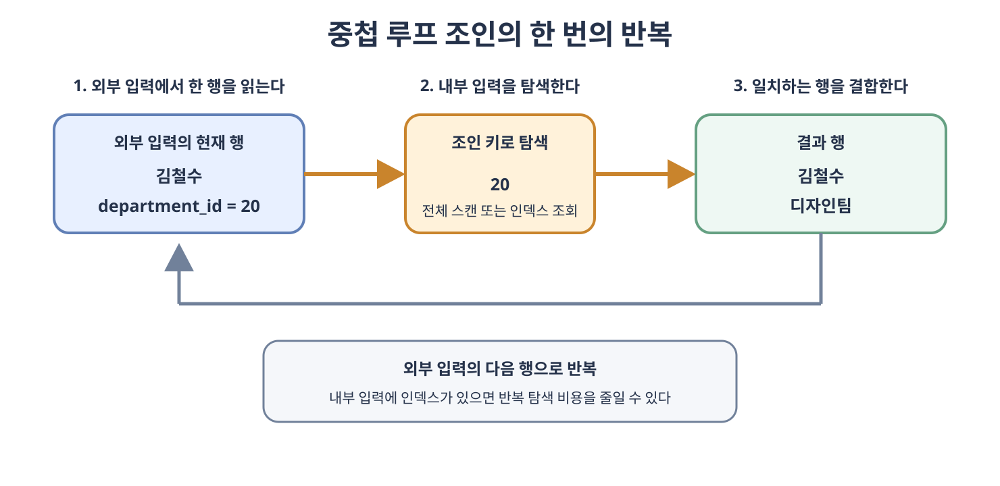
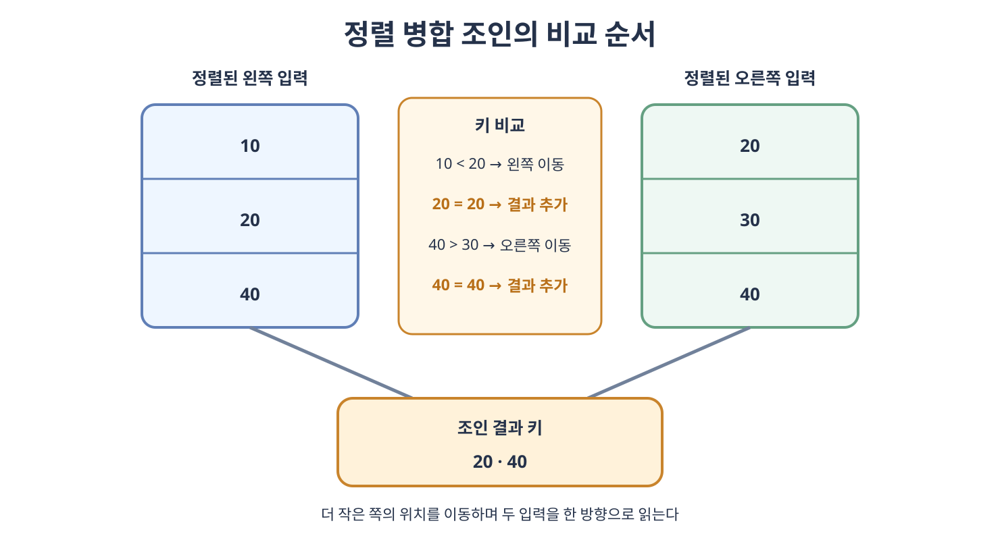
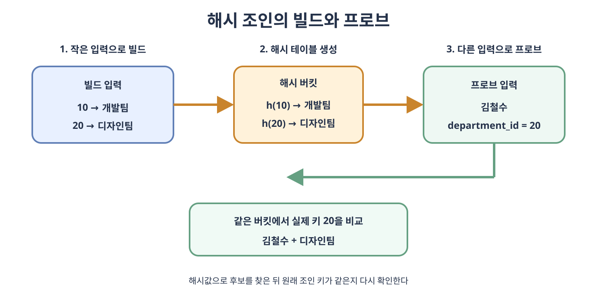

# 조인의 원리

내부 조인, 왼쪽 조인과 같은 조인의 종류는 결과에 어떤 행을 포함할지를 나타내는 논리적인 연산이다. 실제로 두 입력을 어떤 순서와 방법으로 비교할지는 DBMS의 **쿼리 옵티마이저**(**Query Optimizer**)가 실행 계획을 만들면서 결정한다.

같은 SQL이라도 테이블 크기, 인덱스, 정렬 상태, 조인 조건과 통계 정보에 따라 중첩 루프 조인, 정렬 병합 조인 또는 해시 조인이 선택될 수 있다. SQL에 먼저 작성한 테이블이 항상 먼저 처리되는 것도 아니다.

### 논리적인 조인과 물리적인 조인

| 구분 | 결정하는 내용 | 예 |
| --- | --- | --- |
| 논리적인 조인 | 어떤 행을 결과에 포함할지 결정한다. | `INNER JOIN`, `LEFT JOIN`, `FULL OUTER JOIN` |
| 물리적인 조인 | 조건에 맞는 행을 실제로 어떻게 찾을지 결정한다. | NL Join, Sort Merge Join, Hash Join |

하나의 내부 조인이 데이터와 실행 환경에 따라 NL Join으로 실행될 수도 있고 Hash Join으로 실행될 수도 있다. 조인의 논리적인 결과와 물리적인 처리 알고리즘을 구분해야 한다.

### 조인 실행에서 사용하는 용어

- **선행 입력**(**Outer Input**)은 조인에서 먼저 읽어 반복을 주도하는 입력이다. NL Join에서는 흔히 선행 테이블 또는 드라이빙 테이블이라고 부른다.
- **후행 입력**(**Inner Input**)은 선행 입력의 각 행에 대해 반복해서 탐색하는 입력이다. NL Join에서는 후행 테이블 또는 이너 테이블이라고 부른다.
- **빌드 입력**(**Build Input**)은 Hash Join에서 해시 테이블을 만드는 입력이다.
- **프로브 입력**(**Probe Input**)은 만들어진 해시 테이블에서 일치하는 키를 찾는 입력이다.
- **카디널리티**(**Cardinality**)는 실행 계획의 각 단계에서 예상하거나 실제로 반환되는 행 수를 의미한다.

`Outer`와 `Inner`는 NL Join의 처리 역할을 나타내며 `LEFT OUTER JOIN`의 왼쪽·오른쪽 테이블과 항상 같은 의미는 아니다. 옵티마이저는 조인의 논리적인 의미를 유지하는 범위에서 입력 순서를 선택할 수 있다.

여기서 카디널리티는 실행 단계의 행 수를 뜻한다. 인덱스 설계에서 한 필드의 서로 다른 값 개수를 뜻하는 카디널리티와 같은 단어를 사용하므로 문맥을 구분해야 한다.

## 4.7.1 중첩 루프 조인

**중첩 루프 조인**(**Nested Loop Join, NL Join**)은 선행 입력의 행을 하나씩 읽으면서 각 행마다 후행 입력에서 조인 조건을 만족하는 행을 찾는 방식이다. 프로그래밍의 중첩 반복문과 비슷하다.

```text
선행 입력의 각 행에 대해
    후행 입력에서 조건을 만족하는 각 행을 찾아
        두 행을 결합하여 반환한다
```

### 처리 과정

1. 선행 입력에서 행 하나를 읽는다.
2. 선행 행의 조인 키를 이용하여 후행 입력을 탐색한다.
3. 조건을 만족하는 후행 행을 선행 행과 결합한다.
4. 일치하는 후행 행이 여러 개라면 각각의 조합을 반환한다.
5. 선행 입력의 다음 행으로 이동하여 같은 과정을 반복한다.



### 인덱스가 없는 경우

후행 입력의 조인 키에 적절한 인덱스가 없다면 선행 입력의 각 행마다 후행 입력 전체를 반복해서 확인할 수 있다. 선행 입력이 `N`행이고 후행 입력이 `M`행이라면 단순한 방식은 최대 `N × M`에 가까운 비교가 필요하다.

두 입력이 모두 크면 반복적인 전체 스캔 비용이 매우 커질 수 있다. DBMS는 후행 입력을 메모리에 보관하거나 여러 선행 행을 묶어 처리하는 방식으로 실제 입출력 횟수를 줄일 수 있지만 기본 원리는 같다.

### 인덱스가 있는 경우

후행 입력의 조인 키에 인덱스가 있으면 각 선행 행마다 후행 전체를 읽지 않고 인덱스로 일치하는 행을 찾을 수 있다. 이를 **인덱스 중첩 루프 조인**(**Index Nested Loop Join**)이라고 한다.

```text
선행 입력 한 행
→ 조인 키 추출
→ 후행 인덱스에서 키 검색
→ 찾은 레코드와 결합
```

인덱스를 사용한다고 항상 한 행만 읽는 것은 아니다. 인덱스 키가 유일하지 않으면 같은 키를 가진 여러 행을 읽어 모두 결합한다. 인덱스로 찾은 뒤 테이블 레코드에 다시 접근해야 한다면 그 비용도 고려해야 한다.

### NL Join이 유리한 경우

- 선행 입력에서 선택되는 행이 적다.
- 후행 입력의 조인 키에 효율적인 인덱스가 있다.
- 조인 결과의 일부를 빠르게 반환하는 것이 중요하다.
- `LIMIT`처럼 필요한 결과 행 수가 적고 조건을 일찍 만족할 수 있다.
- 두 입력 중 하나가 매우 작다.

### NL Join의 주의점

- 선행 입력이 예상보다 커지면 후행 입력의 반복 탐색 횟수도 함께 증가한다.
- 후행 인덱스 탐색과 테이블 접근이 반복되면 무작위 입출력이 많아질 수 있다.
- 잘못된 통계로 작은 입력을 예상했지만 실제 행이 많으면 성능 차이가 커질 수 있다.
- 인덱스가 있다는 사실만으로 NL Join이 항상 가장 빠른 것은 아니다.

NL Join은 등가 조건뿐 아니라 범위 조건을 포함한 다양한 조인 조건에 사용할 수 있다. 실제 적용 가능 여부와 최적화 방식은 DBMS에 따라 달라진다.

## 4.7.2 정렬 병합 조인

**정렬 병합 조인**(**Sort Merge Join**)은 두 입력을 조인 키 기준으로 정렬한 뒤 각 입력을 앞에서부터 함께 읽으며 조건을 만족하는 키를 찾는 방식이다. 소트 머지 조인이라고도 부른다.

### 처리 과정

1. 두 입력을 조인 키 기준으로 정렬한다.
2. 양쪽 입력의 현재 키를 비교한다.
3. 한쪽 키가 더 작으면 작은 키 쪽의 위치를 다음 행으로 이동한다.
4. 두 키가 같으면 행을 결합한다.
5. 같은 키가 여러 개라면 양쪽의 같은 키 묶음에서 가능한 조합을 모두 반환한다.
6. 한쪽 입력을 모두 읽을 때까지 비교를 반복한다.



### 정렬 비용

입력이 정렬되어 있지 않다면 두 입력을 먼저 정렬해야 한다. 정렬 비용까지 포함한 일반적인 설명은 다음과 같다.

- 왼쪽 입력 정렬은 약 `O(N log N)`의 비용이 든다.
- 오른쪽 입력 정렬은 약 `O(M log M)`의 비용이 든다.
- 정렬된 두 입력을 병합하는 단계는 약 `O(N + M)`이다.

이는 알고리즘을 이해하기 위한 단순화된 표현이다. 실제 비용은 메모리 크기, 데이터 타입, 병렬 처리, 디스크 사용과 DBMS 구현에 따라 달라진다.

조인 키 순서의 인덱스를 읽거나 이전 실행 단계에서 이미 같은 순서로 정렬된 입력을 받으면 별도의 정렬을 생략할 수 있다. 반대로 정렬할 데이터가 메모리에 들어가지 않으면 임시 영역이나 디스크를 사용하는 외부 정렬이 발생하여 비용이 증가한다.

### 같은 키가 여러 개 있는 경우

정렬 병합 조인은 같은 키를 한 번만 연결하고 지나가면 안 된다. 왼쪽에 같은 키가 2행, 오른쪽에 같은 키가 3행 있다면 해당 키에서 `2 × 3 = 6`개의 행 조합이 만들어진다. DBMS는 같은 키의 시작 위치를 기억하거나 같은 키 묶음을 별도로 처리한다.

### Sort Merge Join이 유리한 경우

- 두 입력이 크고 많은 행을 결합해야 한다.
- 입력이 조인 키 순서로 이미 정렬되어 있다.
- 조인 이후에도 같은 정렬 순서가 유용하다.
- 해시 조인이 직접 처리하기 어려운 일부 범위 조인 조건을 사용한다.
- 순차적인 입력 처리가 무작위 인덱스 접근보다 유리하다.

정렬 병합 조인이 지원하는 조인 조건은 DBMS마다 다르다. 일반적으로 등가 조인에 사용할 수 있으며 일부 DBMS는 대소 비교를 이용한 비등가 조인에도 활용할 수 있다.

## 4.7.3 해시 조인

**해시 조인**(**Hash Join**)은 한쪽 입력의 조인 키로 해시 테이블을 만든 뒤 다른 입력의 키로 해시 테이블을 탐색하는 방식이다. 정렬 대신 해시값으로 일치할 가능성이 있는 행을 빠르게 찾는다.

### 빌드 단계

1. 일반적으로 더 작은 입력을 빌드 입력으로 선택한다.
2. 빌드 입력의 각 조인 키에 해시 함수를 적용한다.
3. 계산된 해시값에 해당하는 버킷에 키와 필요한 행 정보를 저장한다.

### 프로브 단계

1. 프로브 입력의 행을 하나씩 읽는다.
2. 프로브 행의 조인 키에 같은 해시 함수를 적용한다.
3. 같은 해시 버킷에서 후보 행을 찾는다.
4. 후보의 원래 조인 키를 다시 비교한다.
5. 실제 키가 같으면 두 행을 결합하여 반환한다.



해시값이 같아도 실제 키가 다른 **해시 충돌**(**Hash Collision**)이 발생할 수 있다. 따라서 같은 버킷을 찾았다는 사실만으로 조인하지 않고 원래 조인 키가 같은지 다시 확인해야 한다.

### 메모리가 부족한 경우

빌드 입력이 메모리에 들어가면 해시 조인을 효율적으로 수행할 수 있다. 메모리가 부족하면 DBMS는 빌드 입력과 프로브 입력을 같은 해시 기준으로 여러 파티션에 나누어 디스크에 기록한 뒤 파티션별로 처리할 수 있다. 디스크 입출력이 추가되므로 메모리 안에서 끝나는 경우보다 느려진다.

따라서 빌드 입력은 일반적으로 더 작은 쪽을 선택한다. 그러나 필터 적용 후의 실제 크기, 행 하나의 너비와 데이터 분포도 메모리 사용량에 영향을 준다.

### Hash Join이 유리한 경우

- 두 입력이 크고 많은 행을 처리한다.
- 조인 키에 적절한 인덱스가 없다.
- `=` 조건을 사용하는 등가 조인이다.
- 빌드 입력의 해시 테이블이 메모리에 들어갈 수 있다.
- 일부 결과보다 전체 결과를 처리하는 처리량이 중요하다.

### Hash Join의 주의점

- 일반적인 해시 조인은 등가 조인에 사용하며 `<`, `>`, `BETWEEN` 같은 범위 조건에는 적합하지 않다.
- 해시 테이블을 만든 뒤 프로브하므로 결과의 정렬 순서를 보장하지 않는다.
- 특정 키에 데이터가 몰리면 버킷의 크기가 불균형해져 성능이 낮아질 수 있다.
- 빌드 입력이 예상보다 크면 메모리 부족과 디스크 임시 작업이 발생할 수 있다.

평균적인 처리 비용은 두 입력을 한 번씩 읽는 크기에 가까워 일반적으로 `O(N + M)`으로 설명한다. 해시 충돌과 디스크 파티션 처리 등의 실제 비용은 별도로 고려해야 한다.

### 조인 알고리즘 비교

| 구분 | NL Join | Sort Merge Join | Hash Join |
| --- | --- | --- | --- |
| 핵심 동작 | 선행 행마다 후행 입력을 탐색한다. | 두 입력을 정렬한 뒤 순서대로 병합한다. | 해시 테이블을 만들고 다른 입력으로 탐색한다. |
| 주로 유리한 경우 | 작은 선행 입력과 후행 인덱스 | 정렬된 입력 또는 큰 입력의 순차 처리 | 큰 입력끼리의 등가 조인 |
| 인덱스 의존도 | 후행 인덱스의 영향이 크다. | 정렬된 인덱스가 있으면 정렬을 줄일 수 있다. | 조인 키 인덱스가 없어도 사용할 수 있다. |
| 주요 메모리 | 비교적 적다. | 정렬 영역이 필요할 수 있다. | 빌드용 해시 테이블이 필요하다. |
| 주요 입출력 | 반복적인 인덱스·테이블 접근 | 정렬과 순차 읽기 | 입력 스캔과 메모리 부족 시 파티션 입출력 |
| 조인 조건 | 등가 및 다양한 조건 | 등가 및 구현에 따른 일부 범위 조건 | 일반적으로 등가 조건 |
| 첫 결과 반환 | 빠를 수 있다. | 정렬이 필요하면 늦어질 수 있다. | 빌드가 끝난 뒤 프로브하면서 반환한다. |
| 결과 정렬 | 보장하지 않는다. | 조인 키 순서가 남을 수 있으나 SQL 결과 순서를 보장하지 않는다. | 보장하지 않는다. |

어떤 알고리즘을 사용하더라도 `ORDER BY`가 없다면 SQL 결과의 출력 순서는 보장되지 않는다. 실행 과정에서 정렬된 것처럼 보여도 같은 순서가 계속 유지된다고 가정하면 안 된다.

### 옵티마이저가 조인 방법을 선택하는 기준

옵티마이저는 각 후보 실행 계획의 예상 비용을 비교한다.

- 필터 적용 전후의 예상 행 수
- 조인 키의 서로 다른 값 개수와 데이터 분포
- 조인 키의 `NULL` 비율과 특정 값으로의 편중
- 사용할 수 있는 인덱스와 인덱스의 선택도
- 입력이 이미 정렬되어 있는지 여부
- 행 하나의 크기와 필요한 필드
- 사용 가능한 메모리와 예상 디스크 입출력
- 조인 조건이 등가 조건인지 범위 조건인지
- 여러 테이블을 어떤 순서로 조인할지

통계 정보가 오래되었거나 필드 사이의 상관관계를 충분히 나타내지 못하면 예상 행 수가 실제 행 수와 크게 달라질 수 있다. 잘못된 카디널리티 추정은 부적절한 선행 입력, 빌드 입력과 조인 알고리즘 선택으로 이어질 수 있다.

### 실행 계획으로 확인하기

SQL 문장만 보고 실제 조인 알고리즘을 확정할 수는 없다. `EXPLAIN`으로 예상 실행 계획을 확인하고, DBMS가 지원한다면 `EXPLAIN ANALYZE`로 실제 실행 결과를 확인한다.

```sql
EXPLAIN ANALYZE
SELECT e.employee_name, d.department_name
FROM employee AS e
JOIN department AS d
    ON e.department_id = d.department_id;
```

실행 계획에서는 다음 항목을 함께 확인한다.

- 선택된 조인 알고리즘
- 선행·후행 입력 또는 빌드·프로브 입력
- 각 단계의 예상 행 수와 실제 행 수
- 인덱스 스캔 또는 전체 스캔 여부
- 한 실행 단계가 반복된 횟수
- 정렬이나 해시 작업이 메모리에서 끝났는지 여부
- 디스크 임시 공간이나 추가 입출력이 발생했는지 여부

`EXPLAIN ANALYZE`는 실제로 쿼리를 실행하는 기능이므로 데이터 변경문에 사용할 때는 DBMS 동작과 운영 환경의 영향을 먼저 확인해야 한다.

### 정리할 때 주의할 점

- `INNER JOIN`, `LEFT JOIN`은 결과 규칙이고 NL Join, Sort Merge Join, Hash Join은 처리 방식이다.
- 인덱스가 있다고 반드시 NL Join을 선택하는 것은 아니다.
- 인덱스가 없다고 반드시 Hash Join을 선택하는 것도 아니다.
- 작은 테이블이라고 항상 먼저 읽거나 해시 빌드 입력으로 사용하는 것은 아니다. 필터가 적용된 뒤의 예상 크기가 중요하다.
- 조인 알고리즘이 정렬된 데이터를 사용해도 최종 출력 순서는 `ORDER BY`로만 보장한다.
- 실행 계획은 데이터의 양과 분포, 통계와 DBMS 설정이 바뀌면 달라질 수 있다.
