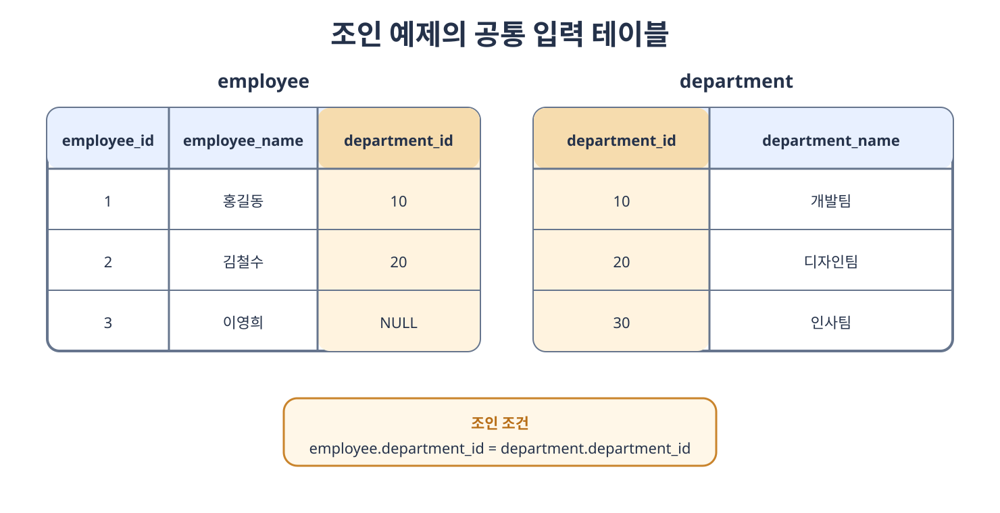

# 조인의 종류

**조인**(**Join**)은 둘 이상의 테이블을 공통된 조건으로 연결하여 하나의 결과 집합으로 만드는 연산이다. 테이블을 실제로 합쳐 저장하는 것이 아니라 쿼리를 실행하는 동안 조건에 맞는 행을 결합한다.

조인의 종류는 결과에 어떤 행을 포함할지를 결정하는 논리적인 개념이다. 실제로 행을 찾고 결합하는 중첩 루프 조인, 정렬 병합 조인, 해시 조인은 4.7절에서 다루는 물리적인 처리 방식이다. `INNER JOIN`을 작성했다고 해서 특정 조인 알고리즘으로만 실행되는 것은 아니다.

### SQLD와 함께 알아둘 조인 범위

SQLD의 `SQL 기본 및 활용`과 `SQL 최적화 기본 원리`를 학습할 때는 네 가지 조인 결과뿐 아니라 다음 개념을 함께 이해하는 것이 좋다.

- 등가 조인과 비등가 조인
- ANSI 표준의 `ON`, `USING`, `NATURAL JOIN`
- 내부 조인과 외부 조인
- 교차 조인과 카테시안 곱
- 셀프 조인과 세 개 이상 테이블의 조인
- Oracle의 구식 외부 조인 연산자 `(+)`
- 조인 조건과 일반 필터 조건의 차이
- 논리적인 조인과 실제 조인 알고리즘의 차이

### 예제에서 사용할 테이블

다음 두 테이블을 모든 기본 예제에서 공통으로 사용한다.

`employee`

| employee_id | employee_name | department_id |
| ---: | --- | ---: |
| 1 | 홍길동 | 10 |
| 2 | 김철수 | 20 |
| 3 | 이영희 | `NULL` |

`department`

| department_id | department_name |
| ---: | --- |
| 10 | 개발팀 |
| 20 | 디자인팀 |
| 30 | 인사팀 |

`employee.department_id`와 `department.department_id`가 같은 행을 연결한다. 이영희는 소속 부서가 없고 인사팀에는 소속 사원이 없는 상태다.



### 조인 조건의 종류

조인 조건은 두 테이블의 행이 서로 연결될 수 있는지를 판단한다.

- **등가 조인**(**Equi Join**)은 `=` 연산자로 값이 같은 행을 연결한다. 기본키와 외래키를 연결할 때 가장 흔하게 사용한다.
- **비등가 조인**(**Non Equi Join**)은 `<`, `>`, `BETWEEN`처럼 `=` 이외의 연산자로 행을 연결한다.
- 조인 조건을 생략하면 양쪽의 모든 행 조합이 만들어지는 카테시안 곱이 발생한다.

등가 조인의 예시는 다음과 같다.

```sql
SELECT e.employee_name, d.department_name
FROM employee AS e
JOIN department AS d
    ON e.department_id = d.department_id;
```

급여가 어느 급여 등급의 범위에 포함되는지를 연결하는 다음 조건은 비등가 조인이다.

```sql
SELECT e.employee_name, e.salary, g.grade
FROM employee AS e
JOIN salary_grade AS g
    ON e.salary BETWEEN g.min_salary AND g.max_salary;
```

비등가 조인은 반드시 느린 조인이라는 의미가 아니다. 실제 성능은 조건, 인덱스, 데이터 양과 DBMS가 선택한 실행 계획에 따라 달라진다.

### ANSI 표준 조인 문법

과거에는 `FROM`에 테이블을 쉼표로 나열하고 `WHERE`에 조인 조건을 작성하는 방식을 많이 사용했다.

```sql
SELECT e.employee_name, d.department_name
FROM employee e, department d
WHERE e.department_id = d.department_id;
```

ANSI 표준 조인 문법은 연결할 테이블과 조인 조건을 `JOIN ... ON`으로 명확히 분리한다.

```sql
SELECT e.employee_name, d.department_name
FROM employee AS e
JOIN department AS d
    ON e.department_id = d.department_id;
```

두 쿼리는 내부 등가 조인에서 같은 결과를 만들 수 있다. 다만 ANSI 문법은 조인 조건과 결과를 제한하는 일반 조건을 구분하기 쉽고 외부 조인을 일관된 형태로 표현할 수 있으므로 새로운 SQL에서는 ANSI 문법을 사용하는 것이 좋다.

#### ON

`ON`은 두 입력의 행을 연결할 조건을 직접 작성한다.

- 이름이 다른 필드도 연결할 수 있다.
- 여러 조건을 `AND`와 `OR`로 조합할 수 있다.
- 등가 조건뿐 아니라 비등가 조건도 작성할 수 있다.
- `SELECT *`를 사용하면 양쪽의 조인 필드가 모두 결과에 나타날 수 있다.

```sql
FROM employee AS e
JOIN department AS d
    ON e.department_id = d.department_id
   AND d.department_name = '개발팀'
```

#### USING

`USING`은 양쪽 테이블에서 이름이 같은 필드를 등가 조건으로 연결할 때 사용할 수 있다.

```sql
SELECT employee_name, department_name
FROM employee
JOIN department
    USING (department_id);
```

이는 행을 연결하는 관점에서 다음 조건과 같다.

```sql
ON employee.department_id = department.department_id
```

`USING (department_id)`을 사용하면 결과에서 공통 필드인 `department_id`가 하나로 합쳐진다. 표준 SQL에서는 이렇게 합쳐진 필드에 테이블 이름을 붙여 참조하지 않는다. DBMS마다 세부적인 필드 표시 순서와 한정자 허용 여부가 다를 수 있다.

#### NATURAL JOIN

`NATURAL JOIN`은 두 테이블에서 이름이 같은 모든 필드를 자동으로 찾아 `USING` 조건으로 사용한다.

```sql
SELECT employee_name, department_name
FROM employee
NATURAL JOIN department;
```

현재 예제에서는 이름이 같은 필드가 `department_id`뿐이므로 이를 기준으로 연결한다. 그러나 나중에 두 테이블에 이름이 같은 다른 필드가 추가되면 그 필드까지 조인 조건에 자동으로 포함되어 결과가 달라질 수 있다. 조인 조건이 SQL에 드러나지 않으므로 실무에서는 `ON`이나 명시적인 `USING`을 사용하는 편이 안전하다.

두 테이블에 이름이 같은 필드가 하나도 없다면 표준 SQL의 `NATURAL JOIN`은 연결 조건이 없는 것과 같아 카테시안 곱을 만들 수 있다. 테이블 구조의 변경만으로 조인 조건이 바뀔 수 있다는 점이 가장 큰 주의사항이다.

| 문법 | 조인 조건 | 결과의 공통 필드 |
| --- | --- | --- |
| `ON` | 조건을 직접 작성한다. | 양쪽 필드가 각각 남을 수 있다. |
| `USING` | 지정한 같은 이름의 필드를 비교한다. | 지정한 공통 필드가 하나로 합쳐진다. |
| `NATURAL JOIN` | 이름이 같은 모든 필드를 자동으로 비교한다. | 자동 선택된 공통 필드가 하나로 합쳐진다. |

## 4.6.1 내부 조인

**내부 조인**(**Inner Join**)은 조인 조건을 만족하는 행만 결과에 포함한다. 어느 한쪽에만 존재하는 행은 제외된다.

```sql
SELECT e.employee_id,
       e.employee_name,
       d.department_name
FROM employee AS e
INNER JOIN department AS d
    ON e.department_id = d.department_id;
```

| employee_id | employee_name | department_name |
| ---: | --- | --- |
| 1 | 홍길동 | 개발팀 |
| 2 | 김철수 | 디자인팀 |

이영희는 연결할 부서가 없고 인사팀은 연결할 사원이 없으므로 결과에서 제외된다. SQL에서 `JOIN`만 작성하면 일반적으로 `INNER JOIN`을 의미한다.

### 내부 조인의 조건과 결과 행 수

내부 조인에서는 `ON`의 조인 조건과 `WHERE`의 필터 조건이 최종 결과에 모두 적용된다. 옵티마이저가 의미를 유지하는 범위에서 조건의 처리 순서를 바꿀 수 있으므로 다음 두 쿼리는 같은 결과를 만들 수 있다.

```sql
FROM employee AS e
JOIN department AS d
    ON e.department_id = d.department_id
WHERE d.department_name = '개발팀'
```

```sql
FROM employee AS e
JOIN department AS d
    ON e.department_id = d.department_id
   AND d.department_name = '개발팀'
```

조인 결과 행 수가 항상 원본 테이블 중 작은 쪽의 행 수와 같은 것은 아니다.

- 일대일 관계에서는 한 행이 최대 한 행과 연결된다.
- 일대다 관계에서는 한쪽의 한 행이 다른 쪽의 여러 행과 연결되어 결과 행이 늘어난다.
- 다대다 관계에서는 조건을 만족하는 양쪽 행의 모든 조합이 만들어진다.
- 조인 키가 유일하지 않으면 예상보다 많은 중복 행이 나타날 수 있다.

필요한 관계가 일대일이라면 기본키나 `UNIQUE` 제약 조건으로 조인 키의 유일성을 데이터베이스에 보장하는 것이 좋다. 결과가 많다는 이유만으로 `DISTINCT`를 추가하면 잘못된 조인 조건을 숨길 수 있다.

## 4.6.2 왼쪽 조인

**왼쪽 조인**(**Left Join**) 또는 **왼쪽 외부 조인**(**Left Outer Join**)은 왼쪽 테이블의 모든 행을 결과에 포함하고, 오른쪽 테이블에서는 조건에 맞는 행만 연결한다.

왼쪽 테이블을 **보존 테이블**(**Preserved Table**)이라고 볼 수 있다. 오른쪽에서 일치하는 행이 없으면 오른쪽 테이블에서 가져온 필드를 `NULL`로 채운다.

```sql
SELECT e.employee_id,
       e.employee_name,
       d.department_name
FROM employee AS e
LEFT OUTER JOIN department AS d
    ON e.department_id = d.department_id;
```

`OUTER`는 생략할 수 있으므로 `LEFT JOIN`과 `LEFT OUTER JOIN`은 같은 의미다.

| employee_id | employee_name | department_name |
| ---: | --- | --- |
| 1 | 홍길동 | 개발팀 |
| 2 | 김철수 | 디자인팀 |
| 3 | 이영희 | `NULL` |

왼쪽 테이블인 `employee`의 모든 행이 유지되므로 소속 부서가 없는 이영희도 결과에 포함된다.

### ON과 WHERE의 차이

외부 조인에서는 `ON`과 `WHERE`의 위치에 따라 결과가 달라질 수 있다.

다음 쿼리는 모든 사원을 먼저 보존한 뒤 오른쪽에서 개발팀인 행만 연결한다. 김철수와 이영희도 결과에 남지만 부서 필드는 `NULL`이 된다.

```sql
SELECT e.employee_name, d.department_name
FROM employee AS e
LEFT JOIN department AS d
    ON e.department_id = d.department_id
   AND d.department_name = '개발팀';
```

반면 다음 쿼리는 왼쪽 조인을 만든 뒤 `WHERE`에서 개발팀이 아닌 결과 행을 제거한다. 연결되지 않아 `NULL`이 된 행도 조건을 만족하지 못하므로 홍길동만 남는다.

```sql
SELECT e.employee_name, d.department_name
FROM employee AS e
LEFT JOIN department AS d
    ON e.department_id = d.department_id
WHERE d.department_name = '개발팀';
```

정리하면 `ON`은 어떤 행을 서로 연결할지 판단하고, `WHERE`는 조인이 끝난 결과에서 어떤 행을 남길지 판단한다. 내부 조인에서는 두 위치가 같은 결과를 만들 수 있지만 외부 조인에서는 보존해야 할 행의 존재 때문에 결과가 달라질 수 있다.

### 연결되지 않은 행 찾기

왼쪽 조인 후 오른쪽의 `NOT NULL` 필드가 `NULL`인 행만 선택하면 오른쪽에 일치하는 행이 없는 왼쪽 행을 찾을 수 있다. 이를 안티 조인 패턴으로 활용할 수 있다.

```sql
SELECT e.employee_id, e.employee_name
FROM employee AS e
LEFT JOIN department AS d
    ON e.department_id = d.department_id
WHERE d.department_id IS NULL;
```

예제에서는 소속 부서가 없는 이영희가 반환된다. 검사할 필드는 원래부터 `NULL`일 수 있는 일반 필드보다 기본키처럼 `NOT NULL`이 보장된 필드를 사용하는 것이 안전하다.

## 4.6.3 오른쪽 조인

**오른쪽 조인**(**Right Join**) 또는 **오른쪽 외부 조인**(**Right Outer Join**)은 오른쪽 테이블의 모든 행을 결과에 포함하고, 왼쪽 테이블에서는 조건에 맞는 행만 연결한다. 왼쪽에서 일치하는 행이 없으면 왼쪽 테이블의 필드를 `NULL`로 채운다.

```sql
SELECT e.employee_id,
       e.employee_name,
       d.department_name
FROM employee AS e
RIGHT JOIN department AS d
    ON e.department_id = d.department_id;
```

| employee_id | employee_name | department_name |
| ---: | --- | --- |
| 1 | 홍길동 | 개발팀 |
| 2 | 김철수 | 디자인팀 |
| `NULL` | `NULL` | 인사팀 |

오른쪽 테이블인 `department`의 모든 행이 유지되므로 소속 사원이 없는 인사팀도 결과에 포함된다.

오른쪽 조인은 테이블의 위치를 바꾼 왼쪽 조인으로 표현할 수 있다.

```sql
FROM department AS d
LEFT JOIN employee AS e
    ON e.department_id = d.department_id
```

두 표현의 논리적인 결과는 같다. 긴 쿼리에서 보존할 테이블을 왼쪽에 배치하면 읽기 쉬운 경우가 많고 일부 DBMS의 공식 문서도 이식성을 위해 왼쪽 조인을 권장한다.

## 4.6.4 합집합 조인

교재에서 말하는 **합집합 조인**(**Full Outer Join**)은 일반적으로 **완전 외부 조인**이라고도 부른다. 양쪽 테이블에서 조건을 만족하는 행은 연결하고, 어느 한쪽에만 존재하는 행도 모두 결과에 포함한다. 연결되는 상대가 없는 필드는 `NULL`로 채운다.

```sql
SELECT e.employee_id,
       e.employee_name,
       d.department_name
FROM employee AS e
FULL OUTER JOIN department AS d
    ON e.department_id = d.department_id;
```

| employee_id | employee_name | department_name |
| ---: | --- | --- |
| 1 | 홍길동 | 개발팀 |
| 2 | 김철수 | 디자인팀 |
| 3 | 이영희 | `NULL` |
| `NULL` | `NULL` | 인사팀 |

MySQL은 `FULL OUTER JOIN` 문법을 직접 지원하지 않는다. 왼쪽 조인의 전체 결과에 오른쪽에만 존재하는 행을 `UNION ALL`로 추가하여 같은 결과를 만들 수 있다.

```sql
SELECT e.employee_id,
       e.employee_name,
       d.department_name
FROM employee AS e
LEFT JOIN department AS d
    ON e.department_id = d.department_id

UNION ALL

SELECT e.employee_id,
       e.employee_name,
       d.department_name
FROM employee AS e
RIGHT JOIN department AS d
    ON e.department_id = d.department_id
WHERE e.employee_id IS NULL;
```

두 번째 쿼리에서 오른쪽에만 존재하는 행만 선택하므로 첫 번째 쿼리에 이미 포함된 일치 행이 중복되지 않는다. 무조건 왼쪽 조인과 오른쪽 조인의 전체 결과를 `UNION ALL`하면 일치 행이 두 번 나타난다.

### FULL OUTER JOIN과 집합 연산자의 차이

`FULL OUTER JOIN`과 `UNION`은 같은 연산이 아니다.

| 구분 | 조인 | 집합 연산자 |
| --- | --- | --- |
| 결합 방향 | 조건에 맞는 두 행의 열을 가로로 결합한다. | 두 조회 결과의 행을 세로로 결합한다. |
| 필드 조건 | 양쪽 필드의 개수가 달라도 된다. | 양쪽 조회의 필드 개수와 데이터 타입이 호환되어야 한다. |
| 중복 처리 | 조건에 맞는 행의 조합을 유지한다. | `UNION`은 중복을 제거하고 `UNION ALL`은 유지한다. |
| 대표 문법 | `JOIN ... ON` | `UNION`, `UNION ALL`, `INTERSECT`, `EXCEPT` 또는 `MINUS` |

`INTERSECT`는 양쪽 조회에 공통으로 존재하는 행을, `EXCEPT`는 첫 번째 조회에는 있지만 두 번째 조회에는 없는 행을 반환한다. Oracle에서는 `EXCEPT`에 해당하는 연산자로 `MINUS`를 사용한다. DBMS마다 지원하는 집합 연산자와 문법이 다를 수 있다.

### 교차 조인

**교차 조인**(**Cross Join**)은 조인 조건 없이 양쪽 테이블의 가능한 모든 행 조합을 반환한다. 이를 **카테시안 곱**(**Cartesian Product**)이라고 한다.

```sql
SELECT e.employee_name, d.department_name
FROM employee AS e
CROSS JOIN department AS d;
```

예제의 `employee`가 3행이고 `department`가 3행이므로 결과는 `3 × 3 = 9`행이다. 일반적으로 왼쪽 입력이 `N`행이고 오른쪽 입력이 `M`행이면 결과는 `N × M`행이다.

교차 조인은 색상과 크기의 모든 상품 옵션 조합처럼 실제로 모든 조합이 필요할 때 사용할 수 있다. 그러나 조인 조건을 빠뜨려 의도하지 않은 카테시안 곱이 발생하면 결과가 급격히 커질 수 있다.

쉼표로 테이블만 나열하고 연결 조건을 작성하지 않아도 카테시안 곱이 만들어진다.

```sql
SELECT *
FROM employee e, department d;
```

의도를 명확하게 표현하려면 모든 조합이 필요한 경우에는 `CROSS JOIN`, 행을 연결하려는 경우에는 `JOIN ... ON`을 사용하는 것이 좋다.

### 셀프 조인

**셀프 조인**(**Self Join**)은 하나의 테이블을 서로 다른 두 테이블처럼 사용하여 자기 자신과 조인하는 방식이다. 별도의 `SELF JOIN` 키워드는 없으며 같은 테이블에 서로 다른 별칭을 붙인다.

사원 테이블에 상사를 가리키는 `manager_id`가 있다고 가정하면 다음과 같이 사원과 상사의 이름을 함께 조회할 수 있다.

```sql
SELECT employee.employee_name AS employee_name,
       manager.employee_name AS manager_name
FROM employee AS employee
LEFT JOIN employee AS manager
    ON employee.manager_id = manager.employee_id;
```

두 별칭은 같은 물리적인 테이블을 가리키지만 쿼리 안에서는 서로 다른 역할을 한다. 셀프 조인은 조직도, 카테고리의 상위·하위 관계, 이전·다음 레코드 비교 등에 사용할 수 있다.

### 세 개 이상의 테이블 조인

세 개 이상의 테이블도 앞에서 만든 조인 결과에 다음 테이블을 차례로 연결한다.

```sql
SELECT e.employee_name,
       d.department_name,
       l.location_name
FROM employee AS e
JOIN department AS d
    ON e.department_id = d.department_id
JOIN location AS l
    ON d.location_id = l.location_id;
```

각 `ON`에는 해당 단계에서 사용할 수 있는 테이블 사이의 연결 조건을 작성한다. 내부 조인만 있는 경우 옵티마이저가 조인 순서를 바꾸어도 같은 결과를 만들 수 있지만, 외부 조인은 어느 테이블의 행을 보존하는지가 중요하므로 괄호와 조인 순서가 논리적인 결과에 영향을 줄 수 있다.

### Oracle의 구식 외부 조인 표기

SQLD 학습 자료에서는 Oracle의 구식 외부 조인 연산자 `(+)`를 접할 수 있다. `(+)`는 일치하는 행이 없어도 `NULL` 행을 만들어야 하는 선택적인 테이블 쪽에 작성한다.

다음은 `employee`의 모든 행을 보존하는 왼쪽 외부 조인이다.

```sql
SELECT e.employee_name, d.department_name
FROM employee e, department d
WHERE e.department_id = d.department_id(+);
```

다음은 `department`의 모든 행을 보존하는 오른쪽 외부 조인이다.

```sql
SELECT e.employee_name, d.department_name
FROM employee e, department d
WHERE e.department_id(+) = d.department_id;
```

| 보존할 테이블 | `(+)`를 작성하는 위치 | ANSI 표준 표현 |
| --- | --- | --- |
| 왼쪽 테이블 | 오른쪽 테이블의 필드 | `LEFT OUTER JOIN` |
| 오른쪽 테이블 | 왼쪽 테이블의 필드 | `RIGHT OUTER JOIN` |

`(+)`는 Oracle 전용의 오래된 문법이며 표현과 조합에 여러 제약이 있다. 새 SQL에서는 의미가 분명하고 다른 DBMS로 옮기기 쉬운 ANSI 표준 외부 조인 문법을 사용하는 것이 좋다.

- 하나의 조건 양쪽에 `(+)`를 동시에 작성할 수 없다.
- 같은 선택적 테이블을 여러 조건으로 연결한다면 필요한 조건에 `(+)`를 일관되게 적용해야 한다. 그렇지 않으면 일반 조건이 `NULL`로 확장된 행을 제거할 수 있다.
- 구식 `(+)` 문법만으로 완전 외부 조인을 한 번에 표현할 수 없다.
- `(+)`와 ANSI `JOIN` 문법을 같은 조인 표현 안에서 혼합하지 않는 것이 좋다.

### NULL과 조인

SQL에서 `NULL`은 값이 없거나 알 수 없음을 나타내므로 `NULL = NULL`의 결과는 참이 아니라 알 수 없음이다. 따라서 일반적인 등가 조인에서는 두 조인 필드가 모두 `NULL`이어도 서로 연결되지 않는다.

`NULL`을 같은 값처럼 연결해야 하는 특별한 요구사항이 있다면 DBMS가 지원하는 `IS NOT DISTINCT FROM` 같은 연산자나 명시적인 `NULL` 처리 조건을 검토해야 한다. 무조건 `COALESCE`로 임의의 값을 대입하면 실제 데이터에 그 값이 존재할 때 잘못된 행이 연결될 수 있다.

### 조인 종류 비교

| 종류 | 조건과 일치하는 행 | 왼쪽에만 있는 행 | 오른쪽에만 있는 행 |
| --- | --- | --- | --- |
| `INNER JOIN` | 포함 | 제외 | 제외 |
| `LEFT JOIN` | 포함 | 포함 | 제외 |
| `RIGHT JOIN` | 포함 | 제외 | 포함 |
| `FULL OUTER JOIN` | 포함 | 포함 | 포함 |
| `CROSS JOIN` | 조건 없이 모든 조합 | 해당 없음 | 해당 없음 |

조인을 작성할 때는 다음 순서로 확인하면 결과를 이해하기 쉽다.

1. 어느 필드를 조인 조건으로 사용할지 확인한다.
2. 일치하지 않는 행도 보존해야 하는지 확인한다.
3. 보존해야 한다면 왼쪽과 오른쪽 중 어느 테이블인지 확인한다.
4. 조인 키가 유일한지, 한 행과 여러 행이 연결될 수 있는지 확인한다.
5. 외부 조인의 오른쪽 또는 왼쪽 조건이 `WHERE`에서 보존 행을 제거하지 않는지 확인한다.
