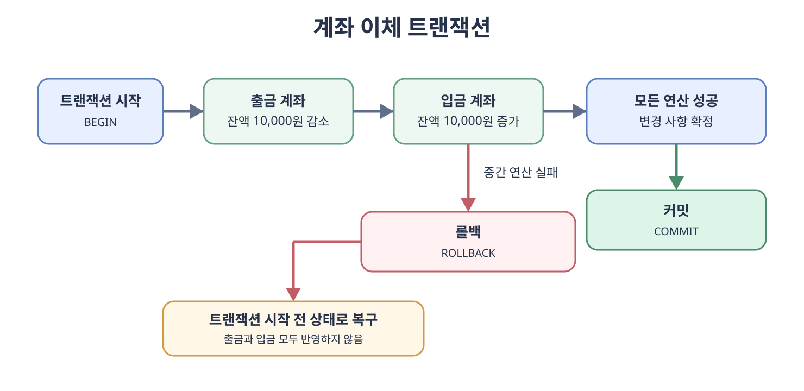
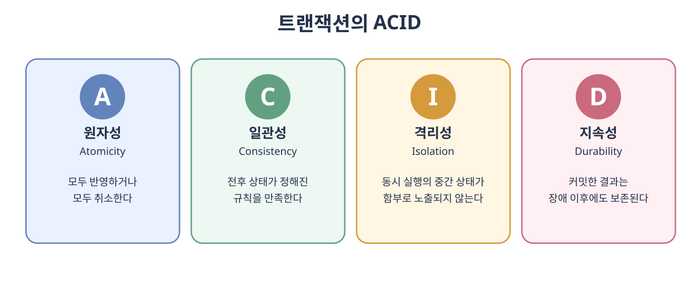
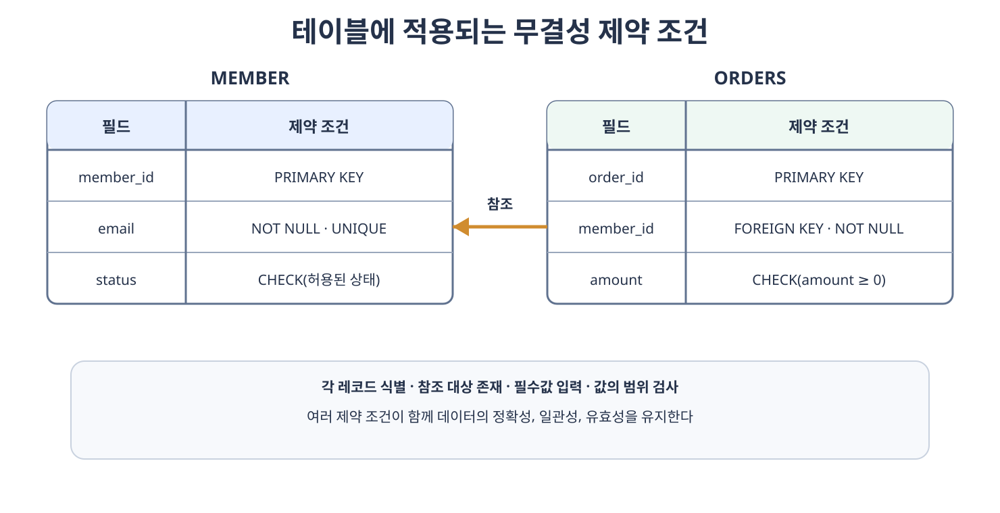

# 트랜잭션과 무결성

데이터베이스에는 여러 사용자가 동시에 데이터를 읽고 변경한다. 이때 일부 작업만 반영되거나 서로의 작업이 뒤섞이면 저장된 값을 신뢰할 수 없다. **트랜잭션**(**Transaction**)은 여러 데이터베이스 연산을 하나의 논리적인 작업 단위로 묶고, **무결성**(**Integrity**)은 데이터가 정해진 규칙에 맞게 정확하고 일관된 상태를 유지하도록 한다.

예를 들어 계좌 이체는 출금 계좌의 잔액을 줄이는 연산과 입금 계좌의 잔액을 늘리는 연산이 함께 성공하거나 함께 취소되어야 한다. 트랜잭션은 작업의 경계를 만들고, 무결성 제약 조건은 잔액이나 계좌 정보가 유효한 상태인지 검사한다.

## 4.3.1 트랜잭션

트랜잭션은 데이터베이스에서 하나의 논리적인 기능을 수행하기 위한 작업 단위다. 하나의 트랜잭션은 하나 이상의 `SELECT`, `INSERT`, `UPDATE`, `DELETE` 문으로 구성될 수 있다.



트랜잭션을 시작한 뒤 모든 연산이 성공하면 **커밋**(**Commit**)하여 변경 사항을 확정한다. 중간에 오류가 발생하면 **롤백**(**Rollback**)하여 해당 트랜잭션이 시작되기 전 상태로 되돌린다.

```sql
START TRANSACTION;

UPDATE account
SET balance = balance - 10000
WHERE account_id = 1;

UPDATE account
SET balance = balance + 10000
WHERE account_id = 2;

COMMIT;
```

두 번째 `UPDATE`가 실패했다면 `COMMIT`하지 않고 `ROLLBACK`해야 한다. 트랜잭션을 사용하지 않으면 출금만 반영되고 입금은 반영되지 않는 불완전한 상태가 남을 수 있다.

### ACID

신뢰할 수 있는 트랜잭션이 갖추어야 할 네 가지 성질을 **ACID**(**Atomicity, Consistency, Isolation, Durability**)라고 한다.



#### 원자성

**원자성**(**Atomicity**)은 트랜잭션에 포함된 연산이 모두 수행되거나 하나도 수행되지 않아야 한다는 성질이다. 계좌 이체에서 출금과 입금 중 하나만 반영되어서는 안 된다. DBMS는 실행 취소 로그와 롤백 등의 기능으로 원자성을 지원한다.

애플리케이션에서 데이터베이스 연산과 외부 API 호출을 하나의 트랜잭션처럼 묶을 때는 주의해야 한다. 데이터베이스 롤백만으로 이미 전송한 메시지나 외부 결제를 되돌릴 수 없기 때문이다. 이런 작업은 보상 트랜잭션이나 트랜잭셔널 아웃박스와 같은 별도의 일관성 전략이 필요하다.

#### 일관성

**일관성**(**Consistency**)은 트랜잭션 전후에 데이터베이스가 정의된 규칙을 만족하는 유효한 상태여야 한다는 성질이다. 기본키, 외래키, `CHECK` 제약 조건뿐만 아니라 잔액은 음수가 될 수 없다는 업무 규칙도 포함된다.

일관성은 DBMS만으로 자동 보장되는 성질이 아니다. 데이터베이스의 제약 조건과 올바른 트랜잭션 로직이 함께 갖추어져야 한다.

#### 격리성

**격리성**(**Isolation**)은 동시에 실행되는 트랜잭션이 서로의 중간 상태를 함부로 관찰하거나 방해하지 않도록 하는 성질이다. 교재에서는 독립성이라고도 표현하지만 데이터베이스에서는 격리성 또는 고립성이라는 용어를 주로 사용한다.

모든 트랜잭션을 완전히 직렬로 실행하면 강한 격리성을 얻을 수 있지만 동시 처리 성능이 낮아질 수 있다. DBMS는 정확성과 동시성 사이의 균형을 선택할 수 있도록 여러 **트랜잭션 격리 수준**(**Transaction Isolation Level**)을 제공한다.

##### 동시 실행에서 발생할 수 있는 현상

- **더티 리드**(**Dirty Read**)는 다른 트랜잭션이 아직 커밋하지 않은 값을 읽는 현상이다. 그 트랜잭션이 롤백하면 실제로 존재하지 않았던 값을 읽은 셈이 된다.
- **반복 불가능 읽기**(**Non-repeatable Read**)는 한 트랜잭션이 같은 행을 두 번 조회하는 사이 다른 트랜잭션이 그 행을 수정하고 커밋하여 두 조회 결과가 달라지는 현상이다.
- **팬텀 리드**(**Phantom Read**)는 같은 조건의 범위 조회를 다시 수행했을 때 다른 트랜잭션이 추가하거나 삭제한 행 때문에 결과 행의 집합이 달라지는 현상이다.
- **갱신 손실**(**Lost Update**)은 두 트랜잭션이 같은 값을 읽고 각각 수정한 뒤 나중에 저장한 값이 먼저 저장한 값을 덮어쓰는 현상이다. 표준 격리 수준만 선택하는 것으로 항상 방지되는 것은 아니며 잠금이나 낙관적 동시성 제어가 필요할 수 있다.

##### 격리 수준

| 격리 수준 | 커밋하지 않은 값 읽기 | 같은 행의 값 변경 | 조건에 맞는 행 집합 변경 | 특징 |
| --- | --- | --- | --- | --- |
| **커밋되지 않은 읽기**(**Read Uncommitted**) | 허용될 수 있음 | 허용될 수 있음 | 허용될 수 있음 | 격리성이 가장 낮고 동시성이 높다. |
| **커밋된 읽기**(**Read Committed**) | 방지 | 허용될 수 있음 | 허용될 수 있음 | 일반적으로 문장이 시작될 때 커밋된 데이터만 읽는다. |
| **반복 가능한 읽기**(**Repeatable Read**) | 방지 | 방지 | 표준상 허용될 수 있음 | 트랜잭션 동안 읽은 행을 다시 읽어도 같은 값을 보장한다. |
| **직렬화 가능**(**Serializable**) | 방지 | 방지 | 방지 | 직렬 실행과 같은 결과를 보장하는 가장 강한 수준이다. |

표는 SQL 표준이 정의한 현상을 기준으로 정리한 것이다. 실제 보장 범위와 구현 방법은 DBMS마다 다르다. 예를 들어 다중 버전 동시성 제어를 사용하는 DBMS는 잠금만 사용하는 방식과 다른 동작을 보일 수 있으므로 사용하는 DBMS의 문서를 확인해야 한다.

##### 잠금과 MVCC

**잠금**(**Lock**)은 한 트랜잭션이 사용하는 데이터에 대한 다른 트랜잭션의 접근을 제한하여 충돌을 제어하는 방법이다.

- **공유 잠금**(**Shared Lock**)은 데이터를 읽기 위한 잠금이다. 여러 트랜잭션이 동시에 획득할 수 있지만 배타 잠금과는 충돌한다.
- **배타 잠금**(**Exclusive Lock**)은 데이터를 변경하기 위한 잠금이다. 다른 공유 잠금과 배타 잠금을 제한한다.

잠금의 범위와 유지 시간은 DBMS와 실행한 명령, 격리 수준에 따라 달라진다. 잠금을 강하게 적용하면 데이터 충돌은 줄일 수 있지만 다른 트랜잭션의 대기 시간이 늘어나 동시 처리 성능이 낮아질 수 있다.

**다중 버전 동시성 제어**(**Multi-Version Concurrency Control, MVCC**)는 하나의 데이터에 여러 버전을 유지하여 읽기 작업이 자신에게 허용된 시점의 버전을 조회하도록 하는 방식이다. 읽기 작업이 변경 중인 데이터를 기다리는 상황을 줄여 읽기와 쓰기의 동시성을 높일 수 있다.

MVCC가 모든 충돌을 없애는 것은 아니다. 같은 데이터를 동시에 변경하는 쓰기 작업에는 잠금이나 충돌 검사가 여전히 필요하며, 더 이상 사용하지 않는 이전 버전을 정리하는 작업도 필요하다.

##### 교착 상태

**교착 상태**(**Deadlock**)는 둘 이상의 트랜잭션이 서로 상대방이 가진 잠금이 해제되기를 기다려 더 이상 진행하지 못하는 상태다.

```text
트랜잭션 1: 회원 1 잠금 → 주문 1 잠금 대기
트랜잭션 2: 주문 1 잠금 → 회원 1 잠금 대기
```

DBMS는 일반적으로 교착 상태를 감지하면 트랜잭션 중 하나를 중단하고 롤백하여 나머지 트랜잭션이 진행하도록 한다. 애플리케이션은 중단된 트랜잭션을 재시도할 수 있어야 한다. 여러 데이터를 변경할 때 항상 같은 순서로 잠금을 획득하고 트랜잭션을 짧게 유지하면 교착 상태의 가능성을 줄일 수 있다.

#### 지속성

**지속성**(**Durability**)은 커밋된 트랜잭션의 결과가 시스템 장애 이후에도 보존되어야 한다는 성질이다. DBMS는 변경 내용을 데이터 파일에 반영하기 전에 로그에 기록하는 **선행 기록 로그**(**Write-Ahead Log, WAL**), 체크포인트, 복구 기능 등을 사용한다.

- **체크섬**(**Checksum**)은 저장하거나 전송한 데이터가 손상되었는지 검사하기 위한 값이다.
- **저널링**(**Journaling**)은 변경 사항을 실제 데이터에 반영하기 전에 로그로 기록하여 장애 이후 복구할 수 있게 하는 방식이다.
- **체크포인트**(**Checkpoint**)는 복구를 시작할 기준 지점을 만들어 읽어야 할 로그의 범위를 줄인다.

커밋이 성공했다는 응답의 정확한 의미는 DBMS의 설정과 복제 방식에 따라 달라질 수 있다. 메모리의 로그 버퍼까지만 기록했는지, 디스크에 동기화했는지, 복제본까지 전달했는지를 구분해야 한다.

### 트랜잭션 전파

**트랜잭션 전파**(**Transaction Propagation**)는 이미 트랜잭션이 실행 중인 메서드에서 다른 트랜잭션 메서드를 호출할 때 기존 트랜잭션에 참여할지 새로운 트랜잭션을 만들지 정하는 애플리케이션 프레임워크의 정책이다. 이는 데이터베이스 자체의 ACID 속성이 아니라 트랜잭션 경계를 구성하는 방법이다.

예를 들어 Spring의 기본 전파 방식인 `REQUIRED`는 진행 중인 트랜잭션이 있으면 참여하고 없으면 새로 시작한다. `REQUIRES_NEW`는 기존 트랜잭션을 잠시 중단하고 별도의 트랜잭션을 시작한다. 별도 트랜잭션은 바깥 트랜잭션이 롤백되더라도 이미 커밋된 결과가 함께 취소되지 않으므로 의도한 경계인지 확인해야 한다.

## 4.3.2 무결성

데이터 무결성은 데이터의 **정확성**, **일관성**, **유효성**을 유지하는 성질이다. 데이터베이스에 저장된 값이 현실의 대상과 업무 규칙을 올바르게 나타내야 데이터를 신뢰할 수 있다.



| 종류 | 의미 | 구현 예시 |
| --- | --- | --- |
| **개체 무결성**(**Entity Integrity**) | 각 레코드는 기본키로 유일하게 식별되어야 하며 기본키는 `NULL`일 수 없다. | `PRIMARY KEY` |
| **참조 무결성**(**Referential Integrity**) | 외래키 값은 참조 대상 테이블에 존재하는 키이거나 허용된 경우 `NULL`이어야 한다. | `FOREIGN KEY` |
| **고유 무결성**(**Unique Integrity**) | 고유해야 한다고 정한 속성의 값은 중복될 수 없다. | `UNIQUE` |
| **NULL 무결성**(**NULL Integrity**) | 필수로 정한 속성에는 `NULL`을 저장할 수 없다. | `NOT NULL` |
| **도메인 무결성**(**Domain Integrity**) | 속성에는 정의된 타입과 범위에 속하는 값만 저장되어야 한다. | 데이터 타입, `CHECK`, `DEFAULT` |
| **사용자 정의 무결성**(**User-defined Integrity**) | 서비스가 정한 업무 규칙을 만족해야 한다. | 제약 조건, 트리거, 애플리케이션 검증 |

다음 테이블 정의에는 여러 무결성 규칙이 함께 표현되어 있다.

```sql
CREATE TABLE member (
    member_id BIGINT PRIMARY KEY,
    email VARCHAR(255) NOT NULL UNIQUE,
    status VARCHAR(20) NOT NULL
        CHECK (status IN ('ACTIVE', 'DORMANT', 'WITHDRAWN'))
);

CREATE TABLE orders (
    order_id BIGINT PRIMARY KEY,
    member_id BIGINT NOT NULL,
    amount DECIMAL(12, 2) NOT NULL CHECK (amount >= 0),
    FOREIGN KEY (member_id) REFERENCES member(member_id)
);
```

`member.member_id`와 `orders.order_id`는 개체 무결성을, `orders.member_id`는 참조 무결성을 구현한다. 이메일의 `UNIQUE`와 `NOT NULL`은 고유 무결성과 NULL 무결성을, 상태와 주문 금액의 `CHECK`는 도메인 및 업무 규칙을 구현한다.

### 참조 동작

부모 레코드가 수정되거나 삭제될 때 외래키가 어떻게 동작할지도 설계해야 한다.

- `RESTRICT` 또는 `NO ACTION`은 참조하는 자식 레코드가 있으면 부모의 변경이나 삭제를 거부한다.
- `CASCADE`는 부모 키의 변경이나 삭제를 자식 레코드에 전파한다.
- `SET NULL`은 자식의 외래키를 `NULL`로 바꾼다. 해당 필드가 `NULL`을 허용해야 한다.
- `SET DEFAULT`는 자식의 외래키를 기본값으로 바꾼다. 지원 여부는 DBMS마다 다르다.

`CASCADE`는 연관 데이터를 편리하게 정리하지만 예상보다 넓은 범위가 삭제될 수 있다. 데이터의 생명주기와 보존 정책을 기준으로 선택해야 한다.

### 트랜잭션과 무결성의 관계

무결성 제약 조건이 각 값과 관계의 유효성을 검사한다면 트랜잭션은 여러 변경을 하나의 작업 단위로 묶는다. 둘 중 하나만으로는 충분하지 않다.

- 제약 조건이 없으면 트랜잭션이 정상적으로 커밋되어도 업무 규칙에 맞지 않는 값이 저장될 수 있다.
- 트랜잭션이 없으면 각각의 쿼리는 유효해도 여러 쿼리로 이루어진 작업의 일부만 반영될 수 있다.
- 데이터베이스 제약 조건은 모든 접근 경로에 적용되므로 핵심 무결성 규칙은 가능한 한 데이터베이스에도 선언하는 것이 좋다.
