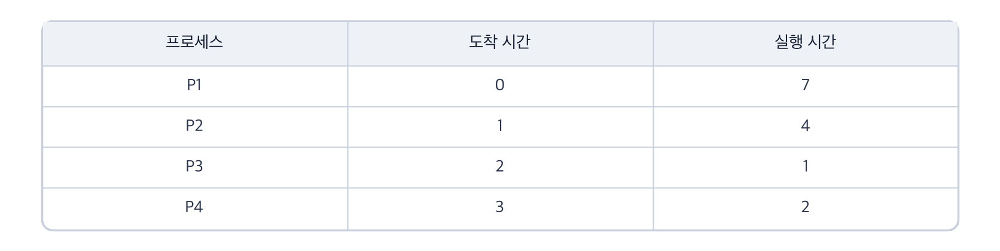
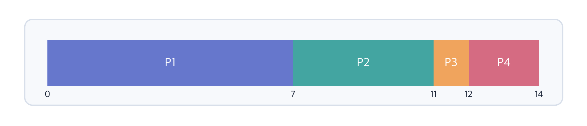
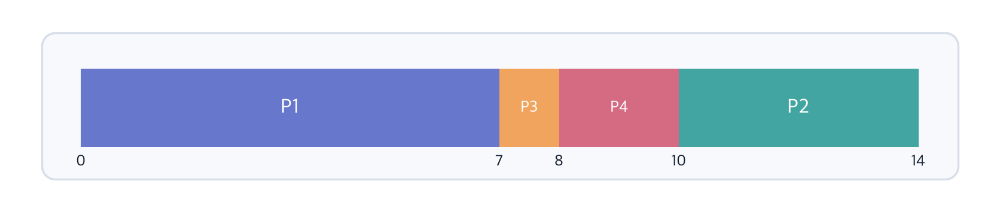
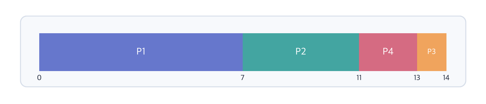
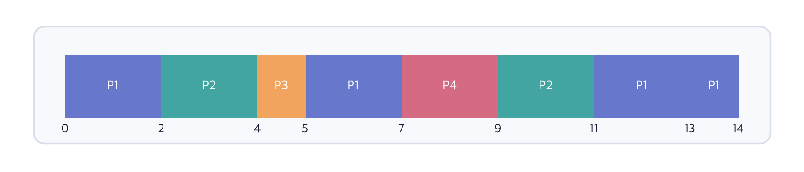
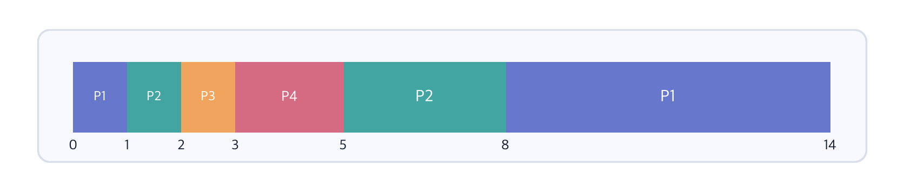
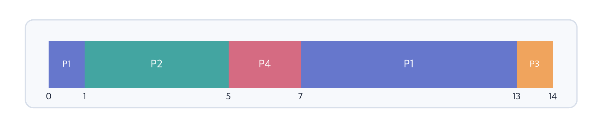
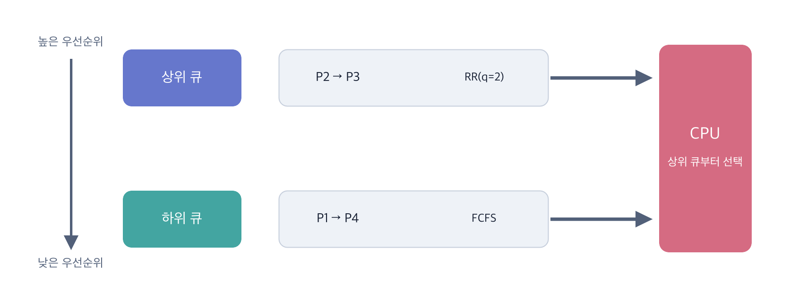
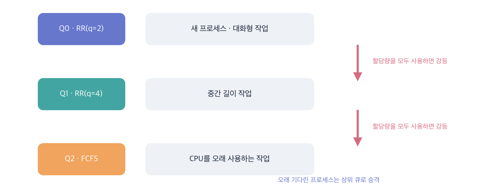

# CPU 스케줄링 알고리즘

여러 프로세스와 스레드가 동시에 실행을 기다리더라도 하나의 CPU 코어는 한 시점에 하나의 실행 흐름만 처리할 수 있다. 운영체제는 준비 상태에 있는 실행 흐름 중 하나를 선택하여 CPU를 할당해야 한다. 이처럼 CPU를 누구에게 언제 할당할지 결정하는 과정을 **CPU 스케줄링**(**CPU Scheduling**)이라고 한다.

CPU 스케줄러는 준비 큐에 있는 실행 가능한 프로세스나 스레드 중 다음 실행 대상을 고른다. 선택된 대상에게 실제로 CPU 제어권을 넘기는 작업은 **디스패치**(**Dispatch**)라고 한다. 실행 대상이 바뀌면 기존 실행 상태를 저장하고 다음 실행 상태를 복원하는 **문맥 교환**(**Context Switch**)이 발생할 수 있다.

교재에서는 이해를 돕기 위해 프로세스를 스케줄링 대상으로 설명한다. 현대 운영체제에서는 커널이 관리하는 스레드가 실제 CPU 스케줄링의 대상이 되는 경우가 많다. 이 문서의 예제도 교재의 표현에 맞추어 실행 대상을 프로세스라고 부른다.

## CPU 버스트와 입출력 버스트

프로세스는 실행되는 동안 CPU만 계속 사용하지 않는다. CPU에서 명령어를 처리하는 구간과 입출력 완료를 기다리는 구간을 반복할 수 있다.

- **CPU 버스트**(**CPU Burst**)는 프로세스가 CPU에서 명령어를 실행하는 구간이다.
- **입출력 버스트**(**I/O Burst**)는 프로세스가 입출력 작업의 완료를 기다리는 구간이다.

CPU를 오래 사용하는 **CPU-bound 프로세스**와 짧게 사용한 뒤 자주 입출력을 요청하는 **I/O-bound 프로세스**가 함께 실행될 수 있다. 스케줄러는 한 종류의 프로세스만 지나치게 유리하지 않도록 CPU 이용률, 응답성, 공정성 등을 함께 고려해야 한다.

## CPU 스케줄링이 발생하는 시점

스케줄러가 실행 대상을 다시 선택할 수 있는 대표적인 시점은 다음과 같다.

- 실행 상태의 프로세스가 입출력을 요청하여 대기 상태로 이동할 때
- 실행 중인 프로세스가 종료될 때
- 대기 상태의 프로세스가 준비 상태로 이동할 때
- 실행 중인 프로세스의 시간 할당량이 끝날 때
- 더 높은 우선순위의 프로세스가 준비 상태가 될 때

앞의 두 경우에는 실행 중인 프로세스가 더 이상 CPU를 사용할 수 없으므로 다른 프로세스를 선택해야 한다. 뒤의 경우에는 현재 프로세스를 계속 실행할지 새 프로세스로 바꿀지 스케줄링 정책에 따라 결정할 수 있다.

## 스케줄링의 평가 기준

모든 상황에서 가장 좋은 단일 스케줄링 알고리즘은 없다. 처리량을 높이는 정책이 대화형 작업의 응답 시간을 나쁘게 만들 수 있으며, 빠른 응답을 위한 잦은 문맥 교환은 CPU 이용률을 떨어뜨릴 수 있다.

| 평가 기준 | 의미 | 일반적인 목표 |
| --- | --- | --- |
| **CPU 이용률**(**CPU Utilization**) | 전체 시간 중 CPU가 실제 작업을 수행한 비율 | 높게 |
| **처리량**(**Throughput**) | 단위 시간 동안 완료한 프로세스의 수 | 많게 |
| **반환 시간**(**Turnaround Time**) | 프로세스가 도착한 시점부터 완료될 때까지 걸린 시간 | 짧게 |
| **대기 시간**(**Waiting Time**) | 준비 큐에서 CPU를 기다린 시간의 합 | 짧게 |
| **응답 시간**(**Response Time**) | 프로세스가 도착한 뒤 처음 CPU를 할당받을 때까지의 시간 | 짧게 |
| **공정성**(**Fairness**) | 특정 프로세스가 CPU 사용 기회를 지나치게 잃지 않는 성질 | 공정하게 |

각 시간은 다음과 같이 계산할 수 있다.

```text
반환 시간 = (프로세스 완료 시간) - (프로세스 도착 시간)
대기 시간 = (반환 시간) - (전체 CPU 실행 시간)
응답 시간 = (프로세스 최초 실행 시간) - (프로세스 도착 시간)
```

**반환 시간**(**Turnaround Time**)과 **응답 시간**(**Response Time**)은 서로 다르다. 응답 시간은 처음 CPU를 얻을 때까지만 측정하지만 반환 시간은 프로세스가 완전히 끝날 때까지 측정한다.

## 예제에서 사용할 프로세스

각 알고리즘의 동작을 비교하기 위해 다음 프로세스를 사용한다. 실행 시간은 예제에서 필요한 전체 CPU 버스트 시간이다.



각 알고리즘의 간트 차트에서 가로 길이는 CPU를 사용한 시간에 비례한다. 막대 안의 이름은 해당 구간에 실행된 프로세스이며, 막대 아래의 숫자는 실행 구간이 바뀌는 시간을 나타낸다.

## 3.4.1 비선점형 방식

**비선점형 스케줄링**(**Non-preemptive Scheduling**)은 한 프로세스에 CPU를 할당하면 그 프로세스가 종료되거나 입출력 대기를 위해 스스로 CPU를 반납할 때까지 강제로 빼앗지 않는 방식이다.

실행 중인 프로세스를 강제로 중단하지 않으므로 선점형 방식보다 문맥 교환 횟수가 적을 수 있고 구현이 단순하다. 반면 긴 프로세스가 CPU를 점유하면 짧거나 중요한 프로세스도 기다려야 하므로 응답성이 떨어질 수 있다.

### FCFS

**FCFS**(**First-Come, First-Served**)는 준비 큐에 먼저 도착한 프로세스부터 실행하는 방식이다. FIFO 방식인 큐로 구현할 수 있어 단순하고 도착 순서라는 명확한 기준을 사용한다.




- 시간 0에는 P1만 도착해 있으므로 P1이 CPU를 얻는다.
- 시간 1, 2, 3에 P2, P3, P4가 도착하지만 비선점형이므로 P1을 중단하지 않는다.
- P1이 시간 7에 끝나면 준비 큐의 도착 순서에 따라 P2, P3, P4를 실행한다.

따라서 전체 실행 순서는 `P1 → P2 → P3 → P4`다.

긴 CPU 버스트를 가진 프로세스가 먼저 도착하면 뒤의 짧은 프로세스들이 오랫동안 기다릴 수 있다. 이처럼 처리 시간이 긴 작업 하나 때문에 여러 짧은 작업이 함께 지연되는 현상을 **호위 효과**(**Convoy Effect**)라고 한다.

### SJF

**SJF**(**Shortest Job First**)는 준비 큐에 있는 프로세스 중 예상 CPU 실행 시간이 가장 짧은 프로세스를 먼저 실행하는 비선점형 방식이다. 모든 프로세스의 도착 시간과 실행 시간을 알고 있다면 평균 대기 시간을 최소화할 수 있다.




- 시간 0에는 P1만 있으므로 P1이 실행된다.
- 더 짧은 P2, P3, P4가 도착해도 비선점형이므로 실행 중인 P1은 유지된다.
- 시간 7에 P1이 끝나면 준비 큐의 실행 시간을 비교한다.
- `P3(1) → P4(2) → P2(4)` 순으로 선택한다.

따라서 전체 실행 순서는 `P1 → P3 → P4 → P2`다.

실제 시스템에서는 미래의 CPU 버스트 길이를 정확히 알기 어렵다. 과거 CPU 버스트를 이용해 다음 길이를 추정할 수 있지만 예상이 항상 맞는 것은 아니다. 짧은 작업이 계속 들어오면 긴 작업은 CPU를 얻지 못하는 **기아 상태**(**Starvation**)에 빠질 수도 있다.

### 비선점형 우선순위 스케줄링

**우선순위 스케줄링**(**Priority Scheduling**)은 준비 큐에서 우선순위가 가장 높은 프로세스를 선택한다. 중요도, 프로세스 종류, 마감 시간 등의 기준으로 우선순위를 정할 수 있다. 여기서는 교재의 분류에 맞추어 비선점형 방식을 먼저 설명하지만 우선순위 스케줄링은 선점형으로도 구현할 수 있다.

이 예제에서는 P1의 우선순위를 3, P2를 1, P3을 4, P4를 2로 설정하며 숫자가 작을수록 높은 우선순위로 가정한다.




- P1 실행 중 우선순위가 더 높은 P2와 P4가 도착해도 비선점형이므로 준비 큐에서 기다린다.
- 시간 7에 P1이 끝나면 숫자가 가장 작은 P2를 선택한다.
- 이후 P4, P3 순서로 실행한다.

따라서 전체 실행 순서는 `P1 → P2 → P4 → P3`이다.

높은 우선순위의 프로세스가 계속 도착하면 우선순위가 낮은 프로세스에 기아 상태가 발생할 수 있다. 이를 완화하기 위해 오래 기다린 프로세스의 우선순위를 점차 높이는 **에이징**(**Aging**)을 적용할 수 있다. 에이징은 별도의 스케줄링 알고리즘이라기보다 우선순위 스케줄링의 기아 문제를 완화하는 기법이다.

## 3.4.2 선점형 방식

**선점형 스케줄링**(**Preemptive Scheduling**)은 실행 중인 프로세스의 의사와 관계없이 운영체제가 CPU를 회수하여 다른 프로세스에 할당할 수 있는 방식이다.

짧거나 중요한 작업에 빠르게 CPU를 할당할 수 있어 대화형 시스템의 응답성을 높이는 데 유리하다. 다만 선점할 때 문맥 교환이 필요하며 너무 잦은 문맥 교환은 레지스터 저장과 복원뿐 아니라 캐시와 TLB 활용에도 영향을 주어 오버헤드를 증가시킨다.

### 라운드 로빈

**라운드 로빈**(**Round Robin, RR**)은 준비 큐의 각 프로세스에 동일한 **시간 할당량**(**Time Quantum**)을 부여하는 선점형 방식이다. 프로세스가 할당 시간 안에 끝나지 않으면 CPU를 회수하고 그 프로세스를 준비 큐의 뒤로 보낸다.

예제에서는 시간 할당량을 2로 설정한다.




각 프로세스는 최대 2만큼 실행한다. 할당량 안에 완료되지 않으면 준비 큐 뒤로 이동하고, 완료되면 큐에서 제거된다.

- 시간 2에 P1은 실행 시간이 5만큼 남아 준비 큐 뒤로 이동한다.
- 시간 4에 P2도 실행 시간이 2만큼 남아 준비 큐 뒤로 이동한다.
- P3은 시간 5에 완료되므로 준비 큐에 다시 들어가지 않는다.

전체 실행 순서는 `P1 → P2 → P3 → P1 → P4 → P2 → P1 → P1`이다.

시간 할당량이 매우 크면 각 프로세스가 대부분 한 번에 끝나므로 FCFS와 비슷해진다. 반대로 너무 작으면 응답 시간은 줄어들 수 있지만 문맥 교환이 지나치게 자주 발생한다. 따라서 응답성과 문맥 교환 비용 사이의 균형이 중요하다.

### SRTF

**SRTF**(**Shortest Remaining Time First**)는 남은 실행 시간이 가장 짧은 프로세스를 선택하는 선점형 방식이다. SJF의 선점형 형태이며, 교재와 일부 자료에서는 **SRF**(**Shortest Remaining First**)라고도 표기한다.




- 시간 1에 P2가 도착한다. `P2의 실행 시간 4 < P1의 남은 시간 6`이므로 P2가 선점한다.
- 시간 2에 P3이 도착한다. `P3의 실행 시간 1 < P2의 남은 시간 3`이므로 P3가 선점한다.
- 시간 3에 P3가 끝나면 P4의 실행 시간 2가 가장 짧으므로 P4를 선택한다.
- 이후 남은 시간이 3인 P2와 남은 시간이 6인 P1을 차례로 실행한다.

SRTF는 평균 대기 시간을 줄이는 데 유리하지만 남은 실행 시간을 알아야 한다는 현실적인 제약이 있다. 짧은 프로세스가 계속 도착하면 긴 프로세스가 반복해서 선점되어 기아 상태에 빠질 수도 있다.

### 선점형 우선순위 스케줄링

선점형 우선순위 스케줄링은 현재 프로세스보다 우선순위가 높은 프로세스가 준비 상태가 되면 현재 CPU를 회수한다.

비선점형 우선순위 스케줄링과의 차이를 비교하기 위해 P1은 3, P2는 1, P3은 4, P4는 2로 동일한 우선순위를 사용한다. 숫자가 작을수록 높은 우선순위로 가정한다.




- 우선순위 3인 P1이 실행 중인 시간 1에 우선순위 1인 P2가 도착한다.
- 숫자가 작을수록 우선순위가 높으므로 P2가 P1을 즉시 선점한다.
- P2보다 높은 우선순위의 프로세스는 도착하지 않으므로 P2는 시간 5에 끝난다.
- 이후 준비 큐에서 P4, P1, P3 순으로 선택한다.

전체 실행 구간은 `P1 → P2 → P4 → P1 → P3`이다.

중요한 작업을 빠르게 처리할 수 있지만 낮은 우선순위 프로세스의 기아 문제는 비선점형 우선순위 스케줄링과 마찬가지로 존재한다. 에이징이나 우선순위 상속 같은 보완 정책이 필요할 수 있다.

### 다단계 큐

**다단계 큐**(**Multilevel Queue, MLQ**)는 준비 큐를 프로세스의 특성이나 우선순위에 따라 여러 개로 나누고, 각 큐에 서로 다른 스케줄링 알고리즘을 적용하는 방식이다.

예를 들어 대화형 프로세스가 들어가는 상위 큐에는 RR을, 배치 프로세스가 들어가는 하위 큐에는 FCFS를 적용할 수 있다. 큐 사이에는 고정 우선순위나 각 큐에 CPU 시간을 나누는 방식 등을 사용할 수 있다. 예제에서는 상위 큐를 우선 실행하는 고정 우선순위 방식을 가정한다.



- P2와 P3은 대화형 프로세스로 분류되어 RR을 사용하는 상위 큐에 들어간다.
- P1과 P4는 배치 프로세스로 분류되어 FCFS를 사용하는 하위 큐에 들어간다.
- 상위 큐가 비어야 하위 큐를 실행하는 고정 우선순위 방식을 가정한다.
- 프로세스는 처음 배정된 큐에 계속 머물며 일반적인 다단계 큐에서는 큐 사이를 이동하지 않는다.

다단계 큐가 항상 하나의 선점 방식으로만 동작하는 것은 아니다. 큐 내부 알고리즘과 큐 사이 정책에 따라 선점 여부가 달라진다. 교재에서는 높은 우선순위 큐가 낮은 우선순위 큐보다 먼저 실행되는 구성을 중심으로 선점형 절에서 소개한다.

## 추가 지식: 다단계 피드백 큐

**다단계 피드백 큐**(**Multilevel Feedback Queue, MLFQ**)는 다단계 큐와 달리 프로세스가 실행 특성에 따라 큐 사이를 이동할 수 있는 방식이다. 짧고 대화형인 작업에는 빠른 응답을 제공하고 CPU를 오래 사용하는 작업은 점차 낮은 우선순위로 이동시킨다.

일반적인 MLFQ는 다음과 같은 규칙을 사용한다.

- 높은 우선순위 큐의 프로세스를 먼저 실행한다.
- 같은 우선순위에서는 RR을 사용할 수 있다.
- 시간 할당량을 모두 사용한 프로세스는 더 낮은 큐로 이동시킨다.
- CPU를 짧게 사용하고 입출력을 요청한 프로세스는 높은 우선순위를 유지할 수 있다.
- 오래 기다린 프로세스의 기아를 막기 위해 일정 시간이 지나면 우선순위를 높인다.



- 새 프로세스는 시간 할당량이 짧은 최상위 큐 Q0에서 시작한다.
- Q0의 시간 할당량을 모두 사용하면 Q1으로 강등된다.
- Q1의 시간 할당량도 모두 사용하면 CPU를 오래 사용하는 작업으로 보고 Q2로 강등한다.
- 짧게 실행한 뒤 입출력을 요청한 프로세스는 높은 우선순위를 유지할 수 있다.
- 낮은 큐에서 오래 기다린 프로세스는 주기적으로 승격하여 기아 상태를 방지한다.

다단계 피드백 큐는 프로세스의 미래 실행 시간을 미리 알지 못해도 관찰된 실행 특성을 이용해 SJF와 비슷한 효과를 추구한다. 하지만 큐의 수, 시간 할당량, 강등과 승격 조건을 적절히 정해야 하므로 정책이 복잡하다.

## 알고리즘 비교

| 알고리즘 | 선점 여부 | 선택 기준 | 장점 | 주요 문제 |
| --- | --- | --- | --- | --- |
| FCFS | 비선점 | 도착 순서 | 단순하고 구현이 쉬움 | 호위 효과, 긴 응답 시간 |
| SJF | 비선점 | 가장 짧은 예상 실행 시간 | 평균 대기 시간을 줄일 수 있음 | 실행 시간 예측, 기아 상태 |
| 비선점형 우선순위 | 비선점 | 가장 높은 우선순위 | 중요한 작업 우선 처리 | 기아 상태 |
| RR | 선점 | 준비 큐 순서와 시간 할당량 | 공정한 실행 기회, 빠른 초기 응답 | 시간 할당량과 문맥 교환 비용 |
| SRTF | 선점 | 가장 짧은 남은 실행 시간 | 평균 대기 시간을 줄일 수 있음 | 실행 시간 예측, 잦은 선점, 기아 상태 |
| 선점형 우선순위 | 선점 | 가장 높은 우선순위 | 중요한 작업에 빠르게 응답 | 기아 상태, 문맥 교환 |
| 다단계 큐 | 정책에 따라 다름 | 고정된 큐와 큐별 정책 | 작업 종류별 정책 적용 | 유연성 부족, 하위 큐 기아 상태 |
| 다단계 피드백 큐 | 일반적으로 선점 | 실행 행동에 따른 동적 우선순위 | 응답성과 처리량의 균형 | 정책 설정이 복잡함 |
