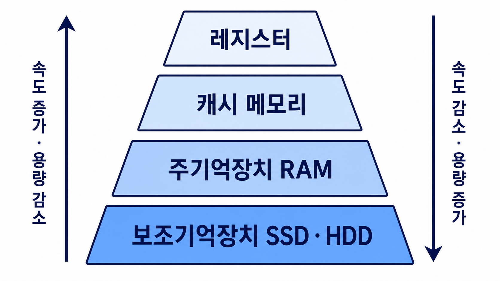
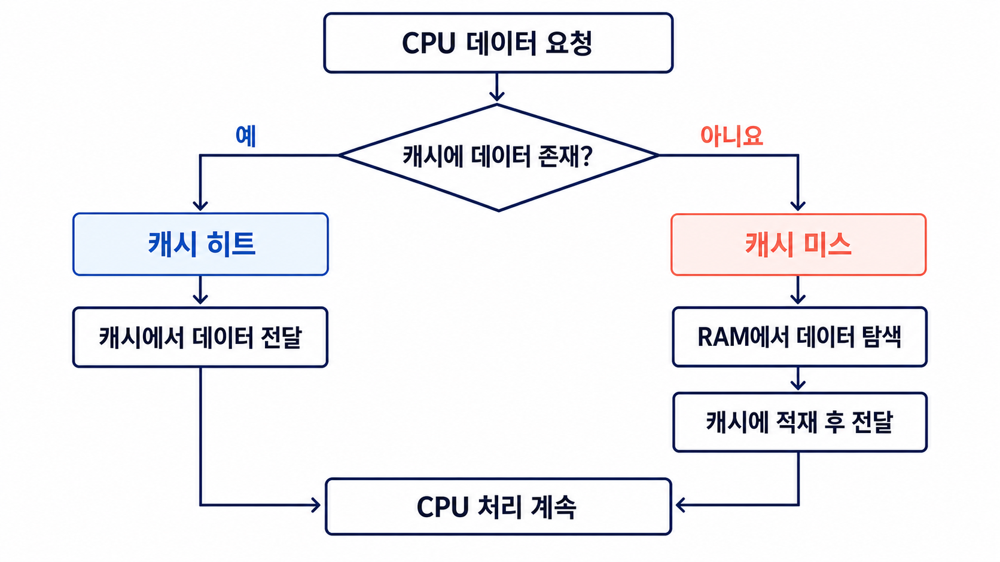
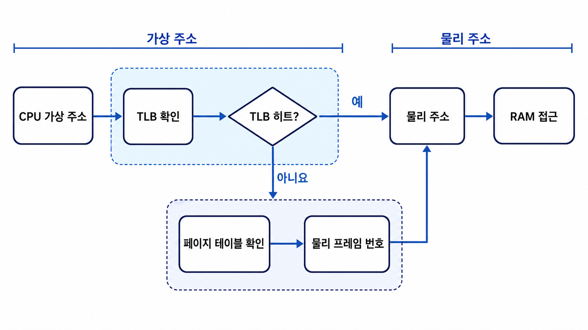
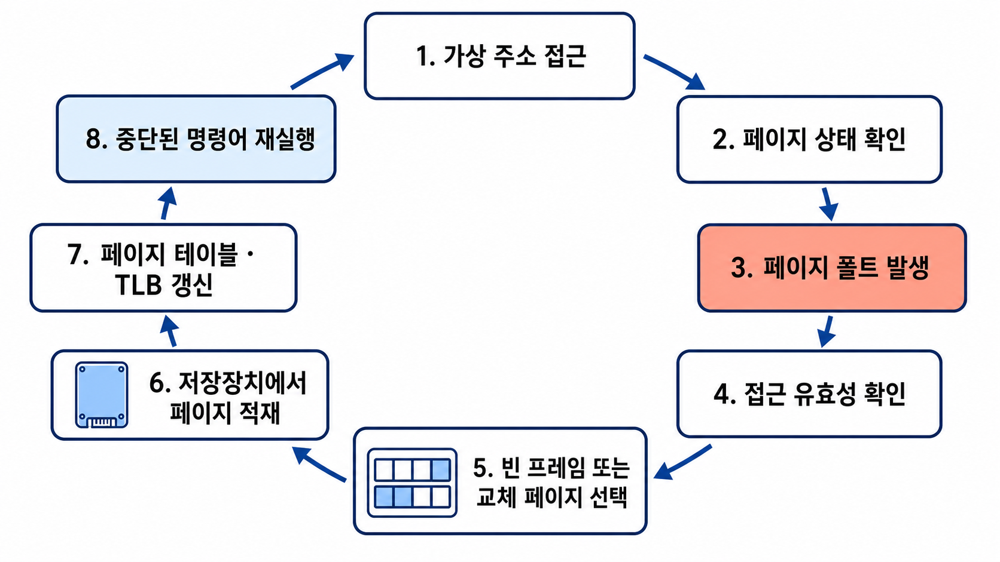
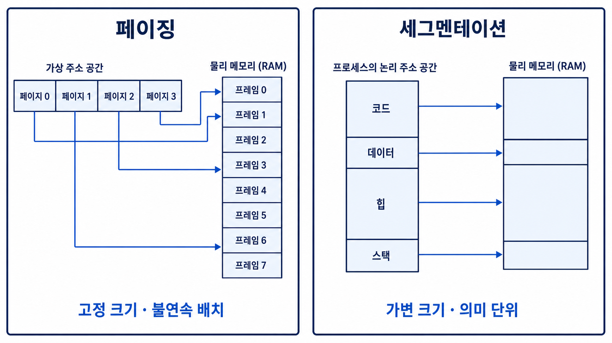

# 메모리

메모리(Memory)는 프로그램의 명령어와 데이터를 저장하는 장치

CPU는 메모리에서 명령어와 데이터를 가져와 연산하고 처리 결과를 다시 메모리에 저장

메모리의 속도와 용량은 컴퓨터의 전체 성능에 직접적인 영향을 미치는 요소

## 3.2.1 메모리 계층

메모리 계층(Memory Hierarchy)은 저장장치를 속도, 용량, 가격에 따라 여러 단계로 구성한 구조

상위 계층으로 이동할수록 속도가 빠르고 용량이 작으며 비트당 가격이 높아지는 특성

하위 계층으로 이동할수록 속도가 느리고 용량이 크며 비트당 가격이 낮아지는 특성



| 계층 | 대표 장치 | 속도 | 용량 | 휘발성 |
| --- | --- | --- | --- | --- |
| 레지스터 | CPU 레지스터 | 가장 빠름 | 가장 작음 | 휘발성 |
| 캐시 메모리 | L1·L2·L3 캐시 | 빠름 | 작음 | 휘발성 |
| 주기억장치 | RAM | 보통 | 보통 | 휘발성 |
| 보조기억장치 | SSD·HDD | 느림 | 큼 | 비휘발성 |

휘발성(Volatile)은 전원이 꺼지면 저장된 데이터가 사라지는 특성

비휘발성(Non-volatile)은 전원이 꺼져도 저장된 데이터가 유지되는 특성

### 레지스터

레지스터(Register)는 CPU 내부에서 명령어, 주소, 데이터, 연산 결과 등을 임시로 저장하는 고속 저장장치

CPU가 연산에 즉시 사용할 값을 보관하므로 가장 빠른 접근 속도를 제공

저장 공간이 매우 작고 CPU의 명령어 집합 구조에 따라 종류와 개수가 달라지는 특성

### 캐시 메모리

캐시 메모리(Cache Memory)는 CPU가 자주 사용할 가능성이 높은 데이터를 RAM에서 미리 복사해 두는 고속 저장장치

CPU와 RAM 사이의 큰 속도 차이로 발생하는 병목 현상을 완화

병목 현상(Bottleneck)은 특정 구성 요소의 처리 속도가 전체 시스템의 성능을 제한하는 현상

일반적인 캐시 계층

| 캐시 | 일반적인 위치와 특징 |
| --- | --- |
| L1 캐시 | CPU 코어와 가장 가까운 캐시, 가장 빠르고 용량이 가장 작음 |
| L2 캐시 | L1보다 느리지만 더 큰 용량 |
| L3 캐시 | 여러 코어가 공유하는 경우가 많으며 L2보다 큰 용량 |

캐시의 정확한 크기와 공유 방식은 CPU 아키텍처에 따라 상이

### 주기억장치

주기억장치(Main Memory)는 실행 중인 프로그램의 명령어와 데이터를 저장하는 공간

일반적으로 RAM(Random Access Memory)을 의미

저장장치의 프로그램을 RAM에 적재한 뒤 CPU가 RAM의 명령어를 실행

적재(Load)는 저장장치에 있는 프로그램이나 데이터를 메모리로 옮기는 과정

프로그램 실행 시 나타나는 로딩 화면은 저장장치나 네트워크의 데이터를 RAM으로 가져오는 과정과 관련

### 보조기억장치

보조기억장치(Secondary Storage)는 프로그램과 데이터를 장기간 보관하는 비휘발성 저장장치

대표적인 장치

- SSD(Solid State Drive)
- HDD(Hard Disk Drive)

RAM보다 속도가 느리지만 더 큰 용량을 낮은 비용으로 제공

### 메모리 계층이 필요한 이유

속도가 빠르고 용량까지 큰 메모리만 사용하면 가장 이상적이지만 높은 비용과 물리적 제약이 발생

작고 빠른 저장장치와 크고 느린 저장장치를 계층적으로 구성하여 속도, 용량, 비용의 균형 확보

```text
CPU가 레지스터의 값으로 명령어 실행
  ↓ 메모리의 데이터가 필요한 경우
캐시에 데이터 요청
  ↓ 없음
RAM 확인
  ↓ 페이지가 RAM에 없는 경우
운영체제가 SSD 또는 HDD에서 페이지 적재
```

레지스터는 CPU가 명령어를 실행할 때 직접 사용하는 공간

캐시, RAM, 보조기억장치는 메모리 접근에 필요한 데이터를 단계적으로 공급

### 지역성의 원리

지역성(Locality)은 프로그램이 최근 사용한 데이터나 그 주변 데이터에 다시 접근하는 경향

캐시는 지역성을 이용하여 앞으로 사용할 가능성이 높은 데이터를 예측

#### 시간 지역성

시간 지역성(Temporal Locality)은 최근 접근한 데이터에 다시 접근할 가능성이 높은 특성

반복문에서 같은 변수나 명령어를 계속 사용하는 경우

```cpp
int main() {
    int sum = 0;

    for (int i = 0; i < 100; ++i) {
        sum += i;
    }

    return 0;
}
```

반복문이 실행되는 동안 `sum`, `i`, 반복문의 명령어에 지속적으로 접근

#### 공간 지역성

공간 지역성(Spatial Locality)은 최근 접근한 메모리 주소와 가까운 주소에 접근할 가능성이 높은 특성

배열의 요소를 앞에서부터 순서대로 읽는 경우

```cpp
#include <iostream>

using namespace std;

int main() {
    int numbers[] = {10, 20, 30, 40, 50};

    for (int number : numbers) {
        cout << number << '\n';
    }

    return 0;
}
```

배열의 데이터가 메모리의 연속된 위치에 배치되는 경우 인접 데이터를 함께 캐시하여 효율적인 접근 가능

### 캐시 라인

캐시 라인(Cache Line)은 RAM과 캐시 사이에서 데이터를 이동하는 기본 단위

CPU가 한 바이트만 요청하더라도 일반적으로 주변 데이터를 포함한 캐시 라인 단위로 가져오는 방식

공간 지역성을 활용하여 이후의 인접 데이터 접근 속도를 향상

캐시 라인의 크기는 CPU 아키텍처에 따라 다르며 현대 시스템에서는 64바이트를 사용하는 경우가 많음

### 캐시 히트와 캐시 미스



캐시 히트(Cache Hit)는 CPU가 요청한 데이터가 캐시에 존재하는 경우

캐시 미스(Cache Miss)는 CPU가 요청한 데이터가 캐시에 없어 RAM 등 하위 계층에서 가져와야 하는 경우

| 구분 | 데이터 위치 | 처리 |
| --- | --- | --- |
| 캐시 히트 | 캐시에 존재 | 캐시에서 바로 전달 |
| 캐시 미스 | 캐시에 없음 | RAM에서 탐색 후 캐시에 적재 |

캐시 적중률(Hit Ratio)은 전체 메모리 접근 중 캐시 히트가 발생한 비율

```text
캐시 적중률 = 캐시 히트 횟수 / 전체 메모리 접근 횟수
```

미스 페널티(Miss Penalty)는 캐시 미스로 인해 하위 메모리에 접근하면서 추가되는 시간

적중률이 높을수록 평균 메모리 접근 시간을 단축

### 캐시 매핑

캐시 매핑(Cache Mapping)은 주 메모리의 블록을 캐시의 어느 위치에 저장할지 결정하는 방법

블록(Block)은 주 메모리에서 캐시로 데이터를 옮길 때 사용하는 일정 크기의 데이터 묶음

캐시의 용량이 RAM보다 훨씬 작으므로 모든 메모리 블록을 동시에 저장할 수 없는 구조

#### 직접 매핑

직접 매핑(Direct Mapping)은 각 메모리 블록을 하나의 정해진 캐시 위치에만 저장하는 방식

- 캐시 위치 탐색이 단순하고 빠름
- 서로 다른 메모리 블록이 같은 캐시 위치를 사용하는 충돌 발생 가능
- 충돌이 반복되면 캐시 교체 증가

#### 완전 연관 매핑

완전 연관 매핑(Fully Associative Mapping)은 메모리 블록을 캐시의 어느 위치에나 저장할 수 있는 방식

- 배치가 자유로워 직접 매핑보다 충돌 감소
- 원하는 블록을 찾기 위해 여러 캐시 항목을 동시에 비교
- 구현 비용과 탐색 복잡도 증가

#### 집합 연관 매핑

집합 연관 매핑(Set-Associative Mapping)은 캐시를 여러 집합으로 나누고 메모리 블록을 특정 집합 안의 여러 위치 중 하나에 저장하는 방식

- 직접 매핑과 완전 연관 매핑의 절충 방식
- 직접 매핑보다 충돌이 적음
- 완전 연관 매핑보다 탐색 범위가 작음

### 소프트웨어의 캐싱

캐싱(Caching)은 느린 원본 저장소의 데이터를 더 빠른 공간에 보관하여 재사용하는 방식

하드웨어뿐 아니라 웹 브라우저, 서버, 데이터베이스 등에서도 사용하는 개념

#### 웹 브라우저 저장소와 HTTP 캐시

HTTP 캐시는 서버 응답을 브라우저나 중간 캐시가 저장하고 이후 요청에서 재사용하는 기능

쿠키, 로컬 스토리지, 세션 스토리지는 브라우저가 데이터를 보관하는 저장 수단이며 HTTP 캐시와는 다른 개념

| 저장 수단 | 주요 특징 |
| --- | --- |
| 쿠키(Cookie) | 요청 조건에 따라 서버로 자동 전송될 수 있는 작은 데이터 |
| 로컬 스토리지(Local Storage) | 브라우저를 종료해도 유지되는 도메인 단위 저장소 |
| 세션 스토리지(Session Storage) | 브라우저의 탭 또는 세션 단위로 유지되는 저장소 |

도메인(Domain)은 인터넷에서 서버나 서비스를 식별하는 이름

쿠키와 웹 스토리지의 구체적인 용량 제한은 브라우저와 환경에 따라 달라질 수 있으므로 고정된 값으로 단정하지 않음

#### 데이터베이스 캐시

애플리케이션과 데이터베이스 사이에 Redis와 같은 인메모리 데이터 저장소를 배치하여 자주 조회하는 결과를 캐싱 가능

인메모리(In-memory)는 데이터를 디스크보다 빠른 주기억장치에 저장하고 처리하는 방식

```text
애플리케이션
  ↓ 조회
캐시
  ├── 데이터 존재 → 즉시 반환
  └── 데이터 없음 → 데이터베이스 조회 → 캐시에 저장 → 반환
```

캐시의 데이터와 원본 데이터가 서로 달라지지 않도록 만료 정책과 갱신 전략 필요

## 3.2.2 메모리 관리

메모리 관리(Memory Management)는 운영체제가 한정된 물리 메모리를 프로세스에 할당하고 회수하며 접근을 보호하는 작업

주요 목적

- 여러 프로세스에 메모리를 효율적으로 할당
- 프로세스마다 독립된 주소 공간 제공
- 다른 프로세스의 메모리에 대한 잘못된 접근 방지
- 물리 메모리보다 큰 프로그램의 실행 지원

### 가상 메모리

가상 메모리(Virtual Memory)는 각 프로세스에 독립적인 주소 공간을 제공하고 물리 메모리를 효율적으로 사용하기 위한 메모리 관리 기법

프로세스는 실제 RAM의 배치 상태를 직접 알지 않고 연속된 자신만의 주소 공간을 사용하는 구조

- 주소 공간(Address Space): 프로세스가 사용할 수 있는 메모리 주소의 범위
- 가상 주소(Virtual Address): 프로세스와 CPU가 프로그램 실행 중 사용하는 주소
- 물리 주소(Physical Address): 실제 RAM에서 데이터가 저장된 위치

### 주소 변환



MMU(Memory Management Unit)는 가상 주소를 물리 주소로 변환하는 하드웨어

페이지 테이블(Page Table)은 가상 페이지와 물리 프레임의 대응 관계를 저장하는 자료 구조

페이지(Page)는 가상 주소 공간을 일정한 크기로 나눈 단위

프레임(Frame)은 물리 메모리를 페이지와 같은 크기로 나눈 단위

페이지와 프레임의 크기를 같게 만들어 가상 페이지를 임의의 물리 프레임에 배치 가능

```text
가상 주소
  ↓
가상 페이지 번호 + 페이지 내부 위치
  ↓
페이지 테이블
  ↓
물리 프레임 번호 + 페이지 내부 위치
  ↓
물리 주소
```

오프셋(Offset)은 페이지 또는 프레임 안에서 데이터의 세부 위치를 나타내는 값

### TLB

TLB(Translation Lookaside Buffer)는 최근 사용한 가상 페이지와 물리 프레임의 주소 변환 결과를 저장하는 고속 캐시

주소를 변환할 때마다 RAM의 페이지 테이블에 접근하면 메모리 접근 횟수가 증가하는 문제

TLB에 변환 정보가 있으면 페이지 테이블 접근 없이 빠르게 물리 주소를 확인

- TLB 히트: 필요한 주소 변환 정보가 TLB에 존재
- TLB 미스: TLB에 정보가 없어 페이지 테이블 확인 필요

TLB 미스와 페이지 폴트는 서로 다른 개념

TLB 미스는 주소 변환 정보가 TLB에 없다는 의미이며 해당 페이지는 RAM에 존재할 수 있음

페이지 폴트는 접근할 페이지가 현재 RAM에 없거나 접근 자체가 유효하지 않을 때 발생하는 예외

### 요구 페이징

요구 페이징(Demand Paging)은 프로세스의 모든 페이지를 처음부터 RAM에 적재하지 않고 실제로 필요한 시점에 적재하는 방식

사용하지 않는 페이지를 메모리에 올리지 않으므로 메모리 사용량 감소

필요한 페이지가 RAM에 없을 때 페이지 폴트 발생

### 페이지 폴트

페이지 폴트(Page Fault)는 프로세스가 접근한 가상 페이지를 현재 조건에서 바로 사용할 수 없을 때 발생하는 예외

페이지가 저장장치에는 존재하지만 RAM에 없는 경우 운영체제가 해당 페이지를 메모리로 적재

잘못된 주소나 접근 권한 위반인 경우에는 페이지를 적재하지 않고 프로세스에 오류 전달 가능



일반적인 페이지 폴트 처리 과정

1. CPU가 가상 주소에 접근
2. MMU가 페이지 테이블에서 페이지 상태 확인
3. RAM에 페이지가 없으면 페이지 폴트 예외 발생
4. 운영체제가 접근의 유효성과 권한을 확인
5. 유효한 접근이면 저장장치에서 페이지 탐색
6. 비어 있는 프레임 탐색
7. 빈 프레임이 없으면 교체할 페이지 선택
8. 필요한 페이지를 프레임에 적재
9. 페이지 테이블과 관련 TLB 항목 갱신
10. 중단된 명령어를 다시 실행

페이지 폴트 처리는 저장장치 접근을 포함할 수 있으므로 일반적인 메모리 접근보다 매우 느린 작업

### 스와핑과 페이지 인·아웃

스와핑(Swapping)은 메모리의 내용을 저장장치의 스왑 영역으로 이동하거나 다시 가져오는 메모리 관리 방식

전통적인 의미의 스와핑은 프로세스 전체를 메모리와 저장장치 사이에서 이동하는 방식

현대의 가상 메모리에서는 페이지 단위 이동이 일반적

- 페이지 아웃(Page Out): RAM의 페이지를 저장장치로 내보내는 작업
- 페이지 인(Page In): 저장장치의 페이지를 RAM으로 가져오는 작업
- 스왑 영역(Swap Space): 메모리에서 밀려난 데이터를 임시로 보관하는 저장장치 공간

저장장치는 RAM보다 매우 느리므로 스와핑이 빈번하면 성능 저하 발생

### 스레싱

스레싱(Thrashing)은 페이지 폴트와 페이지 교체가 지나치게 반복되어 실제 작업보다 페이지 이동에 더 많은 시간을 사용하는 상태

```text
물리 메모리 부족
  ↓
프로세스당 사용 가능한 프레임 감소
  ↓
페이지 폴트 증가
  ↓
페이지 인·아웃 증가
  ↓
CPU 이용률과 시스템 성능 저하
```

CPU 이용률(Utilization)은 일정 시간 동안 CPU가 실제 작업을 수행한 비율

#### 작업 집합

작업 집합(Working Set)은 일정 시간 동안 프로세스가 자주 참조하는 페이지의 집합

지역성을 기준으로 프로세스가 현재 실행하는 데 필요한 페이지 수를 추정

각 프로세스의 작업 집합을 메모리에 유지하면 페이지 폴트와 스레싱 완화 가능

#### PFF

PFF(Page Fault Frequency)는 프로세스의 페이지 폴트 빈도를 기준으로 할당할 프레임 수를 조절하는 방식

- 상한선을 넘으면 프레임을 추가로 할당
- 하한선보다 낮으면 일부 프레임을 회수
- 프레임을 추가할 수 없으면 프로세스의 실행을 일시 중단하는 방법 고려

### 메모리 할당

메모리 할당(Memory Allocation)은 운영체제가 프로세스에 사용할 메모리 공간을 배정하는 작업

프로세스를 물리 메모리의 연속된 위치에 배치하는 연속 할당과 여러 위치에 나누어 배치하는 불연속 할당으로 구분

### 연속 할당

연속 할당(Contiguous Allocation)은 하나의 프로세스를 물리 메모리의 연속된 공간에 배치하는 방식

#### 고정 분할 방식

고정 분할(Fixed Partitioning)은 물리 메모리를 미리 정해진 크기의 여러 영역으로 나누는 방식

- 구현이 단순
- 동시에 적재할 프로세스 수가 분할 영역 수로 제한
- 프로세스보다 큰 영역을 할당하면 내부 단편화 발생

내부 단편화(Internal Fragmentation)는 할당한 메모리 블록이 요청한 크기보다 커서 블록 내부에 사용하지 못하는 공간이 생기는 현상

#### 가변 분할 방식

가변 분할(Variable Partitioning)은 프로세스의 크기에 맞추어 필요한 만큼의 연속 공간을 할당하는 방식

- 고정 분할보다 내부 낭비 감소
- 프로세스의 생성과 종료가 반복되면 외부 단편화 발생 가능

외부 단편화(External Fragmentation)는 전체 빈 공간은 충분하지만 여러 위치에 흩어져 필요한 크기의 연속 공간을 만들지 못하는 현상

홀(Hole)은 아직 할당되지 않은 연속된 빈 메모리 공간

압축(Compaction)은 흩어진 빈 공간을 하나로 모으기 위해 메모리의 프로세스를 이동하는 작업

프로세스 이동과 주소 조정이 필요하므로 큰 비용 발생

#### 가변 분할 공간 선택

| 방식 | 선택 기준 |
| --- | --- |
| 최초 적합(First Fit) | 처음 발견한 충분한 크기의 홀 |
| 최적 적합(Best Fit) | 할당 가능한 홀 중 가장 작은 홀 |
| 최악 적합(Worst Fit) | 할당 가능한 홀 중 가장 큰 홀 |

최적 적합은 남는 공간을 줄일 수 있지만 매우 작은 홀이 많이 생길 수 있는 특성

최악 적합은 큰 홀을 사용하여 할당 후에도 비교적 큰 공간을 남기려는 방식

### 불연속 할당

불연속 할당(Non-contiguous Allocation)은 하나의 프로세스를 물리 메모리의 여러 위치에 나누어 배치하는 방식

현대 운영체제에서 주로 사용하는 페이징이 대표적인 불연속 할당 방식

### 페이징

페이징(Paging)은 가상 주소 공간을 동일한 크기의 페이지로, 물리 메모리를 동일한 크기의 프레임으로 나누어 매핑하는 방식



주요 특징

- 페이지를 서로 떨어진 프레임에 배치 가능
- 연속된 큰 물리 메모리 공간 불필요
- 외부 단편화 방지
- 마지막 페이지에서 내부 단편화 발생 가능
- 페이지 테이블을 통한 주소 변환 필요

### 세그멘테이션

세그멘테이션(Segmentation)은 프로세스의 주소 공간을 코드, 데이터, 힙, 스택 등 의미와 용도가 다른 세그먼트로 나누는 방식

세그먼트(Segment)는 프로그램을 논리적 의미에 따라 나눈 가변 크기 메모리 영역

- 코드나 데이터 단위의 공유와 보호에 유리
- 세그먼트마다 크기가 다름
- 물리 메모리 배치 과정에서 외부 단편화 발생 가능

### 페이지드 세그멘테이션

페이지드 세그멘테이션(Paged Segmentation)은 주소 공간을 먼저 세그먼트로 구분하고 각 세그먼트를 다시 페이지 단위로 나누는 방식

세그멘테이션의 논리적 구분과 페이징의 물리 메모리 관리 방식을 결합

주소 변환 과정과 관리 구조가 복잡해지는 단점

### 페이지 교체 알고리즘

페이지 교체 알고리즘(Page Replacement Algorithm)은 페이지 폴트 발생 시 빈 프레임이 없을 때 RAM에서 내보낼 페이지를 선택하는 방법

좋은 페이지 교체 알고리즘의 목표는 앞으로 사용할 가능성이 낮은 페이지를 선택하여 페이지 폴트 횟수를 줄이는 것

각 알고리즘이 사용하는 정보

- OPT: 페이지가 미래에 다시 사용될 시점
- FIFO: 페이지가 RAM에 들어온 순서
- LRU: 페이지를 마지막으로 사용한 시점
- NRU: 페이지의 최근 참조 여부
- LFU: 페이지의 누적 참조 횟수

#### 최적 페이지 교체

최적 페이지 교체(OPT, Optimal Page Replacement)는 앞으로 가장 오랫동안 사용되지 않을 페이지를 교체하는 방식

- 이론적으로 가장 낮은 페이지 폴트 횟수
- 미래의 페이지 참조 순서를 실제 실행 중에는 알 수 없어 구현 불가
- 다른 알고리즘의 성능을 비교하는 기준

예시

```text
현재 프레임: A, B, C
새로 필요한 페이지: D
앞으로의 참조 순서: C → A → C → B

B가 가장 늦게 다시 사용
→ B를 내보내고 D를 적재
→ 결과: A, D, C
```

#### FIFO

FIFO(First In First Out)는 RAM에 가장 먼저 들어온 페이지를 가장 먼저 교체하는 방식

- 구현이 단순
- 페이지의 사용 빈도와 최근 사용 시점을 고려하지 않음
- 프레임 수를 늘렸는데도 페이지 폴트가 증가할 수 있음

벨레이디의 모순(Belady's Anomaly)은 FIFO 등 일부 알고리즘에서 프레임 수를 늘렸는데 페이지 폴트가 오히려 증가하는 현상

예시

```text
현재 프레임: A, B, C
적재 순서: A → B → C
새로 필요한 페이지: D

A가 가장 먼저 적재
→ A를 내보내고 D를 적재
→ 결과: D, B, C
```

#### LRU

LRU(Least Recently Used)는 가장 오랫동안 사용되지 않은 페이지를 교체하는 방식

최근에 사용한 페이지는 가까운 미래에도 다시 사용될 가능성이 높다는 시간 지역성을 활용

- 일반적으로 FIFO보다 우수한 성능
- 각 페이지의 최근 사용 시점을 추적해야 하는 비용
- 정확한 구현에는 하드웨어 지원 또는 추가 자료 구조 필요

예시

```text
현재 프레임: A, B, C
마지막 사용 시점: A는 4초 전, B는 9초 전, C는 1초 전
새로 필요한 페이지: D

B를 가장 오래전에 사용
→ B를 내보내고 D를 적재
→ 결과: A, D, C
```

#### NRU

NRU(Not Recently Used)는 최근 사용되지 않은 페이지를 우선 교체하는 방식

페이지의 참조 비트와 수정 비트를 사용하여 교체 우선순위를 구분

- 참조 비트(Reference Bit): 페이지에 최근 접근했는지 표시
- 수정 비트(Modified Bit): 페이지의 내용이 변경되었는지 표시

교재나 일부 정리 자료에서는 `NUR`로 표기되지만 일반적으로 사용하는 명칭은 `NRU`

예시

```text
A: 참조 비트 0, 수정 비트 0
B: 참조 비트 0, 수정 비트 1
C: 참조 비트 1, 수정 비트 0
D: 참조 비트 1, 수정 비트 1

참조하지 않았고 수정하지도 않은 A의 우선순위가 가장 높음
→ A를 교체
```

#### LFU

LFU(Least Frequently Used)는 참조 횟수가 가장 적은 페이지를 교체하는 방식

- 자주 사용하는 페이지를 유지하는 장점
- 과거에 많이 사용했지만 현재 사용하지 않는 페이지가 남을 수 있는 문제
- 오래된 참조 기록의 영향을 줄이기 위한 에이징(Aging) 기법 적용 가능

에이징은 시간이 지날수록 과거의 참조 횟수에 부여하는 영향력을 줄이는 방법

예시

```text
현재 프레임: A, B, C
참조 횟수: A는 5회, B는 2회, C는 7회
새로 필요한 페이지: D

B의 참조 횟수가 가장 적음
→ B를 내보내고 D를 적재
→ 결과: A, D, C
```

### 페이지 교체 알고리즘 비교

| 알고리즘 | 교체 기준 | 장점 | 단점 |
| --- | --- | --- | --- |
| OPT | 미래에 가장 늦게 참조 | 이론적으로 가장 적은 페이지 폴트 | 실제 구현 불가 |
| FIFO | 가장 먼저 적재 | 구현이 단순 | 최근 사용 여부 미반영 |
| LRU | 가장 오래전에 참조 | 시간 지역성 반영 | 사용 시점 추적 비용 |
| NRU | 최근 미사용 페이지 | 비교적 단순한 근사 방식 | 정확한 최근 순서 미반영 |
| LFU | 참조 횟수가 가장 적음 | 사용 빈도 반영 | 오래된 기록이 남는 문제 |
