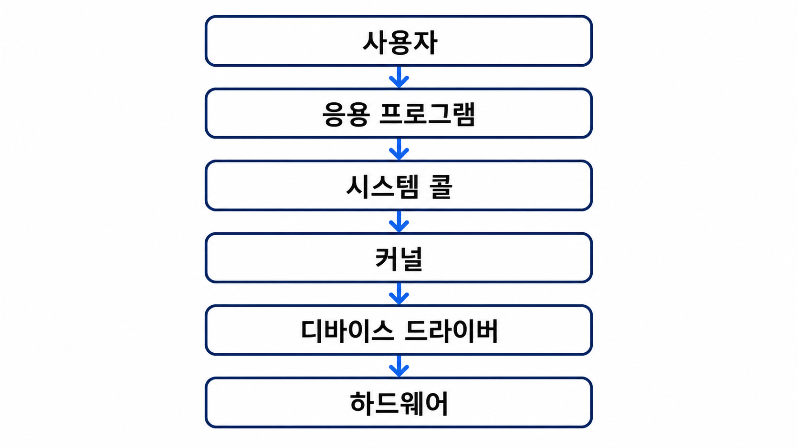
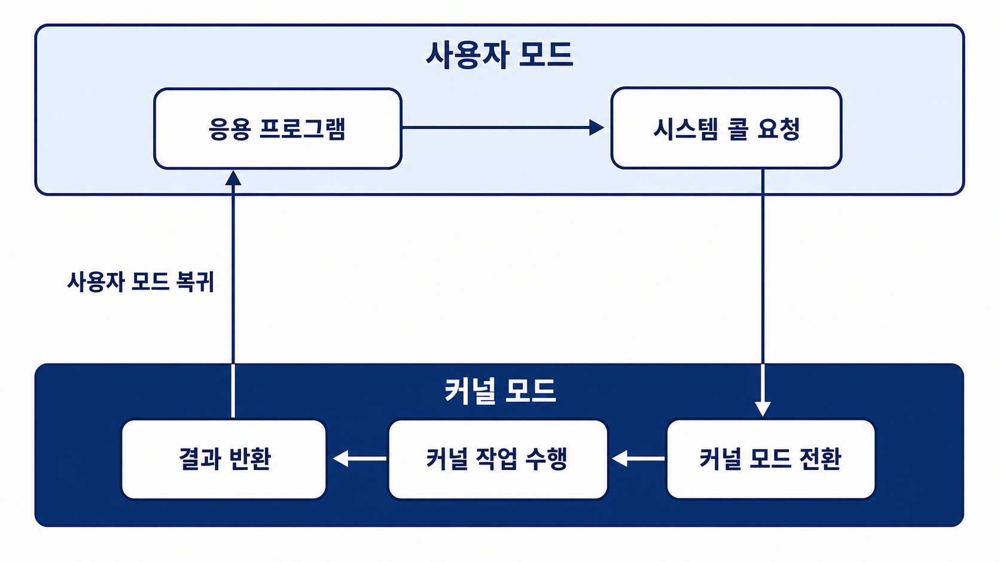
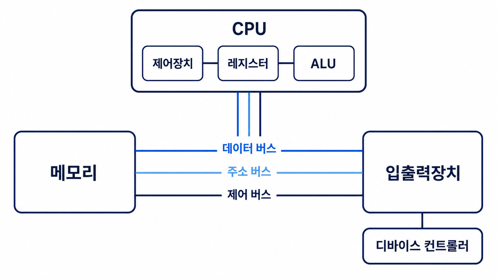
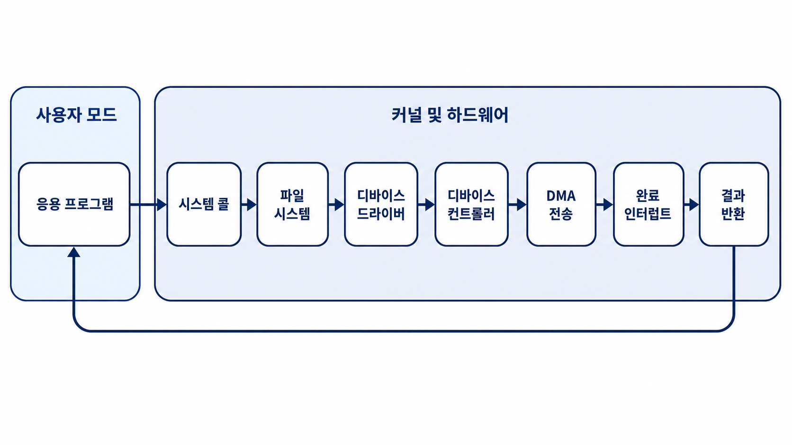

# 운영체제와 컴퓨터

운영체제(Operating System, OS)는 컴퓨터 하드웨어와 응용 프로그램 사이에서 컴퓨터의 자원을 관리하고, 프로그램이 실행될 수 있는 환경을 제공하는 시스템 소프트웨어

여기서 자원(Resource)은 CPU 사용 시간, 메모리 공간, 파일, 입출력장치처럼 프로그램 실행에 필요한 요소를 의미

응용 프로그램은 운영체제가 제공하는 인터페이스를 통해 CPU, 메모리, 저장장치, 입출력장치 등의 자원을 사용

인터페이스(Interface)는 서로 다른 구성 요소가 기능을 요청하고 결과를 주고받기 위해 정한 접점이나 규칙

운영체제는 여러 프로그램이 한정된 자원을 효율적이고 안전하게 사용할 수 있도록 관리

## 3.1.1 운영체제의 역할과 구조

### 운영체제의 역할

운영체제의 주요 역할은 CPU와 프로세스 관리, 메모리 관리, 파일 시스템 관리, 입출력장치 관리로 구분

#### CPU 스케줄링과 프로세스 관리

프로세스(Process)는 메모리에 적재되어 실행 중인 프로그램

여러 프로세스가 동시에 실행되는 환경에서는 CPU를 할당할 프로세스와 사용 시간 결정 필요

운영체제는 CPU 스케줄링을 통해 프로세스의 실행 순서와 CPU 사용 시간을 결정

CPU 스케줄링(CPU Scheduling)은 실행 가능한 프로세스 중 CPU를 사용할 대상을 선택하고 사용 시간을 결정하는 작업

프로세스의 생성과 종료, 상태 전환, 자원 할당과 회수 등을 관리

상태 전환(State Transition)은 프로세스가 준비, 실행, 대기 등의 실행 상태 사이를 이동하는 과정

#### 메모리 관리

운영체제는 한정된 메모리 공간을 여러 프로세스에 할당하고 회수

각 프로세스가 다른 프로세스의 메모리 영역에 임의로 접근하지 못하도록 보호하며, 실제 메모리보다 큰 프로그램을 실행할 수 있도록 가상 메모리도 관리

**가상 메모리(Virtual Memory)**: 저장장치의 일부를 메모리처럼 활용하여 각 프로세스에 독립된 연속 주소 공간을 제공하는 메모리 관리 기법

#### 파일 시스템 관리

운영체제는 데이터를 파일과 디렉터리 단위로 저장하고 관리

파일의 생성, 읽기, 쓰기, 삭제와 같은 연산을 제공하며 저장장치에서 파일의 위치, 접근 권한, 메타데이터 등을 관리

**메타데이터(Metadata)**: 파일 이름, 크기, 생성·수정 시간, 소유자, 접근 권한처럼 파일 자체를 설명하는 정보

#### 입출력장치 관리

키보드, 마우스, 모니터, 디스크, 네트워크 카드 등의 입출력장치는 동작 방식과 처리 속도가 서로 상이

운영체제는 디바이스 드라이버를 통해 각 장치를 제어

응용 프로그램은 장치의 세부 동작을 직접 처리하지 않고 공통 인터페이스를 통해 사용

### 운영체제의 구조

운영체제는 사용자 인터페이스, 시스템 콜, 커널, 디바이스 드라이버 등으로 구성



#### 사용자 인터페이스

사용자 인터페이스는 사용자가 컴퓨터와 상호작용할 수 있는 환경

- **GUI(Graphical User Interface)**: 창, 아이콘, 메뉴 등을 마우스나 터치로 조작하는 그래픽 기반 인터페이스
- **CUI(Character User Interface)**: 터미널이나 명령 프롬프트에서 명령어를 입력하는 문자 기반 인터페이스

GUI와 CUI는 운영체제의 기능을 사용하기 위한 사용자 환경이며, 커널의 핵심 기능과는 구분

#### 커널

커널(Kernel)은 운영체제의 핵심 부분

컴퓨터가 부팅될 때 메모리에 적재되어 시스템이 종료될 때까지 실행

커널은 다음과 같은 핵심 기능을 담당

- 프로세스와 스레드 관리
- CPU 스케줄링
- 메모리 관리
- 파일 시스템 관리
- 입출력장치 관리
- 시스템 콜 처리
- 프로세스 간 통신과 동기화

스레드(Thread)는 프로세스 내부에서 명령어를 실행하는 기본 실행 단위

프로세스 간 통신(Inter-Process Communication, IPC)은 서로 다른 프로세스가 데이터를 주고받는 방법

동기화(Synchronization)는 여러 프로세스나 스레드가 공유 자원에 접근하는 순서와 시점을 조정하는 작업

응용 프로그램이 하드웨어 자원에 직접 접근하지 않고 커널을 거치도록 함으로써 시스템의 안정성과 보안을 유지

#### 디바이스 드라이버

디바이스 드라이버(Device Driver)는 운영체제가 특정 하드웨어 장치를 제어할 수 있도록 하는 소프트웨어

장치마다 명령과 동작 방식이 다르기 때문에 운영체제는 장치별 드라이버를 사용

응용 프로그램은 장치의 세부 구현을 알 필요 없이 운영체제가 제공하는 공통 인터페이스를 사용

### 사용자 모드와 커널 모드

CPU는 시스템 자원을 보호하기 위해 명령어를 실행할 수 있는 권한을 사용자 모드와 커널 모드로 구분

- **사용자 공간(User Space)**: 일반 응용 프로그램이 제한된 권한으로 실행되는 메모리 영역
- **커널 공간(Kernel Space)**: 커널이 높은 권한으로 동작하는 메모리 영역

| 구분 | 사용자 모드 | 커널 모드 |
| --- | --- | --- |
| 실행 대상 | 일반 응용 프로그램 | 운영체제 커널 |
| 자원 접근 | 제한된 자원만 접근 가능 | 모든 시스템 자원에 접근 가능 |
| 특권 명령어 | 실행 불가능 | 실행 가능 |
| 오류의 영향 | 일반적으로 해당 프로세스에 한정 | 시스템 전체에 영향을 줄 수 있음 |

특권 명령어(Privileged Instruction)는 메모리 관리, 입출력장치 제어, 인터럽트 설정처럼 시스템 전체에 영향을 줄 수 있는 명령어

특권 명령어는 커널 모드에서만 실행 가능

#### 모드 비트

모드 비트(Mode Bit)는 CPU가 현재 어떤 권한 수준에서 명령어를 실행하는지 나타내는 하드웨어 상태 정보

일반적인 교재에서는 다음 두 값으로 표현

| 모드 비트 | 실행 모드 | 권한 |
| --- | --- | --- |
| `0` | 커널 모드 | 특권 명령어와 모든 시스템 자원에 접근 가능 |
| `1` | 사용자 모드 | 허용된 명령어와 자원만 접근 가능 |

응용 프로그램 실행 중에는 사용자 모드를 유지

시스템 콜, 인터럽트, 예외 발생 시 커널 모드로 전환

커널 작업 완료 후 기존 사용자 모드로 복귀

```text
응용 프로그램 실행
  ↓ 사용자 모드
시스템 콜 · 인터럽트 · 예외
  ↓ 커널 모드 전환
커널 작업 수행
  ↓ 사용자 모드 복귀
응용 프로그램 실행 계속
```

`0`과 `1`의 의미는 설명을 위한 단순화된 표현

실제 CPU는 하나의 비트 대신 여러 권한 단계나 상태 필드를 사용할 수 있으며 구체적인 구성은 CPU 아키텍처에 따라 상이

### 시스템 콜

시스템 콜(System Call)은 응용 프로그램이 운영체제의 서비스를 요청하는 인터페이스

응용 프로그램은 파일 읽기, 프로세스 생성, 메모리 할당, 네트워크 통신과 같이 권한이 필요한 작업을 직접 수행 불가

권한이 필요한 작업은 시스템 콜을 통해 커널에 처리 요청

대표적인 시스템 콜의 종류

| 분류 | 기능 | 예시 |
| --- | --- | --- |
| 프로세스 관리 | 프로세스 생성과 실행, 종료 | `fork()`, `exec()`, `exit()` |
| 파일 관리 | 파일 열기, 읽기, 쓰기, 닫기 | `open()`, `read()`, `write()`, `close()` |
| 메모리 관리 | 메모리 매핑과 해제 | `mmap()`, `munmap()` |
| 장치 관리 | 장치 속성 확인과 제어 | `ioctl()` |
| 통신 | 소켓 생성과 데이터 송수신 | `socket()`, `send()`, `recv()` |

- **메모리 매핑(Memory Mapping)**: 파일, 장치 또는 메모리 영역을 프로세스의 주소 공간에 연결하는 방식
- **소켓(Socket)**: 네트워크에서 데이터를 송수신하기 위해 사용하는 통신의 끝점

프로그래밍 언어의 표준 라이브러리 함수와 시스템 콜은 구분 필요

라이브러리 함수(Library Function)는 프로그래밍 언어나 라이브러리가 미리 구현하여 제공하는 함수

표준 라이브러리 함수는 시스템 콜을 직접 호출하거나 사용자 공간에서 일부 작업을 처리한 뒤 필요한 경우에만 시스템 콜을 호출

### 시스템 콜의 처리 과정

파일을 읽는 작업은 다음과 같은 흐름으로 처리



1. 응용 프로그램이 파일 읽기 함수를 호출
2. 라이브러리가 운영체제에 파일 읽기 시스템 콜을 요청
3. CPU의 실행 모드가 사용자 모드에서 커널 모드로 전환
4. 커널이 요청과 접근 권한을 확인
5. 커널이 파일 시스템과 디바이스 드라이버를 통해 데이터 읽기
6. 커널이 처리 결과를 응용 프로그램에 반환
7. CPU가 사용자 모드로 복귀하고 응용 프로그램의 실행을 계속

시스템 콜은 응용 프로그램과 커널을 분리하는 추상화 계층

추상화(Abstraction)는 복잡한 내부 동작을 감추고 필요한 기능을 단순한 인터페이스로 제공하는 방식

응용 프로그램은 하드웨어의 세부 동작을 직접 구현하지 않고 운영체제가 제공하는 일관된 인터페이스를 사용

## 3.1.2 컴퓨터의 요소

컴퓨터 시스템은 CPU, 메모리, 입출력장치와 이들을 연결하는 시스템 버스로 구성

시스템 버스(System Bus)는 CPU, 메모리, 입출력장치 사이에서 데이터, 주소, 제어 신호를 전달하는 통로

운영체제는 이러한 구성 요소의 동작을 관리



- **데이터 버스**: CPU, 메모리, 입출력장치 사이에서 실제 데이터를 전달
- **주소 버스**: 접근할 메모리나 입출력장치의 위치를 식별하는 주소(Address)를 전달
- **제어 버스**: 읽기, 쓰기, 인터럽트 등 장치 동작에 필요한 제어 신호를 전달

### CPU

CPU(Central Processing Unit)는 메모리에 저장된 명령어를 가져와 해석하고 실행하는 장치

CPU는 주로 제어장치, 레지스터, 산술논리연산장치로 구성

```text
CPU
├── 제어장치
├── 레지스터
└── 산술논리연산장치
```

#### 제어장치

제어장치(Control Unit, CU)는 명령어를 읽고 해석하여 CPU 내부 구성 요소에 제어 신호를 전달

제어 신호(Control Signal)는 읽기, 쓰기, 실행 등 구성 요소의 동작을 지시하는 전기적 신호

연산에 필요한 데이터를 메모리에서 레지스터로 가져오고, 산술논리연산장치에 수행할 연산을 지시하며, 연산 결과를 저장할 위치를 결정

#### 레지스터

레지스터(Register)는 CPU 내부에 존재하는 고속 임시 저장장치

CPU가 현재 처리하는 명령어, 데이터, 메모리 주소, 연산 결과 등을 저장

CPU 내부에 있어 주 메모리보다 빠르지만 저장 용량은 매우 작음

대표적인 레지스터

| 레지스터 | 역할 |
| --- | --- |
| 프로그램 카운터(PC) | 다음에 실행할 명령어의 주소 저장 |
| 명령어 레지스터(IR) | 현재 실행 중인 명령어 저장 |
| 메모리 주소 레지스터(MAR) | 접근할 메모리 주소 저장 |
| 메모리 버퍼 레지스터(MBR/MDR) | 메모리에서 읽거나 메모리에 쓸 데이터 저장 |
| 범용 레지스터 | 연산에 필요한 데이터와 중간 결과 저장 |

레지스터의 명칭과 세부 구성은 CPU 아키텍처에 따라 달라질 수 있음

CPU 아키텍처(CPU Architecture)는 CPU가 지원하는 명령어, 레지스터, 권한 단계와 동작 방식을 정의한 구조

#### 산술논리연산장치

산술논리연산장치(Arithmetic Logic Unit, ALU)는 산술 연산과 논리 연산을 수행하는 CPU의 구성 요소

- 산술 연산: 덧셈, 뺄셈, 곱셈, 나눗셈
- 논리 연산: AND, OR, NOT, XOR
- 비교 연산: 두 값의 크기 또는 일치 여부 비교
- 비트 연산: 비트 이동과 비트 단위 처리

### 명령어 처리 과정

CPU는 인출, 해석, 실행, 저장 과정을 반복하며 프로그램을 실행

**명령어 사이클(Instruction Cycle)**: CPU가 명령어의 인출, 해석, 실행, 저장을 반복하는 과정

```text
인출(Fetch)
  ↓
해석(Decode)
  ↓
실행(Execute)
  ↓
저장(Write Back)
```

1. **인출**: 프로그램 카운터가 가리키는 주소에서 명령어를 인출
2. **해석**: 제어장치가 명령어의 종류와 필요한 데이터를 분석
3. **실행**: 산술논리연산장치나 다른 실행 장치가 연산을 수행
4. **저장**: 실행 결과를 레지스터나 메모리에 저장

명령어 사이클 도중 인터럽트가 발생하면 CPU는 현재 실행 상태를 저장하고 인터럽트 처리 루틴을 실행

처리 완료 후 저장한 상태를 복원하고 기존 작업을 계속

### 인터럽트

인터럽트(Interrupt)는 CPU가 현재 실행 중인 작업을 잠시 중단하고 특정 사건을 우선 처리하도록 알리는 신호

CPU가 입출력 작업의 완료 여부를 계속 확인하면 연산 시간 낭비 발생

입출력장치는 작업 완료 후 인터럽트를 발생시켜 CPU에 처리할 사건이 있음을 전달

#### 인터럽트 처리 과정

```text
1. 장치 또는 프로그램에서 사건이 발생
2. CPU에 인터럽트가 전달
3. CPU가 현재 명령어의 실행을 완료
4. 현재 실행 상태를 저장
5. 인터럽트 벡터를 통해 처리할 핸들러를 탐색
6. 인터럽트 서비스 루틴을 실행
7. 저장한 상태를 복원
8. 중단했던 작업을 다시 실행
```

- **인터럽트 벡터(Interrupt Vector)**: 인터럽트 종류와 해당 처리 루틴의 위치를 연결하는 정보
- **인터럽트 핸들러(Interrupt Handler)**: 인터럽트가 발생했을 때 실행되는 처리 함수
- **인터럽트 서비스 루틴(Interrupt Service Routine, ISR)**: 인터럽트 처리를 위해 실행되는 명령어 집합

#### 하드웨어 인터럽트

하드웨어 인터럽트는 CPU 외부의 하드웨어 장치에서 발생

실행 중인 명령어와 직접적인 관계없이 발생하는 비동기 인터럽트

비동기적(Asynchronous)은 현재 실행 중인 명령어와 관계없이 외부 장치 등에 의해 사건이 발생하는 방식

- 키보드 입력
- 네트워크 패킷 도착
- 디스크 입출력 완료
- 타이머 만료

#### 예외와 시스템 콜

예외(Exception)는 CPU가 명령어를 실행하는 과정에서 내부적으로 감지한 사건

현재 실행 중인 명령어와 관련되어 발생하므로 동기적으로 처리

동기적(Synchronous)은 현재 실행 중인 명령어와 직접 관련되어 예측 가능한 실행 지점에서 사건이 발생하는 방식

- 0으로 나누기
- 유효하지 않은 명령어 실행
- 접근할 수 없는 메모리 참조
- 페이지 폴트

페이지 폴트(Page Fault)는 프로세스가 접근한 페이지가 현재 메모리에 없어 운영체제의 처리가 필요한 예외

시스템 콜은 응용 프로그램이 커널 기능을 사용하기 위해 의도적으로 발생시키는 제어 전환

트랩(Trap)은 시스템 콜이나 오류 처리 등을 위해 커널의 처리 루틴으로 제어를 넘기는 동기적 사건

예외, 트랩, 소프트웨어 인터럽트 등의 용어와 분류 방식은 운영체제와 CPU 아키텍처에 따라 상이

### DMA 컨트롤러

DMA(Direct Memory Access) 컨트롤러는 CPU를 거치지 않고 입출력장치와 메모리 사이에서 데이터를 직접 전송할 수 있도록 하는 하드웨어 장치

DMA를 사용하지 않으면 CPU가 입출력장치의 데이터를 읽어 메모리에 저장하는 작업을 반복

DMA를 사용하면 CPU는 전송에 필요한 정보만 설정한 뒤 다른 작업 수행 가능

```text
1. CPU가 DMA 컨트롤러에 전송 위치와 크기를 설정
2. DMA 컨트롤러가 장치와 메모리 사이에서 데이터를 전송
3. 전송이 완료되면 DMA 컨트롤러가 CPU에 인터럽트를 전송
```

DMA는 대량의 데이터를 전송하는 동안 CPU의 개입 횟수와 부하를 감소

### 메모리

메모리는 실행 중인 프로그램의 명령어와 데이터를 저장하는 장치

일반적으로 메모리는 주 메모리인 RAM(Random Access Memory)을 의미

RAM은 전원이 꺼지면 저장된 내용이 사라지는 휘발성(Volatile) 저장장치

CPU는 저장장치에 있는 프로그램을 직접 실행하지 않음

운영체제가 프로그램을 메모리에 적재하면 CPU가 메모리에서 명령어를 가져와 실행

### 타이머

타이머(Timer)는 일정 시간이 지나면 CPU에 인터럽트를 발생시키는 장치

운영체제는 타이머를 이용하여 한 프로세스가 CPU를 계속 독점하지 못하도록 제한

프로세스의 할당 시간이 끝나면 타이머 인터럽트가 발생하고 운영체제는 CPU를 다른 프로세스에 할당

타이머는 CPU 스케줄링, 시간 측정, 주기적인 작업 실행 등에 사용

### 디바이스 컨트롤러

디바이스 컨트롤러(Device Controller)는 특정 입출력장치를 제어하는 하드웨어 구성 요소

디바이스 컨트롤러는 장치의 동작과 장치·CPU·메모리 사이의 데이터 전송을 관리

컨트롤러 내부에는 전송할 데이터를 임시로 저장하는 로컬 버퍼(Local Buffer)가 존재

버퍼(Buffer)는 속도가 다른 두 장치 사이에서 데이터를 임시로 저장하는 공간

디바이스 컨트롤러와 디바이스 드라이버는 다음과 같이 구분

| 구분 | 디바이스 컨트롤러 | 디바이스 드라이버 |
| --- | --- | --- |
| 종류 | 하드웨어 | 소프트웨어 |
| 역할 | 실제 장치를 제어하고 데이터 전송 처리 | 운영체제와 컨트롤러 사이의 통신 방식 제공 |
| 위치 | 장치 또는 시스템 하드웨어 | 운영체제 커널 |

### 입출력 작업의 전체 흐름

응용 프로그램이 디스크의 파일을 읽는 과정에서 운영체제와 컴퓨터 구성 요소는 다음과 같이 협력



이 과정에서 시스템 콜은 응용 프로그램과 커널을 연결

디바이스 드라이버는 커널과 장치를 연결

DMA 컨트롤러는 데이터 전송에 필요한 CPU의 개입 감소

인터럽트는 작업 완료를 CPU에 전달
