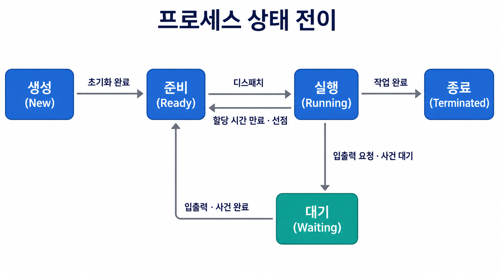

# 프로세스와 스레드

운영체제가 실행 중인 프로그램을 구분하고 관리할 때 사용하는 핵심 단위가 **프로세스**와 **스레드**다.

프로그램은 저장장치에 존재하는 명령어와 데이터의 집합이다. 아직 실행되지 않은 프로그램은 실행 파일이라는 정적인 형태로 존재한다. 이 프로그램을 실행하면 운영체제가 필요한 내용을 메모리에 적재하고 실행에 필요한 자원을 할당한다. 이렇게 실행 중인 프로그램을 **프로세스(Process**) 라고 한다.

하나의 프로그램을 여러 번 실행하면 같은 실행 파일을 사용하더라도 서로 다른 프로세스가 만들어진다. 각 프로세스는 독립된 주소 공간과 PID를 가지므로 하나가 종료되어도 다른 프로세스는 계속 실행될 수 있다. 여기서 **PID(Process ID**) 는 운영체제가 프로세스를 구분하기 위해 부여하는 식별자다.

프로세스 안에는 실제 명령어를 실행하는 하나 이상의 흐름이 존재한다. 이 실행 흐름을 **스레드(Thread**) 라고 한다. 프로세스가 실행에 필요한 자원을 담는 하나의 작업 공간이라면, 스레드는 그 공간 안에서 작업을 수행하는 실행 단위라고 볼 수 있다.

참고로 프로세스와 프로세서는 다른 개념이다. **프로세스**는 실행 중인 프로그램이고, **프로세서(Processor**) 는 명령어를 실행하는 CPU와 같은 처리 장치를 의미한다.

## 3.3.1 프로세스와 컴파일 과정

프로세스가 만들어지는 과정을 이해하려면 먼저 작성한 소스 코드가 어떻게 실행 파일이 되는지 알아야 한다.

프로그래밍 언어로 작성한 소스 코드는 실행 방식에 맞는 변환 과정이 필요하다. 컴파일 방식의 언어는 소스 코드를 CPU가 이해할 수 있는 기계어로 변환하고 필요한 라이브러리를 연결한다. 이 과정은 일반적으로 전처리, 컴파일, 어셈블리, 링크 순서로 이루어진다.

언어에 따라 소스 코드를 실행 중에 해석하는 인터프리터를 사용하거나, 가상 머신에서 중간 코드를 실행하면서 필요한 부분을 기계어로 바꾸기도 한다. 따라서 여기서 설명하는 과정은 실행 파일을 만드는 컴파일 방식의 대표적인 흐름이다.

### 전처리

**전처리(Preprocessing)** 는 본격적인 컴파일 전에 전처리 지시문을 처리하는 단계다.

전처리 단계를 제공하는 언어에서는 다른 파일의 내용 반영, 매크로 치환, 조건부 컴파일, 주석 제거 등의 작업이 이루어질 수 있다. 구체적인 기능과 문법은 프로그래밍 언어에 따라 다르다.

전처리가 끝나면 컴파일러가 분석할 수 있도록 하나의 확장된 소스 코드가 만들어진다.

### 컴파일

**컴파일(Compilation**) 은 전처리된 소스 코드를 분석하여 어셈블리 코드와 같은 다음 단계의 표현으로 변환하는 과정이다.

컴파일러는 이 과정에서 문법과 타입이 올바른지 검사한다. 필요하면 불필요한 연산을 줄이거나 더 효율적인 명령어를 사용하도록 코드를 최적화한다.

**어셈블리어(Assembly Language**) 는 CPU의 기계어 명령을 사람이 읽기 쉬운 기호로 표현한 저수준 언어다. 같은 소스 코드라도 대상 CPU의 명령어 구조에 따라 생성되는 어셈블리 코드는 달라질 수 있다.

### 어셈블리

**어셈블리(Assembly**) 는 어셈블리어를 기계어가 들어 있는 목적 파일로 변환하는 과정이다. 이 변환을 수행하는 프로그램을 **어셈블러(Assembler**) 라고 한다.

**목적 파일(Object File)** 은 기계어 코드와 심볼, 재배치 정보 등을 포함한다. 여기서 **심볼(Symbol**) 은 함수나 변수의 이름을 실제 위치와 연결하기 위한 정보다. **재배치(Relocation**) 는 여러 목적 파일을 합칠 때 코드와 데이터의 최종 주소를 조정하는 작업이다.

목적 파일에는 다른 파일이나 라이브러리에 정의된 함수의 위치가 아직 결정되지 않았을 수 있다. 따라서 목적 파일만으로는 프로그램이 완성되지 않을 수 있다.

### 링크

**링크(Link**) 는 여러 목적 파일과 라이브러리를 결합하고 심볼의 실제 위치를 연결하여 실행 파일을 만드는 과정이다.

라이브러리를 연결하는 방식에는 정적 링크와 동적 링크가 있다.

- **정적 링크**는 필요한 라이브러리 코드를 실행 파일 안에 포함한다. 실행에 필요한 코드가 파일에 함께 들어가므로 배포가 단순하지만, 실행 파일의 크기가 커지고 여러 프로그램에 같은 코드가 중복될 수 있다.
- **동적 링크**는 프로그램을 실행할 때 공유 라이브러리를 연결한다. 여러 프로세스가 같은 라이브러리 코드를 공유할 수 있어 파일 크기와 메모리 사용량을 줄일 수 있지만, 실행 환경에 필요한 라이브러리가 존재해야 한다.

이 과정을 모두 거치면 운영체제가 실행할 수 있는 파일이 만들어진다.

### 실행 파일에서 프로세스로

실행 파일을 실행하면 운영체제의 **로더(Loader**) 가 코드와 데이터를 가상 주소 공간에 배치한다. 이어서 운영체제는 프로세스를 관리하는 데 필요한 PCB를 만들고, 스택과 실행 시작 위치를 준비한 뒤 프로세스를 준비 상태로 전환한다.

유닉스 계열 운영체제에서는 `fork()`와 `exec()` 계열 함수를 조합하여 새로운 프로그램을 실행하는 경우가 많다.

`fork()`는 현재 프로세스와 거의 같은 상태를 가진 자식 프로세스를 만든다. 부모와 자식은 서로 다른 PID와 주소 공간을 가지지만, 생성 직후의 내용은 거의 같다.

이때 메모리 전체를 즉시 복사하면 비용이 크기 때문에 현대 운영체제는 보통 **COW(Copy-On-Write**) 를 사용한다. COW는 부모와 자식이 처음에는 같은 물리 페이지를 공유하고, 한쪽에서 내용을 수정할 때 해당 페이지만 복사하는 방식이다.

반면 `exec()`는 새 프로세스를 만드는 함수가 아니다. 현재 프로세스의 실행 이미지를 새로운 프로그램의 코드와 데이터로 교체한다. 실행 이미지란 프로세스의 코드, 데이터, 스택처럼 메모리에 구성된 실행 환경을 의미한다. 따라서 `exec()`가 성공해도 기존 프로세스의 PID는 그대로 유지된다.

결국 프로그램은 컴파일과 링크를 거쳐 실행 파일이 되고, 실행 파일이 메모리에 적재되어 운영체제의 관리 대상이 되면 프로세스가 된다.

## 3.3.2 프로세스의 상태

프로세스가 생성되었다고 해서 항상 CPU를 사용하는 것은 아니다. 한정된 CPU를 여러 프로세스가 나누어 사용하므로 프로세스는 실행 상황에 따라 상태를 바꾼다.

대표적인 프로세스 상태는 생성, 준비, 실행, 대기, 종료다.

### 생성 상태

**생성(New**) 상태는 운영체제가 프로세스를 만들고 필요한 정보를 초기화하는 단계다.

운영체제는 PCB를 생성하고 주소 공간과 자원을 준비한다. 초기화가 끝나고 실행할 조건을 갖추면 프로세스는 준비 상태로 이동한다.

### 준비 상태

**준비(Ready**) 상태는 CPU만 할당받으면 바로 실행할 수 있는 상태다.

준비 상태의 프로세스들은 준비 큐에서 자신의 차례를 기다린다. 운영체제의 스케줄러가 이들 중 하나를 선택하고 CPU를 넘겨주면 실행 상태가 된다. 이처럼 선택된 실행 단위에 CPU 제어권을 넘기는 작업을 **디스패치(Dispatch**) 라고 한다.

### 실행 상태

**실행(Running**) 상태는 프로세스의 명령어가 CPU에서 처리되고 있는 상태다.

실행 중인 프로세스가 항상 종료될 때까지 CPU를 사용하는 것은 아니다. 할당된 시간이 끝나거나 더 높은 우선순위의 작업이 실행되어야 하면 운영체제가 CPU를 회수하고 해당 프로세스를 다시 준비 상태로 보낼 수 있다. 이를 **선점(Preemption**) 이라고 한다.

실행 중에 파일이나 네트워크 데이터를 기다려야 한다면 CPU를 계속 점유할 이유가 없다. 이 경우 프로세스는 대기 상태로 이동하고 다른 프로세스가 CPU를 사용한다.

### 대기 상태

**대기(Waiting**) 상태는 입출력이나 특정 사건이 완료되기를 기다리는 상태다.

예를 들어 프로세스가 디스크에 파일 읽기를 요청하면 데이터가 준비될 때까지 대기 상태에 머문다. 작업 완료 인터럽트가 발생하면 프로세스는 실행 상태가 아니라 준비 상태로 이동한다. CPU를 사용하려면 다시 스케줄러의 선택을 받아야 하기 때문이다.

### 종료 상태

**종료(Terminated**) 상태는 프로세스가 실행을 마치고 운영체제가 자원을 정리하는 단계다.

운영체제는 프로세스에 할당했던 메모리와 파일 등의 자원을 회수한다. 종료 상태와 PCB의 최종 제거 시점은 운영체제의 구현과 부모 프로세스의 종료 상태 확인 여부에 따라 달라질 수 있다.

전체 상태 변화는 다음과 같이 정리할 수 있다.



운영체제에 따라 **보류(Suspended**) 상태를 추가로 구분하기도 한다. 보류 상태는 프로세스의 실행이 장기간 중단되거나 메모리 확보를 위해 프로세스의 일부 내용이 저장장치로 이동한 상태다. 실행할 수 있지만 메모리 밖에 있는 상태를 보류 준비, 사건까지 기다리고 있는 상태를 보류 대기라고 한다.

## 3.3.3 프로세스의 메모리 구조

프로세스가 실행되려면 코드와 데이터뿐 아니라 함수 호출과 동적 메모리 할당에 사용할 공간도 필요하다. 이를 위해 프로세스의 가상 주소 공간은 일반적으로 코드, 데이터, BSS, 힙, 스택 영역으로 나뉜다.

### 코드 영역

**코드 영역(Text Segment**) 은 CPU가 실행할 기계어 명령을 저장하는 영역이다.

프로그램 실행 중 코드가 임의로 바뀌지 않도록 일반적으로 읽기 전용 권한이 설정된다. 같은 프로그램에서 생성된 여러 프로세스가 읽기 전용 코드 페이지를 공유하여 물리 메모리를 절약할 수도 있다.

### 데이터 영역과 BSS

**데이터 영역(Data Segment**) 은 초기값이 있는 전역 변수와 정적 변수를 저장한다. 프로그램이 시작될 때 값이 준비되고 프로세스가 종료될 때까지 유지된다.

**BSS(Block Started by Symbol**) 영역은 초기화하지 않았거나 0으로 초기화된 전역 변수와 정적 변수를 저장한다. 실행 파일에 모든 0 값을 직접 기록하는 대신 필요한 크기를 중심으로 표현할 수 있어 실행 파일의 크기를 줄이는 데 도움이 된다.

문자열 상수나 변경할 수 없는 데이터는 별도의 읽기 전용 데이터 영역에 배치될 수도 있다. 실제 구분과 배치는 운영체제, 컴파일러, 실행 파일 형식에 따라 달라질 수 있다.

### 힙

**힙(Heap**) 은 프로그램 실행 중 필요한 크기의 메모리를 동적으로 할당하는 영역이다.

프로그램 실행 중 동적으로 생성한 객체나 크기가 변하는 자료구조의 데이터가 힙을 사용할 수 있다. 힙 데이터의 수명과 관리 방식은 프로그래밍 언어와 실행 환경에 따라 달라진다.

더 이상 사용하지 않는 메모리가 회수되지 않아 계속 점유되는 현상을 **메모리 누수(Memory Leak**) 라고 한다. 프로그래머가 직접 메모리를 해제하는 언어도 있고, 가비지 컬렉션을 통해 사용하지 않는 객체를 자동으로 찾고 회수하는 언어도 있다. **가비지 컬렉션(Garbage Collection, GC**) 은 더 이상 접근할 수 없는 객체의 메모리를 실행 환경이 자동으로 회수하는 기능이다.

### 스택

**스택(Stack**) 은 함수 호출에 필요한 매개변수, 지역 변수, 반환 주소 등의 정보를 저장하는 영역이다.

함수가 호출되면 해당 호출에 필요한 **스택 프레임(Stack Frame**) 이 생성되고, 함수가 반환되면 제거된다. 재귀 함수가 호출될 때마다 새로운 스택 프레임이 생기기 때문에 각 호출의 지역 변수를 서로 구분할 수 있다.

스택의 크기는 제한되어 있다. 지나치게 깊은 재귀 호출이나 매우 큰 지역 변수를 사용하여 허용된 크기를 넘으면 **스택 오버플로(Stack Overflow**) 가 발생할 수 있다.

힙과 스택은 모두 실행 중에 사용량이 변하지만 관리 방식은 다르다. 스택은 함수 호출과 반환에 따라 규칙적으로 관리되는 반면, 힙은 프로그램이 필요한 시점에 메모리를 요청하고 수명을 관리한다.

메모리 영역의 개념적인 배치는 다음과 같다.

```text
높은 주소
┌──────────────┐
│ 스택          │ 함수 호출에 따라 사용
│      ↓       │
│              │
│      ↑       │
│ 힙            │ 동적 메모리 할당
├──────────────┤
│ BSS           │ 0 또는 미초기화 전역·정적 변수
├──────────────┤
│ 데이터        │ 초기값이 있는 전역·정적 변수
├──────────────┤
│ 코드          │ 실행 명령어
└──────────────┘
낮은 주소
```

힙과 스택의 위치와 성장 방향은 항상 위 그림과 같은 것은 아니다. 운영체제와 실행 환경에 따라 주소 공간의 실제 배치는 달라질 수 있다.

## 3.3.4 PCB

운영체제는 여러 프로세스를 번갈아 실행하기 위해 각 프로세스의 현재 상태를 기억해야 한다. 이 정보를 저장하는 자료 구조가 **PCB(Process Control Block, 프로세스 제어 블록**) 다.

PCB는 프로세스가 생성될 때 만들어지며 커널 영역에서 관리된다. 프로세스가 종료되고 관련 자원의 정리가 끝나면 PCB도 제거된다.

PCB에는 일반적으로 다음과 같은 정보가 들어간다.

- **PID**: 프로세스를 구분하는 식별자
- **프로세스 상태**: 준비, 실행, 대기 등의 현재 상태
- **프로그램 카운터**: 다음에 실행할 명령어의 주소
- **CPU 레지스터**: 프로세스가 중단된 시점의 레지스터 값
- **스케줄링 정보**: 우선순위, 준비 큐 위치, CPU 사용 시간
- **메모리 관리 정보**: 페이지 테이블처럼 주소 공간을 관리하는 정보
- **입출력 상태 정보**: 열린 파일과 사용 중인 장치에 관한 정보
- **계정과 권한 정보**: 실행 사용자, 접근 권한, 자원 사용량

PCB가 필요한 이유는 CPU가 한 프로세스만 계속 실행하지 않기 때문이다. 실행 중인 프로세스가 바뀔 때 운영체제는 이전 프로세스가 어디까지 실행되었는지 저장하고, 다음 프로세스가 중단되었던 지점부터 이어서 실행되도록 해야 한다.

이처럼 실행 대상을 바꾸면서 기존 실행 상태를 저장하고 새로운 실행 상태를 복원하는 과정을 **문맥 교환(Context Switching**) 이라고 한다. 여기서 문맥은 프로그램 카운터와 CPU 레지스터처럼 작업을 이어가는 데 필요한 실행 상태를 의미한다.

문맥 교환은 타이머 인터럽트로 할당 시간이 끝났을 때, 입출력 대기가 발생했을 때, 더 높은 우선순위의 작업을 실행해야 할 때 등에 일어날 수 있다.

문맥 교환 중에는 사용자가 요청한 작업 자체를 처리하지 않는다. 상태를 저장하고 복원하는 시간뿐 아니라, 프로세스가 바뀌면서 페이지 테이블과 TLB, CPU 캐시의 활용도가 달라질 수 있으므로 추가 비용이 발생한다. 이처럼 본래 작업을 수행하기 위해 부가적으로 사용하는 시간과 자원을 **오버헤드(Overhead**) 라고 한다.

## 3.3.5 멀티프로세싱

하나의 프로세스만으로 모든 작업을 처리할 수도 있지만, 여러 작업을 서로 분리하거나 여러 CPU 코어를 활용하려면 여러 프로세스를 사용할 수 있다. 이를 **멀티프로세싱(Multiprocessing**) 이라고 한다.

멀티프로세싱을 이해할 때는 동시성과 병렬성을 구분해야 한다.

**동시성(Concurrency**) 은 여러 작업이 같은 시간 구간에 함께 진행되는 성질이다. 하나의 CPU 코어에서도 작업을 빠르게 번갈아 실행하면 여러 작업이 동시에 진행되는 것처럼 보일 수 있다.

**병렬성(Parallelism**) 은 여러 CPU 코어가 여러 작업을 실제로 같은 시점에 실행하는 성질이다. 따라서 동시성이 있다고 해서 항상 병렬로 실행되는 것은 아니다.

프로세스는 서로 독립된 주소 공간을 가지므로 한 프로세스의 오류가 다른 프로세스의 메모리를 직접 손상시킬 가능성이 낮다. 작업을 프로세스별로 분리하면 안정성과 격리 수준을 높일 수 있고, 여러 CPU 코어를 활용할 수도 있다.

반면 프로세스를 생성하고 문맥을 교환하는 데는 비용이 든다. 주소 공간이 분리되어 있으므로 서로 데이터를 주고받기 위해서는 운영체제가 제공하는 별도의 통신 방법도 필요하다.

### IPC

프로세스 사이에서 데이터를 주고받는 방법을 **IPC(Inter-Process Communication, 프로세스 간 통신**) 라고 한다.

대표적인 IPC 방식은 다음과 같다.

- **파이프**: 한 프로세스의 출력을 다른 프로세스의 입력으로 전달하는 바이트 흐름
- **이름 있는 파이프**: 파일 시스템의 이름을 사용하여 관계없는 프로세스도 접근할 수 있는 파이프
- **메시지 큐**: 운영체제가 관리하는 큐를 통해 메시지 단위로 데이터를 전달하는 방식
- **공유 메모리**: 여러 프로세스가 같은 물리 메모리 영역을 각자의 주소 공간에 연결하여 사용하는 방식
- **소켓**: 같은 컴퓨터 또는 네트워크에 있는 프로세스가 통신하는 방식
- **시그널**: 프로세스에 특정 사건이 발생했음을 알리는 비동기 알림

공유 메모리는 여러 IPC 방식 중 데이터 복사 비용이 비교적 작아 빠른 통신에 사용할 수 있다. 그러나 여러 프로세스가 같은 데이터를 직접 읽고 쓸 수 있으므로 접근 순서를 별도로 조정해야 한다.

프로세스 사이의 강한 격리는 안정성에는 도움이 되지만 데이터를 자주 공유해야 하는 작업에서는 불편할 수 있다. 이러한 상황에서 같은 주소 공간을 공유하면서 여러 실행 흐름을 만드는 스레드를 사용할 수 있다.

## 3.3.6 스레드와 멀티스레딩

스레드는 프로세스 안에서 명령어를 실행하는 흐름이다. 하나의 프로세스가 여러 스레드를 가지면 각 스레드가 서로 다른 작업을 맡아 진행할 수 있다. 이를 **멀티스레딩(Multithreading**) 이라고 한다.

같은 프로세스에 속한 스레드는 코드, 데이터, 힙, 열린 파일과 같은 프로세스 자원을 공유한다. 따라서 한 스레드가 만든 데이터를 다른 스레드가 같은 주소 공간에서 바로 사용할 수 있다.

모든 실행 상태를 공유하는 것은 아니다. 각 스레드는 서로 다른 명령어 위치에서 실행될 수 있어야 하므로 프로그램 카운터와 CPU 레지스터를 따로 가진다. 함수 호출도 독립적으로 이루어져야 하므로 각자의 스택을 사용한다.

스레드마다 독립적으로 유지해야 하는 데이터를 위해 **스레드 지역 저장소(Thread-Local Storage, TLS**) 를 사용할 수도 있다. TLS에 저장된 값은 같은 변수처럼 보이더라도 스레드마다 별도의 값을 가진다.

프로세스와 스레드가 관리하는 요소를 정리하면 다음과 같다.

| 프로세스 단위로 관리·공유 | 스레드마다 독립적으로 관리 |
| --- | --- |
| 코드 영역 | 프로그램 카운터 |
| 데이터 영역과 힙 | CPU 레지스터 |
| 열린 파일 등의 프로세스 자원 | 스택 |
| 가상 주소 공간 | 스레드 ID와 TLS |

멀티스레딩은 같은 주소 공간을 사용하므로 프로세스 간 통신보다 데이터를 주고받기 쉽다. 프로세스를 새로 만드는 것보다 스레드를 만들고 전환하는 비용도 일반적으로 작다. 한 스레드가 입출력을 기다리는 동안 다른 스레드가 작업을 이어 갈 수 있고, 여러 CPU 코어에서 스레드를 병렬로 실행할 수도 있다.

하지만 자원을 공유한다는 특징은 단점이 되기도 한다. 한 스레드가 공유 데이터를 잘못 수정하면 같은 프로세스의 다른 스레드에도 영향을 준다. 잘못된 메모리 접근처럼 치명적인 오류가 발생하면 프로세스 전체가 종료될 수도 있다.

스레드 전환 역시 비용이 없는 작업은 아니다. 프로그램 카운터와 레지스터, 스택 관련 상태를 저장하고 복원해야 하며 스케줄링과 CPU 캐시에도 영향을 줄 수 있다. 스레드를 지나치게 많이 만들면 실제 작업보다 전환과 관리에 더 많은 자원을 사용할 수 있다.

프로세스는 격리와 안정성에 유리하고, 스레드는 자원 공유와 가벼운 작업 분리에 유리하다. 어느 방식이 항상 더 좋은 것은 아니며 작업의 독립성, 데이터 공유량, 오류 격리, 생성과 전환 비용을 함께 고려해야 한다.

## 3.3.7 공유 자원과 임계 영역

여러 프로세스나 스레드가 동시에 작업하면 같은 데이터나 장치를 함께 사용해야 하는 상황이 생긴다. 이처럼 여러 실행 흐름이 함께 접근할 수 있는 메모리, 변수, 파일, 장치 등을 **공유 자원(Shared Resource**) 이라고 한다.

공유 자원을 읽기만 한다면 문제가 생기지 않는 경우가 많다. 그러나 둘 이상의 실행 흐름이 같은 값을 동시에 변경하면 실행 순서에 따라 결과가 달라질 수 있다. 이를 **경쟁 상태(Race Condition**) 라고 한다.

예를 들어 공유 변수 `count`의 값이 0이고 두 스레드가 각각 값을 1만큼 증가시킨다고 가정한다. 증가 연산은 값을 읽고, 1을 더하고, 결과를 저장하는 여러 단계로 처리될 수 있다.

두 스레드가 모두 0을 읽은 뒤 각자 1을 저장하면 증가 연산을 두 번 수행했는데도 최종 결과는 2가 아니라 1이 된다. 어느 스레드가 어느 시점에 실행되는지에 따라 결과가 달라지는 경쟁 상태가 발생한 것이다.

공유 자원에 접근하여 동시에 실행했을 때 문제가 생길 수 있는 코드 영역을 **임계 영역(Critical Section**) 이라고 한다. 임계 영역을 안전하게 관리하려면 다음 조건을 고려해야 한다.

- **상호 배제(Mutual Exclusion**): 한 번에 하나의 실행 흐름만 임계 영역에 들어갈 수 있어야 한다.
- **진행(Progress**): 임계 영역이 비어 있다면 진입할 실행 흐름을 결정할 수 있어야 한다.
- **한정 대기(Bounded Waiting**): 특정 실행 흐름이 자신의 차례를 무한정 기다리지 않아야 한다.

### 뮤텍스

**뮤텍스(Mutex**) 는 한 번에 하나의 스레드만 임계 영역에 들어가도록 잠금을 제공하는 동기화 도구다.

스레드는 공유 자원에 접근하기 전에 뮤텍스의 잠금을 획득한다. 다른 스레드가 이미 잠금을 가지고 있다면 잠금이 해제될 때까지 기다린다. 작업을 마친 스레드는 반드시 잠금을 해제해야 다른 스레드가 임계 영역에 들어갈 수 있다.

뮤텍스는 일반적으로 잠금을 획득한 스레드가 직접 해제한다는 소유권 개념을 가진다. 잠금 해제를 빠뜨리거나 여러 잠금을 잘못된 순서로 획득하면 교착 상태가 생길 수 있으므로 주의해야 한다.

### 세마포어

**세마포어(Semaphore)** 는 사용할 수 있는 자원의 개수를 정수 값으로 관리하는 동기화 도구다.

스레드가 자원을 사용하면 세마포어 값을 감소시키고, 사용을 마치면 값을 증가시킨다. 값이 0이면 사용할 수 있는 자원이 없으므로 새로운 요청은 기다린다.

값을 0과 1로만 사용하는 이진 세마포어는 하나의 자원에 대한 접근을 제어할 수 있다. 1보다 큰 값을 사용하는 카운팅 세마포어는 연결 풀이나 한정된 작업 공간처럼 동시에 사용할 수 있는 자원이 여러 개인 상황에 적합하다.

뮤텍스가 잠금의 소유권과 상호 배제에 초점을 둔다면, 세마포어는 자원의 개수 관리와 실행 흐름 사이의 신호 전달에도 사용할 수 있다는 차이가 있다.

### 모니터

**모니터(Monitor**) 는 공유 데이터와 그 데이터를 다루는 연산, 동기화 조건을 하나로 묶은 고수준 동기화 구조다.

모니터는 내부의 공유 데이터에 한 번에 하나의 실행 흐름만 접근하도록 상호 배제를 제공한다. 특정 조건이 충족될 때까지 기다려야 한다면 **조건 변수(Condition Variable**) 를 사용해 스레드를 대기시키고, 조건이 바뀌었을 때 다시 깨울 수 있다.

뮤텍스, 세마포어, 모니터는 모두 공유 자원의 접근 순서를 조정하기 위한 방법이다. 하지만 동기화 도구를 사용했다고 해서 모든 문제가 자동으로 해결되는 것은 아니다. 여러 자원을 동시에 잠그는 과정이 잘못되면 실행 흐름들이 서로를 기다리며 멈출 수 있다.

## 3.3.8 교착 상태

둘 이상의 프로세스나 스레드가 서로가 가진 자원을 기다리면서 누구도 다음 작업으로 진행하지 못하는 상태를 **교착 상태(Deadlock**) 라고 한다.

예를 들어 스레드 A가 자원 1의 잠금을 가진 상태에서 자원 2를 기다리고, 스레드 B가 자원 2의 잠금을 가진 상태에서 자원 1을 기다린다고 가정한다. 두 스레드는 상대방이 자원을 해제해야 진행할 수 있지만, 자신도 다른 자원을 기다리고 있어 현재 자원을 해제하지 못한다. 결국 두 스레드 모두 계속 대기한다.

### 교착 상태의 필요 조건

교착 상태가 발생하려면 다음 네 조건이 동시에 성립해야 한다.

- **상호 배제**: 하나의 자원을 한 번에 하나의 실행 흐름만 사용할 수 있다.
- **점유와 대기**: 이미 자원을 가진 상태에서 다른 자원을 추가로 기다린다.
- **비선점**: 다른 실행 흐름이 가진 자원을 강제로 빼앗을 수 없다.
- **순환 대기**: 여러 실행 흐름이 서로가 가진 자원을 원형으로 기다린다.

이 조건들은 교착 상태가 반드시 발생한다는 뜻이 아니라, 교착 상태가 발생할 수 있는 환경이 만들어졌다는 뜻이다. 네 조건 중 하나라도 성립하지 않도록 만들면 교착 상태를 예방할 수 있다.

### 교착 상태 처리 방법

교착 상태를 다루는 방법은 예방, 회피, 탐지와 회복, 무시로 나눌 수 있다.

**예방**은 교착 상태의 네 가지 필요 조건 중 하나가 성립하지 않도록 자원 할당 규칙을 정하는 방법이다. 예를 들어 모든 스레드가 잠금을 항상 같은 순서로 획득하도록 만들면 순환 대기를 방지할 수 있다.

**회피**는 자원을 할당하기 전에 그 결과가 안전한 상태인지 확인하는 방법이다. 여기서 **안전 상태(Safe State**) 는 모든 프로세스가 일정한 순서로 필요한 자원을 얻어 정상적으로 종료할 수 있는 상태다. 대표적인 회피 방법으로 각 프로세스의 최대 자원 요구량을 이용하는 은행원 알고리즘이 있다.

**탐지와 회복**은 교착 상태가 발생하는 것을 허용한 뒤 주기적으로 상태를 검사하는 방법이다. 교착 상태가 발견되면 관련 프로세스를 종료하거나 일부 자원을 회수하여 순환 관계를 끊는다.

**무시**는 교착 상태가 매우 드물고 예방이나 탐지 비용이 더 크다고 판단될 때 별도의 처리를 하지 않는 방법이다. 문제가 실제로 발생하면 사용자가 프로그램을 종료하거나 시스템을 다시 시작하는 방식으로 처리할 수 있다.

교착 상태와 함께 자주 나오는 개념으로 **기아 상태(Starvation**) 가 있다. 교착 상태에서는 관련된 실행 흐름이 서로 기다리기 때문에 누구도 진행하지 못한다. 반면 기아 상태에서는 다른 실행 흐름은 계속 진행하지만 특정 실행 흐름만 CPU나 자원을 할당받지 못해 오랫동안 기다린다.

정리하면 멀티프로세싱과 멀티스레딩은 여러 작업을 효율적으로 진행하도록 해 주지만, 공유 자원이 생기면 접근 순서를 조정해야 한다. 이 과정에서 뮤텍스와 세마포어 같은 동기화 도구를 사용하며, 잠금 관계가 잘못되면 교착 상태가 발생할 수 있다. 따라서 실행 단위를 나누는 것뿐 아니라 자원의 공유 범위와 잠금 순서를 함께 설계하는 것이 중요하다.
