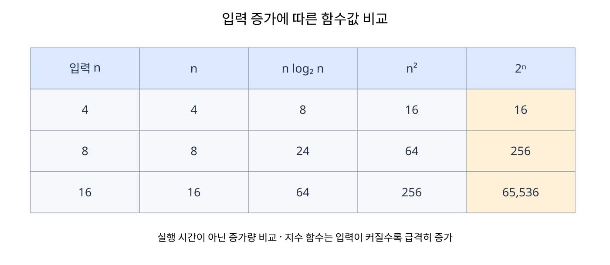

# 복잡도

**복잡도**(**Complexity**)는 입력 크기가 증가할 때 알고리즘이 사용하는 시간이나 메모리가 얼마나 증가하는지를 나타낸다. 같은 문제를 해결하더라도 알고리즘과 자료 구조에 따라 필요한 자원의 양은 달라진다.

입력 크기 `n`은 문제에서 처리할 데이터의 양이다. 배열에서는 원소 수, 문자열에서는 문자 수가 될 수 있다. 서로 다른 두 배열을 처리한다면 각각의 크기를 `n`, `m`으로 구분한다.

실행 시간은 CPU 성능, 프로그래밍 언어와 실행 환경에 영향을 받는다. 복잡도 분석에서는 특정 컴퓨터에서 걸린 초보다 입력 증가에 따른 연산 수의 증가율을 비교한다. 이하에서는 고정 크기 원소의 비교·대입·기본 산술 연산을 일정한 비용으로 가정한다.

### 점근적 표기법

**점근적 분석**(**Asymptotic Analysis**)은 입력 크기가 충분히 커질 때의 증가 양상을 분석하는 방법이다. 대표적인 표기법으로 빅오, 빅오메가, 빅세타가 있다.

여기서 상한은 증가량을 위에서 제한하는 기준, 하한은 아래에서 제한하는 기준이다. 실제 실행 시간을 초 단위로 예측하는 표현은 아니다.

| 표기법 | 의미 | 해석 |
| --- | --- | --- |
| **빅오**(**Big-O**) | 점근적 상한 | 충분히 큰 입력에서 기준 함수의 일정 배수보다 빠르게 커지지 않는다. |
| **빅오메가**(**Big-Ω**) | 점근적 하한 | 충분히 큰 입력에서 기준 함수의 일정 배수 이상으로 커진다. |
| **빅세타**(**Big-Θ**) | 점근적으로 일치하는 증가율 | 같은 기준 함수로 상한과 하한을 모두 나타낼 수 있다. |

연산 수가 `3n + 5`라면 입력이 커질수록 상수항보다 `n`에 비례하는 부분이 중요하다. 따라서 증가율은 `Θ(n)`이며 `O(n)`, `Ω(n)`도 성립한다.

`O(n²)` 역시 상한이므로 틀린 표현은 아니지만, `3n + 5`의 증가율을 비교할 때는 더 밀접한 상한인 `O(n)`을 사용하는 것이 유용하다. 빅오가 반드시 가장 밀접한 상한만 의미하는 것은 아니다.

상수 계수와 낮은 차수의 항을 생략하면 다음처럼 정리할 수 있다.

| 연산 수 | 밀접한 빅오 표현 | 이유 |
| --- | --- | --- |
| `7` | `O(1)` | 입력 크기와 무관하다. |
| `3n + 5` | `O(n)` | 선형항이 증가율을 결정한다. |
| `2n² + 10n + 3` | `O(n²)` | 이차항이 증가율을 결정한다. |
| `n log₂ n + n` | `O(n log n)` | `n log n`이 선형항보다 빠르게 커진다. |

이는 상수 비용이 실제 성능에 영향을 주지 않는다는 뜻은 아니다. 작은 입력에서는 상수 비용과 캐시 사용 방식 때문에 더 낮은 복잡도의 알고리즘이 오히려 느릴 수도 있다.

## 5.1.1 시간 복잡도

**시간 복잡도**(**Time Complexity**)는 입력 크기에 따라 알고리즘이 수행하는 연산 수가 어떻게 증가하는지를 나타낸다.

### 최선·평균·최악의 경우

같은 크기의 입력이라도 값의 배치에 따라 연산 수가 달라질 수 있다. 순서대로 원소를 확인하는 선형 탐색을 생각하면 다음과 같다.

| 구분 | 선형 탐색의 상황 | 시간 복잡도 |
| --- | --- | --- |
| **최선의 경우**(**Best Case**) | 첫 번째 원소가 찾는 값이다. | `Θ(1)` |
| **평균적인 경우**(**Average Case**) | 찾는 값이 각 위치에 같은 확률로 있다고 가정한다. | `Θ(n)` |
| **최악의 경우**(**Worst Case**) | 마지막에 있거나 아예 없다. | `Θ(n)` |

평균적인 경우는 입력이 어떻게 분포하는지에 대한 가정이 필요하다. 위 가정에서 성공하는 탐색의 평균 비교 횟수는 `(n + 1) / 2`이므로 증가율은 선형이다.

빅오는 최악의 경우, 빅오메가는 최선의 경우를 뜻하는 기호가 아니다. 최선·평균·최악은 분석할 상황이고, 빅오·빅오메가·빅세타는 그 상황에서 얻은 함수의 증가율을 표현하는 도구다.

### 상각 시간 복잡도

**상각 시간 복잡도**(**Amortized Time Complexity**)는 여러 연산을 연속해서 수행할 때 전체 비용을 연산 횟수에 나누어 한 번당 비용을 분석하는 방법이다. **분할 상환 시간 복잡도**라고도 한다.

이는 입력의 확률 분포를 가정하는 평균 시간 복잡도와 다르다. 가끔 비싼 연산이 발생하더라도 그 연산이 자주 발생하지 않는다는 사실을 이용한다.

벡터의 뒤에 원소를 추가하는 연산이 대표적인 예다. 여유 용량이 있으면 `O(1)`이지만, 용량이 부족하여 기존 원소 `n`개를 새 공간으로 옮기면 그 한 번은 `O(n)`이다. 저장 용량을 일정 비율로 늘리는 구현에서는 여러 번의 추가에 사용한 전체 비용이 추가 횟수에 비례하므로 뒤 삽입의 상각 시간 복잡도는 `O(1)`이다.

따라서 상각 `O(1)`은 모든 뒤 삽입이 항상 `O(1)`이라는 뜻이 아니다. 한 번의 최악 시간 복잡도는 `O(n)`일 수 있다.

### 대표적인 증가율

| 복잡도 | 명칭 | 대표적인 상황 |
| --- | --- | --- |
| `O(1)` | 상수 시간 | 배열의 인덱스 접근 |
| `O(log n)` | 로그 시간 | 정렬된 배열의 이진 탐색 |
| `O(n)` | 선형 시간 | 모든 원소를 한 번 확인 |
| `O(n log n)` | 선형 로그 시간 | 일반적인 병합 정렬 |
| `O(n²)` | 이차 시간 | 모든 원소 쌍 비교 |
| `O(2ⁿ)` | 지수 시간 | 각 원소의 포함 여부를 두 갈래로 나누는 모든 부분집합 탐색 |
| `O(n!)` | 팩토리얼 시간 | 모든 순열 후보 탐색 |

부분집합과 순열의 예시는 후보 수의 증가율이다. 각 후보를 길이 `n`의 배열로 복사하거나 출력한다면 그 비용도 추가해야 한다.

같은 계수라고 가정했을 때의 증가량을 비교하면 다음과 같다. `log n`의 밑은 이 표에서 2로 정한다.

| n | log₂ n | n | n log₂ n | n² | 2ⁿ |
| ---: | ---: | ---: | ---: | ---: | ---: |
| 4 | 2 | 4 | 8 | 16 | 16 |
| 8 | 3 | 8 | 24 | 64 | 256 |
| 16 | 4 | 16 | 64 | 256 | 65,536 |

이 값은 실행 시간이 아니라 증가 양상을 비교하기 위한 수치다. 로그의 밑이 서로 다른 고정된 값이라면 상수 배 차이이므로 복잡도에서는 보통 `O(log n)`으로 적는다.



입력이 두 배가 되면 선형 함수의 값은 두 배, 이차 함수의 값은 네 배가 된다. 로그 함수는 입력을 몇 번 나눌 수 있는지를 세기 때문에 증가 속도가 느리다. 복잡도를 비교할 때는 작은 입력에서의 함수값 하나보다 입력이 커질 때의 증가 양상을 본다.

### 반복문에서 연산 수 계산하기

다음 의사 코드는 반복 횟수를 보여준다. 반복문 안의 작업은 각각 상수 시간이라고 가정한다.

**한 번의 반복문**

```text
for i = 0 to n - 1
    count = count + 1
```

본문이 `n`번 실행되므로 시간 복잡도는 `O(n)`이다.

**연속된 반복문**

```text
for i = 0 to n - 1
    count = count + 1

for j = 0 to m - 1
    count = count + 1
```

두 작업을 차례로 수행하므로 `O(n + m)`이다. 두 입력의 크기가 독립적이라면 하나를 임의로 없애지 않는다. 두 반복문의 크기가 모두 `n`이면 `O(2n)`을 `O(n)`으로 정리한다.

**중첩된 반복문**

```text
for i = 0 to n - 1
    for j = 0 to m - 1
        count = count + 1
```

바깥 반복마다 안쪽이 `m`번 실행되므로 `O(nm)`이다. `m = n`이면 `O(n²)`이다.

**반복 범위가 달라지는 경우**

```text
for i = 0 to n - 1
    for j = 0 to i - 1
        count = count + 1
```

총 반복 횟수는 `0 + 1 + ... + (n - 1) = n(n - 1) / 2`이므로 `O(n²)`이다. 반복문이 중첩되어 있다는 사실만 보는 것이 아니라 실제 반복 횟수를 합해야 한다.

**범위가 절반씩 줄어드는 경우**

```text
remaining = n
while remaining > 1
    count = count + 1
    remaining = remaining / 2
```

`n → n/2 → n/4 → ... → 1`로 줄어든다. `n / 2ᵏ`가 1 정도가 되려면 약 `log₂ n`번 반복하므로 `O(log n)`이다.

재귀도 같은 원리로 전체 호출 수와 호출당 작업을 계산한다. 재귀를 썼다는 이유만으로 시간 복잡도가 지수 시간이 되는 것은 아니다.

### 복잡도를 읽을 때 확인할 조건

- 입력 크기의 기준을 먼저 정한다. 배열 길이인지, 문자열 길이인지, 서로 다른 두 입력의 크기인지 구분한다.
- 반복문 안에서 수행하는 함수의 비용도 포함한다. 반복할 때마다 길이 `n`의 배열을 복사하면 반복문 하나여도 총비용이 `O(n²)`일 수 있다.
- 정렬 후 이진 탐색을 한 번 한다면 정렬 비용도 계산한다. 이미 정렬된 입력의 탐색 비용과 구분해야 한다.
- 시간 제한을 특정 연산 횟수로 정확히 환산할 수는 없다. 같은 복잡도라도 언어, 입출력, 캐시와 자료형에 따라 실제 시간이 달라진다.

### 시간 제한으로 복잡도 가늠하기

알고리즘 문제에서는 입력 크기와 시간 제한을 보고 사용할 수 있는 복잡도를 먼저 예상한다. 단순한 연산을 수행한다고 가정할 때 1초에 약 1억 번의 연산을 처리한다는 경험칙을 사용하기도 한다.

이 수치는 정확한 성능 기준이 아니다. 사용하는 언어, 반복문 안에서 수행하는 작업, 입출력, 메모리 접근과 실행 환경에 따라 실제 처리량은 크게 달라진다. 따라서 1억 번을 시간 제한 안에 항상 처리할 수 있다는 뜻이 아니라 알고리즘을 고르기 위한 대략적인 기준으로만 사용한다.

| 시간 복잡도 | 1초일 때 고려할 수 있는 대략적인 `n`의 범위 |
| --- | ---: |
| `O(1)`, `O(log n)` | 입력 크기의 영향을 비교적 적게 받는다. |
| `O(n)` | 약 `10⁷`~`10⁸` 이하 |
| `O(n log n)` | 약 `10⁶`~`4 × 10⁶` 이하 |
| `O(n²)` | 약 `5,000`~`10,000` 이하 |
| `O(n³)` | 약 `300`~`500` 이하 |
| `O(2ⁿ)` | 약 `20`~`25` 이하 |
| `O(n!)` | 약 `10`~`11` 이하 |

예를 들어 `n = 100,000`일 때 `O(n²)` 알고리즘은 약 `100억`번의 연산이 필요하므로 1초 안에 처리하기 어렵다. 반면 `O(n log n)`은 `log₂ 100,000`이 약 17이므로 약 `170만`번 규모다.

문제를 풀 때는 다음 순서로 판단할 수 있다.

1. 입력에서 `n`의 최댓값을 확인한다.
2. 생각한 알고리즘의 최악 시간 복잡도를 구한다.
3. `n`을 대입하여 대략적인 연산 규모를 계산한다.
4. 시간 제한과 사용하는 언어를 고려해 여유가 있는지 판단한다.

## 5.1.2 공간 복잡도

**공간 복잡도**(**Space Complexity**)는 입력 크기에 따라 알고리즘 실행에 필요한 메모리의 양이 어떻게 증가하는지를 나타낸다. 변수, 자료 구조, 임시 배열과 재귀 호출 스택 등이 포함된다.

### 전체 공간과 보조 공간

| 구분 | 의미 |
| --- | --- |
| 입력 공간 | 처음부터 주어진 데이터를 저장하는 공간 |
| **보조 공간**(**Auxiliary Space**) | 입력을 처리하는 과정에서 추가로 사용하는 공간 |
| 전체 공간 | 입력을 포함하여 실행에 필요한 전체 공간 |

알고리즘 설명에서 공간 복잡도를 보조 공간만으로 제시하는 경우도 있으므로 어떤 기준인지 명시해야 한다. 길이 `n`인 입력 배열을 읽으며 합계를 변수 하나에 저장한다면 전체 공간은 `O(n)`, 보조 공간은 `O(1)`이다.

```text
sum = 0
for value in values
    sum = sum + value
```

원소 수가 늘어나도 추가 변수의 수는 일정하다. 실행 시간이 `O(n)`이라고 해서 보조 공간도 `O(n)`이 되는 것은 아니다.

### 크기에 따라 늘어나는 자료 구조

| 추가로 사용하는 공간 | 보조 공간 복잡도 |
| --- | --- |
| 고정된 개수의 변수 | `O(1)` |
| 원소 `n`개의 복사본 배열 | `O(n)` |
| `n × m` 크기의 표 | `O(nm)` |
| 호출당 고정 공간을 쓰는 깊이 `n`의 재귀 | `O(n)` |

공간은 실행 중 동시에 살아 있는 메모리의 최대량을 기준으로 계산한다. 반복할 때마다 임시 변수 하나를 사용하고 재사용한다면 총 반복 횟수만큼 공간을 더하지 않는다.

### 재귀 호출 스택

함수 호출에는 매개변수, 지역 변수와 돌아갈 위치 등을 보관하는 **호출 스택**(**Call Stack**)이 필요하다.

```text
함수(n)
  → 함수(n - 1)
    → 함수(n - 2)
      → ...
        → 함수(0)
```

각 호출이 끝나기 전에 다음 호출을 기다리므로 최대 깊이가 `n`에 비례하면 보조 공간은 `O(n)`이다. 호출 수가 많더라도 동시에 쌓이는 깊이가 작으면 호출 수만큼 공간을 사용하지는 않는다.

반복문으로 구현한 이진 탐색은 경계와 가운데 위치만 저장하여 보조 공간이 `O(1)`이다. 같은 탐색을 재귀로 구현하면 일반적인 호출 스택 기준으로 깊이에 비례하는 `O(log n)` 공간을 사용한다.

### 제자리 처리와 시간·공간의 관계

**제자리 알고리즘**(**In-place Algorithm**)은 입력 저장 공간을 활용하여 추가 공간을 적게 사용하는 알고리즘이다. 엄격하게는 `O(1)` 보조 공간을 뜻하지만 재귀 스택을 별도로 보는 관례도 있어 정의를 확인해야 한다.

계산 결과를 저장해 다시 사용하는 **메모이제이션**(**Memoization**)은 메모리를 더 사용하여 중복 계산 시간을 줄인다. 반대로 중간 결과를 저장하지 않고 재계산하면 메모리는 줄어들지만 시간이 늘 수 있다. 이런 관계를 **시간·공간 절충**(**Time-space Trade-off**)이라고 한다.

## 5.1.3 자료 구조에서의 시간 복잡도

같은 연산도 자료 구조에 따라 비용이 달라진다. 다음 표는 원소 하나의 비교·이동 비용을 `O(1)`로 가정하고, 별도 설명이 없으면 최악의 경우를 기준으로 한다.

| 자료 구조 | 인덱스로 접근 | 정렬되지 않은 값 탐색 | 앞 삽입·삭제 | 뒤 삽입 | 뒤 삭제 |
| --- | --- | --- | --- | --- | --- |
| 배열 | `O(1)` | `O(n)` | `O(n)` | 여유 공간이 있으면 `O(1)` | `O(1)` |
| 벡터 | `O(1)` | `O(n)` | `O(n)` | 상각 `O(1)`, 한 번의 최악 `O(n)` | `O(1)` |
| 단일 연결 리스트 | `O(n)` | `O(n)` | `O(1)` | 꼬리 포인터가 있으면 `O(1)` | `O(n)` |
| 이중 연결 리스트 | `O(n)` | `O(n)` | `O(1)` | 꼬리 포인터가 있으면 `O(1)` | 꼬리 포인터가 있으면 `O(1)` |

배열의 삽입·삭제는 사용 중인 원소 수를 따로 관리하면서 순서를 유지하는 경우다. 고정 배열 자체의 크기는 바뀌지 않는다. 공간이 가득 찬 배열은 그대로 추가할 수 없으며, 더 큰 배열을 마련하여 복사하면 `O(n)`이 필요하다.

### 위치를 찾는 비용과 변경하는 비용

연결 리스트의 삽입·삭제가 `O(1)`이라는 설명에는 필요한 노드를 이미 알고 있다는 전제가 있다.

| 작업 | 시간 복잡도 |
| --- | --- |
| 단일 연결 리스트에서 알고 있는 노드 뒤에 삽입 | `O(1)` |
| 단일 연결 리스트에서 이전 노드를 알고 있는 대상 삭제 | `O(1)` |
| 이중 연결 리스트에서 알고 있는 노드 삭제 | `O(1)` |
| 연결 리스트의 특정 인덱스를 찾아 삽입·삭제 | 탐색을 포함하여 `O(n)` |
| 배열·벡터의 중간 위치에서 삽입·삭제 | 원소 이동 때문에 최악 `O(n)` |

### 스택과 큐

| 자료 구조 | 추가 | 제거 | 다음 제거할 원소 확인 | 전제 |
| --- | --- | --- | --- | --- |
| 스택 | `O(1)` | `O(1)` | `O(1)` | 여유 있는 배열 또는 머리에서 처리하는 연결 리스트 |
| 큐 | `O(1)` | `O(1)` | `O(1)` | 고정 용량 원형 큐 또는 머리·꼬리 포인터가 있는 연결 리스트 |

동적 배열의 크기 확장이 발생하는 추가 연산은 한 번의 최악을 기준으로 `O(n)`이 될 수 있다. 저장 용량을 일정 비율로 늘리는 동적 배열에서 뒤 삽입을 반복하면 상각 시간 복잡도는 `O(1)`이다. 배열의 앞 원소를 지울 때 나머지를 매번 이동시키는 방식의 큐는 제거에 `O(n)`이 걸린다. 자료 구조의 이름과 함께 구현 방식도 확인해야 한다.

정렬된 배열에서는 이진 탐색으로 값을 `O(log n)`에 찾을 수 있다. 연결 리스트는 가운데 위치에 바로 접근할 수 없으므로 배열의 이진 탐색 복잡도를 그대로 적용할 수 없다.
