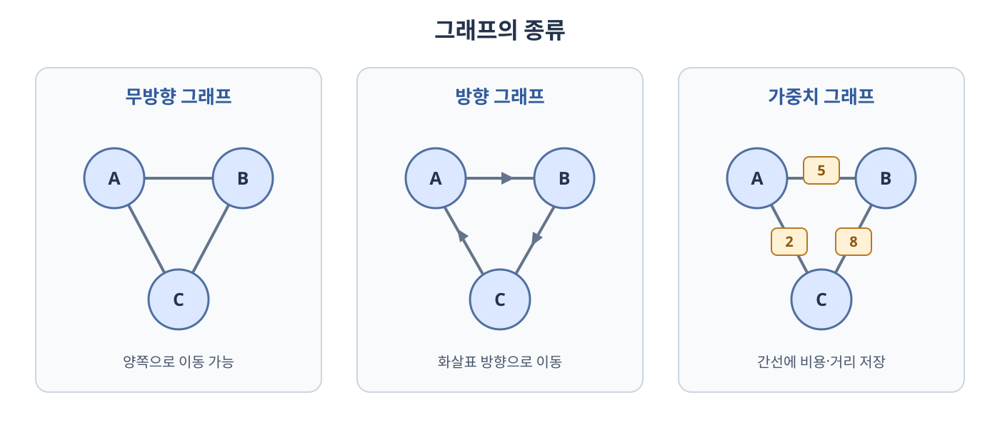
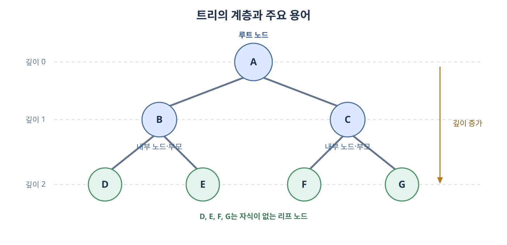
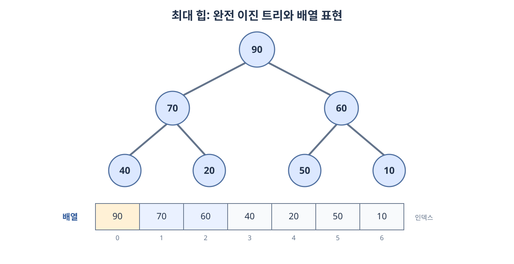
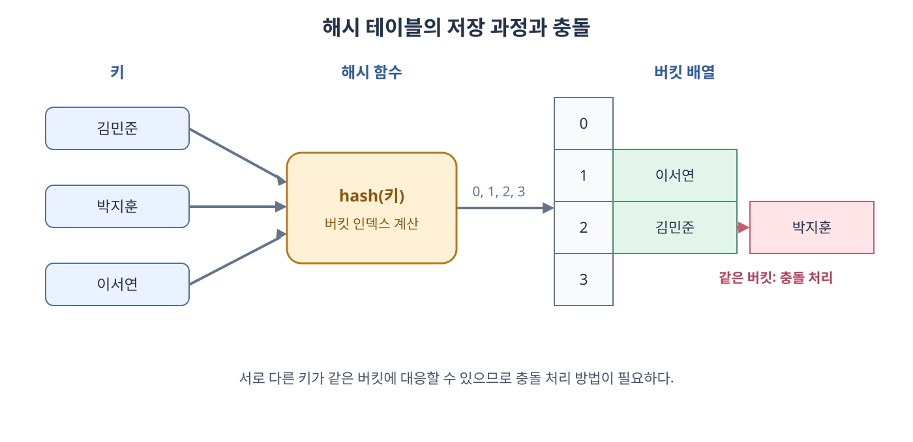

# 비선형 자료 구조

**비선형 자료 구조**(**Non-linear Data Structure**)는 원소가 하나의 순서로만 이어지지 않고, 하나의 원소가 여러 원소와 관계를 맺을 수 있는 자료 구조다. 그래프와 트리는 관계 자체를 표현하고, 힙·맵·셋·해시 테이블은 특정 연산을 효율적으로 처리하도록 데이터를 구성한다.

자료 구조의 이름만으로 시간 복잡도가 결정되지는 않는다. 맵과 셋처럼 같은 개념도 균형 탐색 트리 또는 해시 테이블 등 어떤 구조로 구현하느냐에 따라 정렬 여부와 연산 비용이 달라진다.

## 5.3.1 그래프

**그래프**(**Graph**)는 **정점**(**Vertex**)의 집합과 정점을 연결하는 **간선**(**Edge**)의 집합으로 이루어진 자료 구조다. 정점은 대상, 간선은 대상 사이의 관계를 나타낸다.

```text
정점 집합 V = {A, B, C, D}
간선 집합 E = {(A, B), (A, C), (B, D), (C, D)}

    A
   / \
  B   C
   \ /
    D
```



### 그래프의 종류

| 종류 | 의미 | 간선의 예 |
| --- | --- | --- |
| **무방향 그래프**(**Undirected Graph**) | 간선의 양쪽 방향으로 이동할 수 있다. | `A — B` |
| **방향 그래프**(**Directed Graph**) | 간선에 이동 방향이 있다. | `A → B` |
| **가중치 그래프**(**Weighted Graph**) | 간선에 거리·비용·시간 등의 값이 있다. | `A —5— B` |

무방향 그래프에서 `A — B`는 `B — A`와 같은 간선이다. 방향 그래프에서 `A → B`와 `B → A`는 서로 다른 간선이다.

### 그래프의 주요 용어

| 용어 | 의미 |
| --- | --- |
| **인접**(**Adjacent**) | 두 정점이 간선으로 직접 연결된 상태 |
| **차수**(**Degree**) | 무방향 그래프에서 한 정점에 연결된 간선의 수 |
| **진입 차수**(**In-degree**) | 방향 그래프에서 한 정점으로 들어오는 간선의 수 |
| **진출 차수**(**Out-degree**) | 방향 그래프에서 한 정점에서 나가는 간선의 수 |
| **경로**(**Path**) | 간선을 따라 정점을 방문하는 순서 |
| **경로 길이**(**Path Length**) | 경로에 포함된 간선의 수 또는 가중치의 합 |
| **사이클**(**Cycle**) | 출발한 정점으로 다시 돌아오는 경로 |
| **연결 요소**(**Connected Component**) | 서로 경로가 존재하는 정점들의 최대 집합 |

**단순 경로**(**Simple Path**)는 같은 정점을 반복해서 방문하지 않는 경로다. 가중치 그래프의 최단 경로는 간선 개수가 가장 적은 경로가 아니라 가중치 합이 가장 작은 경로일 수 있다.

### 그래프의 표현 방법

그래프를 메모리에 저장하는 대표적인 방법은 인접 행렬과 인접 리스트다. 정점 수를 `V`, 간선 수를 `E`라고 한다.

**인접 행렬**(**Adjacency Matrix**)은 두 정점의 연결 여부를 `V × V` 크기의 행렬에 저장한다.

```text
    A B C D
A [ 0 1 1 0 ]
B [ 1 0 0 1 ]
C [ 1 0 0 1 ]
D [ 0 1 1 0 ]
```

**인접 리스트**(**Adjacency List**)는 각 정점마다 직접 연결된 이웃 정점만 저장한다.

```text
A: B, C
B: A, D
C: A, D
D: B, C
```

| 비교 | 인접 행렬 | 인접 리스트 |
| --- | --- | --- |
| 공간 복잡도 | `O(V²)` | `O(V + E)` |
| 두 정점의 연결 확인 | `O(1)` | 해당 정점의 이웃 수에 비례 |
| 한 정점의 모든 이웃 확인 | `O(V)` | 해당 정점의 이웃 수에 비례 |
| 적합한 경우 | 간선이 많은 밀집 그래프 | 간선이 적은 희소 그래프 |

무방향 그래프에서는 하나의 간선을 양쪽 정점의 인접 리스트에 각각 기록하므로 저장 항목 수가 약 `2E`지만, 복잡도에서는 `O(E)`로 본다.

### 그래프 탐색

**깊이 우선 탐색**(**Depth-First Search, DFS**)은 한 방향으로 가능한 만큼 깊게 이동한 뒤 되돌아온다. 스택이나 재귀 호출을 이용할 수 있다.

**너비 우선 탐색**(**Breadth-First Search, BFS**)은 시작 정점에서 가까운 정점부터 차례로 방문한다. 큐를 이용하며, 가중치가 없는 그래프에서 시작 정점으로부터 간선 수가 가장 적은 경로를 찾을 수 있다.

인접 리스트로 모든 정점과 간선을 한 번씩 확인하면 DFS와 BFS의 시간 복잡도는 모두 `O(V + E)`다. 이미 방문한 정점을 다시 처리하지 않도록 방문 여부를 기록해야 사이클이 있는 그래프에서도 탐색을 끝낼 수 있다.

## 5.3.2 트리

**트리**(**Tree**)는 계층적인 관계를 표현하는 자료 구조다. 그래프의 관점에서는 사이클이 없고 모든 정점이 연결된 무방향 그래프다.

정점이 `n`개인 트리는 간선이 `n - 1`개이며, 서로 다른 두 정점 사이에는 단순 경로가 정확히 하나 존재한다. 여기에 하나의 정점을 루트로 정하면 부모와 자식 관계가 생긴다.



### 트리의 주요 용어

| 용어 | 의미 |
| --- | --- |
| **루트 노드**(**Root Node**) | 부모가 없는 최상위 노드 |
| **부모 노드**(**Parent Node**) | 간선으로 직접 연결된 상위 노드 |
| **자식 노드**(**Child Node**) | 간선으로 직접 연결된 하위 노드 |
| **형제 노드**(**Sibling Node**) | 같은 부모를 가진 노드 |
| **리프 노드**(**Leaf Node**) | 자식이 없는 노드 |
| **내부 노드**(**Internal Node**) | 하나 이상의 자식을 가진 노드 |
| **서브트리**(**Subtree**) | 어떤 노드와 그 아래의 후손으로 이루어진 트리 |
| **노드의 차수**(**Degree**) | 해당 노드가 가진 자식의 수 |
| **깊이**(**Depth**) | 루트에서 해당 노드까지의 간선 수 |
| **높이**(**Height**) | 해당 노드에서 가장 먼 리프까지의 간선 수 |

여기서는 루트의 깊이를 0, 리프의 높이를 0으로 정한다. 레벨은 자료마다 루트를 0 또는 1부터 세는 방식이 달라질 수 있으므로 기준을 먼저 확인해야 한다.

### 이진 트리의 종류

**이진 트리**(**Binary Tree**)는 각 노드가 최대 두 개의 자식을 가지는 트리다. 두 자식은 왼쪽 자식과 오른쪽 자식으로 구분한다.

| 종류 | 조건 |
| --- | --- |
| **정 이진 트리**(**Full Binary Tree**) | 모든 노드의 자식 수가 0개 또는 2개다. |
| **완전 이진 트리**(**Complete Binary Tree**) | 마지막 레벨을 제외한 레벨이 모두 채워지고, 마지막 레벨은 왼쪽부터 채워진다. |
| **포화 이진 트리**(**Perfect Binary Tree**) | 모든 내부 노드의 자식이 2개이고 모든 리프의 깊이가 같다. |
| **균형 이진 트리**(**Balanced Binary Tree**) | 왼쪽과 오른쪽 서브트리의 높이가 지나치게 차이 나지 않는다. 정확한 기준은 트리 종류에 따라 다르다. |
| **편향 이진 트리**(**Skewed Binary Tree**) | 노드가 주로 한쪽 자식으로만 이어져 연결 리스트와 비슷한 모양이 된다. |

완전 이진 트리와 포화 이진 트리는 같은 뜻이 아니다. 포화 이진 트리는 모든 레벨이 가득 차 있지만, 완전 이진 트리의 마지막 레벨에는 빈자리가 있을 수 있다.

### 트리 순회

다음 이진 트리를 기준으로 순서를 비교한다.

```text
        A
      /   \
     B     C
    / \   / \
   D   E F   G
```

| 순회 | 방문 규칙 | 결과 |
| --- | --- | --- |
| **전위 순회**(**Preorder Traversal**) | 자신 → 왼쪽 → 오른쪽 | `A → B → D → E → C → F → G` |
| **중위 순회**(**Inorder Traversal**) | 왼쪽 → 자신 → 오른쪽 | `D → B → E → A → F → C → G` |
| **후위 순회**(**Postorder Traversal**) | 왼쪽 → 오른쪽 → 자신 | `D → E → B → F → G → C → A` |
| **레벨 순서 순회**(**Level-order Traversal**) | 깊이가 낮은 노드부터 방문 | `A → B → C → D → E → F → G` |

전위·중위·후위 순회는 깊이 우선 탐색의 형태이며, 레벨 순서 순회는 너비 우선 탐색의 형태다. 모든 노드를 한 번씩 방문하므로 시간 복잡도는 `O(n)`이다.

### 이진 탐색 트리

**이진 탐색 트리**(**Binary Search Tree, BST**)는 각 노드에 대해 왼쪽 서브트리에는 더 작은 키, 오른쪽 서브트리에는 더 큰 키를 저장하는 이진 트리다. 중복 키의 처리 방법은 구현 정책에 따라 달라진다.

```text
        8
      /   \
     3     12
    / \    / \
   1   6  10  14
```

탐색할 키를 현재 노드와 비교하고 한쪽 서브트리만 선택한다. 연산 비용은 트리의 높이 `h`에 비례하므로 탐색·삽입·삭제가 `O(h)`다.

| 트리 상태 | 높이 | 탐색·삽입·삭제 |
| --- | --- | --- |
| 균형이 잡힌 경우 | `O(log n)` | `O(log n)` |
| 한쪽으로 편향된 경우 | `O(n)` | 최악 `O(n)` |

균형 탐색 트리는 삽입과 삭제 후에도 높이를 제한하여 최악의 성능이 선형으로 악화되는 것을 방지한다. AVL 트리와 레드-블랙 트리가 대표적인 균형 이진 탐색 트리다.

## 5.3.3 힙

**힙**(**Heap**)은 완전 이진 트리의 모양과 힙 속성을 함께 만족하는 자료 구조다. 최댓값 또는 최솟값을 반복해서 빠르게 확인하고 제거할 때 사용한다.

| 종류 | 힙 속성 | 루트의 값 |
| --- | --- | --- |
| **최대 힙**(**Max Heap**) | 부모의 키가 자식의 키보다 크거나 같다. | 전체 최댓값 |
| **최소 힙**(**Min Heap**) | 부모의 키가 자식의 키보다 작거나 같다. | 전체 최솟값 |

힙 속성은 부모와 자식 사이의 관계만 보장한다. 최대 힙에서 왼쪽 자식이 오른쪽 자식보다 크다는 보장은 없으며, 힙 전체가 정렬되어 있는 것도 아니다.



### 배열을 이용한 표현

완전 이진 트리는 마지막 레벨을 제외하면 모든 레벨이 채워지고 마지막 레벨도 왼쪽부터 채워지므로, 빈자리 없이 배열에 저장할 수 있다.

0부터 시작하는 인덱스에서 노드 `i`의 관계는 다음과 같다.

```text
부모 인덱스      = (i - 1) / 2의 내림  (i > 0)
왼쪽 자식 인덱스 = 2i + 1
오른쪽 자식 인덱스 = 2i + 2
```

### 힙의 주요 연산

**삽입**은 새 원소를 완전 이진 트리의 마지막 위치에 추가한 뒤, 부모와 비교하며 위로 이동하여 힙 속성을 복구한다. 이를 **상향 이동**(**Sift Up**)이라고 한다.

루트 **추출**은 루트 값을 제거하고 마지막 원소를 루트로 옮긴 뒤, 자식과 비교하며 아래로 이동하여 힙 속성을 복구한다. 이를 **하향 이동**(**Sift Down**)이라고 한다.

| 연산 | 시간 복잡도 | 이유 |
| --- | --- | --- |
| 최댓값 또는 최솟값 확인 | `O(1)` | 루트에 있다. |
| 삽입 | `O(log n)` | 트리 높이만큼 상향 이동할 수 있다. |
| 루트 추출 | `O(log n)` | 트리 높이만큼 하향 이동할 수 있다. |
| 임의의 값 탐색 | `O(n)` | 한쪽 서브트리만 선택할 기준이 없다. |
| `n`개 원소로 힙 만들기 | `O(n)` | 아래쪽 내부 노드부터 하향 이동하는 방식의 전체 비용이다. |

힙과 이진 탐색 트리는 목적이 다르다. 힙은 최댓값 또는 최솟값 하나를 빠르게 다루는 데 적합하고, 이진 탐색 트리는 정렬 관계를 이용한 키 탐색과 순서 있는 처리가 목적이다.

## 5.3.4 우선순위 큐

**우선순위 큐**(**Priority Queue**)는 먼저 들어온 원소가 아니라 우선순위가 가장 높은 원소를 먼저 꺼내는 추상 자료형이다. 값이 클수록 높은 우선순위인지, 작을수록 높은 우선순위인지는 문제에서 정한 기준에 따라 달라진다.

```text
삽입 순서: 작업 A(우선순위 2) → 작업 B(우선순위 5) → 작업 C(우선순위 1)
처리 순서: 작업 B(5) → 작업 A(2) → 작업 C(1)
```

우선순위 큐는 동작 규칙을 정의한 개념이고, 힙은 그 규칙을 효율적으로 구현할 수 있는 자료 구조다. 우선순위 큐를 반드시 힙으로만 구현해야 하는 것은 아니지만 일반적으로 힙을 사용한다.

힙으로 구현했을 때의 주요 연산은 다음과 같다.

| 연산 | 의미 | 시간 복잡도 |
| --- | --- | --- |
| 삽입 | 원소와 우선순위를 추가한다. | `O(log n)` |
| 최우선 원소 확인 | 제거하지 않고 확인한다. | `O(1)` |
| 최우선 원소 추출 | 최우선 원소를 제거하고 반환한다. | `O(log n)` |

우선순위가 같은 원소의 처리 순서는 기본적으로 보장되지 않는다. 입력 순서를 유지해야 한다면 우선순위와 함께 삽입 순서를 저장하여 비교 기준에 포함할 수 있다.

우선순위 큐는 작업 스케줄링, 이벤트 처리, 최단 경로 탐색처럼 여러 후보 중 현재 가장 중요한 원소를 반복해서 선택하는 상황에 사용한다.

## 5.3.5 맵

**맵**(**Map**)은 고유한 키와 그 키에 대응하는 값을 한 쌍으로 저장하는 추상 자료형이다. 키는 값을 식별하는 데 사용하므로 중복될 수 없지만, 서로 다른 키가 같은 값을 가지는 것은 가능하다.

| 키 | 값 |
| --- | --- |
| `user_101` | `김민준` |
| `user_102` | `이서연` |
| `user_103` | `김민준` |

`user_101`과 `user_103`은 서로 다른 키이므로 같은 값 `김민준`을 저장할 수 있다. 이미 존재하는 키에 새 값을 저장할 때 기존 값을 교체할지 실패로 처리할지는 연산의 정의에 따라 달라진다.

맵은 구현 방식에 따라 특성이 달라진다.

| 구현 방식 | 키의 순서 | 탐색·삽입·삭제 |
| --- | --- | --- |
| 균형 탐색 트리 기반 | 정렬된 순서를 유지할 수 있다. | `O(log n)` |
| 해시 테이블 기반 | 일반적으로 정렬된 순서를 보장하지 않는다. | 평균 `O(1)`, 최악 `O(n)` |

정렬된 순회, 최솟값·최댓값, 특정 범위의 키를 다루려면 트리 기반 맵이 적합하다. 키로 값을 빠르게 찾는 것이 중요하고 정렬된 순서가 필요 없다면 해시 기반 맵이 적합하다.

## 5.3.6 셋

**셋**(**Set**)은 중복되지 않는 원소의 집합을 저장하는 추상 자료형이다. 같은 원소를 여러 번 추가해도 집합에는 하나만 존재한다.

```text
3, 1, 3, 2를 차례로 추가
결과 집합 = {3, 1, 2}
```

집합에서 원소를 적은 순서는 의미가 없다. 정렬된 순회가 필요한지는 셋의 구현 방식에 따라 달라진다.

셋의 핵심 연산은 원소의 추가, 삭제와 포함 여부 확인이다. 구현 방식에 따른 특성은 맵과 비슷하다.

| 구현 방식 | 원소의 순서 | 추가·삭제·포함 확인 |
| --- | --- | --- |
| 균형 탐색 트리 기반 | 정렬된 순서를 유지할 수 있다. | `O(log n)` |
| 해시 테이블 기반 | 일반적으로 정렬된 순서를 보장하지 않는다. | 평균 `O(1)`, 최악 `O(n)` |

셋은 중복 제거와 집합 연산에 사용한다.

| 연산 | 표기 | 의미 |
| --- | --- | --- |
| **합집합**(**Union**) | `A ∪ B` | A 또는 B에 속한 원소 |
| **교집합**(**Intersection**) | `A ∩ B` | A와 B에 모두 속한 원소 |
| **차집합**(**Difference**) | `A - B` | A에는 있고 B에는 없는 원소 |

맵과 셋의 차이는 저장 대상이다. 맵은 `키 → 값`의 대응 관계를 저장하고, 셋은 원소 자체의 존재 여부를 저장한다.

## 5.3.7 해시 테이블

**해시 테이블**(**Hash Table**)은 키를 **해시 함수**(**Hash Function**)에 입력하여 얻은 결과로 키가 저장될 **버킷**(**Bucket**)의 위치를 결정하는 자료 구조다.

```text
키 "김민준"
    ↓ 해시 함수
해시값 1057
    ↓ 버킷 수로 위치 계산
버킷 인덱스 1
    ↓
[1] "김민준" → 회원 정보
```



### 해시 함수와 버킷

같은 키를 입력하면 같은 해시값을 얻어야 원하는 데이터를 다시 찾을 수 있다. 좋은 해시 함수는 키를 버킷 전체에 고르게 분산하여 특정 버킷에 데이터가 몰리는 현상을 줄인다.

해시값과 버킷 인덱스는 같은 개념이 아니다. 해시값의 범위가 버킷 수보다 크므로 일반적으로 해시값을 버킷 수에 맞는 인덱스로 변환한다.

서로 다른 키가 같은 버킷 위치에 대응하는 현상을 **해시 충돌**(**Hash Collision**)이라고 한다. 가능한 키의 수가 유한한 버킷 수보다 많으므로 충돌 가능성을 완전히 없앨 수는 없으며, 충돌을 처리하는 방법이 필요하다.

### 충돌 처리 방법

**분리 연결법**(**Separate Chaining**)은 같은 버킷에 대응한 원소들을 연결 리스트 등의 별도 구조에 함께 저장한다.

```text
버킷 0: 비어 있음
버킷 1: [김민준] → [박지훈]
버킷 2: [이서연]
버킷 3: 비어 있음
```

**개방 주소법**(**Open Addressing**)은 충돌이 발생하면 정해진 규칙에 따라 다른 빈 버킷을 찾아 저장한다.

| 방법 | 다음 위치를 찾는 방식 |
| --- | --- |
| **선형 탐사**(**Linear Probing**) | 일정한 간격으로 다음 버킷을 확인한다. |
| **제곱 탐사**(**Quadratic Probing**) | 확인 간격을 제곱 형태로 늘린다. |
| **이중 해싱**(**Double Hashing**) | 두 번째 해시 함수로 이동 간격을 정한다. |

### 적재율과 재해싱

**적재율**(**Load Factor**)은 저장된 원소 수를 버킷 수로 나눈 값이다.

```text
적재율 = 저장된 원소 수 / 버킷 수
```

적재율이 커지면 충돌이 증가하여 성능이 떨어질 수 있다. 이를 완화하기 위해 더 큰 버킷 배열을 만들고 모든 키의 위치를 다시 계산하여 옮기는 **재해싱**(**Rehashing**)을 수행할 수 있다.

| 연산 | 평균 시간 복잡도 | 최악 시간 복잡도 |
| --- | --- | --- |
| 탐색 | `O(1)` | `O(n)` |
| 삽입 | `O(1)` | `O(n)` |
| 삭제 | `O(1)` | `O(n)` |

평균 `O(1)`은 적절한 해시 함수와 적당한 적재율로 키가 여러 버킷에 고르게 분산되어 있다는 전제가 필요하다. 충돌이 한곳에 몰리거나 재해싱이 발생한 한 번의 삽입은 `O(n)`이 될 수 있다.

해시 테이블은 해시 기반 맵과 해시 기반 셋을 구현하는 데 사용할 수 있다. 맵에서는 키와 값을 함께 저장하고, 셋에서는 원소 자체를 키처럼 저장한다.
