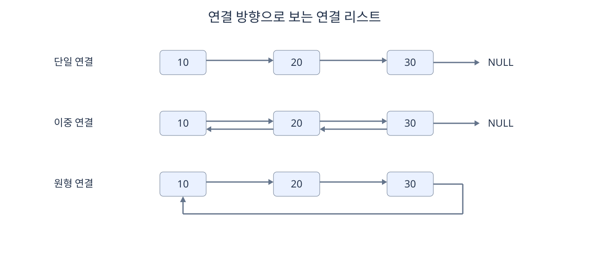
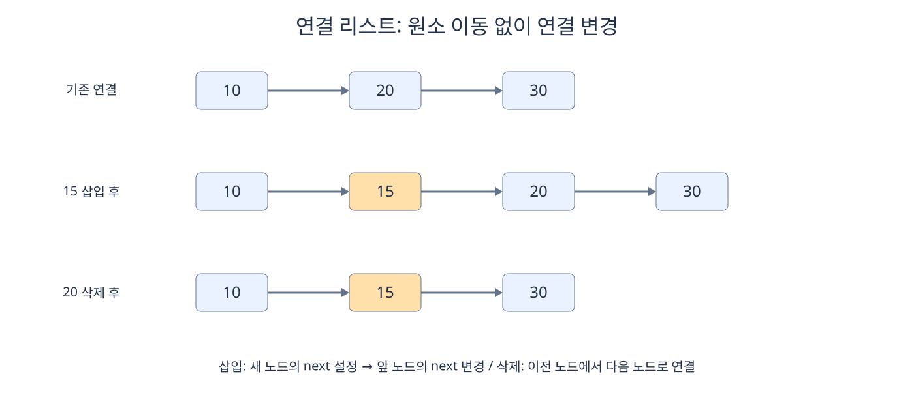
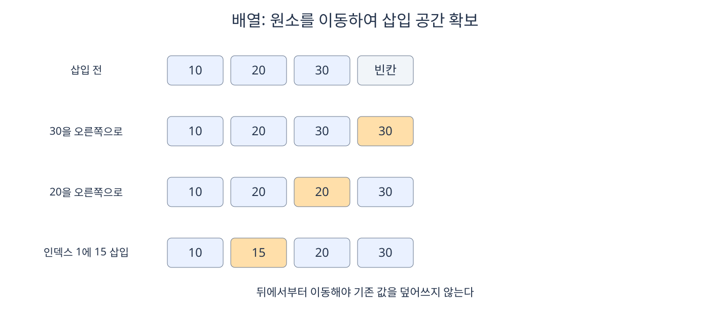
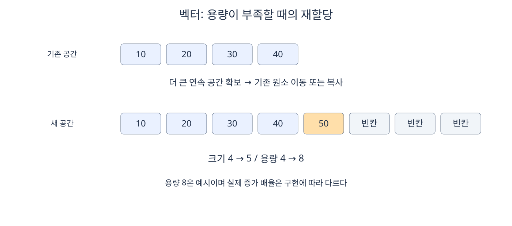
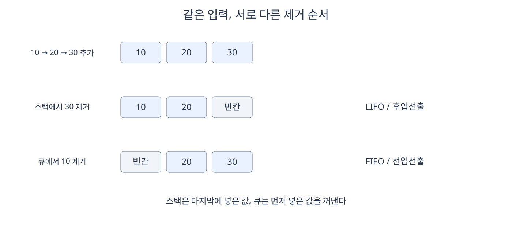
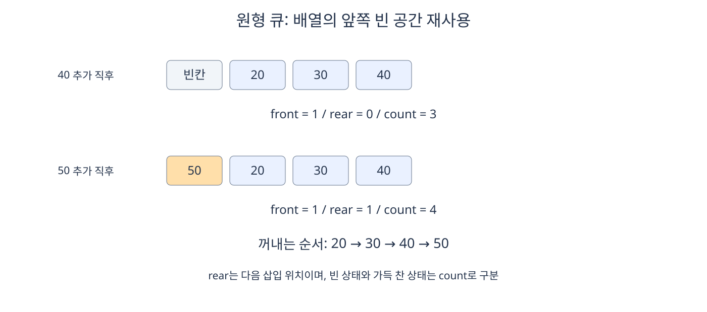

# 선형 자료 구조

**자료 구조**(**Data Structure**)는 데이터를 저장하고 접근·탐색·수정하기 위해 구성하는 방식이다. **선형 자료 구조**(**Linear Data Structure**)는 원소가 논리적으로 한 줄의 순서를 이루는 구조다.

논리적인 순서와 실제 메모리 배치는 다르다. 배열은 원소를 연속된 메모리에 저장하고, 연결 리스트는 떨어져 있는 노드를 포인터로 연결하여 순서를 만든다. 스택과 큐는 원소를 추가하고 제거하는 순서에 규칙을 둔다.

이하의 연산 비용은 원소 하나의 비교·복사·이동을 일정한 비용으로 가정한다. 입력된 원소 수를 `n`이라고 할 때 `O(1)`은 원소 수와 관계없이 일정한 시간, `O(log n)`은 입력이 증가해도 연산 수가 완만하게 증가하는 시간, `O(n)`은 원소 수에 비례하여 증가하는 시간을 뜻한다. 별도 설명이 없으면 시간 복잡도는 최악의 경우를 기준으로 한다.

## 5.2.1 연결 리스트

**연결 리스트**(**Linked List**)는 데이터를 담은 **노드**(**Node**)들을 포인터로 연결한 자료 구조다. 노드는 데이터와 다른 노드의 위치 정보를 저장한다.

첫 노드를 가리키는 포인터를 `head`, 마지막 노드를 가리키는 포인터를 `tail`이라고 한다. `tail`을 유지할지는 구현에 따라 달라진다.

포인터는 데이터 자체가 아니라 데이터가 저장된 위치를 가리키는 정보다. 노드를 순서대로 방문하는 작업을 **순회**(**Traversal**)라고 하며, 앞 노드부터 연결을 따라 접근하는 방식을 **순차 접근**(**Sequential Access**)이라고 한다.



### 단일 연결 리스트

**단일 연결 리스트**(**Singly Linked List**)의 노드는 다음 노드를 가리키는 `next`를 가진다. 마지막 노드의 `next`는 보통 `NULL`이다.

```text
head → [10] → [20] → [30] → NULL
                         ↑
                        tail
```

앞에서 뒤로 이동할 수 있지만 이전 노드로 바로 돌아갈 수는 없다. 특정 인덱스에 접근하려면 머리부터 링크를 따라가야 하므로 최악 `O(n)`이다.

### 이중 연결 리스트

**이중 연결 리스트**(**Doubly Linked List**)의 노드는 이전 노드를 가리키는 `prev`와 다음 노드를 가리키는 `next`를 가진다.

```text
NULL ← [10] ⇄ [20] ⇄ [30] → NULL
        ↑             ↑
       head          tail
```

양방향으로 이동할 수 있고, 삭제할 노드를 알고 있으면 앞뒤 연결을 바로 수정할 수 있다. 대신 노드마다 포인터를 하나 더 저장한다.

### 원형 연결 리스트

**원형 연결 리스트**(**Circular Linked List**)는 마지막 노드가 첫 노드로 연결되는 구조다. 단일 연결과 이중 연결 모두 원형으로 만들 수 있다.

```text
head → [10] → [20] → [30]
         ↑_____________|
```

마지막 이후에 첫 원소로 돌아오는 순환 처리에 적합하다. 끝을 `NULL`로 판별할 수 없으므로 출발 노드로 돌아왔는지 또는 정해진 개수만큼 순회했는지 검사해야 한다.

### 삽입과 삭제

단일 연결 리스트에서 노드 `10` 뒤에 `15`를 넣는 과정은 다음과 같다.

| 단계 | 변경 |
| --- | --- |
| 기존 연결 | `10 → 20 → 30` |
| 새 노드 연결 | 새 노드 `15`의 `next`를 기존 다음 노드 `20`으로 설정한다. |
| 앞 노드 연결 | `10`의 `next`를 새 노드 `15`로 바꾼다. |
| 결과 | `10 → 15 → 20 → 30` |

연결을 바꾸는 순서를 잘못 정하면 뒤쪽 노드를 가리키던 정보를 잃을 수 있다. 연결 수정 자체는 일정한 횟수로 끝난다.

`20`을 삭제하려면 이전 노드 `15`의 `next`를 `30`으로 바꾼다. 수동으로 메모리를 관리하는 언어에서는 제거한 노드의 메모리도 해제해야 한다.



| 연산 | 단일 연결 리스트 | 이중 연결 리스트 |
| --- | --- | --- |
| 값 탐색·인덱스 접근 | `O(n)` | `O(n)` |
| 머리 삽입·삭제 | `O(1)` | `O(1)` |
| 꼬리 삽입 | `tail`이 있으면 `O(1)` | `tail`이 있으면 `O(1)` |
| 꼬리 삭제 | 이전 노드 탐색에 `O(n)` | `tail`이 있으면 `O(1)` |
| 알려진 위치에서 삽입·삭제 | 삽입은 앞 노드, 삭제는 이전 노드를 알고 있으면 `O(1)` | 필요한 노드를 알고 있으면 `O(1)` |

연결 리스트는 원소 이동 없이 연결을 바꿀 수 있지만 노드를 찾는 비용은 별개다. 포인터 저장 공간과 노드별 메모리 할당 비용이 필요하고, 순회할 때 메모리 접근 위치가 흩어질 수 있다.

## 5.2.2 배열

**배열**(**Array**)은 같은 타입의 원소를 연속된 메모리 공간에 저장하고 **인덱스**(**Index**)로 접근하는 자료 구조다. 여기서는 크기가 고정된 배열을 기준으로 설명한다.

| 인덱스 | 0 | 1 | 2 | 3 |
| --- | --- | --- | --- | --- |
| 값 | 10 | 20 | 30 | 40 |

### 인덱스 접근과 값 탐색

원소 크기가 일정하므로 특정 원소의 주소를 계산할 수 있다.

배열의 인덱스가 `i`일 때 해당 원소는 일반적으로 `arr[i]`와 같이 나타낸다.

```text
(원소 주소) = (배열 시작 주소) + (인덱스 × 원소 하나의 크기)
```

앞 원소를 차례로 거치지 않고 위치를 계산하므로 인덱스로 접근하는 시간은 `O(1)`이다. 이를 **임의 접근**(**Random Access**)이라고 한다.

임의 접근은 무작위 값을 고른다는 의미가 아니라 원하는 위치에 직접 접근할 수 있다는 의미다. **접근**(**Access**)은 위치를 알고 원소를 읽는 작업이고, **탐색**(**Search**)은 조건을 만족하는 원소의 위치를 찾는 작업이다.

반면 값 `30`이 어느 인덱스에 있는지 모른다면 원소를 비교해야 한다. 정렬되지 않은 배열의 값 탐색은 최악 `O(n)`이다. 정렬된 배열에서는 이진 탐색을 사용하여 `O(log n)`에 찾을 수 있다.

### 삽입과 삭제

배열의 순서를 유지하며 중간에 삽입하려면 뒤쪽 원소를 한 칸씩 이동한다. 다음 예시는 마지막에 빈 공간이 있는 경우다.

| 상태 | 저장된 원소 |
| --- | --- |
| 삽입 전 | `[10, 20, 30, 빈칸]` |
| 뒤쪽 원소 이동 | `[10, 빈칸, 20, 30]` |
| 인덱스 1에 삽입 | `[10, 15, 20, 30]` |

중간 원소를 삭제하면 뒤쪽 원소를 앞으로 이동하여 빈자리를 메운다. 삽입·삭제할 위치를 알아도 원소 이동 때문에 최악 `O(n)`이다.



삽입할 때는 마지막 원소부터 뒤로 옮겨야 아직 옮기지 않은 값을 덮어쓰지 않는다. 그림의 중간 상태에서 같은 값이 두 칸에 보이는 것은 이동을 위한 복사가 진행 중이기 때문이다.

고정 배열의 크기 자체는 바뀌지 않는다. 위 연산은 정해진 저장 공간 안에서 사용 중인 원소 수를 따로 관리하는 방식이다. 공간이 가득 차면 추가할 수 없으며 더 큰 배열에 옮겨야 한다.

| 연산 | 시간 복잡도 | 이유 |
| --- | --- | --- |
| 인덱스 접근 | `O(1)` | 원소의 주소를 바로 계산한다. |
| 정렬되지 않은 값 탐색 | 최악 `O(n)` | 찾을 때까지 원소를 비교한다. |
| 정렬된 값 탐색 | `O(log n)` | 이진 탐색을 사용할 수 있다. |
| 맨 뒤 삽입·삭제 | `O(1)` | 사용할 공간과 위치를 알고 있다고 가정한다. |
| 앞·중간 삽입·삭제 | 최악 `O(n)` | 뒤쪽 원소를 이동해야 한다. |

정렬된 배열의 값 탐색이 `O(log n)`이라는 설명은 배열이 이미 정렬되어 있을 때의 탐색 비용이다. 탐색 전에 정렬해야 한다면 정렬 비용도 별도로 계산해야 한다.

### 캐시 지역성과 사용 상황

CPU는 메모리의 일부를 **캐시**(**Cache**)에 보관한다. 배열을 순서대로 읽으면 인접한 원소도 함께 캐시에 들어올 가능성이 높다. 이를 **공간 지역성**(**Spatial Locality**)이라고 한다.

배열은 인덱스 접근과 순차 순회가 잦고 크기를 미리 알 수 있을 때 적합하다. 연결 리스트와 달리 원소마다 링크를 저장할 필요가 없지만, 중간 삽입·삭제에는 이동 비용이 든다.

## 5.2.3 벡터

**벡터**(**Vector**)는 필요에 따라 저장 용량을 늘릴 수 있는 **동적 배열**(**Dynamic Array**)이다. 언어마다 명칭과 세부 구현은 다를 수 있지만 연속된 공간에 원소를 저장하고 필요할 때 용량을 늘린다는 원리는 같다.

벡터는 배열처럼 원소를 연속적으로 저장하므로 인덱스 접근이 `O(1)`이다. 중간 삽입·삭제에는 원소 이동이 필요하다.

### 크기와 용량

| 구분 | 의미 |
| --- | --- |
| **크기**(**Size**) | 실제로 저장된 원소 수 |
| **용량**(**Capacity**) | 재할당 없이 담을 수 있도록 확보한 원소 수 |

```text
저장 공간: [10, 20, 30, 빈칸]
크기: 3
용량: 4
```

용량이 크기보다 크면 사용하지 않는 여유 공간이 존재한다. 용량을 확보했다고 해당 위치에 실제 원소가 생성된 것은 아니다.

항상 `size ≤ capacity`이며 둘이 같을 수도 있다. 현재 공간으로 부족해 새 저장 공간을 확보하는 과정을 **재할당**(**Reallocation**)이라고 한다.

### 뒤에 추가하는 과정

| 상황 | 동작 | 한 번의 추가 비용 |
| --- | --- | --- |
| 여유 용량이 있다. | 마지막 위치에 새 원소를 저장한다. | `O(1)` |
| 용량이 부족하다. | 더 큰 공간 확보, 기존 원소 이동·복사, 새 원소 추가를 수행한다. | `O(n)` |

```text
추가 전: [10, 20, 30, 40]   크기 4, 용량 4
                       ↓ 더 큰 공간 확보 및 원소 이동
추가 후: [10, 20, 30, 40, 50, 빈칸, 빈칸, 빈칸]
         크기 5, 용량 8
```

용량을 8로 늘리는 것은 설명을 위한 예시다. 용량 증가 배율은 구현에 따라 다르며 반드시 두 배가 되는 것은 아니다. 재할당이 일어나면 기존 저장 공간의 위치를 직접 가리키던 정보는 더 이상 유효하지 않을 수 있다.

뒤 삽입 한 번만 보면 재할당이 없는 경우 `O(1)`, 재할당이 발생한 경우 `O(n)`이다. 그러나 뒤 삽입을 여러 번 반복하는 전체 비용을 나누어 보면 **상각 시간 복잡도**(**Amortized Time Complexity**)는 `O(1)`이다. 이는 모든 뒤 삽입이 항상 `O(1)`이라는 뜻이 아니라 가끔 발생하는 재할당 비용을 여러 번의 저렴한 삽입에 나누어 계산한 결과다.

### 주요 연산



| 연산 | 시간 복잡도 | 이유 |
| --- | --- | --- |
| 인덱스 접근 | `O(1)` | 연속된 메모리에서 주소를 계산한다. |
| 정렬되지 않은 값 탐색 | `O(n)` | 원소를 비교한다. |
| 뒤 삽입 | 상각 `O(1)`, 한 번의 최악 `O(n)` | 용량 확장 시 기존 원소를 옮긴다. |
| 뒤 삭제 | `O(1)` | 마지막 원소만 제거한다. |
| 앞·중간 삽입·삭제 | 최악 `O(n)` | 뒤쪽 원소를 이동한다. |

원소 수가 실행 중 달라지고 인덱스 접근이 자주 필요할 때 벡터가 적합하다. 예상 크기를 알면 용량을 미리 확보하여 추가 과정의 재할당 횟수를 줄일 수 있다.

## 5.2.4 스택

**스택**(**Stack**)은 마지막에 넣은 원소를 먼저 꺼내는 **후입선출**(**Last In First Out, LIFO**) 자료 구조다. 추가와 제거가 한쪽 끝에서 이루어지며 그 위치를 `top`이라고 한다.

| 연산 | 의미 | 시간 복잡도 |
| --- | --- | --- |
| `push` | 맨 위에 원소를 추가한다. | `O(1)` |
| `pop` | 맨 위의 원소를 제거한다. | `O(1)` |
| `top` 또는 `peek` | 맨 위 원소를 제거하지 않고 확인한다. | `O(1)` |
| `empty` | 비어 있는지 확인한다. | `O(1)` |

연산의 실제 이름과 값을 반환하는 방식은 언어에 따라 다를 수 있다.

| 순서 | 연산 | 아래에서 위로 저장된 원소 | top |
| ---: | --- | --- | --- |
| 1 | `push(10)` | `[10]` | 10 |
| 2 | `push(20)` | `[10, 20]` | 20 |
| 3 | `push(30)` | `[10, 20, 30]` | 30 |
| 4 | `pop()` | `[10, 20]` | 20 |

### 구현과 비용



스택과 큐의 핵심은 허용하는 연산과 처리 순서다. 내부 저장 방식을 숨기고 연산과 동작 규칙을 정의하는 것을 **추상 자료형**(**Abstract Data Type, ADT**)이라고 한다. 같은 스택도 배열이나 연결 리스트로 구현할 수 있고, 구현에 따라 공간 확장 비용은 달라진다.

배열에서는 마지막 사용 위치를 관리하고 연결 리스트에서는 머리에서 삽입·삭제하면 된다. 이 경우 기본 연산은 `O(1)`이다. 동적 배열로 구현한 스택의 `push`는 저장 공간을 확장하는 한 번의 연산에는 `O(n)`이 걸릴 수 있으며, 용량을 일정 비율로 늘린다면 상각 `O(1)`이다.

빈 스택에서 꺼내는 **언더플로**(**Underflow**)와 고정 용량을 넘겨 넣는 **오버플로**(**Overflow**)를 처리해야 한다. 실제 API에서는 호출 전 조건을 확인하거나 예외·실패 반환 규칙을 따른다.

### 사용 예

- 괄호 검사: 여는 괄호를 넣고 닫는 괄호가 나오면 가장 최근의 여는 괄호와 비교한다.
- 깊이 우선 탐색: 다음에 탐색할 위치를 스택에 저장한다.
- 실행 취소: 가장 최근 작업부터 되돌린다.
- 함수 호출: 나중에 호출된 함수가 먼저 끝나고 이전 함수로 돌아간다.

괄호 검사에서 닫는 괄호를 처리할 때 스택이 비어 있거나 종류가 다르면 잘못된 표현이다. 문자열을 모두 처리한 후에도 여는 괄호가 남아 있으면 올바르지 않다.

## 5.2.5 큐

**큐**(**Queue**)는 먼저 넣은 원소를 먼저 꺼내는 **선입선출**(**First In First Out, FIFO**) 자료 구조다. 제거하는 쪽을 `front`, 추가하는 쪽을 `rear`라고 한다.

| 연산 | 의미 | 시간 복잡도 |
| --- | --- | --- |
| `enqueue` | 뒤에 원소를 추가한다. | `O(1)` |
| `dequeue` | 앞에서 원소를 제거한다. | `O(1)` |
| `front` 또는 `peek` | 다음에 제거할 원소를 확인한다. | `O(1)` |
| `empty` | 비어 있는지 확인한다. | `O(1)` |

연산의 실제 이름과 값을 반환하는 방식은 언어에 따라 다를 수 있다. 위 시간 복잡도는 머리·꼬리 위치를 관리하는 구조, 머리·꼬리 포인터가 있는 연결 리스트 또는 원형 큐처럼 앞 원소를 제거할 때 나머지 원소를 이동하지 않는 구현을 전제로 한다.

| 순서 | 연산 | 앞에서 뒤로 저장된 원소 | front |
| ---: | --- | --- | --- |
| 1 | `enqueue(10)` | `[10]` | 10 |
| 2 | `enqueue(20)` | `[10, 20]` | 10 |
| 3 | `enqueue(30)` | `[10, 20, 30]` | 10 |
| 4 | `dequeue()` | `[20, 30]` | 20 |

### 연결 리스트로 구현

머리와 꼬리 포인터를 모두 유지하면 꼬리 삽입과 머리 삭제를 각각 `O(1)`에 처리할 수 있다. 마지막 원소를 제거했을 때는 머리와 꼬리를 모두 빈 상태로 갱신해야 한다.

### 배열과 원형 큐

배열에서 맨 앞 원소를 지울 때마다 나머지를 앞으로 이동시키면 제거 비용은 `O(n)`이다. 대신 앞뒤 위치를 인덱스로 관리하면 원소를 움직이지 않고 처리할 수 있다.

**원형 큐**(**Circular Queue**)는 배열의 끝 다음을 처음으로 연결하여 비워진 앞쪽 공간을 재사용한다.

```text
다음 인덱스 = (현재 인덱스 + 1) % 배열 용량
```

아래에서는 `front`를 다음 제거 위치, `rear`를 다음 삽입 위치로 정하고, 실제 원소 수 `count`로 비어 있음과 가득 참을 구분한다. 배열 용량은 4다.

| 연산 후 상태 | 인덱스 0 | 인덱스 1 | 인덱스 2 | 인덱스 3 | front | rear | count |
| --- | --- | --- | --- | --- | ---: | ---: | ---: |
| 10, 20, 30 추가 | 10 | 20 | 30 | 빈칸 | 0 | 3 | 3 |
| 10 제거 | 빈칸 | 20 | 30 | 빈칸 | 1 | 3 | 2 |
| 40 추가 | 빈칸 | 20 | 30 | 40 | 1 | 0 | 3 |
| 50 추가 | 50 | 20 | 30 | 40 | 1 | 1 | 4 |

마지막 행의 논리적인 순서는 `20 → 30 → 40 → 50`이다. 실제 배열의 인덱스 순서와 큐에서 꺼내는 순서가 달라질 수 있다.



이 구현에서 빈 상태는 `count = 0`, 가득 찬 상태는 `count = 용량`이다. `front = rear`만으로는 둘을 구분할 수 없다. 다른 구현에서는 한 칸을 비워 두는 방법을 사용하기도 한다.

고정 용량 원형 큐의 추가·제거는 `O(1)`이다. 가득 찼을 때 실패시킬지, 대기시킬지, 저장 공간을 확장할지는 구현 정책에 따라 다르다.

### 사용 예

- 너비 우선 탐색: 먼저 발견한 위치부터 처리한다.
- 작업 대기열: 먼저 들어온 작업부터 꺼낸다.
- 데이터 버퍼: 생산한 데이터를 소비할 때까지 보관한다.

큐가 선입선출이어도 여러 작업자가 병렬로 처리하면 작업의 완료 순서는 달라질 수 있다. 선입선출은 기본적으로 큐에서 원소를 꺼내는 순서에 관한 규칙이다.
